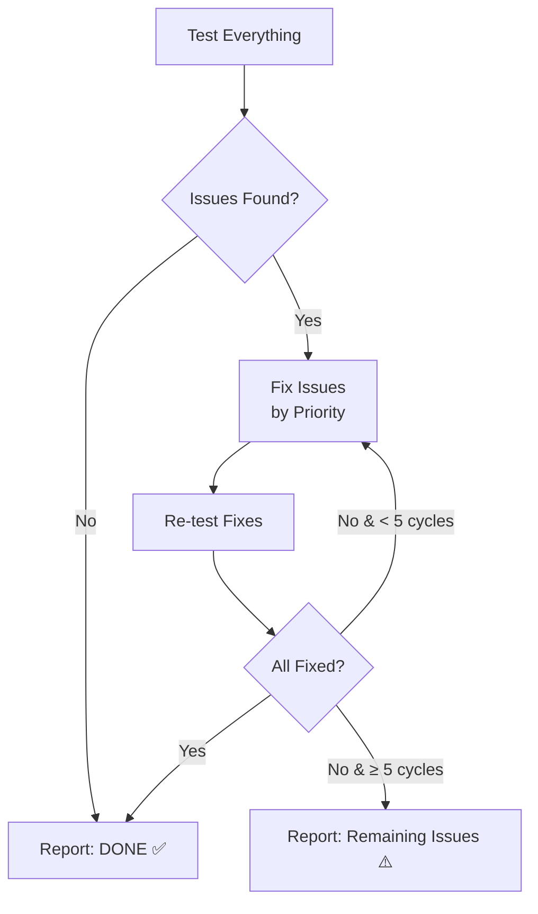

<p align="center">
  
  <br><br>
  <strong>🧪 The skill that makes AI agents test their own work before saying "I'm done"</strong>
  <br><br>
  
  
  
  
</p>

---

## The Problem

You ask an AI agent to build something. It builds it, says "done," and then **you** become the QA tester:

```
You: "Build me a photo editor app"
Agent: "Done! ✨"
You: *tries it* "The upload doesn't work, and filters are missing"
Agent: "Sorry about that!" *fixes* "Done!"
You: *tries again* "Export is broken too"
Agent: "Sorry!" *fixes* "Done!"
You: *tired* "..."
```

This back-and-forth loop is **exhausting** — especially for vibe coders who just want to describe an idea and get a working result.

## The Solution

**QA Pilot** is a skill that teaches AI agents to test their own work. Before reporting completion, the agent:

1. 📋 **Understands what was requested** — reads the spec, extracts features
2. 🌐 **Opens the app** — navigates like a real user
3. 🖱️ **Clicks every button** — fills forms, tries workflows, tests edge cases
4. 🔍 **Compares spec vs reality** — finds missing/broken/incomplete features
5. 🔧 **Fixes issues automatically** — and re-tests to confirm
6. 📊 **Reports honestly** — only says "done" when it's actually done

```
You: "Build me a photo editor app"
Agent: *builds it* → *tests it* → *finds 3 bugs* → *fixes them* → *re-tests* → all clear
Agent: "Done! Tested all features. 8/8 working. ✅"
You: *tries it* → everything works 🎉
```

## How It Works

### The 5-Phase Methodology

```
Phase 0: Understand        →  What was promised? Extract the feature list.
Phase 1: Environment Check →  Is the app running? Does it load?
Phase 2: Test Everything   →  Click every button. Fill every form. Break things.
Phase 3: Spec vs Reality   →  Compare what exists vs what was promised.
Phase 4: Self-Fix Loop     →  Fix issues. Re-test. Repeat until clean.
Phase 5: Final Report      →  Honest summary with pass/fail for each feature.
```

### What the Agent Tests

| Category | Examples |
|----------|----------|
| **Core Flows** | Login, checkout, form submissions, CRUD operations |
| **Navigation** | All pages load, all links work, no 404s |
| **Forms** | Valid input works, invalid input shows errors, required fields enforced |
| **Edge Cases** | Empty states, special characters, large inputs, wrong order of operations |
| **Responsive** | Mobile, tablet, desktop layouts |
| **Dark Mode** | Toggle works, all elements visible in both themes |
| **Settings** | Save, persist, apply to app behavior |
| **Visual** | No placeholder text, no broken images, proper alignment |

### The Self-Fix Loop



## Installation

### As an OpenClaw Skill

```bash
# Using ClawHub (when published)
clawhub install qa-pilot

# Or manually — copy the skill folder to your skills directory
cp -r qa-pilot/ ~/.openclaw/skills/
```

### As a GitHub Reference

Add to your agent's instructions:

```markdown
Before completing any web development task, follow the QA Pilot methodology:
https://github.com/helal-muneer/qa-pilot/blob/main/SKILL.md
```

### For Any AI Agent

QA Pilot is just a methodology document (`SKILL.md`). You can:

- **Paste it** into your agent's system prompt
- **Reference it** from your project's `AGENTS.md` or `CLAUDE.md`
- **Include it** in your agent's knowledge base
- **Feed it** as context when starting a coding task

## Usage

The skill activates **automatically** when configured. Just build your project normally — the agent will test it before reporting done.

### Manual Trigger

If your agent supports skills:

```
# In your agent's chat:
"Run QA Pilot on http://localhost:3000"

# Or add to your project's AGENTS.md:
"Always run QA Pilot testing before marking tasks complete."
```

## Example Output

```
## 🧪 QA Report — Photo Editor

**Tested:** 2026-04-16 | **URL:** http://localhost:3000 | **Cycles:** 2

### ✅ Working (7/9 features)
- Image upload from device ✅
- Drag & drop upload ✅
- Basic edits (crop, rotate, flip) ✅
- Preset filters (6 available) ✅
- Text overlay ✅
- Dark mode ✅
- Responsive layout ✅

### ⚠️ Fixed During Testing
- Export was using wrong MIME type → Fixed ✅
- Undo button had no icon → Fixed ✅

### ❌ Known Limitation
- Redo after undo — complex state management issue,
  tracked as known limitation. Manual workaround: re-apply the edit.

### 📊 Score: 8/9 (89%)
```

## Why QA Pilot?

| Without QA Pilot | With QA Pilot |
|------------------|---------------|
| Agent says "done" with 5 bugs | Agent tests, finds bugs, fixes them |
| You discover missing features | Agent compares against spec |
| 3-4 back-and-forth messages | 0 back-and-forth messages |
| Frustrating user experience | Smooth, professional result |
| ~30 min wasted per project | ~2 min agent self-testing |

## Who Is This For?

- **Vibe Coders** — Describe your idea, get something that actually works
- **AI Agent Developers** — Make your agents more reliable
- **Solo Developers** — Free QA tester for your side projects
- **Teams** — Automated sanity check before code review

## Philosophy

> **A carpenter doesn't hand you a table with loose legs and say "let me know if it wobbles."**

Testing is part of building. If an AI agent builds something, it should verify it works before handing it off. QA Pilot makes this the default behavior, not an afterthought.

## Contributing

Contributions are welcome! See [CONTRIBUTING.md](CONTRIBUTING.md) for guidelines.

## License

MIT — use it however you want. See [LICENSE](LICENSE).

---

<p align="center">
  <strong>The best bug is the one the user never sees.</strong>
  <br><br>
  Made with 🦞 by <a href="https://github.com/helal-muneer">helal-muneer</a>
</p>
