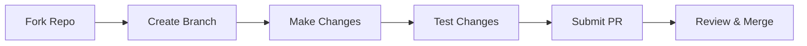

<p align="center">
  
  
  
  
</p>

<h1 align="center">🎨 AI Prompt Generator</h1>

<p align="center">
  <strong>Generate high-quality AI prompts for Flutter apps, games, and more</strong>
</p>

<p align="center">
  <a href="#-features">Features</a> •
  <a href="#-quick-start">Quick Start</a> •
  <a href="#-examples">Examples</a> •
  <a href="#-documentation">Documentation</a> •
  <a href="#-contributing">Contributing</a>
</p>

---

<p align="center">
  
  
  
</p>

<p align="center">
  
  
  
  
</p>

---

## 📋 Table of Contents

- [Overview](#-overview)
- [Features](#-features)
- [Demo](#-demo)
- [Quick Start](#-quick-start)
- [Examples](#-examples)
  - [Flutter App Development](#flutter-app-development)
  - [Flutter Game Development](#flutter-game-development)
  - [Creative Writing](#creative-writing)
  - [Problem-Solving](#problem-solving)
- [Documentation](#-documentation)
- [Templates](#-templates)
- [Customization](#-customization)
- [Best Practices](#-best-practices)
- [Roadmap](#-roadmap)
- [Contributing](#-contributing)
- [License](#-license)
- [Support](#-support)
- [Acknowledgments](#-acknowledgments)

---

## 🎯 Overview

**AI Prompt Generator** is a comprehensive OpenClaw skill that helps you create structured, high-quality prompts for AI tools like ChatGPT, Claude, and others. 

### Why Use This Skill?

❌ **Without this skill:**
```
"Help me with my Flutter app"
```
→ Vague, unclear, poor results

✅ **With this skill:**
```
Implement user authentication in a Flutter e-commerce app:
- Methods: Email/password, Google Sign-In, Apple Sign-In
- State Management: Riverpod
- Security: Secure token storage using flutter_secure_storage
- UI: Login screen with form validation
Provide: Complete implementation with error handling and testing
```
→ Clear, specific, excellent results!

---

## ✨ Features

### 🎨 **30+ Comprehensive Templates**

#### Flutter App Development
- ✅ Complete app architecture
- ✅ Feature implementation
- ✅ Authentication systems
- ✅ Data management
- ✅ Real-time features
- ✅ Payment integration
- ✅ Media handling
- ✅ Push notifications
- ✅ Search & filters
- ✅ Analytics & crash reporting

#### Flutter Game Development
- ✅ Complete game setup
- ✅ Player character systems
- ✅ Enemy/NPC AI
- ✅ Level design
- ✅ Physics systems
- ✅ UI/UX for games
- ✅ Save systems
- ✅ Audio systems
- ✅ Particle effects
- ✅ Monetization

#### General Categories
- ✅ Creative writing
- ✅ Problem-solving
- ✅ Educational content
- ✅ Business & marketing
- ✅ Programming tasks

### 🎛️ **Customization Options**

| Option | Choices | Description |
|--------|---------|-------------|
| **Tone** | Formal, Casual, Technical, Creative | Adjust language style |
| **Length** | Short, Medium, Detailed | Control response depth |
| **Complexity** | Beginner, Intermediate, Advanced | Match expertise level |
| **Domain** | App, Game, Creative, Business | Specialized templates |

### 🚀 **Key Benefits**

- ⚡ **Save Time**: Generate prompts in seconds, not minutes
- 🎯 **Better Results**: Structured prompts = better AI responses
- 📚 **Learn**: Understand effective prompt engineering
- 🔧 **Customize**: Adapt templates to your exact needs
- 💾 **Reuse**: Save successful prompts for future use

---

## 🎬 Demo

### Example 1: Flutter Authentication

**Input:**
```
Create a prompt for user authentication in my Flutter app
```

**Output:**
```dart
Implement user authentication in a Flutter app with the following requirements:

AUTHENTICATION METHODS:
- Email/Password: With validation
- Social Login: Google Sign-In, Apple Sign-In
- Biometric: Face ID/Touch ID (optional)

STATE MANAGEMENT:
- Solution: Riverpod for auth state
- Persistence: Keep user logged in
- Token Management: Secure storage

SECURITY:
- Password Policy: Min 8 chars, 1 uppercase, 1 number
- Token Storage: flutter_secure_storage
- Session Timeout: 30 days

UI COMPONENTS:
- Login Screen: Email/password form with validation
- Registration Screen: Multi-step form
- Forgot Password: Email reset flow
- Profile Screen: User info display

ERROR HANDLING:
- Network Errors: User-friendly messages
- Validation Errors: Real-time feedback
- Auth Errors: Retry mechanisms

PROVIDE:
1. Complete authentication service
2. Riverpod providers setup
3. UI screens with validation
4. Error handling strategy
5. Testing approach
6. Example usage in widgets
```

### Example 2: Game Jump Mechanic

**Input:**
```
Add jumping to my 2D platformer game
```

**Output:**
```dart
Implement a jumping mechanic for a 2D platformer game in Flutter using Flame:

REQUIREMENTS:
- Jump Types: Single jump, variable height (hold for higher)
- Physics: Realistic gravity (9.8 m/s²) and jump arc
- Input: Touch/screen tap for jump
- Visual Feedback: Jump animation, dust particles on landing
- Audio: Jump sound effect, landing sound
- Controls: Variable jump height based on press duration

IMPLEMENTATION DETAILS:
1. Player Component
   - Jump velocity calculation
   - Gravity application
   - Ground detection
   - Coyote time (jump grace period)

2. Animation System
   - Idle → Jump transition
   - Jump → Fall transition
   - Fall → Land transition
   - Particle effects timing

3. Input Handling
   - Touch detection
   - Press duration tracking
   - Jump strength calculation
   - Buffer system for responsiveness

4. Audio Integration
   - Sound effect triggers
   - Volume control
   - Pooling for performance

INCLUDE:
1. Player component with jump logic
2. Physics implementation (gravity, velocity)
3. Input handling for variable jump
4. Animation system for jump states
5. Particle effects for landing
6. Audio integration
7. Example usage
8. Performance optimizations
9. Testing approach
```

---

## 🚀 Quick Start

### Prerequisites

- OpenClaw 2.0.0 or higher
- Basic understanding of AI prompting

### Installation

#### Option 1: ClawHub (Recommended)
```bash
openclaw skill install prompt-generator
```

#### Option 2: Manual
```bash
cd ~/.openclaw/workspace/skills
git clone https://github.com/openclaw/skill-prompt-generator.git
```

### Basic Usage

1. **Activate the skill**
   ```
   Just ask for help creating a prompt
   ```

2. **Describe your goal**
   ```
   "Help me create a prompt for implementing user authentication"
   ```

3. **Get your prompt**
   ```
   Skill generates a structured, optimized prompt
   ```

4. **Use it**
   ```
   Copy and paste into ChatGPT, Claude, or any AI tool
   ```

---

## 💡 Examples

### Flutter App Development

<details>
<summary>📱 Click to expand Flutter App examples</summary>

#### E-Commerce App
```
Create a complete e-commerce Flutter app with:
- Product catalog with categories
- Shopping cart management
- User authentication
- Payment integration (Stripe)
- Order history
- Wishlist feature
- Search and filters
- Offline support

Architecture: Clean Architecture
State Management: Riverpod
Backend: Firebase
```

#### Social Media App
```
Build a social media Flutter app with:
- User profiles
- Post creation (text, images, videos)
- Feed with infinite scroll
- Likes and comments
- Follow/unfollow system
- Real-time notifications
- Direct messaging
- Story feature

Architecture: MVVM
State Management: Bloc
Backend: Custom REST API
Real-time: WebSockets
```

</details>

### Flutter Game Development

<details>
<summary>🎮 Click to expand Flutter Game examples</summary>

#### 2D Platformer
```
Create a 2D platformer game in Flutter with:
- Player movement (walk, run, jump, double jump)
- Enemy AI with patrol and chase behaviors
- Collectibles (coins, power-ups)
- Level progression
- Save system (progress, high scores)
- Particle effects
- Background music and SFX
- Touch controls

Engine: Flame
Physics: Forge2D
State Management: Riverpod
```

#### Puzzle Game
```
Design a match-3 puzzle game with:
- Grid-based gameplay
- Match detection algorithm
- Cascading effects
- Score system
- Power-ups
- Level system with increasing difficulty
- Daily challenges
- Leaderboards

Engine: Flame
State Management: Provider
Backend: Firebase
```

</details>

### Creative Writing

<details>
<summary>✍️ Click to expand Creative Writing examples</summary>

#### Short Story
```
Write a science fiction short story about:
- Setting: Mars colony in 2150
- Protagonist: A terraforming engineer
- Conflict: Discovery of ancient Martian artifact
- Theme: Human adaptability vs. preservation
- Tone: Thoughtful, slightly mysterious
- Length: 2000-2500 words

Include:
- Character development
- Descriptive world-building
- Internal monologue
- Unexpected twist
- Open-ended conclusion
```

#### Blog Post
```
Create a technical blog post about:
- Topic: Flutter state management comparison
- Audience: Intermediate Flutter developers
- Tone: Educational, objective
- Length: 1500-2000 words

Cover:
- Provider vs Riverpod vs Bloc vs GetX
- Use cases for each
- Performance considerations
- Learning curve
- Community support
- Code examples
- Recommendation framework
```

</details>

### Problem-Solving

<details>
<summary>🔧 Click to expand Problem-Solving examples</summary>

#### Technical Debugging
```
Help debug a Flutter app issue:
- Problem: App crashes on iOS when opening camera
- Context: Using image_picker package
- Error: "MissingPluginException"
- Environment: iOS 15+, Flutter 3.0

Attempted:
- Reinstalled pods
- Cleaned build folder
- Checked permissions in Info.plist

Provide:
1. Root cause analysis
2. Step-by-step solution
3. Prevention measures
4. Testing verification
```

#### Business Strategy
```
Develop a growth strategy for a mobile app:
- App Type: Fitness tracking
- Current Status: 10K users, $5K MRR
- Goal: 100K users, $50K MRR in 12 months
- Budget: $20K marketing budget
- Team: 2 developers, 1 marketer

Constraints:
- No paid advertising initially
- Must maintain 4.5+ app store rating
- Limited to English-speaking markets

Provide:
1. Market analysis
2. User acquisition strategy
3. Monetization optimization
4. Feature roadmap
5. KPIs and milestones
```

</details>

---

## 📚 Documentation

### Comprehensive Guides

| Document | Description | Link |
|----------|-------------|------|
| **Main Skill** | Core functionality and templates | [SKILL.md](SKILL.md) |
| **Game Templates** | 10+ game development templates | [flutter_game_templates.md](flutter_game_templates.md) |
| **App Templates** | 10+ app development templates | [flutter_app_templates.md](flutter_app_templates.md) |
| **Implementation** | Technical implementation details | [IMPLEMENTATION_SUMMARY.md](IMPLEMENTATION_SUMMARY.md) |
| **Contributing** | How to contribute | [CONTRIBUTING.md](CONTRIBUTING.md) |
| **Changelog** | Version history | [CHANGELOG.md](CHANGELOG.md) |

### Template Categories

#### 🎮 Game Development
- [Complete Game Setup](flutter_game_templates.md#1-complete-game-setup)
- [Player Character System](flutter_game_templates.md#2-player-character-system)
- [Enemy/NPC AI](flutter_game_templates.md#3-enemy/npc-ai-system)
- [Level Design](flutter_game_templates.md#4-level-design-system)
- [Physics System](flutter_game_templates.md#5-game-physics-system)
- [UI/UX System](flutter_game_templates.md#6-ui/ux-system)
- [Save/Load System](flutter_game_templates.md#7-save/load-system)
- [Audio System](flutter_game_templates.md#8-audio-system)
- [Particle System](flutter_game_templates.md#9-particle-system)
- [Monetization](flutter_game_templates.md#10-monetization-system)

#### 📱 App Development
- [App Architecture](flutter_app_templates.md#1-complete-app-architecture)
- [Feature Implementation](flutter_app_templates.md#2-feature-implementation)
- [Authentication](flutter_app_templates.md#3-authentication-system)
- [Data Management](flutter_app_templates.md#4-data-management-system)
- [Real-Time Features](flutter_app_templates.md#5-real-time-features)
- [Payment Integration](flutter_app_templates.md#6-payment-integration)
- [Media Handling](flutter_app_templates.md#7-media-handling)
- [Push Notifications](flutter_app_templates.md#8-push-notifications)
- [Search & Filters](flutter_app_templates.md#9-search-&-filter-system)
- [Analytics](flutter_app_templates.md#10-analytics-&-crash-reporting)

---

## 🎨 Customization

### Prompt Structure Framework

```
┌─────────────────────────────────────────┐
│           PROMPT STRUCTURE              │
├─────────────────────────────────────────┤
│  1. ROLE                                │
│     Define who the AI should act as     │
│                                         │
│  2. TASK                                │
│     Clear description of what to do     │
│                                         │
│  3. CONTEXT                             │
│     Background information needed       │
│                                         │
│  4. CONSTRAINTS                         │
│     Limitations and requirements        │
│                                         │
│  5. OUTPUT FORMAT                       │
│     How the response should look        │
└─────────────────────────────────────────┘
```

### Customization Dimensions

#### 1. **Tone Customization**

| Tone | Use Case | Example |
|------|----------|---------|
| **Formal** | Business, academic | "Implement authentication considering security best practices..." |
| **Casual** | Personal projects | "Add a cool login feature to my app..." |
| **Technical** | Developer-focused | "Implement OAuth2.0 flow with PKCE extension..." |
| **Creative** | Artistic projects | "Design an immersive onboarding experience..." |

#### 2. **Length Customization**

| Length | Word Count | When to Use |
|--------|------------|-------------|
| **Short** | 50-100 | Quick tasks, simple features |
| **Medium** | 100-250 | Standard features, moderate complexity |
| **Detailed** | 250-500+ | Complex systems, comprehensive guides |

#### 3. **Complexity Customization**

| Level | Target Audience | Characteristics |
|-------|-----------------|-----------------|
| **Beginner** | New developers | Simple language, basic concepts, lots of examples |
| **Intermediate** | Experienced devs | Moderate jargon, some assumed knowledge |
| **Advanced** | Experts | Technical terms, complex patterns, optimizations |

---

## 📏 Best Practices

### ✅ DO

<details>
<summary>Click to expand best practices</summary>

#### 1. Be Specific
```diff
- "Help me with my app"
+ "Implement user authentication in my Flutter e-commerce app using Firebase Auth"
```

#### 2. Provide Context
```diff
- "Add a button"
+ "Add a floating action button in the bottom-right corner that opens a modal bottom sheet for creating new posts"
```

#### 3. Define Success
```diff
- "Make it fast"
+ "Ensure the list loads within 200ms on mid-range devices with 1000 items"
```

#### 4. Include Constraints
```diff
- "Build a chat feature"
+ "Build a real-time chat feature using WebSockets, supporting text and images, with offline queueing"
```

#### 5. Specify Output
```diff
- "Give me code"
+ "Provide complete implementation with:
   1. Data models
   2. Repository layer
   3. Bloc/Cubit setup
   4. UI components
   5. Example usage
   6. Unit tests"
```

</details>

### ❌ DON'T

<details>
<summary>Click to expand common pitfalls</summary>

#### 1. Too Vague
```diff
- "Fix my code"
+ "Debug why my Flutter app crashes when navigating to the profile screen on iOS 15"
```

#### 2. Missing Context
```diff
- "Add authentication"
+ "Add JWT-based authentication with refresh tokens, integrating with my existing REST API at api.example.com"
```

#### 3. Unrealistic Expectations
```diff
- "Build a complete app in one prompt"
+ "Create the user authentication module for my app, including login, registration, and password reset"
```

#### 4. No Constraints
```diff
- "Make it work"
+ "Implement a solution that works offline, handles network errors gracefully, and syncs when back online"
```

#### 5. Ambiguous Requirements
```diff
- "Make it look good"
+ "Follow Material Design 3 guidelines with a blue primary color (#2196F3) and support dark mode"
```

</details>

---

## 🗺️ Roadmap

### Version 1.0 (Current) ✅
- [x] Core prompt generation framework
- [x] 30+ templates for Flutter apps and games
- [x] Basic customization options
- [x] Documentation and examples

### Version 1.1 (Planned - Q2 2026)
- [ ] Interactive prompt builder UI
- [ ] Prompt effectiveness scoring
- [ ] More game development templates
- [ ] Community template sharing
- [ ] Multi-language support (Arabic, Spanish, etc.)

### Version 1.2 (Planned - Q3 2026)
- [ ] AI-powered prompt optimization
- [ ] Template versioning system
- [ ] Integration with popular AI platforms
- [ ] Advanced analytics on prompt performance
- [ ] Collaborative prompt editing

### Version 2.0 (Planned - Q4 2026)
- [ ] Visual prompt builder
- [ ] Machine learning for prompt improvement
- [ ] Enterprise features (team templates, analytics)
- [ ] API for programmatic access
- [ ] Plugin system for custom templates

---

## 🤝 Contributing

We love contributions! Please see our [Contributing Guide](CONTRIBUTING.md) for details.

### Quick Contribution Guide



### Ways to Contribute

- 🐛 **Report Bugs**: Use our issue templates
- 💡 **Suggest Features**: Share your ideas
- 📝 **Improve Docs**: Fix typos, add examples
- 🎨 **Add Templates**: Share your successful prompts
- 🌍 **Translate**: Help reach more users
- ⭐ **Star the Repo**: Show your support

### Top Contributors

<!-- This will be auto-generated -->
<table>
  <tr>
    <td align="center">
      <a href="https://github.com/openclaw">
        
        <br />
        <sub><b>OpenClaw Community</b></sub>
      </a>
    </td>
  </tr>
</table>

---

## 📊 Stats


---

## 📄 License

This project is licensed under the MIT License - see the [LICENSE](LICENSE) file for details.

```
MIT License

Copyright (c) 2026 OpenClaw Community

Permission is hereby granted, free of charge, to any person obtaining a copy
of this software and associated documentation files (the "Software"), to deal
in the Software without restriction, including without limitation the rights
to use, copy, modify, merge, publish, distribute, sublicense, and/or sell
copies of the Software...
```

---

## 💬 Support

### Get Help

| Channel | Best For | Response Time |
|---------|----------|---------------|
| **GitHub Issues** | Bug reports, feature requests | 24-48 hours |
| **Discord** | Quick questions, discussions | Real-time |
| **Email** | Private inquiries | 24-48 hours |

### Community

- 💬 **Discord**: [Join our community](https://discord.com/invite/clawd)
- 🐦 **Twitter**: [@OpenClawAI](https://twitter.com/openclaw)
- 📧 **Email**: community@openclaw.ai

### FAQ

<details>
<summary><strong>How do I install this skill?</strong></summary>

```bash
# Via ClawHub (recommended)
openclaw skill install prompt-generator

# Manual installation
cd ~/.openclaw/workspace/skills
git clone https://github.com/openclaw/skill-prompt-generator.git
```
</details>

<details>
<summary><strong>Can I use this with other AI tools?</strong></summary>

Yes! The generated prompts work with:
- ChatGPT (OpenAI)
- Claude (Anthropic)
- Gemini (Google)
- Any AI assistant

Just copy the generated prompt and paste it into your preferred AI tool.
</details>

<details>
<summary><strong>How do I customize templates?</strong></summary>

1. Choose a template from the library
2. Replace placeholders (e.g., `[APP_TYPE]`) with your specifics
3. Add/remove sections as needed
4. Test with your AI tool
5. Save for future use
</details>

---

## 🙏 Acknowledgments

### Inspired By
- [Feedough AI Prompt Generator](https://www.feedough.com/ai-prompt-generator/)
- OpenClaw Community feedback and suggestions

### Built With
- ❤️ OpenClaw Platform
- 📝 Markdown
- 🎨 Community-driven development

### Special Thanks
- All our [contributors](CONTRIBUTORS.md)
- OpenClaw team for the amazing platform
- Everyone who provided feedback and suggestions

---

## 📈 Project Status


---

<p align="center">
  <strong>Made with ❤️ by the OpenClaw Community</strong>
</p>

<p align="center">
  <a href="https://openclaw.ai">
    
  </a>
  <a href="https://discord.com/invite/clawd">
    
  </a>
  <a href="https://github.com/openclaw/skill-prompt-generator">
    
  </a>
</p>

---

<p align="center">
  <sub>⭐ If you find this skill useful, please consider <a href="https://github.com/openclaw/skill-prompt-generator">starring the repository</a>! ⭐</sub>
</p>
