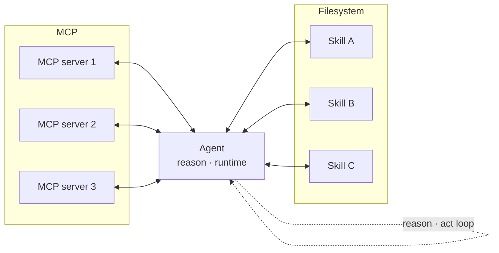

# Agent with skills

**One-line description.** The architectural snapshot of a general-purpose agent composed of four layers — **agent loop** (reasoning), **agent runtime** (code + filesystem), **MCP servers** (outbound connectors to external tools and data), and a **skills library** (local, progressively-disclosed domain expertise on the filesystem). This is the "Skills: the complete picture" diagram from Anthropic's skills blog post — the shape that explains *why you stop building specialized agents and start shipping skills to one general agent*. It is a **system composition** diagram, not a workflow: it answers "what the agent is", not "what it does next".

## Default diagram type

**Structural — central hub with bilateral satellite groups.** Single agent box in the middle with a visible interior loop glyph; MCP servers stacked vertically on the **left**; skills stacked vertically inside a **filesystem container** on the **right**. The left/right split is the point: *left is network-reachable tools, right is on-disk expertise*.

Alternate types:
- **Before/after poster flowchart** (two stacked frames, per `flowchart.md` → "Poster flowchart") when illustrating the evolution from specialized-per-domain agents → general agent + skills. This is Anthropic's Figure 1 / Figure 2 shape.
- **Flowchart with a loop container** when the user wants to show activation order (loop → read skill → call MCP → write file → loop). The structural snapshot loses sequencing; the flowchart gains it.

## Palette

Three role ramps + gray. This is a structural diagram where the two satellite groups must be visually distinct:

- **`c-gray`** — filesystem container, title bar, legend, arrow labels.
- **`c-teal`** — agent (central hub). Teal anchors the LLM/reasoning role.
- **`c-purple`** — MCP servers. Shared across all three (homogeneous satellite group — instances of one role do not get distinct colors).
- **`c-coral`** — skills. Shared across all three; coral reads as Anthropic's own skills brand-orange and sits opposite the MCP group.

This is a **category coloring**, not a rainbow: one ramp per satellite *group*, not per satellite. The structural radial-star rule in `structural.md` ("satellites stay neutral gray") is deliberately overridden here because we have **two distinct kinds of satellite** that the reader must tell apart at a glance.

Legend is required.

## Sub-pattern

`structural.md` → **Radial star topology** as the base (hub with satellites, bidirectional arrows), extended to an **asymmetric two-group** variant: left group is a loose stack (no container), right group is wrapped in a `structural.md` → **Container box** to show the filesystem boundary. The agent's interior loop uses `glyphs.md` → **terminal-icon** plus a hand-drawn circular arrow pair around it (the "reason · act" cycle) — this is what distinguishes the agent visually from its satellites.

## Mermaid reference



Two subgraphs flanking a central hub plus a self-loop on the hub is the defining shape. Drop either subgraph and the pattern collapses into something else — a plain tool-calling loop (if you drop skills) or a read-only retrieval shape (if you drop MCP).

## Baoyu SVG plan

Central agent with an interior loop glyph; three MCP servers stacked on the left; three skills stacked inside a filesystem container on the right.

- **viewBox**: `0 0 820 460`
- **Agent (hub)** — `c-teal`, `x=310 y=110 w=200 h=240`, large central box:
  - Title *Agent* at `(410, 140)` class `th`.
  - Interior loop glyph centered at `(410, 230)`: a `terminal-icon` at `(398, 218)` (24×24 from `glyphs.md`), with two curved arrows forming a circle around it — `path d="M 370 230 A 40 40 0 1 1 450 230" class="arr" marker-end="url(#arrow)"` plus the mirror arc below. This is the reason-act loop made visible.
  - Subtitle *reason · runtime* at `(410, 310)` class `ts`.
- **MCP server stack** (3 boxes, `c-purple`, single-line title, same size):
  - *MCP server 1*, `x=60 y=140 w=170 h=52`.
  - *MCP server 2*, `x=60 y=210 w=170 h=52`.
  - *MCP server 3*, `x=60 y=280 w=170 h=52`.
- **Filesystem container** — `rect x=570 y=100 w=220 h=260 rx=16` class `box`, title *Filesystem* at `(680, 128)` class `th`, centered.
- **Skills stack** inside the filesystem (3 boxes, `c-coral`, single-line title, same size):
  - *Skill A*, `x=600 y=150 w=160 h=52`.
  - *Skill B*, `x=600 y=216 w=160 h=52`.
  - *Skill C*, `x=600 y=282 w=160 h=52`.

**Arrow plan.** Six bidirectional pairs, three per side. Each pair uses two single-headed arrows offset 8px perpendicular to direction (same rule as `structural.md` → "Radial star → Arrow pairs"):

- MCP server *n* ↔ Agent: short horizontal channel from `(230, y_center)` to `(310, y_center)` and back, where `y_center ∈ {166, 236, 306}`. Both solid `arr`.
- Agent ↔ Skill *n*: short horizontal channel from `(510, y_center)` to `(600, y_center)` and back, where `y_center ∈ {176, 242, 308}`. Arrows cross the filesystem container edge — that crossing is semantically important and must not be hidden.

No external self-loop arc on the agent — the interior loop glyph (`terminal-icon` + circular arrows) already carries that meaning, and an exterior arc would collide with the MCP/skills channels.

**Legend** (bottom, required):

```
[■] Agent   [■] MCP server   [■] Skill   [▭] Filesystem   [↔] bidirectional channel
```

**Gotchas.**
- Never color the 3 MCP servers differently from each other, nor the 3 skills. Each group is a homogeneous tier; per-item coloring turns an architecture diagram into a role diagram.
- Keep the filesystem container around the skills. Dropping it makes skills look like peers of MCP servers and erases the "local, progressively disclosed from disk" property that is the whole reason skills are not MCP servers.
- Convention: **MCP on the left, skills on the right**, matching Anthropic's own materials. Flipping the sides loses a free point of recognition.
- If the user wants to show **progressive disclosure** (metadata → SKILL.md → references/), add a nested three-tier rect *inside each skill box* — that is an extension of this pattern, not an alternate type.
