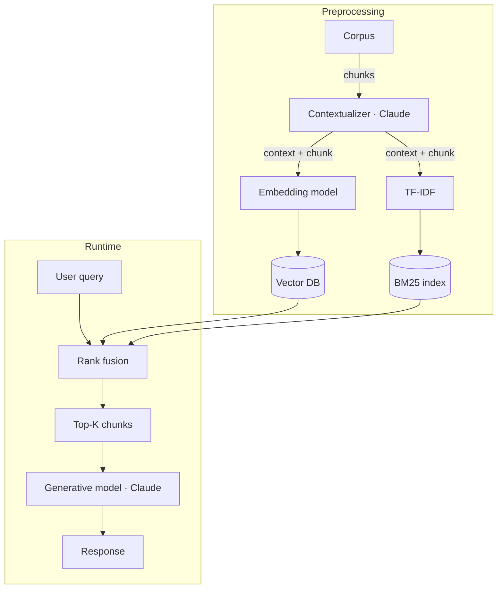

# Contextual retrieval

**One-line description.** Anthropic's preprocessing recipe for RAG: before chunks are embedded and indexed, an LLM (the *contextualizer*) reads the whole document together with each chunk and emits 50–100 tokens of situating context that gets prepended to the chunk. The contextualized chunk then feeds **both** a semantic index (embedding model → vector DB) and a lexical index (TF-IDF → BM25). At runtime the query hits both indices, results merge through rank fusion, and the top-K chunks go to the generative model. The diagram's job is to show the contextualizer as the distinctive new step and the dual-track preprocessing it feeds.

## Default diagram type

**Flowchart (poster style) with two stacked phases.** The pattern has a name, a clear preprocessing / runtime split, a fan-out into parallel tracks, and a distinctive new step — that's poster flowchart territory. A flat linear chart would smear the two phases and hide what's new. Stack the phases vertically with eyebrow dividers; each phase reads left-to-right.

Alternate types:
- **Structural — subsystem containers side by side** when contrasting contextual retrieval against plain RAG (two siblings, each a mini pipeline). See `structural.md` → "Rich interior for subsystem containers".
- **Preprocessing-only flowchart** when the runtime story isn't needed — drop phase 2 and end at the two indices.

## Palette

Three accent ramps plus gray, under the poster-flowchart 4-ramp exception (ramps encode role *categories*, not sequence):

- **`c-gray`** — corpus, query, rank fusion, top-K chunks, response. Neutral data / IO.
- **`c-purple`** — Claude in both its roles: contextualizer and generative model. One ramp for both anchors the "same Claude, two prompts" story without adding a fourth color.
- **`c-teal`** — semantic track (embedding model + vector DB).
- **`c-amber`** — lexical track (TF-IDF + BM25 index).

Do **not** color the contextualizer and generative model differently — doing so implies different models or different roles, but the whole point is the same Claude doing both jobs.

## Sub-pattern

`flowchart.md` → **Poster flowchart pattern** (eyebrow-divided phases, ≤4 ramps for role categories) + **Fan-out + aggregator (simple mode)** applied twice: the contextualizer splits into two tracks that never reconverge in phase 1, and query + both indices converge at rank fusion in phase 2.

## Mermaid reference



Defining edges: `CTX --> EM` *and* `CTX --> TF` (the contextualized chunk goes to both tracks) plus `VDB --> RF` *and* `BM --> RF` (both indices feed fusion). Drop either pair and the diagram collapses into plain RAG or embedding-only retrieval.

## Baoyu SVG plan

Two stacked phases with eyebrow labels and a thin horizontal divider between them.

- **viewBox**: `0 0 680 540`
- **Phase 1 eyebrow** — *Preprocessing · Runs once per corpus update* at `(40, 50)`, class `eyebrow`.

Phase 1 interior:
- **Corpus** — `c-gray`, `x=40 y=80 w=100 h=56`, two-line (*Corpus*, *Documents*).
- **Contextualizer** — `c-purple`, `x=180 y=72 w=260 h=72`, multi-line (*Contextualizer*, *Claude*, *50–100 tokens per chunk*). Visibly the largest box — it's the pattern's signature step.
- **Embedding model** — `c-teal`, `x=140 y=180 w=160 h=48`, single-line.
- **TF-IDF** — `c-amber`, `x=380 y=180 w=160 h=48`, single-line.
- **Vector DB** — `c-teal`, `x=140 y=260 w=160 h=56`, two-line (*Vector DB*, *Semantic index*).
- **BM25 index** — `c-amber`, `x=380 y=260 w=160 h=56`, two-line (*BM25 index*, *Lexical index*).

**Phase 1 arrows:**
- *Corpus → Contextualizer*: `(140, 108) → (180, 108)`, label *chunks* at `(160, 102)`.
- *Contextualizer → Embedding model*: L-bend `(260, 144) → (260, 160) → (220, 160) → (220, 180)`, label *context + chunk* at `(170, 164)` `text-anchor="end"`.
- *Contextualizer → TF-IDF*: L-bend `(360, 144) → (360, 160) → (460, 160) → (460, 180)`, label *context + chunk* at `(470, 164)` `text-anchor="start"`. (Both arrows labeled — the reader must see that *both* tracks receive the contextualized chunk.)
- *Embedding model → Vector DB*: straight vertical `(220, 228) → (220, 260)`.
- *TF-IDF → BM25 index*: straight vertical `(460, 228) → (460, 260)`.

- **Phase divider** — dashed line `x1=40 y1=340 x2=640 y2=340`, class `arr-alt`.
- **Phase 2 eyebrow** — *Runtime · Per user query* at `(40, 362)`, class `eyebrow`.

Phase 2 interior (single horizontal row at y=400–456):
- *User query* `c-gray` `x=40 w=100`, *Rank fusion* `c-gray` `x=160 w=100`, *Top-K chunks* `c-gray` `x=280 w=100` (two-line with subtitle *Top 20*), *Generative model* `c-purple` `x=400 w=140` (two-line with subtitle *Claude*), *Response* `c-gray` `x=560 w=80`. All `y=400 h=56`.

**Phase 2 arrows** (straight horizontal, 20px gaps between boxes at y=428): query→fusion, fusion→top-K, top-K→generator, generator→response.

**Cross-phase arrows** (indices into rank fusion):
- *Vector DB → Rank fusion*: vertical drop `(200, 316) → (200, 400)` — lands inside rank fusion's top edge (x=160–260).
- *BM25 index → Rank fusion*: L-bend `(460, 316) → (460, 372) → (220, 372) → (220, 400)`. The 20px x-offset from the Vector DB arrow keeps the two inbound arrows from stacking.

Both cross-phase arrows are solid `.arr` — they're the main data flow, nothing alternate.

**Legend** (bottom, required — 3 accent ramps encode category):

```
[■] Claude (contextualizer + generator)    [■] Semantic track    [■] Lexical track
```

Place at `y=510`, centered at `x=340`.

**Gotchas.**
- Both tracks must show they receive the *contextualized* chunk — label both outgoing arrows from the contextualizer. If only one is labeled, readers assume the other track still uses raw chunks.
- Do not draw the contextualizer as a self-loop on the Corpus. It's a distinct LLM step that runs once per chunk with whole doc + chunk as input, conceptually closer to an orchestrator than an inline transform.
- Keep rank fusion gray, not amber — it merges two tracks but it's a structural aggregator, not an accent role. Giving it amber visually absorbs it into the lexical track.

**Reranker variant.** The reranking extension inserts a **reranker** box between *Rank fusion* and *Top-K chunks*. Insert `Reranker` at `x=280 y=400 w=120 h=56` (shift Top-K, generator, response right by 140 and widen the viewBox to 820). Annotate the reranker's input arrow with *top 150* and its output with *top 20* — the winnowing ratio is the whole point.
