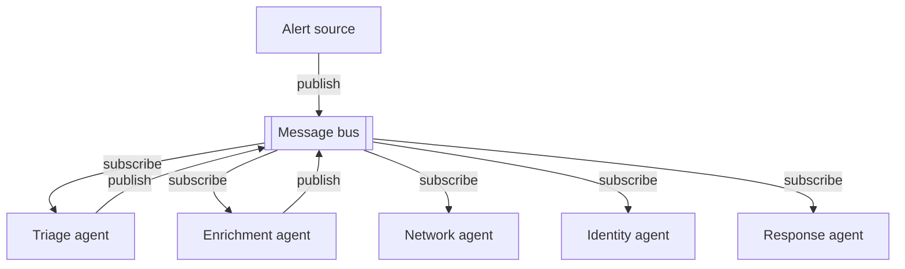

# Message bus

**One-line description.** N agents coordinate through a shared publish/subscribe channel rather than talking to each other directly. Each agent subscribes to the topics it cares about and publishes events others may handle. Unlike orchestrator-subagent (central router) or shared-state (central store), the bus carries *events in flight* — agents react to what's happening, not to what's been accumulated. Canonical use cases: event-driven pipelines, security-ops triage → investigation → response, growing agent ecosystems where new capabilities plug in without rewiring.

## Default diagram type

**Structural — bus topology.** The defining visual is a central horizontal bar with agents fanning out above and below, each linked by a pair of offset arrows (publish down, subscribe up). A flowchart would force one specific event sequence, but the whole point of a bus is that the workflow emerges from events; a structural diagram shows the coordination shape without committing to a single path.

Alternate types:
- **Sequence** when the user wants to show one specific event cascade (alert arrives → triage classifies → network agent investigates → response agent acts) with explicit ordering. Use 4–5 lifelines, not the bus geometry.
- **Flowchart** only if the pipeline really is fixed, in which case it's not a message bus — it's just a linear workflow.

## Palette

- **`c-gray`** — the event source / external input (the thing that only publishes, never subscribes). Neutral because it's outside the coordinated agent set.
- **`c-teal`** — the agent role for all subscribed agents. One shared ramp because every agent on the bus is a peer; coloring them differently implies a hierarchy that the pattern explicitly rejects.
- **`c-amber`** — the bus bar itself. Amber is the convention for "the shared channel everyone looks at" per `structural.md` → "Bus topology sub-pattern".

Do **not** rainbow the agents by role (network / identity / response / enrichment → four different ramps). The reader should feel the agents are interchangeable peers that differ only in what topics they subscribe to, not in what kind of thing they are.

## Sub-pattern

`structural.md` → **Bus topology sub-pattern** + `glyphs.md` → **Publish/subscribe arrow pair**. This pattern is the flagship use case for both; the bus topology section is written with this diagram in mind and `layout-math.md` → "Bus topology geometry" has the fixed coordinates.

## Mermaid reference



The `[[bus]]` notation stands in for a central bar — mermaid can't draw the real geometry. What matters structurally is that every agent talks only to the bus, never agent-to-agent, and that most agents both publish *and* subscribe (the source is the exception).

## Baoyu SVG plan

Bus bar centered horizontally; 3 agents on top, 3 agents on bottom. Uses the Anthropic security-ops example labels verbatim — swap them for the user's domain when adapting.

- **viewBox**: `0 0 680 500`
- **Bus bar** — `c-amber`, `x=40 y=280 w=600 h=40 rx=20`. Label *Message bus (publish/subscribe)* at `(340, 304)`, class `th`, centered.
- **Top row** (3 boxes, centers at `x = 170, 340, 510`, `w=140 h=60`, `y=80`, two-line):
  - *Alert source*, **`c-gray`**, subtitle *External events* — the only pure publisher. Mark it gray to distance it from the coordinated agent set.
  - *Triage agent*, `c-teal`, subtitle *Classifies severity*.
  - *Enrichment agent*, `c-teal`, subtitle *Gathers context*.
- **Bottom row** (same centers, `y=400`, `h=60`):
  - *Network agent*, `c-teal`, subtitle *Investigates traffic*.
  - *Identity agent*, `c-teal`, subtitle *Checks credentials*.
  - *Response agent*, `c-teal`, subtitle *Triggers actions*.

**Publish/subscribe arrow pairs** (use the glyph template verbatim, 8px offset):

- For each agent centered at `agent_cx`, with top agents at `agent_y_bottom=140` and the bus top at `bar_y_top=280`, draw two vertical lines:
  - Publish: `(agent_cx − 8, 140) → (agent_cx − 8, 280)` with arrowhead.
  - Subscribe: `(agent_cx + 8, 280) → (agent_cx + 8, 140)` with arrowhead.
- For bottom agents, `agent_y_top=400`, `bar_y_bottom=320`, mirror: Publish goes down from agent to bus, Subscribe goes up from bus to agent. (Yes — publish on a bottom agent still goes *out of* the agent toward the bus, which is visually upward.)
- **Gotcha — Alert source exception.** Alert source is a pure publisher; draw only its Publish arrow (`(162, 140) → (162, 280)`) and omit the Subscribe return. Do *not* draw a subscribe arrow with no label, and do not put a "(source)" parenthetical in the subtitle — the gray ramp + missing return arrow is the signal.
- **Labels.** Only label the Publish/Subscribe arrows for one representative agent (e.g., Triage), not all six. With six pairs on one diagram, labeling every pair becomes text soup — a single labeled example plus the legend below is enough.

**Legend.** Required because the two arrow directions encode distinct semantics and the color-off source agent needs a key:

```
[↓] Publish    [↑] Subscribe    [■] Event source    [■] Subscribed agent    [■] Bus
```

Place at `y=480`, `text-anchor="middle"` at `x=340`.

**When to drop to 2+2 or go up to 4+4.** The 3+3 layout is the sweet spot. With 2 agents per row use `w=180` centered at `x=180, 500`. With 4 per row use `w=110` centered at `x=120, 260, 420, 560` and drop the Publish/Subscribe *labels* entirely — four pairs plus labels per row is too dense. Beyond 8 total agents, the diagram is telling you the ecosystem has outgrown a single-canvas structural view; consider grouping agents by topic or splitting into two diagrams.
