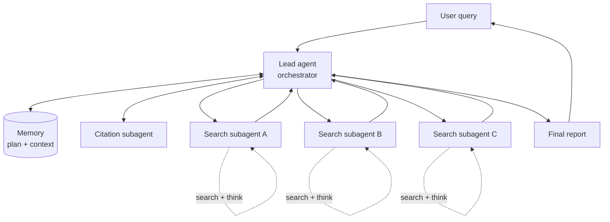

# Multi-agent research

**One-line description.** A lead agent plans a research task, persists its plan to a memory sidecar, spawns a row of parallel search subagents (each running its own search-and-think loop over a different aspect of the question), synthesizes their findings, then hands the synthesized draft to a dedicated citation subagent that attributes sources before the final report goes back to the user. This is Anthropic's Research-feature shape. The parts that distinguish it from a plain orchestrator fan-out are the **memory sidecar**, the **per-subagent iteration loop**, and the **post-processing citation stage**.

## Default diagram type

**Structural flowchart — central orchestrator with two flanking peers plus a subagent row.** The topology has one big star (the lead agent) with a memory store on one side and a citation subagent on the other, and a row of interchangeable search subagents underneath. A plain fan-out misses memory; a vertical queue-backed worker pool misses the pre/post peers. Draw the lead agent large and central, flank it with memory + citations, and put search subagents in a horizontal row below.

Alternate types:
- **Sequence** when the user wants to show turn order — `LeadResearcher → Memory (save plan) → Subagent1/2 (parallel dispatch) → LeadResearcher (synthesize) → CitationAgent → User`. This is the shape of the process diagram in Anthropic's own post.

## Palette

Four role ramps (at the `design-system.md` limit for multi-agent diagrams):

- **`c-gray`** — user box, final report, structural labels.
- **`c-teal`** — lead agent / orchestrator. The primary role anchors the strongest color.
- **`c-purple`** — search subagents, **all the same color**. Instances of one role share a ramp; they are interchangeable workers, not distinct actors.
- **`c-coral`** — citation subagent. Distinct from the search pool because it is a different specialist running at a different stage.
- **`c-amber`** — memory store. Amber is the standing convention for a retriever/store sidecar, which also prevents readers from mistaking memory for a third agent role.

Legend is required — three distinct non-gray role ramps plus the store color.

## Sub-pattern

`flowchart.md` → **Fan-out + aggregator (simple mode)** for the lead ↔ subagents channel, plus `flowchart.md` → **Self-loops** (borrowed from the state-machine section) on each search subagent to show its internal search/think iteration. The flanking peers (memory, citation) are **bidirectional satellites** off the lead agent — not part of the fan-out.

## Mermaid reference



The distinctive edges vs. a plain orchestrator fan-out: the bidirectional `L <--> M` sidecar, the `L <--> C` post-processor, and the three self-loops on the search subagents.

## Baoyu SVG plan

Central lead agent with two flanking peers on the top row and three parallel search subagents in a row below. User box on the far left.

- **viewBox**: `0 0 820 460`
- **User** — `c-gray`, `x=30 y=150 w=120 h=64`, two-line (*User*, *Submits query*).
- **Lead agent** — `c-teal`, `x=310 y=90 w=260 h=180`, multi-line block:
  - Title *Lead agent* at `(440, 120)` class `th`.
  - Subtitle *(orchestrator)* at `(440, 140)` class `ts`.
  - Tool stack at y=178, 198, 218, 238, class `ts`, centered: *Tools:*, *search · MCP · memory*, *run_subagent*, *complete_task*.
- **Citations subagent** — `c-coral`, `x=170 y=156 w=120 h=60`, two-line (*Citations*, *subagent*).
- **Memory** — `c-amber`, `x=590 y=156 w=200 h=60`, two-line (*Memory*, *plan + context*).
- **Search subagent row** (3 workers, all `c-purple`, same size):
  - *Search subagent A*, `x=200 y=340 w=160 h=64`, two-line (*Search subagent*, *Aspect A*).
  - *Search subagent B*, `x=390 y=340 w=160 h=64`, two-line (*Search subagent*, *Aspect B*).
  - *Search subagent C*, `x=580 y=340 w=160 h=64`, two-line (*Search subagent*, *Aspect C*).

**Arrow plan.**
- User ↔ Lead — stacked request/response pair: `user → lead` solid `arr` `M 150 174 L 310 174` labeled *query*; `lead → user` dashed `arr-alt` `M 310 198 L 150 198` labeled *final report*.
- Lead ↔ Citations — short bidirectional pair on lead's left edge: `M 290 180 L 310 180` (in), `M 310 204 L 290 204` (out). Both solid `arr`.
- Lead ↔ Memory — matching pair on lead's right edge: `M 570 180 L 590 180`, `M 590 204 L 570 204`.
- Lead → each subagent — vertical L-bends from lead's bottom edge `(y=270)` via a shared channel at `y=305`. Dispatch arrows anchor on lead at `(360, 270)`, `(470, 270)`, `(520, 270)` and land at each subagent's top-center `(280, 340)`, `(470, 340)`, `(660, 340)`. Middle arrow is straight; outer two L-bend through the channel.
- Subagent → Lead — matching return arrows offset 16px to the right of each dispatch arrow, using `arr-alt` to mark the return.
- **Self-loop on each search subagent** — per `flowchart.md` → Self-loops, a short arc off the right edge: `M {x+w} {y+16} C {x+w+24} {y+8}, {x+w+24} {y+h-8}, {x+w} {y+h-16}` class `arr`, with a `ts` label *search + think* at `({x+w+28}, {y+h/2})`. Repeat for all three subagents. This is the key visual that distinguishes research subagents from plain workers.

**Legend** (bottom, required):

```
[■] Lead agent   [■] Search subagent   [■] Citation subagent   [■] Memory   [──] dispatch   [- -] return
```

**Gotchas.**
- Do not color the 3 search subagents differently — they are one pool, not three roles. Rainbow-ing them turns a homogeneous worker pool into a role fan-out and misrepresents the pattern.
- Keep memory amber even though it is a peer of lead — the store convention keeps readers from reading it as a third agent.
- The citation subagent runs *at the end* logically, but the architecture view draws it as a peer of the lead agent (not a downstream successor), matching Anthropic's own diagram. If the user asks for the turn-order view instead, switch to the sequence alternate.
