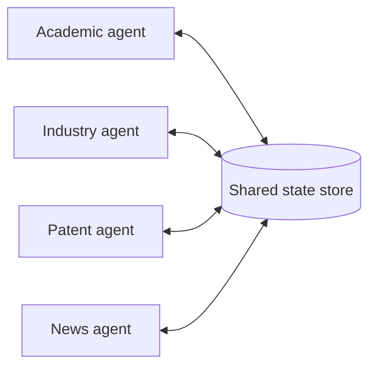

# Shared state

**One-line description.** N peer agents coordinate by reading and writing a persistent shared store — database, filesystem, document — with no central orchestrator, router, or message bus between them. Each agent checks the store for relevant findings, acts on what it sees, and writes its own contributions back. Findings are immediately visible to every other agent; the store becomes an evolving knowledge base. Canonical use case: a research synthesis system where an academic-literature agent, industry-reports agent, patent agent, and news agent all build on each other's discoveries in real time.

## Default diagram type

**Structural — radial star.** The point of the pattern is *no central coordinator* — the hub is a passive store, not an active router. A radial star diagram puts the store in the center and the agents around it, with bidirectional read/write channels on every spoke. A flowchart would smuggle in an implied order; a bus topology would suggest events in flight rather than accumulated state.

Alternate types:
- **Illustrative** when the user wants a *cross-section* metaphor — concentric layers, store as a well, agents as drawers dipping in. Rarely the right call for production docs but occasionally useful for teaching the intuition.
- **Structural (subsystem)** when the user is contrasting shared-state with a different pattern (agent teams, message bus) — in that case use the two-sibling container layout and make this pattern's side a mini radial star inside the right container. See `structural.md` → "Rich interior for subsystem containers".

## Palette

- **`c-amber`** — the shared state hub. This is the one place in the diagram that "everybody is looking at," and amber is the documented convention for shared-state hubs per `structural.md` → "Radial star topology sub-pattern".
- **`c-gray`** — the peripheral satellite agents. They are peers doing the same *kind* of work (read + write), and the pattern's whole argument is that they're interchangeable. Giving each satellite its own ramp is rainbow coloring that implies a hierarchy that doesn't exist.
- **`c-teal`** — acceptable *instead of* gray for all satellites together (single ramp for "agent peer"), when the diagram needs to distinguish the agents from other gray scaffolding elsewhere on the canvas. Never mix gray and teal satellites in the same diagram — it looks like two tiers.

Never promote one satellite to a different ramp "to show the primary agent". If one agent really is primary, the topology isn't radial star — it's orchestrator-subagent or agent-teams.

## Sub-pattern

`structural.md` → **Radial star topology sub-pattern**. The central hub carries a `doc-icon` glyph from `glyphs.md` → "Document & terminal icons" to signal it's a store (not just an abstract coordinator). `layout-math.md` → "Radial star geometry (3 / 4 / 5 / 6 satellites)" has the fixed coordinate table for N=3 through N=6.

## Mermaid reference

The defining shape is the bidirectional double-headed arrow between every satellite and the store, with *no arrows between satellites*. Any agent-to-agent edge turns the topology into a mesh and is a signal to switch patterns.

## Baoyu SVG plan

N=4 radial star with a doc-icon hub. Uses the Anthropic research-synthesis example labels verbatim — swap them for the user's domain.

- **viewBox**: `0 0 680 560`
- **Hub (shared state store)** — `c-amber`, `x=260 y=280 w=160 h=80 rx=10`.
  - Title *Shared state* at `(340, 302)`, `th`, centered.
  - Subtitle *Database / filesystem / doc* at `(340, 320)`, `ts`, centered.
  - `doc-icon` glyph at `translate(328, 328)` (bottom-center of hub rect). Copy the 5-line doc-icon path from `structural.md` → "Hub content" verbatim — it's the worked example for exactly this diagram.
- **Satellites** (4, all `c-gray`, `w=160 h=60`, two-line):
  - *Academic agent*, `x=60 y=120`, subtitle *Literature search*.
  - *Industry agent*, `x=460 y=120`, subtitle *Market reports*.
  - *Patent agent*, `x=60 y=460`, subtitle *Patent filings*.
  - *News agent*, `x=460 y=460`, subtitle *Current coverage*.

**Bidirectional arrow pairs** (use the pre-computed N=4 endpoints from `layout-math.md` → "Radial star geometry"):

- TL Academic: outbound `(224, 176) → (264, 276)`, inbound offset perpendicular by 8.
- TR Industry: outbound `(456, 176) → (416, 276)`, inbound offset.
- BL Patent: outbound `(224, 464) → (264, 364)`, inbound offset.
- BR News: outbound `(456, 464) → (416, 364)`, inbound offset.
- Label each pair with a single `ts` *Read / write* next to the satellite end (not between the two offset lines — the 8px gap is too narrow). For the top satellites, place the label just below the satellite box at `y ≈ 198`. For the bottom satellites, just above at `y ≈ 448`.

**Centered banner for termination rule.** Shared-state systems cycle indefinitely without an explicit termination condition. Drop a small centered `ts` caption at the top of the canvas — `y=60`, `text-anchor="middle"` at `x=340` — naming the rule the system uses: *Until convergence (no new findings for N cycles)*, *Until time budget exhausted*, or *Until a designated terminator agent signals done*. This is not ornamental — a shared-state diagram without a termination line misrepresents the pattern. See the blog's "reactive loops" failure mode.

**Legend.** Not needed — the single accent color on the hub and the shared gray on satellites self-document. If you used `c-teal` satellites instead of gray, still no legend: one ramp on all peers means "they're all the same role", which is the whole message.

**When to use N≠4.** Stick to N=4 unless the source explicitly names a different count. N=3 when the user names three investigators, N=5–6 for larger ecosystems. Beyond 6 satellites, switch to the bus topology pattern — a shared store with 8+ agents suggests event-driven coordination, not accumulated state.
