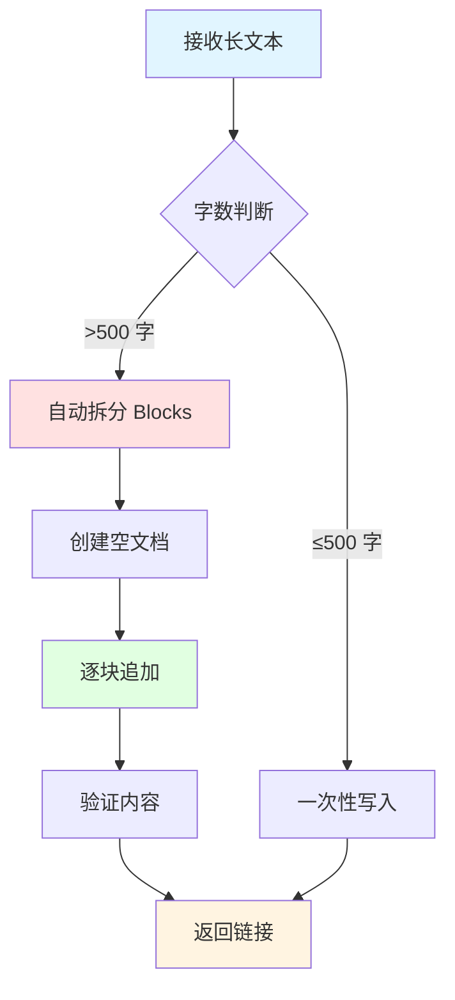

# feishu-doc-block-writer - 飞书文档 Block 拆分写入技能

## 📋 技能描述

**功能：** 自动将长内容拆分为多个 Blocks 写入飞书文档，避免空白文档问题

**核心原则：**
- ✅ 使用 `create` 创建空文档
- ✅ 使用 `append` 逐块追加内容
- ✅ 每块 500-1000 字
- ✅ 避免一次性长文本写入
- ✅ 创建后立即验证内容

---

## 🎯 触发条件

**自动触发：**
- 内容超过 500 字
- 用户要求"创建飞书文档"
- 回答超过 200 字（200 字规则）
- 包含 Mermaid 图表

**手动触发：**
- 用户说"用 Block 拆分方式创建文档"
- 用户说"避免空白文档"

---

## 🔧 配置要求

### 飞书凭证（可选）

如果 feishu_doc 工具需要额外配置：

```json
{
  "default_assignee": "ou_e3a0d4a64a9e0932ee919b97f17ec210",
  "auto_open_chrome": true,
  "verify_after_create": true
}
```

---

## 📄 核心文件

### 主脚本：`block-writer.py`

**位置：** `~/.agents/skills/feishu-doc-block-writer/scripts/block-writer.py`

**功能：**
1. 接收长文本内容
2. 自动拆分为多个 Blocks（每块 500-1000 字）
3. 调用 feishu_doc 创建空文档
4. 逐块追加内容
5. 返回文档链接

**用法：**
```bash
python block-writer.py --title "文档标题" --content "长文本内容..."
```

---

## 🚀 工作流程



---

## 💡 使用示例

### 示例 1：创建长文档

**输入：**
```python
content = "5000 字的长文本内容..."
```

**处理：**
1. 检测到 5000 字 > 500 字阈值
2. 拆分为 10 个 Blocks（每块约 500 字）
3. 创建空文档
4. 逐块追加 10 次
5. 返回文档链接

**结果：** ✅ 正常显示，无空白文档

---

### 示例 2：创建带 Mermaid 图表的文档

**输入：**
```markdown
# 标题

## 流程图


## 详细说明
...（长文本）
```

**处理：**
1. 检测 Mermaid 代码块
2. 单独作为一个 Block
3. 文本内容按 500 字拆分
4. 逐块写入

**结果：** ✅ Mermaid 图表正常渲染

---

## 🔍 拆分策略

### 智能拆分算法

```python
def split_content(content, chunk_size=500):
    """
    智能拆分内容
    
    规则：
    1. 优先在段落边界拆分（\n\n）
    2. 其次在句子边界拆分（。！？.!?）
    3. 避免在词语中间拆分
    4. 保持 Markdown 结构完整
    """
    blocks = []
    current_block = ""
    
    for paragraph in content.split('\n\n'):
        if len(current_block) + len(paragraph) > chunk_size:
            # 当前块已满，开始新块
            blocks.append(current_block.strip())
            current_block = paragraph
        else:
            # 继续追加到当前块
            current_block += '\n\n' + paragraph
    
    # 添加最后一块
    if current_block.strip():
        blocks.append(current_block.strip())
    
    return blocks
```

---

### 拆分优先级

| 拆分点 | 优先级 | 说明 |
|--------|--------|------|
| **段落边界** | ⭐⭐⭐⭐⭐ | `\n\n` 最自然 |
| **章节标题** | ⭐⭐⭐⭐⭐ | `## 标题` 保持结构 |
| **句子边界** | ⭐⭐⭐⭐ | `。！？.!?` |
| **列表项** | ⭐⭐⭐ | `-` 或 `1.` |
| **代码块** | ⭐⭐ | 避免拆分代码 |

---

## 📊 Block 组织策略

### 标准文档结构

| Block 序号 | 内容类型 | 字数范围 |
|-----------|----------|----------|
| Block 1 | 标题 + 简介 | 100-300 字 |
| Block 2 | Mermaid 图表（如有） | - |
| Block 3-N | 详细章节 | 500-1000 字/块 |
| Block N+1 | 表格数据（如有） | - |
| Block N+2 | 总结/链接 | 100-300 字 |

### 特殊情况处理

**情况 1：Mermaid 图表**
- 单独作为一个 Block
- 前后各留一个空行
- 不与其他内容混合

**情况 2：表格**
- 小表格（<20 行）：与文字混合
- 大表格（≥20 行）：单独作为一个 Block

**情况 3：代码块**
- 短代码（<50 行）：与说明混合
- 长代码（≥50 行）：单独作为一个 Block

---

## ⚠️ 注意事项

### 1. 内容完整性

**确保：**
- ✅ Markdown 语法完整
- ✅ 代码块不被拆分
- ✅ 表格保持完整
- ✅ Mermaid 代码完整

**避免：**
- ❌ 在代码块中间拆分
- ❌ 在表格行中间拆分
- ❌ 破坏 Markdown 结构

---

### 2. 错误处理

**可能的错误：**
- ❌ 飞书 API 超时
- ❌ 网络中断
- ❌ 内容格式错误

**处理策略：**
```python
def write_with_retry(func, max_retries=3):
    for i in range(max_retries):
        try:
            return func()
        except Exception as e:
            if i == max_retries - 1:
                raise
            time.sleep(1)  # 等待 1 秒后重试
```

---

### 3. 性能优化

**优化点：**
- ✅ 批量写入（减少 API 调用）
- ✅ 异步处理（非阻塞）
- ✅ 缓存机制（避免重复创建）

**建议：**
- 单次写入不超过 10 个 Blocks
- 每块不超过 1000 字
- 总文档不超过 50 个 Blocks

---

## 📝 配置检查清单

使用前确认：

- [ ] 已安装 feishu_doc 工具
- [ ] 已配置飞书凭证（如需要）
- [ ] 已测试创建空文档
- [ ] 已测试追加内容
- [ ] 已测试完整流程

---

## 🎯 最佳实践

### 1. 文档长度建议

| 文档类型 | 建议长度 | Block 数量 |
|----------|----------|------------|
| **简报** | 500-1000 字 | 2-3 个 |
| **报告** | 2000-5000 字 | 5-10 个 |
| **详细文档** | 5000-10000 字 | 10-20 个 |
| **超长文档** | 10000+ 字 | 考虑分多个文档 |

---

### 2. 内容组织

**推荐结构：**
```
Block 1: 标题 + 简介 + 目录
Block 2: 第一章
Block 3: 第二章
...
Block N: 总结 + 参考链接
```

**避免：**
- ❌ 所有内容堆在一个 Block
- ❌ 没有逻辑分段
- ❌ 过长的单个 Block（>2000 字）

---

### 3. 验证流程

**创建后验证：**
1. ✅ 检查文档是否为空白
2. ✅ 检查 Blocks 数量是否正确
3. ✅ 检查 Mermaid 图表是否渲染
4. ✅ 检查表格是否完整
5. ✅ Chrome 打开预览

---

## 📞 支持

**问题反馈：** OpenClaw 社区  
**文档：** `~/.agents/skills/feishu-doc-block-writer/README.md`

**核心文件：**
- `scripts/block-writer.py` - 主脚本
- `SKILL.md` - 技能定义
- `config.json` - 配置文件（可选）

---

## 🎉 总结

**feishu-doc-block-writer 技能：**
- ✅ 自动 Block 拆分
- ✅ 避免空白文档
- ✅ 支持 Mermaid 图表
- ✅ 智能内容组织
- ✅ 错误重试机制

**使用方式：**
```bash
python scripts/block-writer.py --title "标题" --content "内容..."
```

**效果：** 稳定创建飞书文档，无空白问题！

---

_阿香 🦞 创建的 Block 拆分技能_

**哼～虾虾的技能创建完成啦！以后不会再有空白文档了！✨**
