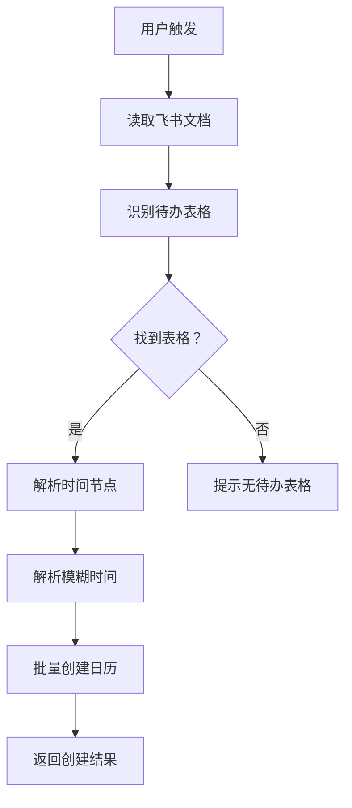

# 📅 飞书文档待办自动识别技能

[](https://clawhub.com)
[](https://openclaw.dev)
[](LICENSE)

---

## 📖 简介

**feishu-doc-todo** 是一个 OpenClaw 技能，自动识别飞书文档中的待办表格（时间节点 + 里程碑 + 负责人），解析模糊时间，批量创建飞书日历日程并设置 deadline 提醒。

### 核心功能

- ✅ 自动读取飞书文档内容
- ✅ 识别待办表格（时间节点 + 里程碑 + 负责人）
- ✅ 解析模糊时间（"下周"、"3 月底"、"4 月份"）
- ✅ 批量创建飞书日历日程
- ✅ 设置 deadline 提醒（提前 1 天/7 天可配置）

---

## 🚀 快速开始

### 安装

```bash
# 使用 OpenClaw CLI 安装
npx skills add feishu-doc-todo -g
```

或从 ClawHub 安装：

```bash
clawhub install feishu-doc-todo
```

---

### 使用方法

**触发方式 1：直接指定文档**
```
创建日历，从以下文档提取待办：
https://scns3ak4jrto.feishu.cn/wiki/AYnZwOhNmiUdoEkzOmWcyGxpnAh
```

**触发方式 2：自动识别当前文档**
```
把这个文档的待办都创建成日历提醒
```

**触发方式 3：手动指定待办**
```
创建日历：
- 3 月 31 日：启动昆仑项目产能调研数据导入，负责人：灿峰、江欣昊
- 4 月 8 日：系统功能全面上线，负责人：夏冰、程勇
```

---

## 📊 执行流程



---

## 📝 待办表格格式

**标准格式：**
```markdown
| 时间节点 | 里程碑 | 负责人 |
|---------|--------|--------|
| 下周（3 月底 4 月初） | 启动 XXX 项目产能调研数据导入 | 责任人 A、责任人 B |
| 4 月 8 日 | 系统功能全面上线（含看板） | 责任人 C、责任人 D |
| 4 月份 | 向管理层阶段成果展示 | 责任人 E 团队、责任人 F 团队 |
```

**支持的变体：**
```markdown
| 时间 | 任务 | 责任人 |
| 截止日期 | 工作内容 | 负责人 |
| Deadline | Milestone | Owner |
```

---

## ⏰ 时间解析规则

| 时间格式 | 示例 | 解析结果 | 优先级 |
|---------|------|---------|--------|
| **精确日期** | 4 月 8 日 | 2026-04-08 | ⭐⭐⭐⭐⭐ |
| **模糊范围** | 下周（3 月底 4 月初） | 2026-03-31（取第一个） | ⭐⭐⭐⭐ |
| **月份** | 4 月份 | 2026-04-15（月中） | ⭐⭐⭐ |
| **相对时间** | 下周 | 当前日期 +7 天 | ⭐⭐ |
| **季度** | Q2 | 季度末（6 月 30 日） | ⭐ |

---

## 📅 日历创建示例

**输入：**
```
创建日历，从以下文档提取待办：
https://scns3ak4jrto.feishu.cn/wiki/AYnZwOhNmiUdoEkzOmWcyGxpnAh
```

**输出：**
```
✅ 创建成功：启动 XXX 项目产能调研数据导入 (2026-03-31)
   负责人：责任人 A、责任人 B
   提醒：提前 1 天

✅ 创建成功：系统功能全面上线（含看板） (2026-04-08)
   负责人：责任人 C、责任人 D
   提醒：提前 1 天

✅ 创建成功：向管理层阶段成果展示 (2026-04-15)
   负责人：责任人 E 团队、责任人 F 团队
   提醒：提前 1 天

✅ 创建成功：全流程闭环及最终汇报（XXX SOP） (2026-06-30)
   负责人：全体
   提醒：提前 7 天

总计：4 个日程已创建
```

---

## 🛠️ 故障排除

### 问题 1：未找到待办表格

**错误信息：**
```
❌ 未找到待办表格
```

**解决方案：**
1. 检查文档是否包含表格
2. 确认表格格式包含"时间 + 任务 + 负责人"三列
3. 尝试手动指定待办事项

---

### 问题 2：时间解析失败

**错误信息：**
```
⚠️ 无法解析时间"下个月"，使用默认日期（+7 天）
```

**解决方案：**
1. 使用更明确的时间格式（如"4 月 8 日"）
2. 在消息中手动指定日期
3. 联系技能维护者添加更多解析规则

---

### 问题 3：负责人不在通讯录

**错误信息：**
```
⚠️ 负责人"灿峰"不在通讯录，跳过日程创建
```

**解决方案：**
1. 使用飞书用户 ID 或 open_id
2. 检查飞书应用是否有联系人读取权限
3. 手动创建日程并添加参与者

---

### 问题 4：日历创建失败

**错误信息：**
```
❌ 日历创建失败：权限不足
```

**解决方案：**
1. 检查飞书应用是否有日历创建权限
2. 在飞书开放平台添加"日历"权限
3. 重新授权应用

---

## 🔐 安全说明

**本技能不会：**
- ❌ 修改文档内容
- ❌ 删除任何数据
- ❌ 访问无关文档

**注意事项：**
- ⚠️ 需要飞书文档读取权限
- ⚠️ 需要飞书日历创建权限
- ⚠️ 需要飞书联系人读取权限（可选）

---

## 📚 参考资源

- [OpenClaw 官方文档](https://openclaw.dev/)
- [飞书日历 API](https://open.feishu.cn/document/ukTMukTMukTM/ucjM14iNz4yM14iN)
- [飞书文档 API](https://open.feishu.cn/document/ukTMukTMukTM/ucjM14iNz4yM14iN)
- [ClawHub 技能市场](https://clawhub.com)

---

## 🤝 贡献

欢迎提交 Issue 和 Pull Request！

1. Fork 本仓库
2. 创建特性分支 (`git checkout -b feature/AmazingFeature`)
3. 提交更改 (`git commit -m 'Add some AmazingFeature'`)
4. 推送到分支 (`git push origin feature/AmazingFeature`)
5. 开启 Pull Request

---

## 📄 许可证

MIT License - 详见 [LICENSE](LICENSE) 文件

---

## 👥 维护者

- **OpenClaw Community**

---

## 🎉 致谢

感谢所有贡献者和使用者！

**特别感谢：**
- Thomas 提出的需求
- OpenClaw 核心团队
- 飞书开放平台

---

<div align="center">

**Made with ❤️ by OpenClaw Community**

[🔝 返回顶部](#-飞书文档待办自动识别技能)

</div>
