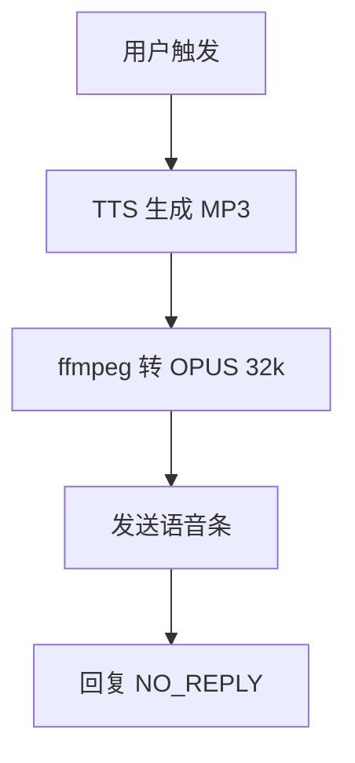

# 🎙️ 飞书语音条生成技能

[](https://clawhub.com)
[](https://openclaw.dev)
[](LICENSE)

---

## 📖 简介

**feishu-voice-note** 是一个 OpenClaw 技能，用于生成和发送飞书原生语音条（语音消息）。

### 核心功能

- ✅ TTS 文本转语音（MP3 生成）
- ✅ ffmpeg 格式转换（MP3 → OPUS 32k）
- ✅ 飞书语音条自动发送
- ✅ 支持所有场景（个人/群聊）

---

## 🚀 快速开始

### 安装

```bash
# 使用 OpenClaw CLI 安装
npx skills add feishu-voice-note -g
```

或从 ClawHub 安装：

```bash
clawhub install feishu-voice-note
```

---

### 配置

**1. 确保 ffmpeg 已安装**

```bash
# 验证 ffmpeg 安装
ffmpeg -version
```

如未安装，请从 https://ffmpeg.org/download.html 下载。

**2. 配置 TTS Provider**

在 `openclaw.json` 中配置：

```json
{
  "messages": {
    "tts": {
      "auto": "always",
      "provider": "edge",
      "edge": {
        "enabled": true,
        "voice": "zh-CN-XiaoyuNeural",
        "lang": "zh-CN"
      }
    }
  }
}
```

**3. 配置飞书渠道**

确保 `openclaw.json` 中已启用飞书：

```json
{
  "channels": {
    "feishu": {
      "enabled": true
    }
  }
}
```

---

### 使用方法

**自动触发：** 当用户消息包含以下触发词时自动执行：

- "发送语音条"
- "用语音回复"
- "语音消息"
- "语音条"
- "TTS 转语音"

**手动调用：**

```bash
# 1. 生成 TTS
tts --text "你好，这是语音测试" --channel feishu

# 2. 转换为 OPUS
ffmpeg -i voice.mp3 -c:a libopus -b:a 32k voice.opus -y

# 3. 发送语音条
openclaw message send \
    --channel feishu \
    --account main \
    --target "user:ou_XXXXXXXXXXXXXXXXXXXXXXXXXXXXXXXX" \
    --media "voice.opus"

# 4. 避免重复回复
echo "NO_REPLY"
```

---

## 📊 执行流程



---

## ⚙️ 技术参数

| 参数 | 值 | 说明 |
|------|-----|------|
| **音频格式** | OPUS | 飞书原生支持 |
| **比特率** | 32kbps | 飞书推荐值 |
| **采样率** | 自动 | 根据源文件 |
| **TTS Provider** | Edge TTS / OpenAI | 可配置 |
| **ffmpeg 版本** | 任意 | 支持 libopus 编码 |

---

## 🛠️ 故障排除

### 问题 1：ffmpeg 未找到

**错误信息：**
```
'ffmpeg' 不是内部或外部命令
```

**解决方案：**
1. 下载 ffmpeg：https://ffmpeg.org/download.html
2. 添加到系统 PATH
3. 重启终端

---

### 问题 2：Open ID 格式错误

**错误信息：**
```
Invalid target format
```

**解决方案：**
确保 `--target` 参数格式正确：
```bash
# ✅ 正确
--target "user:ou_XXXXXXXXXXXXXXXXXXXXXXXXXXXXXXXX"

# ❌ 错误
--target "ou_XXX"
--target "chat:XXX"
```

---

### 问题 3：语音条发送失败

**可能原因：**
- 文件格式不正确（必须是 OPUS）
- 文件路径错误
- 飞书账号权限不足

**解决方案：**
```bash
# 1. 验证文件格式
ffprobe voice.opus

# 2. 检查文件是否存在
ls -la voice.opus

# 3. 验证飞书配置
openclaw status
```

---

## 📝 最佳实践

### 1. 文本长度控制

- **推荐：** 150 字以内（约 30-60 秒）
- **过长处理：** 分段生成多个语音条

### 2. 文件清理

发送后清理临时文件：

```powershell
Remove-Item "voice.mp3" -Force
Remove-Item "voice.opus" -Force
```

### 3. 错误重试

发送失败时重试 1 次：

```bash
if (!$?) {
    Start-Sleep -Seconds 2
    openclaw message send --channel feishu --account main --target "user:ou_XXX" --media "voice.opus"
}
```

---

## 🔐 安全说明

**本技能不会：**
- ❌ 收集用户隐私数据
- ❌ 上传音频到第三方服务器
- ❌ 修改系统配置

**注意事项：**
- ⚠️ 请替换示例中的 Open ID 为实际用户 ID
- ⚠️ 不要在公开场合分享你的飞书 App Secret
- ⚠️ 定期更新 ffmpeg 到最新版本

---

## 📚 参考资源

- [OpenClaw 官方文档](https://openclaw.dev/)
- [飞书语音消息 API](https://open.feishu.cn/document/ukTMukTMukTM/ucjM14iNz4yM14iN)
- [ffmpeg 官方文档](https://ffmpeg.org/documentation.html)
- [ClawHub 技能市场](https://clawhub.com)

---

## 🤝 贡献

欢迎提交 Issue 和 Pull Request！

1. Fork 本仓库
2. 创建特性分支 (`git checkout -b feature/AmazingFeature`)
3. 提交更改 (`git commit -m 'Add some AmazingFeature'`)
4. 推送到分支 (`git push origin feature/AmazingFeature`)
5. 开启 Pull Request

---

## 📄 许可证

MIT License - 详见 [LICENSE](LICENSE) 文件

---

## 👥 维护者

- **阿美团队** - OpenClaw Community

---

## 🎉 致谢

感谢所有贡献者和使用者！

**特别感谢：**
- OpenClaw 核心团队
- 飞书开放平台
- ffmpeg 社区

---

<div align="center">

**Made with ❤️ by OpenClaw Community**

[🔝 返回顶部](#-飞书语音条生成技能)

</div>
