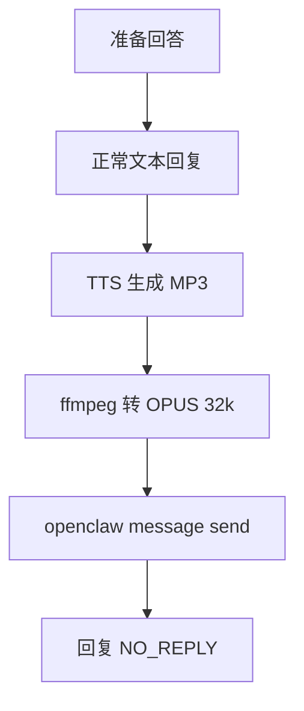

# feishu-voice-note 技能

## 描述

飞书原生语音条（语音条）生成工具。使用场景：用户要求发送语音条、需要将 TTS 转为 OPUS 格式、飞书语音消息自动化。支持 OpenAI/Edge TTS、ffmpeg 转换、自动发送。

## 触发词

- "发送语音条"
- "用语音回复"
- "语音消息"
- "语音条"
- "TTS 转语音"

## 执行流程

### 步骤 1：TTS 生成 MP3

调用 tts 工具生成 MP3 音频：

```bash
# 使用 OpenClaw 内置 tts 工具
tts --text "要转换的文本内容" --channel feishu
```

**输出：** MP3 文件路径（如 `voice.mp3`）

---

### 步骤 2：ffmpeg 转换为 OPUS 32k

使用 ffmpeg 将 MP3 转换为飞书支持的 OPUS 格式：

```powershell
# Windows PowerShell
& "C:\ffmpeg\ffmpeg-8.1-essentials_build\bin\ffmpeg.exe" -i "voice.mp3" -c:a libopus -b:a 32k "voice.opus" -y
```

**参数说明：**
- `-i voice.mp3` - 输入 MP3 文件
- `-c:a libopus` - 使用 OPUS 编码器
- `-b:a 32k` - 比特率 32kbps（飞书推荐）
- `-y` - 覆盖已存在的文件

**输出：** OPUS 文件路径（如 `voice.opus`）

---

### 步骤 3：发送语音条到飞书

使用 `openclaw message send` 发送语音条：

```bash
openclaw message send \
    --channel feishu \
    --account main \
    --target "user:ou_XXXXXXXXXXXXXXXXXXXXXXXXXXXXXXXX" \
    --media "voice.opus"
```

**参数说明：**

| 参数 | 值 | 说明 |
|------|-----|------|
| `--channel` | `feishu` | 指定飞书渠道 |
| `--account` | `main` | 使用主账号配置 |
| `--target` | `user:ou_XXX` | 目标用户 Open ID（需要替换为实际用户 ID） |
| `--media` | 文件路径 | OPUS 音频文件路径 |

**⚠️ 重要：** `--target` 参数需要替换为实际的用户 Open ID，格式为 `user:ou_XXXXXXXXXXXXXXXXXXXXXXXXXXXXXXXX`

---

### 步骤 4：回复 NO_REPLY

发送语音条后，回复 `NO_REPLY` 避免重复消息：

```
NO_REPLY
```

---

## 完整流程图



---

## 技术配置

### 前置条件

1. **ffmpeg 已安装**
   - Windows: `C:\ffmpeg\ffmpeg-8.1-essentials_build\bin\ffmpeg.exe`
   - macOS: `/usr/local/bin/ffmpeg`
   - Linux: `/usr/bin/ffmpeg`

2. **OpenClaw 配置**
   - TTS Provider 已配置（Edge TTS / OpenAI TTS）
   - 飞书渠道已启用

3. **依赖**
   - Node.js 18+
   - OpenClaw 2026.3.13+

---

## 错误处理

### 常见错误及解决方案

**错误 1：ffmpeg 未找到**
```
错误：'ffmpeg' 不是内部或外部命令
解决：安装 ffmpeg 并添加到 PATH
```

**错误 2：Open ID 格式错误**
```
错误：Invalid target format
解决：确保格式为 user:ou_XXX（32 字符）
```

**错误 3：文件不存在**
```
错误：File not found: voice.opus
解决：检查 ffmpeg 转换是否成功，文件路径是否正确
```

---

## 适用范围

✅ **所有回答** - 无论长短、简单/复杂  
✅ **所有场景** - 个人聊天、群聊、子会话  
✅ **所有 Agent** - 阿美、阿香、阿丽、dev、content、ops 等  

---

## 例外情况

❌ **心跳确认** - `HEARTBEAT_OK` 不需要语音  
❌ **NO_REPLY 回复** - 已经发送语音后不需要再次发送  

---

## 最佳实践

### 1. TTS 文本长度控制

- **推荐：** 150 字以内（约 30-60 秒）
- **过长处理：** 分段生成多个语音条

### 2. 文件清理

发送后清理临时文件：

```powershell
Remove-Item "voice.mp3" -Force
Remove-Item "voice.opus" -Force
```

### 3. 错误重试

发送失败时重试 1 次：

```bash
# 重试逻辑
if (!$?) {
    Start-Sleep -Seconds 2
    openclaw message send --channel feishu --account main --target "user:ou_XXX" --media "voice.opus"
}
```

---

## 版本历史

| 版本 | 日期 | 变更 |
|------|------|------|
| v1.0 | 2026-03-18 | 初始版本 |
| v1.1 | 2026-03-29 | 修复命令格式，添加 --channel 和 --account 参数 |

---

## 参考资源

- OpenClaw 官方文档：https://openclaw.dev/
- 飞书语音消息 API 文档：https://[你的租户].feishu.cn/docx/XXX
- ffmpeg 官方文档：https://ffmpeg.org/documentation.html

---

## 许可证

MIT License

---

## 维护者

阿美团队（OpenClaw Community）
