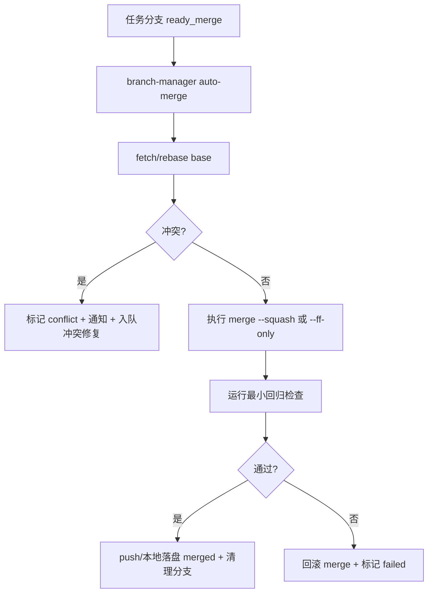

# Branch 隔离模式设计（Codex 自动任务分支化）

## 1. 背景与目标

当前 Autopilot 多数任务在项目当前分支直接执行，风险是：

- 自动任务和人工开发在同一分支互相覆盖
- 任务完成判定只看 `HEAD`，缺少“任务分支生命周期”管理
- 回滚和清理成本高

目标是引入分支隔离机制，在不破坏现有 `watchdog + task-queue` 主流程的前提下，实现“可追踪、可自动合并、可失败回收”的任务执行模型。

---

## 2. 核心设计决策（对应 10 个问题）

### 2.1 什么任务走 branch，什么留 main

默认策略：**风险中高任务走 branch，低风险运维任务可留当前分支**。

走 branch：

- `feature`（新功能）
- `refactor`（结构调整）
- `test`（批量补测试）
- `review_fix`（P1/P2 修复）
- 影响文件数 >= N 的任务

可留 main（兼容模式）：

- 只读分析任务（review 指令、状态收集）
- 非代码任务（日志归档、报告汇总）
- 用户显式指定 `branch_mode=off`

### 2.2 branch 命名与生命周期

命名规范：

`ap/<safe-window>/<task-type>/<yyyymmdd-hhmmss>-<short-hash>`

示例：

`ap/autopilot-dev/review-fix/20260307-141530-aa1dea7`

生命周期状态：

`created -> in_progress -> ready_merge -> merged | conflict | failed | abandoned`

状态文件：

`~/.autopilot/state/branches/<safe>.json`

### 2.3 `tmux-send.sh` 如何支持分支模式

新增参数：

- `--branch-mode auto|on|off`
- `--task-type <feature|refactor|test|review_fix|ops>`
- `--base-branch <name>`

发送前流程：

1. 调 `branch-manager.sh ensure` 获取/创建任务分支
2. 在目标项目目录执行 checkout
3. 将分支信息写入 `tracked-task-<safe>.json`
4. 再发送 prompt 给 Codex

### 2.4 watchdog 如何检测 branch 上的 commit

现有 `watchdog.sh check_new_commits` 已基于工作目录 `HEAD`，天然可检测分支提交。需补充：

- `head` 文件从单一 `safe-head` 升级为 `safe-<branch>-head`
- `tracked-task` 增加 `branch` 字段
- 完成判定从“有新 commit”升级为“tracked branch 有新 commit 且 agent idle”

### 2.5 auto-merge 条件和流程

auto-merge 条件（全部满足）：

1. 分支状态 `ready_merge`
2. `auto-check.sh --issues-only` 为空
3. 测试通过（由 `test_agent` 或项目命令验证）
4. Layer2 review 为 `CLEAN`（如该任务配置要求 review）
5. base 分支无冲突（可选先 rebase 一次）

流程：



### 2.6 merge 冲突处理策略

策略：

- 自动仅尝试 1 次 rebase
- 冲突后立即停止自动合并
- 生成高优任务：`解决分支 <name> 与 <base> 冲突`
- 同步 Discord/Telegram 提示需人工介入

### 2.7 失败 branch 清理

清理规则：

- `merged`：立即删除本地临时分支
- `failed/conflict`：保留 `keep_failed_hours`，超时后归档并清理
- `abandoned`：超过 `ttl_hours` 自动删除
- 仅清理 `ap/` 前缀分支，禁止触碰用户自定义分支

### 2.8 与 `task-queue.sh` 集成

队列项新增元数据（兼容旧格式）：

- `branch_mode`
- `task_type`
- `base_branch`
- `task_branch`

状态推进建议：

- `[ ]` 待执行
- `[→]` 分支开发中
- `[m]` 等待合并
- `[x]` 已合并完成
- `[!]` 失败待重试

为兼容旧逻辑，`[m]` 可在早期阶段映射为 `[→]` + metadata `ready_merge=true`。

### 2.9 `branch-manager.sh` 设计

新增脚本：`scripts/branch-manager.sh`

命令接口：

```bash
# 确保任务分支存在并 checkout，输出 JSON: {"branch":"...","base":"...","created":true|false}
branch_manager_ensure() {
  local project_dir="$1" safe="$2" task_type="$3" base_branch="$4"
}

# 标记分支进入 ready_merge
branch_manager_mark_ready() {
  local project_dir="$1" branch="$2" reason="$3"
}

# 尝试自动合并并返回状态
branch_manager_auto_merge() {
  local project_dir="$1" branch="$2" base_branch="$3"
}

# 清理过期分支
branch_manager_cleanup() {
  local project_dir="$1" safe="$2"
}
```

状态文件结构（示例）：

```json
{
  "window": "autopilot-dev",
  "active_branch": "ap/autopilot-dev/test/20260307-141530-aa1dea7",
  "base_branch": "main",
  "state": "in_progress",
  "task_type": "test",
  "started_at": 1700000000,
  "updated_at": 1700000500
}
```

### 2.10 `config.yaml` 新增配置

```yaml
branch_isolation:
  enabled: true
  default_mode: "auto"            # auto | on | off
  base_branch: "main"
  naming:
    prefix: "ap"
    include_timestamp: true
  policy:
    force_branch_task_types: ["feature", "refactor", "test", "review_fix"]
    allow_main_task_types: ["ops", "report"]
    file_count_threshold: 5
  auto_merge:
    enabled: true
    strategy: "squash"            # squash | ff-only
    require_auto_check_clean: true
    require_tests_pass: true
    require_review_clean: false
    rebase_before_merge: true
    max_rebase_attempts: 1
  cleanup:
    ttl_hours: 72
    keep_failed_hours: 168
```

---

## 3. 与现有脚本的集成点

- `tmux-send.sh`
  - 发送前调用 `branch-manager ensure`
  - tracked-task 中写入 `branch/base_branch/task_type`
- `watchdog.sh`
  - commit 检测按 `safe+branch` 维度记账
  - queue done 改为“合并成功后 done”
  - `check_new_commits` 后接 `branch-manager auto-merge`
- `task-queue.sh`
  - `add/start/done/fail` 扩展 branch metadata
  - `done` 支持“merge 完成确认”
- `status-sync.sh`
  - 新增事件：`branch_created`、`branch_ready_merge`、`branch_merged`、`branch_conflict`

---

## 4. SOLID 对齐

- S：分支编排放 `branch-manager.sh`，不污染 `watchdog.sh` 主循环
- O：合并策略（squash/ff-only）可扩展
- L：不同项目 Git 工作流通过同一命令接口替换
- I：`tmux-send` 只依赖 `ensure`；`watchdog` 只依赖 `auto-merge/cleanup`
- D：上层调度依赖抽象“branch manager 能力”，不耦合具体 Git 命令细节

---

## 5. 边界条件与失败策略

1. 仓库无 `base_branch`：自动探测 `main/master`，都不存在则退出并告警
2. 工作树脏：默认拒绝切分支，任务回队列
3. 分支被人工删除：自动重建并记录审计日志
4. 远端不可用：降级本地 merge + 标记 `pending_push`
5. 连续冲突：超过阈值后暂停该项目自动分支模式
6. 多任务并发：同项目同一时刻最多 1 个 active task branch

---

## 6. 分阶段实施计划

### Phase 1（MVP：可创建/跟踪分支）

- 新增 `branch-manager.sh ensure/status`
- `tmux-send.sh` 支持 `--branch-mode`
- `tracked-task` 写入 branch 信息

验收：

- 任务可稳定在 `ap/*` 分支执行
- 不破坏现有主分支任务流

### Phase 2（自动合并闭环）

- 新增 `auto-merge` 流程
- `watchdog` 接入 ready_merge 判定
- `task-queue` 支持 `[m]` 语义

验收：

- 满足门禁时自动完成合并并清理分支
- 冲突时可自动转人工任务

### Phase 3（治理与运维）

- 增加过期分支回收
- 完成 status.json 全链路观测
- 加入失败熔断与恢复策略

验收：

- 长期运行无分支垃圾堆积
- 冲突/失败可观测、可恢复

---

## 7. 关键落地建议

1. 先接 `tmux-send` 与 `tracked-task`，再做 auto-merge，避免一次性改动过大。
2. `queue done` 的完成语义要从“有 commit”升级为“已合并”，否则状态会漂移。
3. 分支清理必须严格前缀白名单（仅 `ap/`），避免误删人工分支。
