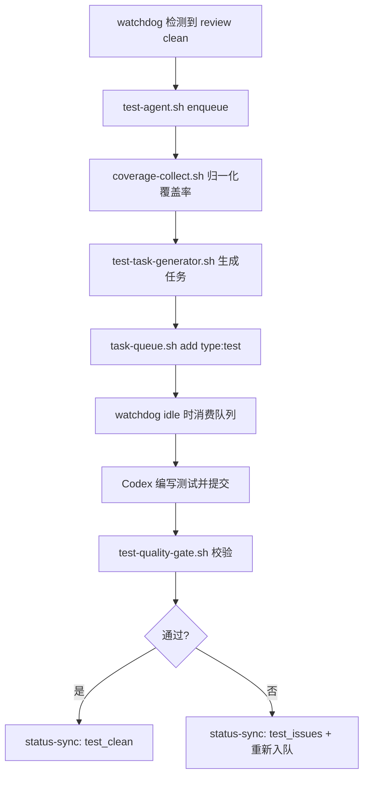

# Test Agent 自动测试覆盖率提升设计

## 1. 背景与目标

Autopilot 现有链路已经具备：

- `watchdog.sh`：commit 检测、idle 调度、自动 nudge
- `auto-check.sh`：零成本静态检查
- `task-queue.sh`：任务编排与状态推进
- `status-sync.sh`：生命周期状态落盘

当前缺口是“自动补测试”和“覆盖率增量治理”。本设计目标是在不破坏现有主循环稳定性的前提下，新增 Test Agent 能力。

---

## 2. 核心设计决策（对应 10 个问题）

### 2.1 Test Agent 用独立实例还是复用现有实例

结论：**默认复用现有项目 Codex 实例，提供可选隔离模式**。

- 默认模式（推荐）：复用当前项目窗口，任务通过 `task-queue.sh` 串行消费
  - 优点：token 成本最低；无需新增 tmux 生命周期管理
  - 风险：与开发任务争抢执行时间
- 隔离模式（可配置）：为测试创建独立窗口（如 `autopilot-dev-test`）
  - 优点：开发与测试并行，互不打断
  - 风险：token 增加；并发改代码冲突风险提升

治理策略：默认串行；仅在 `config.yaml` 显式启用 `test_agent.mode: isolated` 时并行。

### 2.2 触发时机

结论：**主触发用“review clean 后 + idle”，辅以“定时补偿”**。

- commit 后：只做轻量“测试债务评估”，不立即生成大任务
- review clean 后：触发测试补齐（主路径，噪声最小）
- 定时任务（如 nightly）：兜底补齐长期遗漏

原因：commit 后立刻补测试会高频打断；review 后触发更接近“一轮迭代收尾”。

### 2.3 如何解析 coverage report 生成任务

引入统一覆盖率中间模型（Normalized Coverage Model），由适配器生成：

```json
{
  "tool": "jest|jacoco|bats-kcov",
  "line_coverage": 72.3,
  "branch_coverage": 61.0,
  "files": [
    {"path":"src/foo.ts","line_pct":55.0,"uncovered_lines":[12,13,47]}
  ],
  "generated_at": 1700000000
}
```

任务生成规则：

1. 优先处理“本轮变更文件”且覆盖率低于阈值的文件
2. 其次处理“核心目录”（`src/core`, `scripts`）的低覆盖文件
3. 每轮最多生成 N 条测试任务，防止队列被测试任务淹没

### 2.4 测试写在 main 还是 branch，如何避免冲突

结论：**测试默认走隔离分支（推荐），主分支仅保留兼容模式**。

- 推荐：`test/<safe>/<timestamp>` 分支写测试，验证通过后再合并
- 兼容：若 `branch_isolation.enabled=false`，允许直接在当前分支写

冲突控制：

- 任务入队前检查工作树是否干净
- 使用 `locks/test-agent-<safe>.lock.d` 防并发写入
- 同一项目同一时刻只允许一个测试任务 in-progress

### 2.5 Jest/JUnit/bats 如何统一

采用“适配器模式”：

- `coverage-adapter-jest.sh`
- `coverage-adapter-junit.sh`（JaCoCo/Cobertura XML）
- `coverage-adapter-bats.sh`（优先 kcov，缺失则降级到 test 通过率）

统一接口：

- `detect_framework <project_dir>`
- `collect_coverage <project_dir> <out_json>`
- `run_tests <project_dir>`

### 2.6 如何验证测试质量（防空测试/无意义断言）

新增质量门禁（Quality Gate）：

1. 断言密度门禁：每个新增测试文件至少出现有效断言关键词（按框架）
2. 覆盖增益门禁：变更文件覆盖率必须上升或不下降
3. 反模式门禁：拒绝空测试（`it('x', () => {})`）或仅 snapshot 无行为断言
4. 稳定性门禁：新增测试至少重跑 2 次通过

### 2.7 覆盖率目标策略

采用“分层 + 渐进”：

- 全局底线：项目行覆盖率不得下降
- 变更门禁：本轮改动文件覆盖率 >= `changed_files_min`
- 关键目录：`critical_paths` 目标更高
- Ratchet：每周自动上调 1% 直到目标封顶

### 2.8 与 `auto-check.sh` / `watchdog.sh` / `task-queue.sh` 集成

- `watchdog.sh`
  - commit 后调用 `test-agent.sh evaluate`（轻量）
  - review clean 后调用 `test-agent.sh enqueue`
- `task-queue.sh`
  - 扩展元数据字段 `type:test`、`coverage_gap`
  - `done` 时回传测试质量结果摘要
- `auto-check.sh`
  - 新增 `--with-tests` 模式，复用质量门禁脚本
- `status-sync.sh`
  - 新增事件：`test_triggered`、`test_in_progress`、`test_clean`、`test_issues`

### 2.9 具体脚本设计（函数签名与流程）

新增主脚本：`scripts/test-agent.sh`

```bash
# 评估当前项目测试债务，输出 JSON 摘要
test_agent_evaluate() {
  local project_dir="$1" window="$2"
}

# 根据评估结果生成并入队测试任务
test_agent_enqueue_tasks() {
  local project_dir="$1" window="$2" reason="$3"
}

# 执行单个测试任务（由 watchdog/tmux 指令触发）
test_agent_run_task() {
  local project_dir="$1" window="$2" task_payload="$3"
}

# 测试质量门禁（断言、覆盖、稳定性）
test_agent_quality_gate() {
  local project_dir="$1" before_json="$2" after_json="$3"
}
```

新增辅助脚本：

- `scripts/coverage-collect.sh`：框架探测与 coverage 归一化
- `scripts/test-quality-gate.sh`：质量门禁
- `scripts/test-task-generator.sh`：根据覆盖缺口生成任务文本

执行流程（主链路）：



### 2.10 `config.yaml` 新增配置

```yaml
test_agent:
  enabled: true
  mode: "shared"                  # shared | isolated
  trigger:
    on_review_clean: true
    on_commit_evaluate: true
    nightly_cron: "30 2 * * *"
  queue:
    max_generated_tasks_per_round: 3
    priority: "normal"            # high | normal
  coverage:
    changed_files_min: 80
    global_floor_no_regression: true
    ratchet_weekly_increment: 1
    ratchet_cap: 90
    critical_paths:
      - "src/core"
      - "scripts"
    critical_min: 90
  quality_gate:
    min_assertions_per_test_file: 1
    disallow_empty_tests: true
    require_coverage_delta_non_negative: true
    rerun_times: 2
  frameworks:
    jest:
      coverage_file: "coverage/lcov.info"
      test_cmd: "npm test -- --coverage"
    junit:
      coverage_file: "build/reports/jacoco/test/jacocoTestReport.xml"
      test_cmd: "./gradlew test jacocoTestReport"
    bats:
      coverage_file: "coverage/kcov/index.json"
      test_cmd: "bats test/"
```

---

## 3. SOLID 对齐

- S（单一职责）：`coverage-collect`、`task-generator`、`quality-gate` 拆分
- O（开闭）：新增框架只需加 adapter，不改 orchestrator
- L（里氏替换）：各 adapter 输出统一模型，可互换
- I（接口隔离）：watchdog 只调用 `test-agent.sh` 对外接口
- D（依赖倒置）：核心流程依赖“覆盖率接口”，不依赖具体 Jest/JUnit/bats

---

## 4. 边界条件与失败策略

1. 无 coverage 工具：降级为“仅测试执行 + 断言门禁”，并发出告警
2. 仓库无测试框架：只生成“搭建最小测试骨架”任务，不重复轰炸
3. 覆盖率报告损坏：标记 `test_issues`，最多重试 N 次
4. 工作树脏：不自动执行测试写入任务，仅入队并提醒人工处理
5. 队列拥堵：测试任务限流（每轮最多 1 个 in-progress）
6. 长耗时项目：超过超时阈值后自动 fail + retry（复用现有超时回收机制）

---

## 5. 分阶段实施计划

### Phase 1（MVP，低风险）

- 新增 `test-agent.sh evaluate/enqueue`
- 仅支持 Jest + shared 模式
- 只在 review clean 后触发

验收标准：

- 可自动生成测试任务并入队
- 不影响现有 watchdog 主循环稳定性

### Phase 2（扩展框架与质量门禁）

- 加入 JUnit/bats adapter
- 上线 `test-quality-gate.sh`
- 接入 `status-sync` test 事件

验收标准：

- 三类框架输出统一 coverage 模型
- 可识别空测试/弱断言并阻断

### Phase 3（治理增强）

- nightly 补偿任务
- 覆盖率 Ratchet 周期提升
- isolated 模式灰度开关

验收标准：

- 覆盖率趋势持续上行
- token 增长可控，且不出现开发任务饥饿

---

## 6. 关键落地建议

1. 先做 shared 模式，验证稳定后再开 isolated。
2. 先把“覆盖率不下降”跑通，再追求绝对值上涨。
3. 质量门禁必须独立脚本化，避免规则散落在 watchdog 中。
