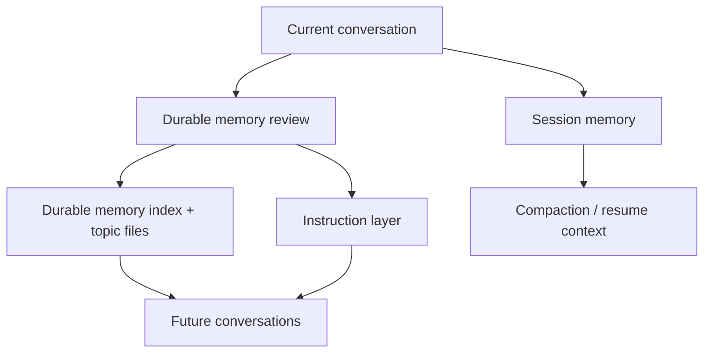

# Claude Code Memory Skill

A clean-room layered memory workflow reconstructed from public analysis of Claude Code's memory architecture.

This repo packages the practical memory pattern people care about when they talk about Claude Code memory:

- instruction memory through `CLAUDE.md`-style rules
- session memory for active work continuity
- durable memory for facts worth carrying across conversations

If you searched for:

- `claude code memory`
- `claude code layered memory`
- `claude md memory workflow`
- `how claude code remembers context`

this is the open implementation you probably wanted.

It gives an agent three distinct memory lanes:

1. Instruction memory for durable rules
2. Session memory for the current workstream
3. Durable memory for facts worth carrying across conversations

The goal is simple: keep the main prompt lean, preserve the right context, and avoid turning every conversation into a total reset.

## In one sentence

This repository turns the Claude Code style memory pattern into a reusable skill you can install, inspect, and adapt.

## What this repo is

This repo is:

- a reusable skill for Claude Code style layered memory
- a clean-room reconstruction of the pattern, not a prompt dump
- a practical way to bring `CLAUDE.md` rules, session continuity, and durable memory into one workflow

This repo is not:

- an official Anthropic repository
- a verbatim copy of proprietary system prompts
- a claim that Claude Code uses these exact words

## Claude Code architecture -> this repo

| Claude Code style concept | What this repo gives you |
|---|---|
| `CLAUDE.md` rule layer | instruction memory workflow |
| current thread continuity | session memory template |
| long-lived memory files | durable indexed memory layout |
| memory cleanup and promotion | review workflow in `SKILL.md` |
| practical repo usage | installable examples and references |

## Why people look for Claude Code memory

The interest around Claude Code memory is not really about one prompt. It is about the architecture:

- rules belong in instruction files
- active work belongs in a session summary
- reusable, non-derivable facts belong in durable memory

That separation is what makes a coding agent feel coherent over time.

This repository turns that idea into an installable skill and a portable repo structure.

## Why this exists

Most coding agents have two failure modes:

- They forget important context between sessions
- They stuff too much transient detail into persistent memory

This skill separates memory by job:

- The instruction layer holds stable rules and collaboration preferences
- The session layer tracks the current task state, files, commands, and mistakes
- The durable layer stores only non-derivable facts that are still useful later

That makes memory easier to maintain, safer to trust, and cheaper to keep in prompt context.

## What is included

- A reusable `SKILL.md`
- A durable memory taxonomy
- A session-summary workflow
- A memory review and promotion workflow
- Example files you can copy into your own setup

## Quick start

1. Put this repo in your skills directory
2. Create `.agent-memory/` in the target project
3. Map your rule layer to `CLAUDE.md`, `CLAUDE.local.md`, `AGENTS.md`, or another instruction file
4. Keep active work in `.agent-memory/session/summary.md`
5. Store reusable facts as indexed topic files under `.agent-memory/`

## Why this is relevant to Claude Code users

If you already use Claude Code, this repo maps naturally onto the way people structure memory around it:

- instruction layer -> `CLAUDE.md` and `CLAUDE.local.md`
- session layer -> a repo-local running summary
- durable layer -> indexed memory topic files

If you use another coding agent, the same pattern still works. Only the host instruction file changes.

## Memory model



## What makes the pattern work

The separation matters more than the wording:

- instruction memory answers: "how should the agent behave here?"
- session memory answers: "what is happening right now?"
- durable memory answers: "what should still be known next week?"

When those answers live in one file, the agent gets noisier. When they live in separate layers, the memory is easier to maintain and easier to trust.

### 1. Instruction layer

This is where stable rules belong:

- project conventions
- collaboration preferences
- approval boundaries
- testing and release expectations

For Claude Code users, this usually means:

- `CLAUDE.md`
- `CLAUDE.local.md`

For other tools, map this layer to whatever instruction file you already use:

- `AGENTS.md`
- `.github/copilot-instructions.md`
- project-level system prompt files

### 2. Session layer

This is the working notebook for the current thread:

- current state
- task specification
- important files and functions
- commands that matter
- errors and corrections
- terse worklog

It is short-lived and should be optimized for continuity, not permanence.

### 3. Durable memory layer

This is the long-term memory directory. It stores things that are not obvious from the repo itself and are still useful later.

This skill uses four durable memory types:

- `user-profile`
- `working-style`
- `project-context`
- `external-reference`

## Install

### As a Claude Code or Codex skill

Clone this repo into your skills directory:

```bash
git clone <your-repo-url> ~/.codex/skills/layered-memory-skill
```

Or symlink it while developing:

```bash
ln -s /path/to/layered-memory-skill ~/.codex/skills/layered-memory-skill
```

### As a prompt pattern for other agents

If your agent platform does not support native skills, copy the workflow from:

- [SKILL.md](./SKILL.md)
- [references/architecture.md](./references/architecture.md)
- [references/host-tool-mapping.md](./references/host-tool-mapping.md)

Then adapt the file paths to your agent runtime.

## Suggested file layout

```text
.agent-memory/
├── MEMORY.md
├── user/
├── style/
├── project/
├── references/
└── session/
    └── summary.md
```

`MEMORY.md` should stay lightweight. Use it as an index that points to topic files rather than a dumping ground.

## Who this is for

- Claude Code users who want a more explicit memory layout
- people building Codex, Cursor, or custom repo agents
- teams experimenting with durable memory for coding workflows
- anyone trying to recreate the useful part of Claude Code memory without relying on prompt dumps

## Promotion rules

Promote something into the instruction layer only when it is:

- stable
- normative
- broadly applicable
- likely to be wrong if the agent has to rediscover it every time

Keep something in durable memory when it is:

- true but not derivable from the code
- useful in future sessions
- not yet stable enough to become an instruction

Keep something only in session memory when it is:

- specific to the current task
- likely to expire soon
- only useful for resuming the present thread

## Examples

- Durable index: [examples/persistent-memory/MEMORY.md](./examples/persistent-memory/MEMORY.md)
- Durable user memory: [examples/persistent-memory/user-profile.md](./examples/persistent-memory/user-profile.md)
- Durable style memory: [examples/persistent-memory/testing-policy.md](./examples/persistent-memory/testing-policy.md)
- Session summary: [examples/session-memory/summary.md](./examples/session-memory/summary.md)

## Reconstructed from public analysis

This repository was designed from public analysis of layered memory behavior discussed around Claude Code and similar coding agents, then rewritten into an original, reusable skill.

The important thing here is the workflow, not any single leaked phrase:

- route stable rules into instruction files
- keep active work in session memory
- save only durable, non-derivable facts into long-term memory

That is the part worth reusing.

## Star this repo if

- you want Claude Code style memory in an open form
- you think coding agents need better memory hygiene
- you want a concrete starting point instead of vague prompt advice

## FAQ

### Is this a copy of Claude Code's internal prompt?

No. This is a clean-room skill and repo design that captures the layered memory idea without reproducing proprietary prompt text.

### Why call it Claude Code Memory Skill?

Because the intended audience is people trying to recreate the layered memory workflow associated with Claude Code in a reusable, open form. The repo is named for compatibility and discoverability, not official affiliation.

### Why not keep everything in one big instruction file?

Because rules, active task state, and long-lived facts decay at different speeds. Mixing them makes the agent noisier and harder to trust.

### Can I adapt this to a different agent stack?

Yes. The core pattern is portable. Only the instruction-file mapping changes.
