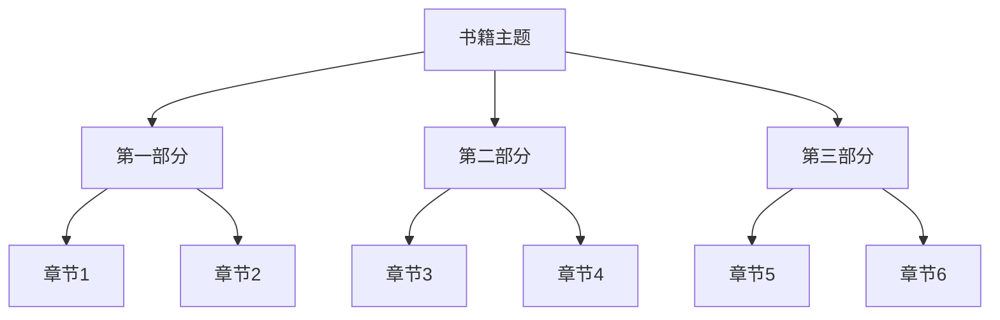

# 书籍整理输出模板参考

## 完整版模板

```markdown
# 《书名》深度整理

> 作者：xxx | 出版社：xxx | 出版年份：xxx | 分类：xxx

---

## 📚 书籍信息

| 属性 | 内容 |
|------|------|
| 书名 | 《书名》 |
| 作者 | xxx |
| 出版社 | xxx |
| 出版年份 | xxxx年 |
| 页数 | xxx页 |
| ISBN | xxx |
| 分类 | xxx |

---

## 📖 内容简介

（书籍简介，100-300字）

---

## 🗂️ 章节结构与摘要

### 第一部分：xxx

#### 第x章 章节标题
- **核心内容**：一句话概括
- **关键知识点**：
  - 要点1
  - 要点2

---

## 💡 核心概念

| 概念 | 解释 | 出现在 |
|------|------|--------|
| 概念1 | 解释内容 | 第x章 |
| 概念2 | 解释内容 | 第x章 |

---

## ✨ 金句摘录

> "原文引用，原文引用，原文引用。"
> —— 出处/第x章/第x页

> "原文引用。"
> —— 出处

---

## 🎯 核心观点

### 观点一：xxx
**论述**：xxx

### 观点二：xxx
**论述**：xxx

---

## 💭 读后感

### 阅读动机
（为什么读这本书）

### 收获与启发
1. 收获1
2. 收获2

### 评价
（客观评价本书的优缺点）

### 适合谁读
（目标读者）

### 推荐理由
（为什么推荐这本书）

---

## 🧠 知识体系

### 知识框架
- 大框架
  - 子要点
  - 子要点

### 实践应用
（书中知识如何应用到实际）

### 相关推荐
- 《相关书籍1》
- 《相关书籍2》

---

*整理时间：2026-01-01*
```

## 思维导图模板（Mermaid 格式）

```markdown
## 🌟 思维导图


```

## 概念表格模板

```markdown
## 核心概念速查

| 序号 | 概念 | 英文 | 简明解释 | 章节 | 应用场景 |
|------|------|------|---------|------|----------|
| 1 | 概念名 | Concept | 解释 | 第x章 | 场景 |
```

## 金句模板

```markdown
## ✨ 金句摘录

### 关于人生
> "xxx"
> —— 作者/书名/第x页

### 关于成长
> "xxx"
> —— 作者/书名/第x页

### 关于智慧
> "xxx"
> —— 作者/书名/第x页
```

## 读后感模板

```markdown
## 💭 读后感

### 📌 一句话总结
（用一句话总结这本书）

### 🎯 核心收获
1. **认知提升**：xxx
2. **技能习得**：xxx
3. **情感共鸣**：xxx

### 👍 优点
- 优点1
- 优点2

### 👎 不足
- 不足1
- 不足2

### 📎 适合谁读
- 适合人群1
- 适合人群2

### ⭐ 我的评分
★★★★☆（4/5星）
```
