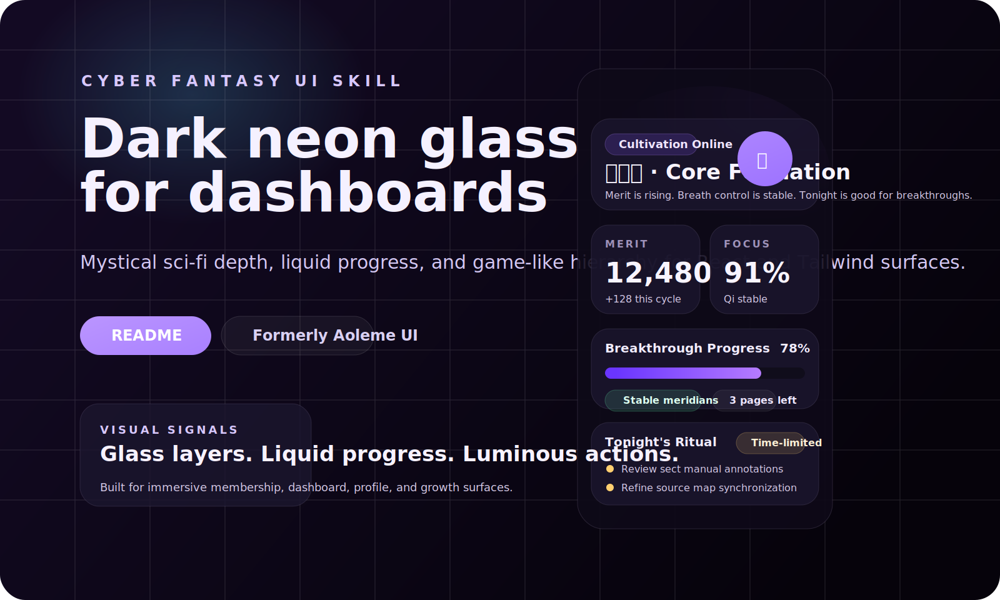

# Cyber Fantasy UI Skill / 赛博奇幻 UI Skill

原名 Aoleme UI。一个更容易被搜索发现的 OpenClaw 设计类 skill，适合生成暗色霓虹、玻璃拟态、游戏化的 React / Tailwind 界面。

<p align="center">
  <a href="README.md"></a>
  <a href="README.zh-CN.md"></a>
</p>
<p align="center">
  
  
  
  
</p>

## 效果预览



- 预览文件：[`demo/index.html`](./demo/index.html)
- demo 样式：[`demo/styles.css`](./demo/styles.css)

这个 demo 展示了这套 skill 的典型视觉语言：深色背景、修仙紫主色、液态进度、玻璃面板、状态徽标和偏游戏化的信息层次。

## 这个 Skill 是做什么的

适合在这些情况下让 OpenClaw 使用：

- 设计暗色、神秘、偏游戏化的仪表盘
- 把已有 React 或 Tailwind 页面改造成赛博奇幻方向
- 稳定地应用发光、玻璃面板、液态进度条和沉浸式界面模式

适合这些场景：

- 仪表盘
- 会员中心
- 成长体系
- 活动页
- 个人主页
- 状态面板

不适合：

- 后端逻辑、接口流程、数据处理
- 已有严格品牌规范且不希望明显改变视觉方向的产品

## 示例 Prompt

- 用 React 和 Tailwind 做一个赛博奇幻风格的习惯打卡仪表盘。
- 把这个页面改造成暗色霓虹玻璃拟态界面，带紫色发光和液态进度条。
- 做一个带功德值、境界等级和状态卡片的游戏化个人主页。
- 做一个移动端优先的沉浸式活动页，保留现有数据结构但整体风格改成神秘科技感。
- 把这个普通后台页面改造成更像游戏界面的状态中心，但不要改数据模型。

## 为什么值得用

- 它给 agent 的不是模糊审美方向，而是一套明确可执行的视觉目标。
- 它不只是风格文案，还附带可复用的 Tailwind 配置和 CSS 工具类。
- 它强调“贴着宿主项目落地”，而不是粗暴替换整个设计系统。
- 它明确规避了一些危险的全局规则，例如无差别地设置 `overflow: hidden`。

## 仓库内容

- `SKILL.md` - skill 入口、触发条件、执行规则
- `resources/tailwind.config.js` - 颜色、字体、动画、keyframes
- `resources/global.css` - 玻璃拟态、液态进度、发光和性能辅助样式
- `demo/index.html` - 可本地打开的静态 demo
- `demo/styles.css` - demo 样式
- `demo/preview.svg` - README 预览图
- `PUBLISHING.md` - 本地验证与发布步骤

## 安装方式

### 全局安装

```bash
mkdir -p ~/.openclaw/skills/cyber_fantasy_ui
rsync -av ./ ~/.openclaw/skills/cyber_fantasy_ui/
```

### 工作区安装

```bash
mkdir -p <your-project>/skills/cyber_fantasy_ui
rsync -av ./ <your-project>/skills/cyber_fantasy_ui/
```

安装后建议新开一个 OpenClaw session。

若你的 OpenClaw 只扫描工作区根目录，请复制目录，不要使用 symlink。

## 验证

```bash
openclaw skills info cyber_fantasy_ui --json
openclaw skills list --json
```

验证通过时应看到：

- `name` 为 `cyber_fantasy_ui`
- `eligible` 为 `true`
- 描述中出现 cyber-fantasy、dark neon、gamified UI 等关键词

## 不接 OpenClaw 也能用

1. 把 `resources/tailwind.config.js` 中需要的 token 合并进你的 Tailwind 配置。
2. 复制或按需引入 `resources/global.css`。
3. 把 `demo/` 当作视觉参考，同时复用 `SKILL.md` 中的落地规则。

## 命名说明

对外展示名：

- `Cyber Fantasy UI Skill`

内部 skill key：

- `cyber_fantasy_ui`

历史别名：

- `Aoleme UI`
- `Cyber Xianxia UI Skill`

## 发布

```bash
git add .
git commit -m "Rename skill to cyber_fantasy_ui"
npx clawhub login
npx clawhub publish . --slug cyber-fantasy-ui --name "Cyber Fantasy UI Skill" --version 1.1.1
```

如果 `clawhub` 在你当前 Node 版本下报错，先切到 Node 20 之类的 LTS 版本再发。

## 许可证

[MIT](./LICENSE) © 2026 isdou
