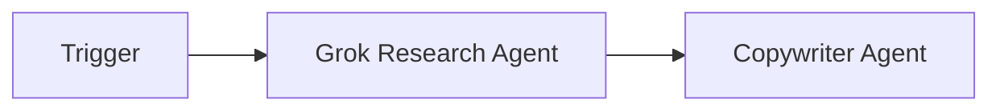
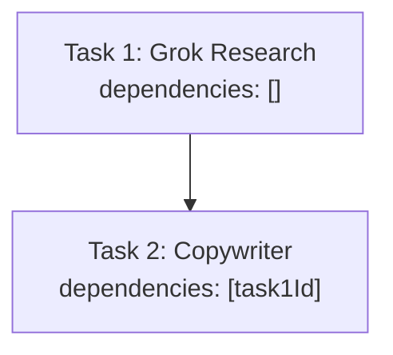
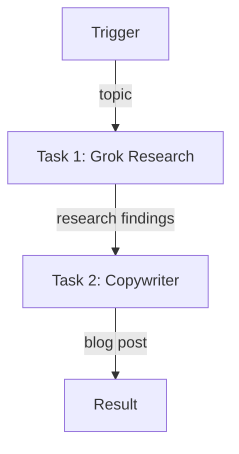

# Blog Pipeline Example

A simple 2-agent sequential workflow that researches a topic and writes a blog post.

## Pipeline



## Task Dependencies (Sequential)



The Copywriter waits for Grok Research to complete before starting.

---

## Complete Setup Script

### Project Structure

```
blog-pipeline/
├── src/
│   └── setup.ts
├── .env
├── package.json
└── tsconfig.json
```

### .env

```env
WALLET_PRIVATE_KEY=0x...
```

### Dependencies

```bash
npm init -y && npm pkg set type=module
npm i @openserv-labs/client dotenv
npm i -D @types/node tsx typescript
```

> **Note:** The project must use `"type": "module"` in `package.json`. Add a `"setup": "tsx src/setup.ts"` script for local development.

### src/setup.ts

**Recommended Approach: Using `workflows.sync()`**

This uses the declarative `workflows.sync()` method which handles triggers, tasks, and edges in one call:

```typescript
import 'dotenv/config'
import { PlatformClient, triggers } from '@openserv-labs/client'

async function setup() {
  const client = new PlatformClient()

  if (!process.env.WALLET_PRIVATE_KEY) {
    console.error('Missing WALLET_PRIVATE_KEY in .env')
    process.exit(1)
  }

  console.log('1. Authenticating with wallet...')
  await client.authenticate(process.env.WALLET_PRIVATE_KEY)

  console.log('2. Finding agents from marketplace...')
  const grokResult = await client.agents.listMarketplace({ search: 'grok research' })
  const copywriterResult = await client.agents.listMarketplace({ search: 'copywriter' })
  const grokResearch = grokResult.items[0]
  const copywriter = copywriterResult.items[0]

  if (!grokResearch || !copywriter) {
    console.error('   Could not find required agents')
    const all = await client.agents.listMarketplace({})
    all.items.slice(0, 15).forEach(a => console.log(`   ID: ${a.id} | ${a.name}`))
    process.exit(1)
  }

  console.log(`   Grok Research: ${grokResearch.name} (ID: ${grokResearch.id})`)
  console.log(`   Copywriter: ${copywriter.name} (ID: ${copywriter.id})`)

  console.log('3. Creating workflow...')
  const workflow = await client.workflows.create({
    name: 'Instant Blog Machine',
    goal: 'Research any topic thoroughly using web sources and produce a well-structured, publication-ready blog post',
    agentIds: [grokResearch.id, copywriter.id]
  })

  console.log('   Syncing triggers, tasks, and edges...')
  await workflow.sync({
    triggers: [
      triggers.webhook({
        name: 'webhook',
        waitForCompletion: true,
        timeout: 600,
        input: {
          topic: { type: 'string', title: 'Blog Topic', description: 'Topic for the blog post' }
        }
      })
    ],
    tasks: [
      {
        name: 'research',
        agentId: grokResearch.id,
        description: 'Research the topic using Grok',
        body: 'Research the topic using X/Twitter. Find relevant tweets, discussions, and social proof.',
        input: '{{trigger.topic}}'
      },
      {
        name: 'write',
        agentId: copywriter.id,
        description: 'Write the blog post',
        body: 'Write an engaging blog post based on the research findings.'
      }
    ],
    // ⚠️ CRITICAL: Edges define how data flows through your workflow
    // Without edges, tasks won't execute even if dependencies are set!
    edges: [
      { from: 'trigger:webhook', to: 'task:research' },
      { from: 'task:research', to: 'task:write' }
    ]
  })
  console.log(`   Workflow ID: ${workflow.id}`)

  console.log('4. Activating workflow...')
  const trigger = workflow.triggers[0]
  await client.triggers.activate({ workflowId: workflow.id, id: trigger.id })
  await workflow.setRunning()

  console.log('\n========================================')
  console.log('Blog Pipeline Setup Complete!')
  console.log('========================================')
  console.log(`\nWorkflow ID: ${workflow.id}`)
  console.log(`\nWorkflow: Trigger → Grok Research → Copywriter`)
  console.log(`\nWebhook URL:`)
  console.log(`  POST https://api.openserv.ai/webhooks/trigger/${trigger.token}`)
  console.log(`\nExample:`)
  console.log(`  curl -X POST https://api.openserv.ai/webhooks/trigger/${trigger.token} \\`)
  console.log(`    -H "Content-Type: application/json" \\`)
  console.log(`    -d '{"topic": "AI trends in 2026"}'`)
  console.log('========================================')
}

setup().catch(err => {
  console.error('Setup failed:', err.message)
  process.exit(1)
})
```

---

### Alternative: Using `client.workflows.sync()` Directly

The recommended approach above uses the `workflow.sync()` instance method. You can also call `client.workflows.sync()` directly with a workflow ID:

```typescript
import 'dotenv/config'
import { PlatformClient, triggers } from '@openserv-labs/client'

async function setup() {
  const client = new PlatformClient()
  await client.authenticate(process.env.WALLET_PRIVATE_KEY!)

  // Find agents...
  const grokResult = await client.agents.listMarketplace({ search: 'grok research' })
  const copywriterResult = await client.agents.listMarketplace({ search: 'copywriter' })
  const grokResearch = grokResult.items[0]
  const copywriter = copywriterResult.items[0]

  // Create workflow
  const workflow = await client.workflows.create({
    name: 'Instant Blog Machine',
    goal: 'Research any topic thoroughly using web sources and produce a well-structured, publication-ready blog post',
    agentIds: [grokResearch.id, copywriter.id]
  })

  // Sync triggers, tasks, and edges using the static API
  await client.workflows.sync({
    id: workflow.id,
    triggers: [
      triggers.webhook({
        name: 'webhook',
        waitForCompletion: true,
        timeout: 600,
        input: {
          topic: { type: 'string', title: 'Blog Topic', description: 'Topic for the blog post' }
        }
      })
    ],
    tasks: [
      {
        name: 'research',
        agentId: grokResearch.id,
        description: 'Research the topic using Grok',
        body: 'Research the topic using X/Twitter. Find relevant tweets, discussions, and social proof.',
        input: '{{trigger.topic}}'
      },
      {
        name: 'write',
        agentId: copywriter.id,
        description: 'Write the blog post',
        body: 'Write an engaging blog post based on the research findings.'
      }
    ],
    edges: [
      { from: 'trigger:webhook', to: 'task:research' },
      { from: 'task:research', to: 'task:write' }
    ]
  })

  // Activate workflow
  const updatedWorkflow = await client.workflows.get({ id: workflow.id })
  const trigger = updatedWorkflow.triggers[0]
  await client.triggers.activate({ workflowId: workflow.id, id: trigger.id })
  await updatedWorkflow.setRunning()

  console.log(`Webhook: https://api.openserv.ai/webhooks/trigger/${trigger.token}`)
}

setup().catch(console.error)
```

---

## How It Works

1. **Trigger fires** with `{ "topic": "AI trends in January 2026" }`
2. **Grok Research Agent** receives the topic, searches X/Twitter for relevant content
3. **Grok Research completes** → Copywriter task becomes ready
4. **Copywriter** receives the research, writes a blog post
5. **Copywriter completes** → Blog post returned via webhook response

## Workflow Graph



## Usage

```bash
# Run setup (creates workflow, tasks, trigger)
npm run setup

# Trigger the workflow
curl -X POST https://api.openserv.ai/webhooks/trigger/{token} \
  -H "Content-Type: application/json" \
  -d '{"topic": "The future of autonomous AI agents"}'
```
