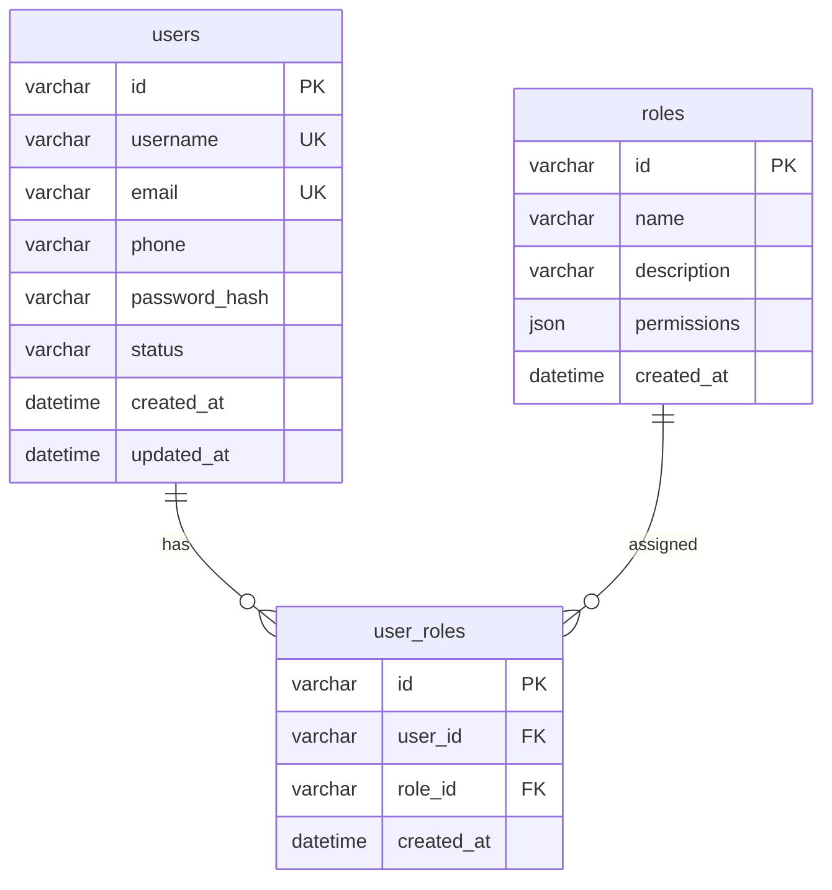

# 产品原型技术分析文档

## 文档信息
- **原型来源**: [URL/图片/XMind文件路径]
- **分析时间**: [YYYY-MM-DD HH:MM:SS]
- **文档版本**: v1.0
- **技能版本**: bie-zheng-luan-prototype v1.0.0

## 1. 系统概览

### 1.1 产品简介
[用1-2句话描述产品的核心功能和目标用户]

### 1.2 技术栈建议
- **前端**: [React/Vue/Angular + TypeScript]
- **UI框架**: [Ant Design/Element UI/Tailwind CSS]
- **后端**: [Node.js/.NET/Spring Boot/Go]
- **数据库**: [MySQL/PostgreSQL/MongoDB]
- **部署**: [Docker/Kubernetes]

### 1.3 核心业务流程
```
[用流程图或文字描述主要业务流程]
```

## 2. 页面结构分析

### 2.1 整体布局
| 区域 | 位置 | 包含内容 | 宽度占比 | 固定/滚动 |
|------|------|----------|----------|-----------|
| 头部 | 顶部 | 品牌Logo、用户信息、通知中心 | 100% | 固定 |
| 侧边栏 | 左侧 | 导航菜单、快捷操作 | 15-20% | 固定 |
| 主内容区 | 中间 | 功能模块、数据展示 | 80-85% | 滚动 |
| 底部 | 底部 | 版权信息、备案号 | 100% | 固定 |

### 2.2 导航菜单结构
```yaml
一级菜单:
  - 菜单1:
      icon: [图标名称]
      path: /menu1
      二级菜单:
        - 子菜单1.1: /menu1/sub1
        - 子菜单1.2: /menu1/sub2
  - 菜单2:
      icon: [图标名称]
      path: /menu2
      无子菜单
```

### 2.3 功能模块清单
| 模块名称 | 所在页面 | 位置坐标 | 主要功能 | 数据来源 |
|----------|----------|----------|----------|----------|
| [模块A] | [/dashboard] | 主内容区左上 | 数据概览卡片 | 后端API |
| [模块B] | [/dashboard] | 主内容区右上 | 统计图表 | 后端API |
| [模块C] | [/users] | 主内容区全宽 | 用户列表表格 | 后端API |

## 3. 前端实现方案

### 3.1 页面路由规划
```javascript
const routes = [
  {
    path: '/',
    component: Layout,
    children: [
      { path: 'dashboard', component: Dashboard },
      { path: 'users', component: UserList },
      { path: 'users/:id', component: UserDetail },
      { path: 'settings', component: Settings },
    ]
  }
];
```

### 3.2 组件清单

#### 3.2.1 布局组件
**组件名**: `MainLayout`
- **位置**: 根组件
- **Props**: 
  - `children`: React.ReactNode (页面内容)
  - `title`: string (页面标题)
- **状态**: 
  - `collapsed`: boolean (侧边栏是否折叠)
  - `userInfo`: object (用户信息)
- **交互逻辑**:
  - 侧边栏折叠/展开切换
  - 用户头像点击显示下拉菜单
  - 通知图标点击显示通知列表

#### 3.2.2 业务组件
**组件名**: `UserTable`
- **位置**: `/users` 页面
- **Props**:
  - `dataSource`: User[] (用户数据)
  - `loading`: boolean (加载状态)
  - `onEdit`: (user: User) => void (编辑回调)
  - `onDelete`: (id: string) => void (删除回调)
- **状态**:
  - `selectedRows`: User[] (选中的行)
  - `pagination`: { current: number, pageSize: number }
- **交互逻辑**:
  - 表格行点击选中/取消
  - 分页器切换页面
  - 搜索框输入实时过滤
  - 批量操作按钮点击

### 3.3 样式规范
```css
/* 设计令牌 */
:root {
  --primary-color: #1890ff;
  --success-color: #52c41a;
  --warning-color: #faad14;
  --error-color: #f5222d;
  
  --font-size-base: 14px;
  --border-radius-base: 4px;
  
  --spacing-xs: 4px;
  --spacing-sm: 8px;
  --spacing-md: 16px;
  --spacing-lg: 24px;
}

/* 组件样式示例 */
.user-table {
  background: white;
  border-radius: var(--border-radius-base);
  box-shadow: 0 2px 8px rgba(0,0,0,0.1);
  padding: var(--spacing-md);
}
```

### 3.4 交互细节

#### 按钮交互示例
**按钮**: "新建用户"
- **位置**: 用户列表页面右上角
- **样式**: 主按钮（蓝色背景，白色文字）
- **点击行为**:
  1. 打开用户表单弹窗
  2. 重置表单为初始状态
  3. 设置表单模式为"创建"
- **成功反馈**: 显示"创建成功"提示，刷新用户列表
- **失败反馈**: 显示错误信息，保持表单打开

#### 表单交互示例
**表单**: 用户信息表单
- **提交行为**:
  1. 前端验证必填字段
  2. 显示加载状态
  3. 调用后端API
  4. 根据响应显示结果
- **验证规则**:
  - 用户名：必填，2-20字符
  - 邮箱：必填，邮箱格式
  - 手机号：可选，11位数字

## 4. 后端实现方案

### 4.1 API接口设计

#### 4.1.1 用户管理接口
**接口名称**: 获取用户列表
- **HTTP方法**: GET
- **URL**: `/api/users`
- **认证**: 需要Bearer Token
- **权限**: 管理员权限

**请求参数**:
```json
{
  "page": 1,          // 页码（必填，默认1）
  "size": 10,         // 每页数量（必填，默认10）
  "keyword": "",      // 搜索关键词（可选）
  "status": "active"  // 状态过滤（可选：active/inactive）
}
```

**成功响应** (HTTP 200):
```json
{
  "code": 200,
  "message": "success",
  "data": {
    "items": [
      {
        "id": "123e4567-e89b-12d3-a456-426614174000",
        "username": "zhangsan",
        "email": "zhangsan@example.com",
        "phone": "13800138000",
        "status": "active",
        "createdAt": "2026-04-21T10:00:00Z",
        "updatedAt": "2026-04-21T10:00:00Z"
      }
    ],
    "total": 100,
    "page": 1,
    "size": 10,
    "pages": 10
  }
}
```

**错误响应** (HTTP 400):
```json
{
  "code": 400,
  "message": "参数验证失败",
  "errors": [
    {
      "field": "page",
      "message": "页码必须大于0"
    }
  ]
}
```

**业务逻辑伪代码**:
```python
def get_user_list(request):
    # 1. 验证用户权限
    if not request.user.has_permission('user:read'):
        return unauthorized_response()
    
    # 2. 解析和验证参数
    page = request.query.get('page', 1)
    size = request.query.get('size', 10)
    keyword = request.query.get('keyword', '')
    status = request.query.get('status')
    
    if page < 1 or size < 1 or size > 100:
        return bad_request('分页参数无效')
    
    # 3. 构建查询条件
    query = User.objects.filter(is_deleted=False)
    
    if keyword:
        query = query.filter(
            Q(username__icontains=keyword) |
            Q(email__icontains=keyword) |
            Q(phone__icontains=keyword)
        )
    
    if status in ['active', 'inactive']:
        query = query.filter(status=status)
    
    # 4. 执行分页查询
    total = query.count()
    items = query.order_by('-created_at') \
                .offset((page - 1) * size) \
                .limit(size) \
                .all()
    
    # 5. 格式化返回数据
    return success_response({
        'items': [user.to_dict() for user in items],
        'total': total,
        'page': page,
        'size': size,
        'pages': math.ceil(total / size)
    })
```

#### 4.1.2 其他接口
[按照相同格式描述其他接口]

### 4.2 服务层设计

#### 用户服务 (UserService)
```java
public class UserService {
    /**
     * 创建用户
     */
    public User createUser(CreateUserRequest request) {
        // 1. 验证用户名唯一性
        // 2. 密码加密
        // 3. 保存到数据库
        // 4. 发送欢迎邮件
        // 5. 记录操作日志
    }
    
    /**
     * 更新用户
     */
    public User updateUser(String userId, UpdateUserRequest request) {
        // 1. 查询用户是否存在
        // 2. 验证更新权限
        // 3. 更新用户信息
        // 4. 清除用户缓存
    }
}
```

### 4.3 第三方服务集成
- **短信服务**: 阿里云短信（用户注册验证）
- **邮件服务**: SendGrid（通知邮件）
- **文件存储**: AWS S3/MinIO（用户上传文件）
- **消息队列**: RabbitMQ/Kafka（异步任务）

## 5. 数据库设计

### 5.1 数据库表清单

#### 表名: `users` (用户表)
| 字段名 | 数据类型 | 长度 | 必填 | 默认值 | 说明 |
|--------|----------|------|------|--------|------|
| id | varchar | 36 | ✓ | UUID | 主键 |
| username | varchar | 50 | ✓ | | 用户名，唯一 |
| email | varchar | 100 | ✓ | | 邮箱，唯一 |
| phone | varchar | 20 | | | 手机号 |
| password_hash | varchar | 255 | ✓ | | 密码哈希 |
| status | varchar | 20 | ✓ | 'active' | 状态：active/inactive |
| avatar_url | varchar | 255 | | | 头像URL |
| last_login_at | datetime | | | NULL | 最后登录时间 |
| created_at | datetime | | ✓ | CURRENT_TIMESTAMP | 创建时间 |
| updated_at | datetime | | ✓ | CURRENT_TIMESTAMP | 更新时间 |
| is_deleted | tinyint | 1 | ✓ | 0 | 软删除标记 |

**索引**:
- PRIMARY KEY (`id`)
- UNIQUE KEY `uk_username` (`username`)
- UNIQUE KEY `uk_email` (`email`)
- INDEX `idx_status` (`status`)
- INDEX `idx_created_at` (`created_at`)

#### 表名: `roles` (角色表)
| 字段名 | 数据类型 | 长度 | 必填 | 默认值 | 说明 |
|--------|----------|------|------|--------|------|
| id | varchar | 36 | ✓ | UUID | 主键 |
| name | varchar | 50 | ✓ | | 角色名称 |
| description | varchar | 200 | | | 角色描述 |
| permissions | json | | ✓ | '[]' | 权限列表 |
| created_at | datetime | | ✓ | CURRENT_TIMESTAMP | 创建时间 |

#### 表名: `user_roles` (用户角色关联表)
| 字段名 | 数据类型 | 长度 | 必填 | 默认值 | 说明 |
|--------|----------|------|------|--------|------|
| id | varchar | 36 | ✓ | UUID | 主键 |
| user_id | varchar | 36 | ✓ | | 用户ID，外键 |
| role_id | varchar | 36 | ✓ | | 角色ID，外键 |
| created_at | datetime | | ✓ | CURRENT_TIMESTAMP | 创建时间 |

**外键约束**:
- FOREIGN KEY (`user_id`) REFERENCES `users`(`id`) ON DELETE CASCADE
- FOREIGN KEY (`role_id`) REFERENCES `roles`(`id`) ON DELETE CASCADE

### 5.2 实体关系图


## 6. 部署与运维

### 6.1 环境配置
```yaml
# docker-compose.yml
version: '3.8'
services:
  backend:
    build: ./backend
    ports:
      - "8080:8080"
    environment:
      - DATABASE_URL=postgresql://user:pass@db:5432/app
      - REDIS_URL=redis://redis:6379
    depends_on:
      - db
      - redis
  
  frontend:
    build: ./frontend
    ports:
      - "3000:3000"
  
  db:
    image: postgres:15
    environment:
      - POSTGRES_USER=user
      - POSTGRES_PASSWORD=pass
      - POSTGRES_DB=app
  
  redis:
    image: redis:7-alpine
```

### 6.2 监控指标
- API响应时间（P95 < 500ms）
- 错误率（< 0.1%）
- 数据库连接池使用率（< 80%）
- 内存使用率（< 70%）

### 6.3 日志规范
```json
{
  "timestamp": "2026-04-21T10:00:00Z",
  "level": "INFO",
  "service": "user-service",
  "trace_id": "abc123",
  "user_id": "user123",
  "operation": "user.create",
  "duration_ms": 150,
  "status": "success",
  "message": "用户创建成功"
}
```

## 7. 测试要点

### 7.1 单元测试
- 用户服务逻辑测试
- 权限验证测试
- 数据验证测试

### 7.2 集成测试
- API接口端到端测试
- 数据库操作测试
- 第三方服务集成测试

### 7.3 性能测试
- 并发用户创建测试
- 大数据量查询测试
- API压力测试

## 8. 开发注意事项

### 8.1 安全性
- 所有用户输入必须验证和过滤
- 密码使用bcrypt加密存储
- API接口需要身份验证和授权
- 敏感操作需要二次确认

### 8.2 性能优化
- 数据库查询使用索引优化
- 频繁访问的数据使用缓存
- 大文件上传使用分片上传
- 列表接口支持分页查询

### 8.3 可维护性
- 代码遵循一致的命名规范
- 重要业务逻辑添加注释
- 配置项集中管理
- 错误处理统一规范

---

## 文档生成信息
- **生成工具**: bie-zheng-luan-prototype v1.0.0
- **生成时间**: [YYYY-MM-DD HH:MM:SS]
- **置信度评估**: [高/中/低] (基于原型分析完整性)
- **建议复核**: [需要/不需要] 与产品经理确认业务逻辑

> **注意**: 本文档为技术分析结果，实际开发前应与产品经理确认需求细节。