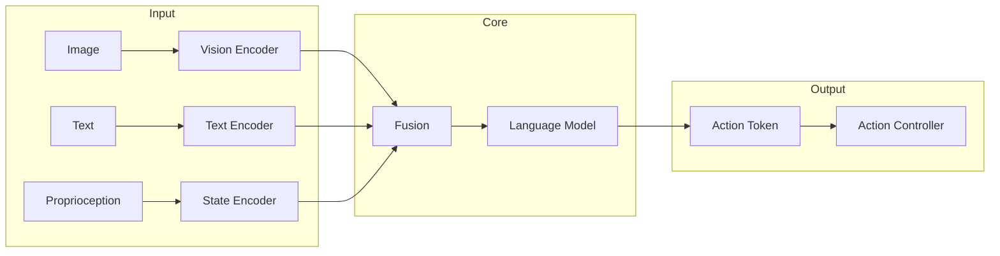
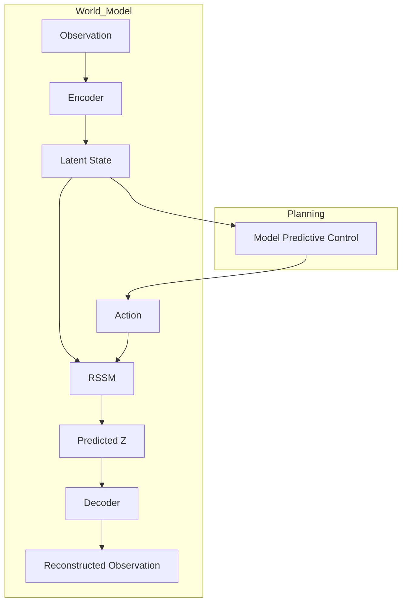

# AWAR 仓库资源指南

本目录存放 AWAR (Awesome World-Action-Robotics) 仓库所需的静态资源和参考模板。

---

## 目录结构

```
assets/
├── README.md              # 本文件
├── templates/             # 文档模板
│   ├── project_template.md
│   ├── benchmark_table.md
│   └── architecture.mmd   # Mermaid 架构图模板
├── badges/               # 徽章样式
│   ├── paradigm_badges.md
│   └── status_badges.md
└── images/                # 架构图存放
    └── (项目架构图)
```

---

## 架构图模板

### 基础流程图



### World Model 架构



---

## 徽章样式

### 范式徽章

```markdown


```

### 状态徽章

```markdown


```

---

## 文档检查清单

每个项目文档必须包含：

- [ ] 一句话核心定位（第一行）
- [ ] 快速上手段落（代码可运行）
- [ ] 至少一张架构图
- [ ] 技术规格表格
- [ ] Benchmark 数据（必须具体数值）
- [ ] 开发者友好度评估
- [ ] 技术限制说明

---

## 图片嵌入规范

### 推荐格式

| 格式 | 适用场景 | 优势 |
|------|----------|------|
| PNG | 架构图、流程图 | 清晰、通用 |
| SVG | 矢量图、logo | 可缩放 |
| GIF | 演示动画 | 直观 |
| Mermaid | 简单图表 | 代码可维护 |

### 嵌入方式

```markdown
<!-- 方式1: 本地图片 -->


<!-- 方式2: URL -->


<!-- 方式3: Mermaid -->
```mermaid
flowchart ...
```
```

---

## Benchmark 表格模板

| 基准 | 指标 | 结果 | 条件 |
|------|------|------|------|
| CALVIN | 任务成功率 | 85% | 5个任务平均 |
| LIBERO-Spatial | 成功率 | 92% | 空间推理 |
| REAL | 零样本 | 45% | Sim2Real |

---

## 持续更新

- 添加新的架构图模板
- 更新 Mermaid 图表语法
- 补充更多示例
