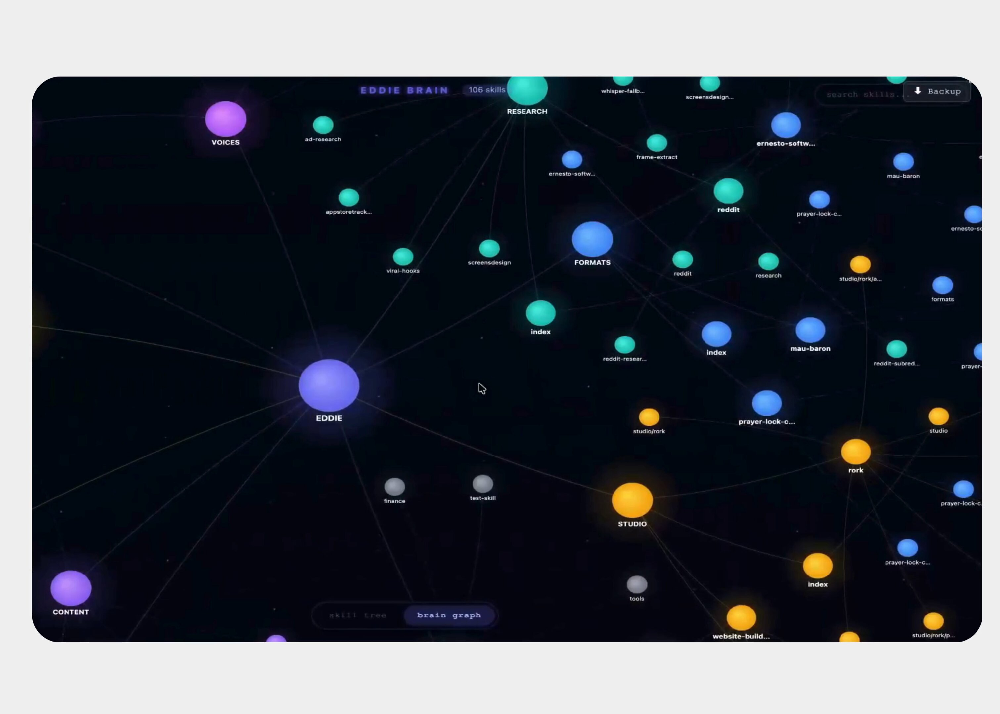
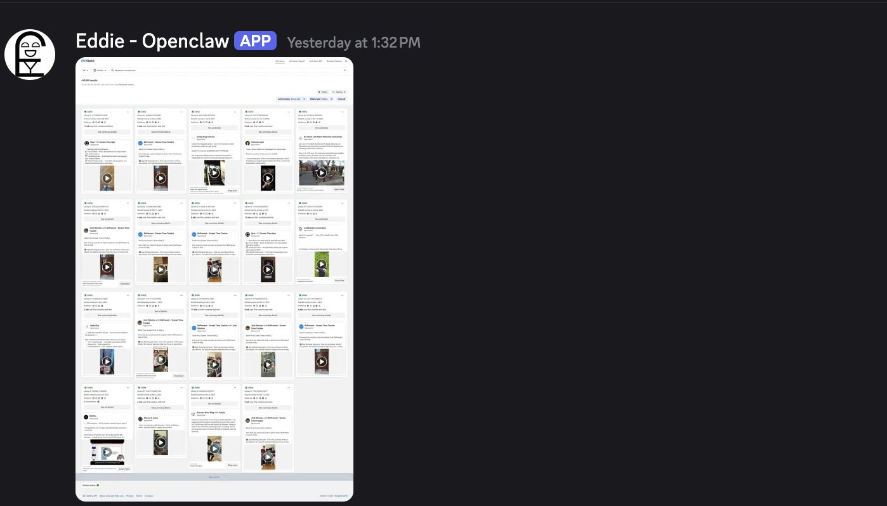
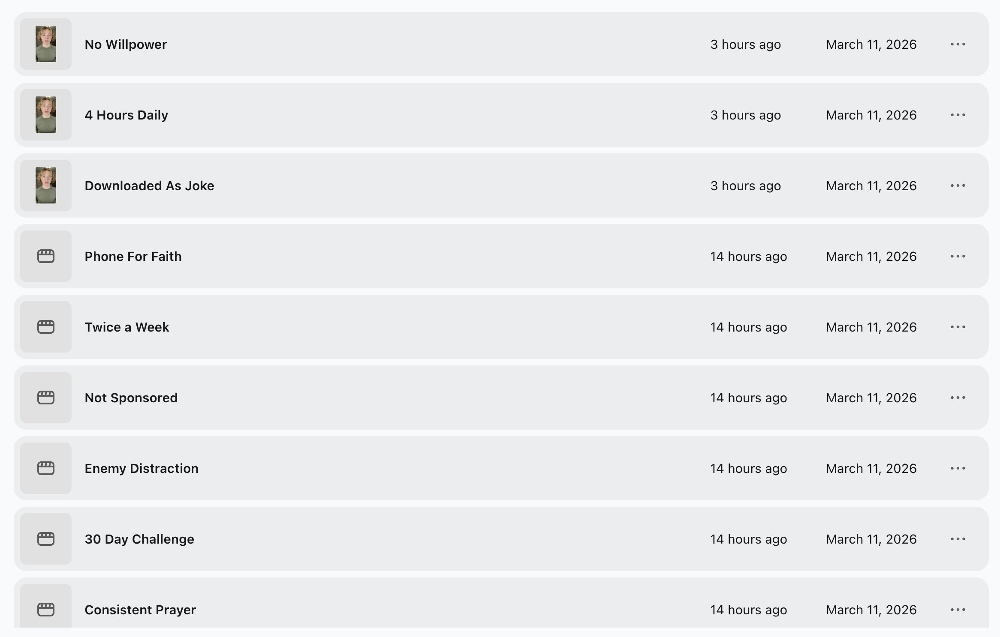

# We turned Openclaw into a self improving vibe marketer for our $300,000/yr app.

1 of our apps does $300,000/yr, we scaled this app with literally only 4 winning ad creatives using tiktok spark ads, and currently we are scaling to $1m/y with an ad system that runs autonomously by our Openclaw agent Eddie. 

the reason we delegated our ad cretion porccess to eddie is becuase 

even though @maubaron and I cracked gold with 4 ads that fueled the whole growth of the app, they eventually burnt out. 

and no longer produce the same results. thats the reality of ads.
they usually last 1-2 months

also making new winning ads is time consuming. 

and thats why we outsourced our whole ad creation system to Eddie 
using Arcads + Apify + the insane brain of markup files we created for him. 

here is exactly how the whole system works:

[video](videos/video-001-EuYCBNNbumgIE_x.mp4)

## Part 1: Eddie researches our competitors automatically

Eddie has a custom skill called ad-research.
it uses Apify to scrape the Meta Ad Library directly.

you give it a keyword or an advertisers name ( whatever your niche is.)

Eddie pulls every active video ad running in that niche right now.
10, 20, 50 ads and sorts them from oldest to newest

Older ads usually means more profitable. 
then he downloads the actual video files from fbcdn.

then he runs every single video through OpenAI Whisper.
word for word transcription.

he grabs every hook and breaks down every video.
Eddie runs this for every competitor in the niche

by the end you have a full intel dump of what angles work 

## Part 2: Eddie learns your brand voice

most AI tools generate scripts and the scripts read like a marketing blog. 
Super generic and no personality. 

Eddie runs on .md files.
markdown files that define exactly how to write.

writing-rules.md is the anti-AI filter.

it bans every word that AI overuses.

he is trained on this wikipedia article: 
[https://en.wikipedia.org/wiki/Wikipedia:Signs_of_AI_writing](https://en.wikipedia.org/wiki/Wikipedia:Signs_of_AI_writing)

This completely avoids all AI slop.
also here is another prompt that works

then there is the brand voice file.
which is trained on our influencer videos 

And split into 3 files
[Voice.md](http://voice.md/)
[product.md](http://product.md/)
[icp.md](http://icp.md/) 

eddie know how to talk like someone in our niche
he knows exactly what the product does
and he knows exactly who needs it

Eddie loads both files before writing a single word.

every script comes out in our voice.

with our positioning.

with our specific product facts baked in.

## Part 3: Eddie generates 100s of script variations

from the competitor research, Eddie writes original scripts.
for every competitor ad it found, it generates 2 outputs:

→ the original competitor script (body copy + transcript + angle breakdown)

→ a rewrite (same angle, same structure, our product and our voice )

so if Eddie scraped 30 competitor ads across 5 competitors, thats 30 rewrites.

each one in our voice. then we have the multiplier which is the ICP

we multiply the ads by the different icp ( ideal customer profiles ) that we know would buy and use our app. 

each one built on a proven angle.
then Eddie generates variations on the top performers.

50, 80, 100 variations.

one session.
all built on competitor data.

all in Prayer Lock's voice.

## Part 4: split between creators and Arcads

the best scripts go two places.

1. to our UGC creators.

Eddie sends them the top 10-15 scripts + the refference video from competitors.

they film them. we pay $15-50/video.

2. the rest go to Arcads via API.

Eddie pushes scripts directly into Arcads.
Arcads has 300+ AI actors + the ones we have made ourself

Eddie triggers the renders.
and makes thousands of ads in a few minutes

same script → 5 different actors.
same actor → 10 different hooks.
we get back 50+ finished video ads.

heres an example of how it looks 

[video](videos/video-002-ZxTQLrLJPAXY86tj.mp4)

combined with our creators, we are testing 100+ creatives per month.
we let meta handle which creatives to push

but wait.. it gets even crazier

## Part 5: the self improvement  loop

after the ads run, performance data goes back into Eddie via singulars api
Which is the mmp that we use.

he analyzes which ads had the best CPA
doubles down on that creative direction

And makes a mental note on what works best.

then on the next run he generates a new batch based on the winners.generate → evaluate → regenerate.

the system gets better on every cycle.

the whole pipeline runs mostly without us, 
and we are still refining this systme

we are running one of the very first vibe advertising eco-systems in the app space. 

thank you arcads for sponsoring our experiments, try it out here
http://www.arcads.ai/?comet_custom=ernestoSOFTWARE