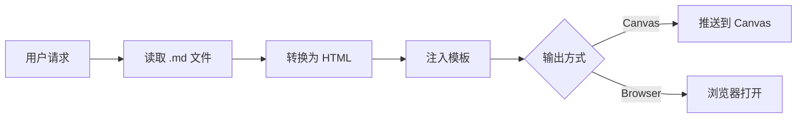

# 📝 Markdown Canvas Renderer

> 将 Markdown 文件转换为精美的 HTML 页面，适用于 Canvas 展示或浏览器查看。

## ✨ 特性

- 🚀 **零依赖**：纯 Python + 自包含 HTML 模板
- 🎨 **开箱即用**：精心设计的样式，代码高亮
- ⚡ **高效**：Token 消耗低（~650 vs ~8000）
- 📱 **响应式**：自适应各种屏幕尺寸
- 🔒 **离线可用**：无需 CDN，即时渲染

## 🎯 使用场景

适用于以下请求：
- "渲染 xxx.md"
- "把这个 Markdown 文件可视化"
- "生成 HTML 页面"
- "让 xxx.md 好看点"
- "分享这个文档"

## 🚀 快速开始

### 基础用法
```bash
python3 scripts/convert.py document.md
# 生成 document.html
```

### 自定义输出路径
```bash
python3 scripts/convert.py input.md -o /path/to/output.html
```

### 自定义页面标题
```bash
python3 scripts/convert.py notes.md -t "我的研究笔记"
```

## 📋 支持的 Markdown 语法

| 语法 | 示例 | 渲染效果 |
|------|------|----------|
| 标题 | `# H1` ... `###### H6` | 六级标题 |
| 加粗 | `**text**` or `__text__` | **text** |
| 斜体 | `*text*` or `_text_` | *text* |
| 代码块 | ` ```python ... ``` ` | 语法高亮 |
| 行内代码 | `` `code` `` | `code` |
| 链接 | `[text](url)` | [text](url) |
| 列表 | `- item` | • item |
| 分隔线 | `---` | <hr> |

## 🎨 输出效果预览

生成的 HTML 页面包含：
- 干净的现代排版
- 代码块语法高亮
- 响应式布局
- 打印友好的样式

## 📦 工作流程



## 🔧 进阶用法

### 与 Canvas 结合
```bash
# 转换后推送到 Canvas 显示
python3 scripts/convert.py report.md
canvas present file://$(pwd)/report.html
```

### 批量转换
```bash
for f in *.md; do 
  python3 scripts/convert.py "$f"
done
```

## 💰 Token 成本分析

| 操作 | Token 消耗 |
|------|-----------|
| 首次读取 SKILL.md | ~500 |
| 执行脚本 | ~100 |
| 报告结果 | ~50 |
| **总计** | **~650** |

**vs 每次生成完整 HTML: ~8000 tokens**  
节省超过 **90%** 的 Token 消耗！

## 📁 文件结构

```
markdown-canvas/
├── SKILL.md              # 技能定义
├── README.md             # 使用文档（本文件）
├── scripts/
│   └── convert.py        # 转换脚本
└── assets/
    └── template.html     # HTML 模板
```

## 🤝 反馈与贡献

- 📮 公众号：**后端工程师的 AI 进化之路**
- 🐙 GitHub: [github.com/jingyu525](https://github.com/jingyu525)
- 🌟 即刻: [okjk.co/GaCNdY](https://okjk.co/GaCNdY)
- 💬 Issues: 欢迎反馈问题和建议

## 📝 许可证

MIT License - 自由使用和修改

---

**Made with ❤️ by @jingyu525**  
*If this skill saved you time, consider giving it a ⭐ on ClawHub!*
