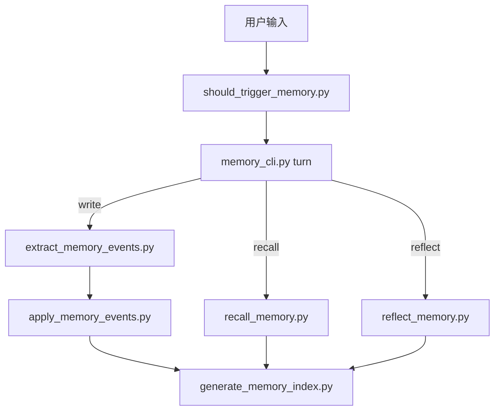

# ARCHITECTURE

## 目标

Memory Orchestrator 的目标不是“尽可能多记”，而是：

1. 在有限上下文下召回最相关的记忆
2. 让记忆结构对白盒可见
3. 允许系统随着对话逐步演化
4. 控制 token 成本，避免每轮都跑重流程

## 设计原则

### 1. 分层而不是堆积

系统把记忆分成：
- session state
- daily log
- topic cards
- objects
- reflections
- indexes

### 2. summary-first

优先读摘要卡，而不是直接读大量原始历史。

### 3. 显式触发优先

优先通过关键词和 `/` 命令激活记忆相关动作，而不是依赖复杂猜测逻辑。

### 4. 白盒可检查

记忆尽量使用：
- YAML
- Markdown
- JSON

不依赖黑盒数据库或难以检查的索引机制。

---

## 目录结构

```text
skills/memory-orchestrator/
  README.md
  SKILL.md
  ARCHITECTURE.md
  ROADMAP.md
  references/
  scripts/

memory/
  README.md
  session-state.yaml
  daily/
  topics/
  objects/
  reflections/
  indexes/
```

---

## 核心流程

### A. Bootstrap

`setup_memory_system.py`

职责：
- 初始化 memory 根目录
- 创建默认 topic seeds
- 创建 README 和 indexes 说明
- 保证对象目录存在

### B. Gate

`should_trigger_memory.py`

职责：
- 判断这条消息是否值得触发记忆动作
- 输出：should_write / should_recall / should_reflect

这一步必须便宜。

### C. Turn

`memory_cli.py turn "..."`

职责：
- 先 gate
- 命中写入时走 extract/apply
- 命中召回时走 recall
- 命中反思时走 reflect
- 最后更新索引

### D. Recall

`recall_memory.py`

职责：
- 读取 topics 和 objects
- 用简单可解释的打分进行 summary-first 召回
- 返回紧凑 JSON 供上层消费

### E. Write

`extract_memory_events.py` + `apply_memory_events.py`

职责：
- 提取偏好、决策、纠正、主题激活等事件
- 写入 session-state 和 daily log
- 必要时 materialize 成 preference / decision 对象

### F. Reflect

`reflect_memory.py`

职责：
- 浏览最近 daily logs
- 生成低频整理结果
- 为未来更强的提炼器预留入口

### G. Index

`generate_memory_index.py`

职责：
- 生成 `manifest.json`
- 生成 `indexes/README.md`
- 让人和脚本都能快速理解当前记忆结构

---

## 脚本之间的关系



---

## 为什么现在不用黑盒向量库

当前阶段优先保证：
- 文件可读
- 行为可解释
- 修改低门槛
- 调试容易

所以目前采用：
- 文件系统为主
- 规则 + 轻量打分
- 自动索引但不黑盒

这不代表未来不能接更强的召回层，只是当前先保证白盒与可持续开发。

---

## 未来演进方向

可以增强，但不应破坏白盒原则：

1. 更好的 object merge
2. 更好的 relation inference
3. 更好的 topic evolution
4. 更细粒度的 durability 策略
5. 更自然的 recall rerank
6. 更强的 OpenClaw 接入层

---

## 当前已知边界

1. gate 仍然是显式触发优先，不是“无感智能”
2. recall 目前仍是轻量启发式
3. reflection 目前更像低频整理记录，不是高级总结器
4. 自动对象化还只覆盖 preference / decision 的一部分场景

这些都属于当前阶段有意保守，而不是遗漏。