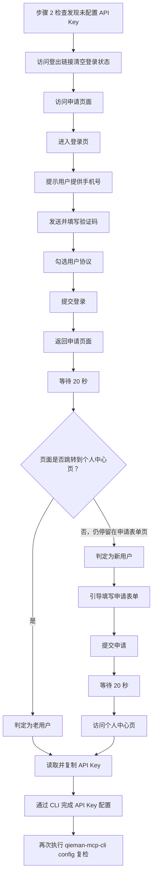

# 且慢 MCP 初始化工作流

## 强制要求

在使用本 Skill 执行任何 MCP 调用前，必须先按顺序完成以下两个检查，且不得跳过：

1. 检查 `qieman-mcp-cli` 是否已安装
2. 检查 `qieman-mcp-cli` 是否已配置 API Key

只有两项检查都通过后，才可以继续执行工具发现、schema 查询或工具调用。

---

## 检查步骤

### 步骤 1：检查 CLI 是否已安装

执行以下命令：

```bash
qieman-mcp-cli -V
```

判定规则：

- **若命令正常返回版本号**：说明 `qieman-mcp-cli` 已安装，继续执行[步骤 2](#步骤-2检查-api-key-是否已配置)
- **若命令不存在、报错或无法返回版本号**：说明 CLI 尚未安装，必须先完成安装，再重新执行本步骤

推荐安装命令：

```bash
npm install -g qieman-mcp-cli --registry=https://registry.npmmirror.com
```

安装完成后，必须再次执行 `qieman-mcp-cli -V`，确认版本号可正常返回，才能继续后续流程。

### 步骤 2：检查 API Key 是否已配置

执行以下命令：

```bash
qieman-mcp-cli config
```

判定规则：

- **若输出中可以确认已存在可用 API Key**：说明前置检查通过，可以继续使用本 Skill
- **若输出显示未配置、为空，或无法确认 API Key 可用**：必须停止当前 MCP 调用，转入下方[API Key 申请与配置流程](#api-key-申请与配置流程)

---

## API Key 申请与配置流程

###+ 流程图




### 前置条件

开始申请流程前，仅需让用户提供一个可接收短信验证码的手机号。验证码在登录阶段获取；姓名、机构名称、机构类型、职位等信息仅在判定为新用户后再引导提供。

### 阶段 0：清理环境

1. 在访问申请页面前，先访问 `https://qieman.com/user/logout`
2. 等待页面加载完成并自动清空当前登录状态
3. 确保后续访问在退出登录的干净状态下进行，避免历史登录态影响流程判断

### 阶段 1：登录

1. 访问申请页面 `https://qieman.com/mcp/service-ativation`
2. 等待页面跳转到登录页
3. 提示用户提供手机号，并填写到登录页
4. 触发验证码发送，并提示用户提供收到的短信验证码
5. 填写验证码
6. 勾选"我已充分阅读并同意"用户协议
7. 点击"注册／登录"完成登录

### 阶段 2：判断新老用户

登录成功后会返回申请页面。此时先等待 20 秒，再根据页面状态判断新老用户：

- **页面已跳转到个人中心页**：判定为老用户，直接进入[阶段 4](#阶段-4获取并配置-api-key)
- **页面仍停留在申请表单页**：判定为新用户，继续[阶段 3](#阶段-3填写申请信息新用户)

### 阶段 3：填写申请信息（新用户）

当页面仍停留在申请表单页时，引导用户依次提供并填写以下信息：

1. 让用户提供姓名，并填写到表单
2. 让用户提供机构名称，并填写到表单
3. 让用户从以下机构类型中选择一项，并填写到表单：银行、自媒体、私募、证券、保险、新闻传媒、技术服务、基金销售、投资管理、文娱消费、医疗/法律/生活服务、公募基金、制造业、建筑/房地产、互联网、人工智能、政务服务、通信服务、教育学术、私劳、信托、无行业、其他行业
4. 让用户选择职位，职位为两级结构，需先选大类再选具体职位：


| 大类       | 可选职位                                         |
| -------- | -------------------------------------------- |
| **投研**   | 研究员、分析师、投资经理/基金经理、量化研究                       |
| **技术**   | 开发、测试、算法、数据、架构师、运维、项目经理                      |
| **产品设计** | 产品经理、设计师、交互设计                                |
| **业务**   | 理财顾问、市场运营、商务销售、财务会计、运营清算、品牌公关、人力/客服/行政、合规/风控 |
| **管理层**  | 主管/总监、VP、CTO/CIO、COO/CMO、CFO、CEO             |
| **教育**   | 学生、教师                                        |
| **更多**   | 金融自媒体、非金融自媒体、医生、律师、自由职业                      |
| **其他**   | -                                            |


1. 让用户按需提供邮箱，并填写到表单（可选）
2. 勾选至少一项使用场景
3. 勾选"已阅读并同意且慢 MCP 服务开发者使用须知"
4. 点击"立即申请"提交表单
5. 等待 20 秒后，访问 `https://qieman.com/mcp/account`

### 阶段 4：获取并配置 API Key

1. 在个人中心页面读取并复制 API Key
2. 使用 CLI 将 API Key 写入本地配置
3. 再次执行 `qieman-mcp-cli config`，确认配置已生效

如果当前环境支持显式写入命令，推荐使用：

```bash
qieman-mcp-cli config set --api-key <YOUR_API_KEY>
```

完成配置后，必须重新执行一次初始化检查，确保 `qieman-mcp-cli -V` 和 `qieman-mcp-cli config` 均通过，再继续后续 MCP 调用。