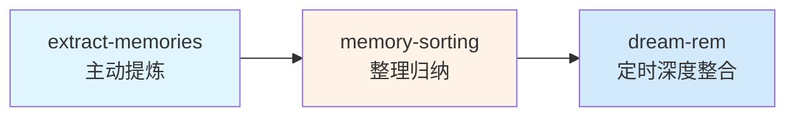

# openclaw-cc-contrib

> 从 Claude Code 源码提取，移植到 OpenClaw 的 CC-harness 技能集合

[](LICENSE)
[](https://openclaw.org/)

## 📖 简介

从 CC 2.1.88 源码移植到 OpenClaw 的技能集合，遵循 CC 原生设计原则：

### 已移植技能

| 技能 | 功能 | 状态 |
|------|------|------|
| **extract-memories** | 对话结束主动提炼关键记忆（提醒型） | ✅ v3.0.0 |
| **memory-sorting** | 扫描记忆库，检测问题生成修改提案 | ✅ v3.0.0 |
| **dream-rem** | 定时深度整合记忆，保持记忆库整洁 | ✅ v3.0.0 |
| **simplify** | 三阶段代码简化审查（复用/质量/效率）| ✅ 完成 |



## 🎯 核心设计原则

**CC 原生记忆系统四大原则：**

| 原则 | 说明 |
|------|------|
| MEMORY.md = 纯索引 | 索引不含内容，每行一个指针 |
| 按主题组织，不按时间 | 记忆按语义分类，不按日期堆砌 |
| 删除被推翻的，不保留矛盾 | 记忆库不囤积过时信息 |
| 不存可推导的信息 | 代码结构/Git历史/调试方案不存 |

## 📦 安装

```bash
mkdir -p ~/.openclaw/skills/
cp -r extract-memories ~/.openclaw/skills/
cp -r memory-sorting ~/.openclaw/skills/
cp -r dream-rem ~/.openclaw/skills/
```

或通过 ClawhHub 安装：
```bash
clawdhub install extract-memories
clawdhub install memory-sorting
clawdhub install dream-rem
```

## 📁 记忆文件结构

```
memory/
├── MEMORY.md              ← 纯索引（每行一个指针，不含内容）
├── ENTRYPATH.md          ← 主题入口导航
├── heartbeat-state.json   ← 状态记录
└── topics/              ← 所有记忆内容
    ├── user_role.md      ← 用户角色/偏好
    ├── feedback_concise.md ← 用户纠正和确认
    ├── project_deadline.md ← 项目约束/截止
    └── reference_xxx.md   ← 外部系统指针
```

---

## 🧠 extract-memories v3.0.0

**功能**：对话结束时主动提炼关键记忆，写入 topic 文件 + 更新 MEMORY.md 索引

**触发方式**：
- **提醒型自动**：主 agent 在检测到对话结束模式（再见/bye等）时主动执行
- **Heartbeat 辅助**：定时检测是否超过 30 分钟未提炼
- **手动**：`/extract-memories`

> 建议在 AGENTS.md 中加入一行触发配置，详见 SKILL.md

### 四种记忆类型

| 类型 | 什么时候存 | 正文结构 |
|------|-----------|---------|
| `user` | 用户角色/偏好/知识时 | 一段文字即可 |
| `feedback` | 用户纠正或确认时 | 规则 → **Why:**（原因）→ **How to apply:**（何时适用）|
| `project` | 项目截止/动机/约束时 | 事实 → **Why:** → **How to apply:** |
| `reference` | 外部系统指针时 | URL/路径 + 用途 |

### What NOT to Save（6条禁止）

1. ❌ 代码结构/文件路径（可从源码读）
2. ❌ Git 历史（git log 是权威来源）
3. ❌ 调试方案（修复在代码里）
4. ❌ CLAUDE.md 已有的内容
5. ❌ 临时任务状态
6. ❌ PR 列表/活动摘要

---

## 🗄️ memory-sorting v3.0.0

**功能**：像整理衣柜一样扫描记忆库，检测问题，生成提案等你批准后执行

**触发**：`/memory-sorting`

### 六类问题检测

| 类型 | 说明 |
|------|------|
| 🔁 重复 | 同一内容出现在 ≥2 个文件 |
| ⏰ 过时 | 被新结论推翻；相对日期超过30天 |
| ⚡ 冲突 | 同一问题两个文件说法矛盾 |
| ❓ 孤儿 | topic 文件无 MEMORY.md 索引 |
| 📜 碎片 | 同一主题分散在 ≥3 个文件 |
| 📏 超限 | MEMORY.md 超过200行或25KB |

---

## 🌙 dream-rem v3.0.0

**功能**：定时深度整合，将 daily 日记提炼到 topic 文件，删除过时内容，保持 MEMORY.md 简洁

**触发**：
- **Cron 自动**：每 2 小时检测，sessionCount >= 5 + 距上次 > 24h 触发
- **手动**：`/dream-rem`

### 四阶段整合流程

```
Phase 1 — Orient    建立视野：读 MEMORY.md + 扫描 topic 文件
Phase 2 — Gather     收集信号：扫描 daily 日记，识别值得提炼的内容
Phase 3 — Consolidate 整合执行：合并到已有 topic / 新建 topic
Phase 4 — Prune       精简索引：删除过时，重写 MEMORY.md（≤200行）
```

---

## 📝 使用命令

| 技能 | 自动触发 | 手动触发 | 触发短语 |
|------|:-------:|:---------|:---------|
| extract-memories | ✅ 提醒型 | `/extract-memories` | `提炼记忆` / `提取记忆` |
| memory-sorting | ❌ | `/memory-sorting` | `整理记忆` / `记忆整理` |
| dream-rem | ✅ Cron定时 | `/dream-rem` | `深度整合记忆` / `梦境整理` |

---

## 🔄 版本历史

| 版本 | 日期 | 主要变化 |
|------|------|---------|
| v1.x | 2026-04-04 | 初始版本，daily 文件模式 |
| **v2.0.0** | 2026-04-04 | 架构重构 |
| **v3.0.0** | 2026-04-07 | 触发机制优化，更新描述 |

## 🎯 项目信息

- 提取来源: CC 2.1.88
- 移植适配: [纬悟心智](https://weavemind.com)
- 许可证: MIT

---

*star 欢迎 🌟*
