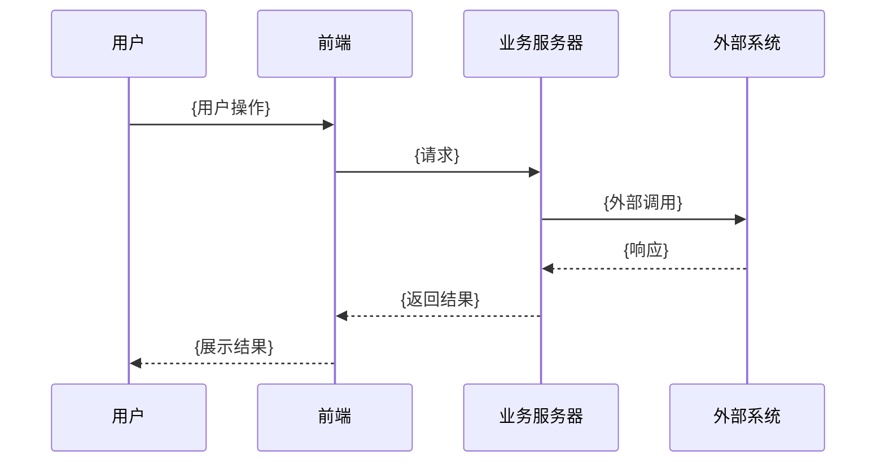

# {产品名称} PRD V{版本号}

> **产品名称**：{产品名称}  
> **所属平台**：{平台}  
> **产品类型**：{小程序/H5/App/后台系统/API服务}  
> **版本**：V{版本号}  
> **文档版本**：v{文档版本号}  
> **最后更新**：{日期}  
> **产品经理**：{PM}  
> **状态**：{草稿/需求评审中/开发中/已上线}

---

## 1. 项目背景

<!-- AI_INSTRUCTION: 必填章节，不可省略 -->

### 1.1 背景描述

<!-- AI_INSTRUCTION: 描述为什么要做这个产品/功能，业务痛点是什么，市场机会在哪里。2-3段。 -->

{背景描述}

### 1.2 目标用户

<!-- AI_INSTRUCTION: 目标用户画像，包含人群特征、使用场景、核心诉求。 -->

| 维度 | 描述 |
|------|------|
| 用户群体 | {群体描述} |
| 年龄范围 | {年龄范围} |
| 典型场景 | {使用场景} |
| 核心诉求 | {核心诉求} |

### 1.3 核心目标

<!-- AI_INSTRUCTION: 北极星指标 + 过程指标，必须可量化。 -->

| 目标维度 | 关键指标 | 目标值 |
|---------|---------|--------|
| {维度1} | {指标名} | {目标值} |
| {维度2} | {指标名} | {目标值} |
| {维度3} | {指标名} | {目标值} |

**北极星指标**：{核心指标及目标值}

---

## 2. 产品概述与业务模式

<!-- AI_INSTRUCTION: 必填章节，不可省略 -->

### 2.1 产品定位

<!-- AI_INSTRUCTION: 50-100字，一句话说清产品是什么、为谁、解决什么问题、怎么解决。 -->

{产品定位描述}

### 2.2 核心业务流程图

<!-- AI_INSTRUCTION: 必须同时包含时序图和流程图两种视图。 -->

#### 2.2.1 业务时序图

<!-- AI_INSTRUCTION: 用Mermaid sequenceDiagram绘制多角色交互时序，展示用户/前端/后端/外部系统之间的调用链。 -->



#### 2.2.2 业务流程图

<!-- AI_INSTRUCTION: 用Mermaid flowchart绘制端到端业务流程，包含用户/系统/外部系统交互。 -->

```mermaid
flowchart TD
    A[{起始节点}] --> B{判断节点}
    B -->|条件1| C[处理节点]
    B -->|条件2| D[处理节点]
    C --> E[结束节点]
    D --> E
```

### 2.3 功能架构

<!-- AI_INSTRUCTION: 模块→子模块→功能点，使用表格格式，标注优先级P0/P1/P2。 -->

| 一级模块 | 优先级 | 子模块/功能点 | 说明 |
|---------|:------:|------------|------|
| {模块1} | P0 | {子模块1.1} → {功能点1.1.1} | {说明} |
| | | {子模块1.1} → {功能点1.1.2} | {说明} |
| | | {子模块1.2} → {功能点1.2.1} | {说明} |
| {模块2} | P0 | {子模块2.1} | {说明} |
| | | {子模块2.2} | {说明} |
| {模块3} | P1 | {子模块3.1} | {说明} |
| {模块4} | P2 | {子模块4.1} | {说明} |

---

## 3. 产品功能说明

<!-- AI_INSTRUCTION: 必填章节，不可省略 -->

### 3.0 整体页面流程图

<!-- AI_INSTRUCTION: 仅使用截图版页面流程全景图（page-flow-map.png），禁止生成Mermaid flowchart文本流程图。Step 5截图完成后，必须将page-flow-map.png插入到下方占位符位置。 -->

<!-- SCREENSHOT_PLACEHOLDER:  -->

---

### 3.{N} {模块名称}

<!-- AI_INSTRUCTION: 将 {N} 替换为实际模块编号（如 3.1、3.2、3.3...），不要保留 {N} 占位符。以下6个子章节为每个功能模块的必填项，逐一填写。标题中不要包含【必填】【选填】等标注。 -->

#### 功能描述

<!-- AI_INSTRUCTION: 用户故事格式 -->

**As a** {用户角色},  
**I want** {功能描述},  
**So that** {获得的价值}。

**页面说明**：{该模块核心页面的用途，1-2句话}

#### 业务规则

| 编号 | 规则描述 | 说明/边界条件 |
|------|---------|-------------|
| BR-{XX} | {规则描述} | {详细说明} |
| BR-{XX} | {规则描述} | {详细说明} |

#### 页面交互说明

**关联原型**：`→ prototype/pages/{页面名}.html`

<!-- SCREENSHOT_PLACEHOLDER:  -->

<!-- AI_INSTRUCTION: 此处禁止放置任何文字画/线框草图/ASCII绘图。页面展示必须且只能使用Demo页面截图（Step 5自动回填上方占位符）。 -->

**页面元素说明**：

| 元素 | 类型 | 说明 |
|------|------|------|
| {元素名} | {类型：按钮/输入框/卡片/列表等} | {功能说明} |

**交互规则**：

1. {交互行为描述，如：点击XX → 跳转到XX页面}
2. {交互行为描述}
3. {交互行为描述}

#### 数据字段说明

| 字段名 | 类型 | 必填 | 校验规则 | 说明 | 示例值 |
|--------|------|------|---------|------|-------|
| {字段名} | {String/Number/Boolean/Date/Enum} | {是/否} | {校验规则} | {说明} | {示例} |

#### 异常处理

| 异常场景 | 处理策略 | 用户提示文案 |
|---------|---------|------------|
| {异常描述} | {处理方式} | "{提示文案}" |
| 网络异常 | {重试/缓存/降级} | "{提示文案}" |
| 数据为空 | {空状态/默认值} | "{提示文案}" |

#### 埋点需求

| 事件ID | 事件名称 | 触发时机 | 关键参数 | 说明 |
|--------|---------|---------|---------|------|
| EVT-{XX} | page_view | 进入{页面名} | page_name | 页面曝光 |
| EVT-{XX} | {事件名} | {触发时机} | {参数列表} | {说明} |

<!-- AI_INSTRUCTION: 以上6个子章节为每个功能模块的必填项 -->

<!-- AI_INSTRUCTION: 以下为选填子章节，按需添加。标题中不要包含【选填】标注。 -->

#### 状态流转

<!-- AI_INSTRUCTION: 选填。涉及状态变化的模块建议添加。 -->

```mermaid
stateDiagram-v2
    [*] --> {状态1}
    {状态1} --> {状态2}: {触发条件}
    {状态2} --> {状态3}: {触发条件}
    {状态3} --> [*]
```

#### 接口依赖

<!-- AI_INSTRUCTION: 选填。有外部接口依赖时添加。 -->

| 接口名称 | 方法 | 路径 | 说明 |
|---------|------|------|------|
| {接口名} | {GET/POST/PUT/DELETE} | {/api/xxx} | {说明} |

#### 竞品参考

<!-- AI_INSTRUCTION: 选填。有竞品对比时添加。 -->

| 竞品 | 做法 | 我们的差异化 |
|------|------|------------|
| {竞品名} | {竞品做法} | {我们的方案} |

---

<!-- AI_INSTRUCTION: 重复 3.{N} 章节，为每个功能模块生成完整内容 -->

---

## 4. 非功能需求

<!-- AI_INSTRUCTION: 按需必填。技术团队需要的性能/安全/兼容性要求。 -->

### 4.1 性能要求

| 指标 | 要求 |
|------|------|
| 首屏加载 | ≤{N}秒 |
| 接口响应 | ≤{N}ms |
| {其他指标} | {要求} |

### 4.2 兼容性要求

| 平台/环境 | 最低版本 |
|----------|---------|
| {平台} | {版本} |

### 4.3 安全要求

<!-- AI_INSTRUCTION: 数据安全、权限控制、隐私保护等 -->

- {安全要求1}
- {安全要求2}

---

## 5. 上线策略

<!-- AI_INSTRUCTION: 选填。有灰度/回滚需求时添加。 -->

### 5.1 灰度发布计划

| 阶段 | 范围 | 持续时间 | 关注指标 |
|------|------|---------|---------|
| {阶段1} | {用户范围} | {时长} | {指标} |

### 5.2 回滚方案

{回滚条件和回滚步骤}

---

## 6. 附录

<!-- AI_INSTRUCTION: 选填。术语表、Demo说明、修订记录等。 -->

### 附录A：术语表

| 术语 | 说明 |
|------|------|
| {术语} | {解释} |

### 附录B：可交互Demo说明

本PRD配套提供完整的可交互HTML Demo原型，包含以下页面：

| Demo页面 | 对应PRD章节 | 文件路径 |
|---------|-----------|---------|
| {页面名} | 3.{N} | `prototype/pages/{文件名}.html` |

> **使用说明**：打开 `prototype/index.html` 作为总入口，可导航至所有页面。

### 附录C：修订记录

| 版本 | 日期 | 修改内容 | 修改人 |
|------|------|---------|-------|
| v{版本} | {日期} | {修改内容} | {修改人} |
