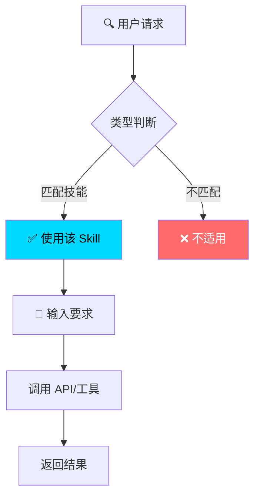
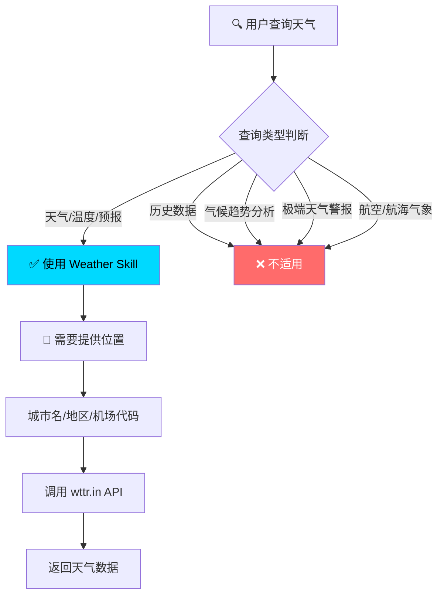
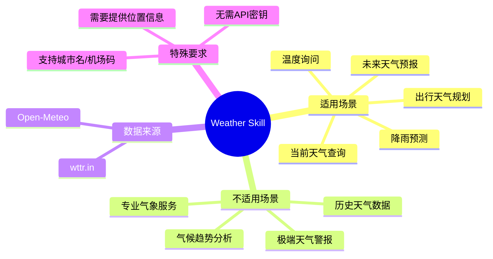
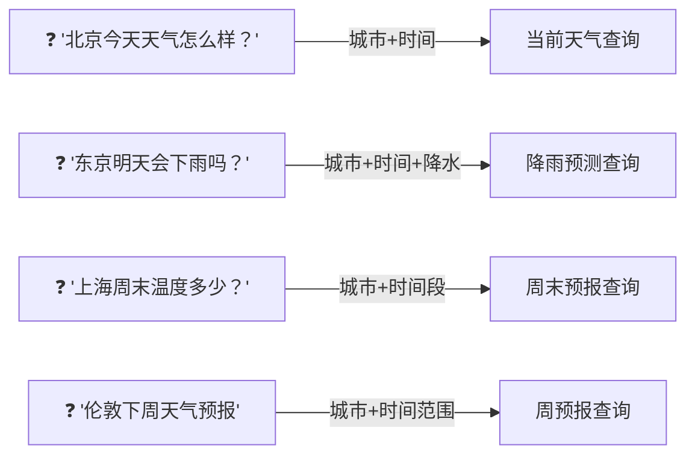
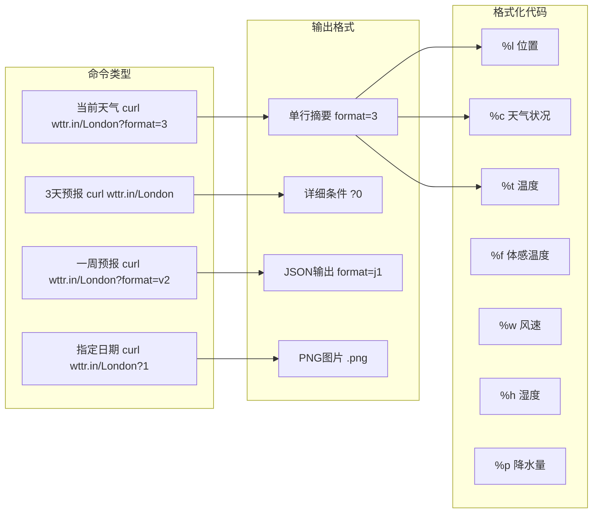
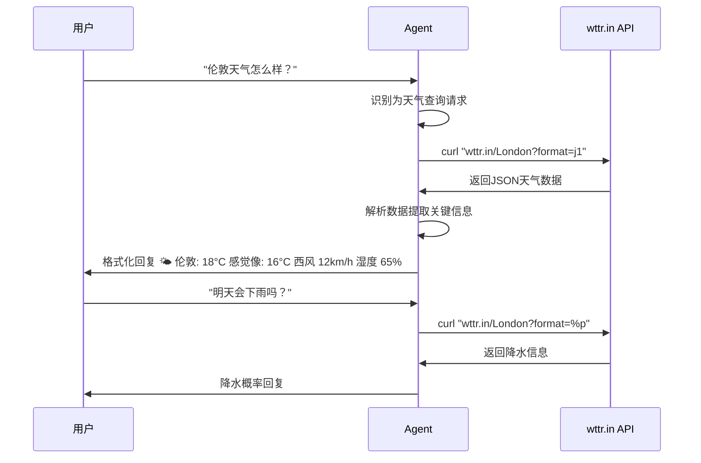

# Learn Skill - 通用技能分析工具

解析任意 Skill 的功能结构，生成可视化的双层架构图表。

## 核心方法：两层架构分析法

| 层次 | 关注点 | 产出物 |
|------|--------|--------|
| **规划层** | 技能定位、边界、输入要求 | 决策 flowchart、mindmap |
| **绘制层** | 功能分解、用户交互、API调用 | 架构图、时序图、提问样例 |

## 使用方法

### Step 1: 读取目标 Skill 的 SKILL.md

首先读取待分析技能的 SKILL.md 文件，了解其：
- `description` - 技能描述和触发场景
- 功能列表和命令示例

### Step 2: 生成两层分析

根据 SKILL.md 内容，生成两层架构图表：

**第一层（规划层）：**


**第二层（绘制层）：**
- 用户提问样例 flowchart
- 核心功能架构图（命令类型 → 输出格式 → 格式化代码）
- 完整交互时序图

### Step 3: 输出 HTML 报告

生成包含所有图表的 HTML 文件供用户查看。

**HTML 输出规范（确保文字清晰可见）：**

- 页面背景使用深色渐变时，正文文字使用浅色 `#eee` 或白色
- 表格使用白色背景 `#fff` + 深色文字 `#1a1a2e` 提供高对比度
- 代码块使用浅色背景（如 `rgba(0,217,255,0.15)`）+ 深色文字
- 标题使用渐变色或亮色（`#00d9ff`, `#00ff88`）确保与背景区分
- 图表容器使用白色背景避免与深色页面混色

---

## 示例：Weather Skill 分析

下面以 Weather Skill 为例，展示两层架构的完整输出。

### 第一层：规划层 - 技能定位与适用范围





### 第二层：绘制层 - 核心功能架构与提问样例

#### 💬 用户提问样例



#### ⚙️ 核心功能架构



#### 时序图 - 完整交互流程



---

## 输出模板

当用户要求分析新 Skill 时，按以下格式组织输出：

```
# {Skill名称} 分析

## 第一层：规划层 - 技能定位与适用范围
[flowchart + mindmap]

## 第二层：绘制层 - 核心功能架构与提问样例
[用户提问样例 flowchart]
[核心功能架构图]
[时序图]
```

## 相关资源

- **Mermaid 图表语法**：`mermaid-diagrams` Skill
- **技能创建规范**：`skill-creator` Skill
