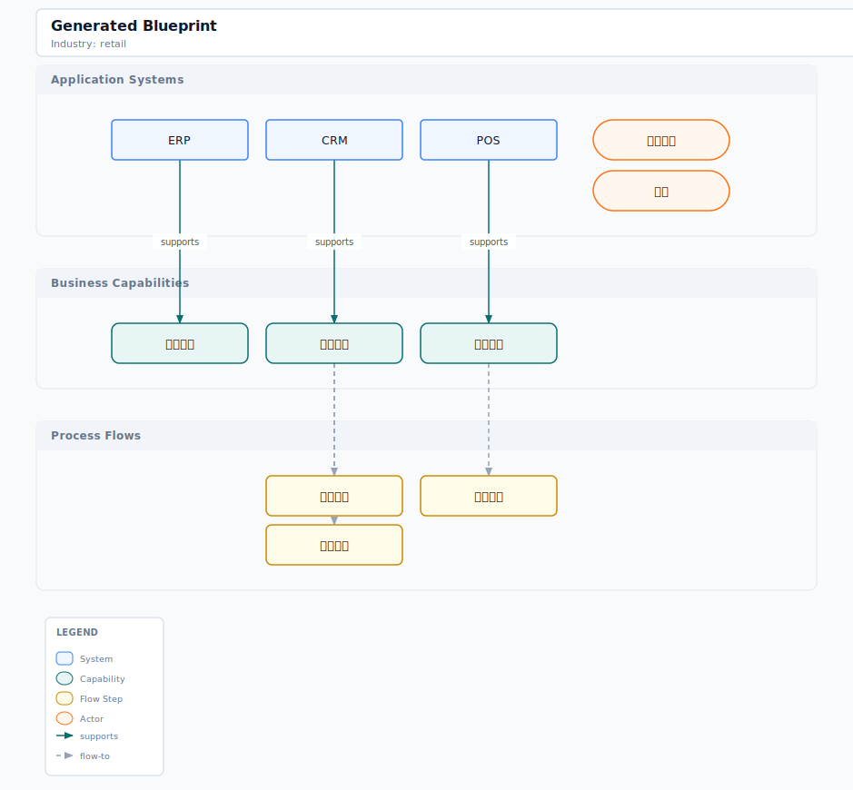

# kai-business-blueprint

> 售前需求、会议纪要、RFP 材料 → 可编辑的业务能力蓝图、泳道流程图、应用架构图。一份 canonical JSON IR，多个下游导出格式（SVG / draw.io / Excalidraw / Mermaid）。

A [Claude Code](https://claude.ai/claude-code) skill that turns raw presales inputs into canonical business capability blueprints, with a static HTML viewer and multi-format diagram exports.

English | [简体中文](README.zh-CN.md)

---

## Demo

Retail industry blueprint, exported as SVG:



The SVG is generated by `business-blueprint --export demos/retail.blueprint.json` — the source JSON is in `demos/retail.blueprint.json`, the viewer is `demos/solution.viewer.html`.

---

## Design Philosophy: IR-First Pipeline

### 1. JSON as Canonical Intermediate Representation

Every workflow converges on `solution.blueprint.json` — the single source of truth. All other artifacts (viewer, SVG, draw.io) are deterministic projections from it.

```
Raw Text ──(--plan)──→ JSON ──(--generate)──→ Viewer HTML
                          │
                          ├──(--export)──→ SVG / draw.io / Excalidraw / Mermaid
                          │
                          └──(--edit)────→ JSON (patch logged) + Viewer refresh
```

The IR is:
- **Version-controllable** — standard JSON, diffs are meaningful
- **AI-readable** — downstream skills parse `entities`, `relations`, `flowSteps` without HTML parsing
- **Human-editable** — light fields (labels, names) can be edited without breaking structure

### 2. Progressive Disclosure

The skill file (`SKILL.md`) is a routing layer — it tells Claude *which* file to read for *which* command. Heavy assets (industry packs, viewer HTML template, export engine) stay on disk until needed.

```
--plan        → only model + generation rules; no CSS, no export engine
--generate    → one viewer.html template + one industry pack
--export      → only the requested export engine; other formats stay on disk
--validate    → schema + rules; no rendering code
```

### 3. Silicon-Carbon Collaboration

**Input:** Humans write natural language (requirements, meeting notes, RFPs). AI parses into structured entities (Application Systems, Business Capabilities, Process Flows, Actors) and relations.

**Output:** The viewer is a static HTML page — no build step, no JS framework, works offline. Every node is editable in-place, and edits are logged as a JSON patch trail (`solution.patch.jsonl`) for full traceability.

---

## Install

### Claude Code

```bash
git clone https://github.com/kaisersong/kai-business-blueprint ~/.claude/skills/kai-business-blueprint
```

Then: `cd kai-business-blueprint && pip install -e .`

### OpenClaw

```bash
git clone https://github.com/kaisersong/kai-business-blueprint ~/.openclaw/skills/kai-business-blueprint
cd kai-business-blueprint && pip install -e .
```

---

## Usage

### CLI Commands

| Flag | Purpose |
|------|---------|
| `--plan "text"` | Parse raw text into canonical blueprint JSON |
| `--project <blueprint.json>` | Derive canonical `solution.projection.json` for downstream skills |
| `--generate <output>` | Generate JSON + static HTML viewer package |
| `--edit <blueprint.json>` | Refresh viewer for an existing blueprint (preserves human edits) |
| `--export <blueprint.json>` | Export diagrams (default: free-flow SVG + HTML viewer) |
| `--export-auto <blueprint.json>` | Alias for --export (free-flow SVG + HTML viewer) |
| `--html <output.html>` | Generate self-contained HTML viewer with inline SVG |
| `--validate <blueprint.json>` | Validate blueprint structure, output errors/warnings |
| `--from <file>` | Read source material from file path |
| `--industry <pack>` | Apply industry template pack (common, finance, manufacturing, retail) |
| `--theme <dark|light>` | Color theme for output (default: dark) |
| `--format <fmt>` | Export format: svg, drawio, excalidraw, mermaid, all |

### Export Quality Contracts

- Export routing is explicit: specialized views are only used when the blueprint structure clearly matches them; otherwise the exporter stays on `freeflow`.
- SVG output now runs structural integrity checks for missing defs references and basic canvas overflow before an artifact is accepted.
- Export thresholds and defect taxonomy live under [`evals/`](evals), so route and integrity behavior are backed by machine-readable fixtures rather than prose only.
- Windows/terminal support is intentionally scoped: the canonical path is `python -m business_blueprint.cli`, and encoding-sensitive runs should use `PYTHONIOENCODING=utf-8` when needed.

### Typical Workflows

**From raw text:**
```bash
# Step 1: parse into canonical JSON
business-blueprint --plan "ERP supports POS system..." --from meeting-notes.md --industry retail

# Step 2: generate viewer
business-blueprint --generate solution.blueprint.json

# Step 3: export diagrams
business-blueprint --export solution.blueprint.json
```

**Edit existing blueprint:**
```bash
# Edit the JSON manually or let AI edit it
# Then refresh the viewer (preserves human-edited fields via editor.fieldLocks)
business-blueprint --edit solution.blueprint.json
```

**Validate before export:**
```bash
business-blueprint --validate solution.blueprint.json
# Fix errors, then:
business-blueprint --export solution.blueprint.json
```

**Prepare downstream machine handoff:**
```bash
business-blueprint --project solution.blueprint.json
```

---

## Outputs

| File | Role |
|------|------|
| `solution.blueprint.json` | Canonical IR — single source of truth |
| `solution.projection.json` | Canonical downstream machine projection |
| `solution.viewer.html` | Static viewer + light editor |
| `solution.exports/` | SVG, draw.io, Excalidraw, Mermaid exports |
| `solution.patch.jsonl` | Edit traceability log (JSON patches) |
| `solution.handoff.json` | Viewer revision manifest |

### SVG Architecture Export

The SVG export renders a free-flow L→R architecture diagram:

- **Main flow chain** (center row) — systems connected via flow steps, left to right
- **Auxiliary systems** (rows above/below) — placed by category (database, security, cloud)
- **Entry node** (left) — auto-generated from blueprint actors
- **Semantic arrows** — 4 types with distinct colors/markers: `supports` (green solid), `depends-on` (gray dashed), `flows-to` (blue solid), `owned-by` (yellow dotted)
- **Semantic node shapes** — diamond for flow steps, left color strip for systems, rounded rects for capabilities, pill shapes for actors
- **Industry themes** — accent color overlays for retail (orange), finance (blue), manufacturing (gray)

The layout engine computes positions dynamically with overlap resolution, horizontal alignment, and mid-y collision avoidance. The region boundary box and SVG canvas auto-expand to contain all arrow paths.

---

## Project Structure

```
kai-business-blueprint/
├── SKILL.md                      # Skill definition (routing layer)
├── business_blueprint/           # Python engine (zero external deps)
│   ├── cli.py                    # CLI entry point
│   ├── generate.py               # Blueprint generation from text
│   ├── model.py                  # Data model & top-level shape
│   ├── projection.py             # Downstream projection builder
│   ├── validate.py               # Machine-readable validation
│   ├── clarify.py                # Clarification request builder
│   ├── normalize.py              # Entity resolution & synonym merging
│   ├── viewer.py                 # HTML viewer package writer
│   ├── export_theme.py           # Shared export theme tokens and semantic colors
│   ├── export_text.py            # Shared SVG text width + wrapping helpers
│   ├── export_routes.py          # Explicit export route resolution
│   ├── export_integrity.py       # Structural export integrity checks + diagnostics
│   ├── export_svg.py             # SVG exporter (two-pass layout, content router, free-flow)
│   ├── export_drawio.py          # draw.io exporter
│   ├── export_excalidraw.py      # Excalidraw exporter
│   ├── export_mermaid.py         # Mermaid markdown exporter
│   ├── templates/                # Industry packs (common, retail, finance, manufacturing)
│   ├── assets/                   # viewer.html template
│   └── specs/                    # Blueprint schema definitions
├── references/                   # Schema, authoring rules, industry packs
├── tests/                        # Test suite
├── demos/                        # Demo blueprints & exports
└── examples/                     # Sample blueprint JSON
```

---

## Architecture Rules

The engine enforces structural rules:

| Rule | Description |
|------|-------------|
| **Every capability links to a system** | No orphaned capabilities |
| **Every flow links to a capability** | No floating flow steps |
| **Actor → System** | Actors must reference valid system IDs |
| **No circular relations** | System → Capability → Flow must be DAG |

Run `--validate` to check all rules. Warnings indicate potential issues (e.g., a system with no capabilities), errors block export.

---

## For AI Agents

Other skills should consume blueprint artifacts through prompt orchestration, not through the viewer handoff manifest.

```
# 1. Prepare the machine artifacts
business-blueprint --plan solution.blueprint.json --from "..."
business-blueprint --project solution.blueprint.json

# 2. Prompt report-creator with the blueprint/projection artifacts
"Use solution.blueprint.json and solution.projection.json to generate a report IR first. Do not render HTML yet."

# 3. Prompt slide-creator with the blueprint/projection artifacts
"Use solution.blueprint.json and solution.projection.json to generate PLANNING.md first. Do not generate HTML yet."
```

See [references/prompt-orchestration-templates.md](references/prompt-orchestration-templates.md) for copy-paste prompt templates.

`solution.handoff.json` is only a viewer manifest. Do not use it as report/deck input.

**Extracting structured data:**
```python
import json

with open("solution.blueprint.json") as f:
    bp = json.load(f)

# Systems
for sys in bp["library"].get("systems", []):
    print(f"System: {sys['name']}")

# Capabilities
for cap in bp["library"].get("capabilities", []):
    print(f"Capability: {cap['name']}")

# Relations
for rel in bp["relations"]:
    print(f"{rel['from']} --{rel['type']}--> {rel['to']}")
```

---

## Requirements

| Requirement | Version | Notes |
|-------------|---------|-------|
| **Python** | >= 3.12 | Zero external dependencies |

---

## Compatibility

| Platform | Version | Install path |
|----------|---------|--------------|
| Claude Code | any | `~/.claude/skills/kai-business-blueprint/` |
| OpenClaw | >= 0.9 | `~/.openclaw/skills/kai-business-blueprint/` |

---

## Version History

**v0.10.0** — Quality hardening release: add explicit export route resolution and SVG integrity checks with structured fallback diagnostics; introduce machine-readable eval assets under `evals/` (thresholds, defect taxonomy, route fixtures, scoring schema); improve cross-platform CLI handling for spaced paths, CRLF input, and UTF-8 validation output; split shared export text/theme helpers out of `export_svg.py`; and refine the evolution timeline view so dark cards stay readable and wrapped system pills no longer overflow.

**v0.9.0** — Canonical projection release: add `solution.projection.json` generation via `--project`; formalize prompt-native orchestration templates for report/slide downstream skills; strengthen export routing rules so non-standard diagram requests fall back to free-flow; and ship substantial SVG quality upgrades across poster, swimlane, hierarchy, and evolution views, including dark-theme fixes, label collision handling, width-aware title wrapping, centered card rows, and new regression coverage.

**v0.8.0** — Skill rename: rebranded from `business-blueprint-skill` to `kai-business-blueprint`; updated all GitHub URLs, install paths, and documentation references.

**v0.7.0** — Visual enhancements: 4 semantic arrow types (supports/depends-on/flows-to/owned-by) with distinct colors, dash patterns, and SVG markers; semantic node shapes (diamond for flowStep, left color strip for systems, rounded rects for capabilities, pill for actors); 3 industry theme overlays (retail=#F97316, finance=#3B82F6, manufacturing=#6B7280); HTML template-driven viewer generation (replaces 244 lines of f-strings); architecture layout fix — one column per unique capability; free-flow now renders full relation arrows from `blueprint.relations`; same-column arrow routing uses direct vertical paths; region box covers all system nodes; 46 new tests.

**v0.6.1** — Layout engine genericization: remove all hardcoded company/product names (AWS service mappings, Kingdee product IDs, brand text) from layout and rendering code; `_categorize_system()` now uses language-agnostic keyword matching (Chinese + English); `_layout_layered()` assigns distinct colors per layer instead of category keyword lookup; dark theme node colors increased contrast (brighter fills, bolder strokes); legend rendered behind arrows and nodes (z-order fix) so overlaps never obscure content; product tree and capability matrix auto-derive segments from blueprint data instead of hardcoded IDs.

**v0.6.0** — Free-flow layout engine overhaul: arrow routing with cross-row elbow paths and mid_y collision avoidance; dark theme as default; all user-facing labels in Chinese (legend, footer, summary cards); arrowheads shrunk (8×6px, stroke-width 1.5) for cleaner look; region boundary box and SVG canvas dynamically expand to contain arrow paths; rendering z-order fixed (arrows behind nodes); `--html` flag for standalone viewer; `--format` and `--theme` CLI flags; description section from blueprint context; download SVG button.

**v0.5.0** — Content router & free-flow layout engine: `_content_router()` auto-selects views (architecture, capability map, swimlane, process chain) based on blueprint content; `_layout_free_flow()` computes free-form positions with domain grouping and auto-wrapping; `export_svg_auto()` combines routing + layout; `--export-auto` CLI flag; HTML viewer now dynamically shows tabs only for available views.

**v0.4.0** — HTML viewer & layout fix: self-contained HTML viewer with three inline SVG views (architecture, capability map, swimlane), tab-based navigation, summary cards, dark theme support with grid background.

**v0.3.1** — CLI fixes: `--from` long Chinese text no longer triggers `File name too long`, stdin pipe support for `--plan`, subprocess `text=True`/bytes compatibility guidance.

**v0.2.0** — SVG layout engine: two-pass dynamic layer height, actor overflow fix, title/layer gap, header clipping fix, legend truncation fix.

**v0.1.0** — Initial release: plan/generate/edit/export/validate pipeline, HTML viewer with in-place editing, SVG/draw.io/Excalidraw/Mermaid exports, industry template packs (common, retail, finance, manufacturing).
