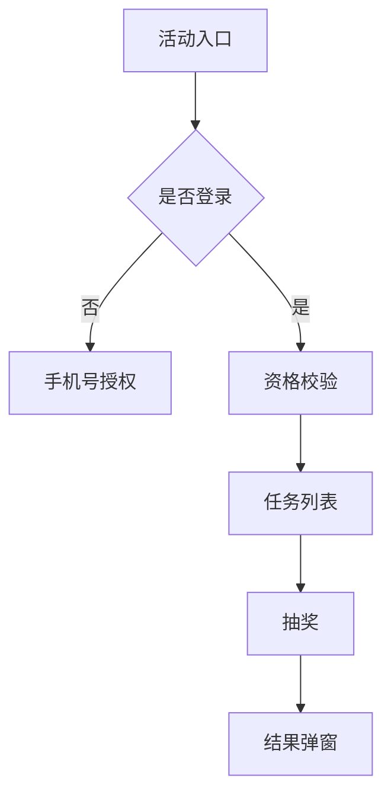

---

name: frontend-tech-doc-guide
description: 规范 AI 生成飞书技术文档结构，确保 Markdown 层级正确、章节顺序稳定、可读性高。
metadata: {"openclaw":{"emoji":"📚","auto":true}}
-------------------------------------------------------

# 前端活动技术文档生成规范（AI 专用）

> 本文件用于指导 AI 自动生成 **飞书技术文档**。重点解决：
>
> 1. Markdown 标题层级错误
> 2. 章节顺序混乱 / 内容重复
> 3. 文本堆叠导致可读性差

AI 在生成文档时 **必须严格遵守以下结构与格式规则**。

---

# 一、文档结构规则（必须严格遵守）

## 1. 标题层级规则

文档标题层级 **必须严格按以下结构生成，不允许跳级**：

```
# 文档标题

# 一、需求认知
需求 PRD：xx
飞书项目：xx
后端文档：xx
UI 设计稿：xx

- 需求背景
- 需求目标
- 核心/特殊改动点

# 二、项目排期
<!-- 评估需求开发内容量，根据复杂度和时间成本，合理分配项目排期。 -->

# 三、功能流程
<!-- 全部使用 mermaid 流程图 表示 -->
## 1. 页面流程
## 2. 功能流程
## ...其他流程

# 四、需求拆分
<!-- 详细描述需求功能模块，包括前端需求点以及所对应的后端接口。 -->
<!-- 需要考虑到边界情况以及异常处理。 -->

# 五、业务埋点 & Sentry 监控
<!-- 埋点信息从需求 PRD 中获得，关注参数，触发时机 -->
<!-- 埋点需要生成 mermaid 操作路径 -->
<!-- 特殊报错需要使用 Sentry 监控输出 -->

# 六、数据链路
<!-- 使用 mermaid 绘制用户在页面的活动链路 -->


# 七、提测信息
<!-- 使用表格格式，表头：模块、内容、备注 -->
<!-- 第一列：提测项目，提测环境 -->

# 八、验收与上线
<!-- 使用表格格式，表头：项目，上线 TAG -->


# 九、待确认问题
<!-- 使用表格格式，表头：问题，结论 -->

```


# 二、章节生成顺序（防止内容错位）

AI **必须严格按以下顺序生成内容**：

1. 需求认知
2. 项目排期
3. 功能流程
4. 需求拆分
5. 业务埋点 & Sentry 监控
6. 数据链路
7. 提测信息
8. 验收上线
9. 待确认问题

### 关键约束

生成时必须遵守：

* **不得提前生成后续章节内容**
* **不得回写前文**
* **不得复制后文内容到前文**

例如禁止出现：

```
开头出现：
第7章内容
第8章内容
```

若模型生成时出现重复章节，必须：

* 删除重复段
* 保留第一次出现的位置

---

# 三、段落排版规则（提升可读性）

AI 生成内容时 **禁止连续长文本块**。

每段说明 **必须拆分为以下结构之一**：

### 1 优先使用列表

错误示例：

```
系统需要完成登录、鉴权、资格校验、任务获取、抽奖逻辑等功能。
```

正确示例：

```
系统主要流程包括：

- 登录
- 身份鉴权
- 资格校验
- 任务获取
- 抽奖执行
```

---

### 2 技术描述必须结构化

统一使用 **模块结构**：

```
模块名称

- 功能说明
- 接口
- 关键逻辑
- 依赖
```

示例：

```
### 积分活动模块

功能：

- 展示用户积分
- 提供抽奖入口

接口：

- getUserPoints
- drawLottery

关键逻辑：

- 未登录先触发登录
- 积分不足提示
```

---

# 四、流程章节规范（必须包含 Mermaid）

流程章节 **必须包含 Mermaid 图**。

示例：



生成规则：

* Mermaid **只允许出现一次代码块**
* 使用 `<br/>` 换行
* 不允许使用 `\n`

---

# 五、模块拆分规则

模块章节必须按以下格式生成：

```
## 模块名称

功能：

- xxx
- xxx

核心逻辑：

- xxx
- xxx

接口：

| 接口 | 说明 |
|----|----|
| getTask | 获取任务 |
| drawLottery | 抽奖 |

依赖：

- 风控接口
- 奖品接口
```

禁止生成 **长段技术说明文字**。

---

# 六、埋点章节格式

必须使用表格。

示例：

| 事件   | code         | 触发时机 |参数|
| ---- | ------------ | ---- |----|
| 页面曝光 | page_view    | 页面加载 |...|
| 抽奖点击 | draw_click   | 点击抽奖 |...|
| 抽奖成功 | draw_success | 返回中奖 |中奖结果|

---

# 七、提测信息格式

表格结构

# 八、AI 生成质量规则（重点）

AI 在生成文档前必须执行：

### 1 章节检查

确认存在以下章节：

* 需求认知
* 项目排期
* 功能流程
* 需求拆分
* 业务埋点 & Sentry 监控
* 数据链路
* 提测信息
* 验收上线
* 待确认问题

缺一不可。

---

### 2 排版检查

确保：

* 无连续超过 **5 行纯文本段落**
* 必须包含

  * 列表
  * 表格
  * Mermaid

---

# 九、AI 输出限制

AI 输出文档时必须遵守：

1 不输出解释

只输出 Markdown 文档

2 不输出多版本

只输出最终版本

3 不输出空章节

无内容时写：

```
待补充
```

---

# 十、推荐文档标题格式

```
【YYMMDD】活动简称-前端技术方案
```

示例：

```
【260320】春季直播活动-前端技术方案
```

---

# 十一、生成目标

AI 生成的文档必须达到：

* Markdown 层级正确
* 飞书渲染结构稳定
* 章节顺序正确
* 信息结构化
* 可读性高

否则视为生成失败。
