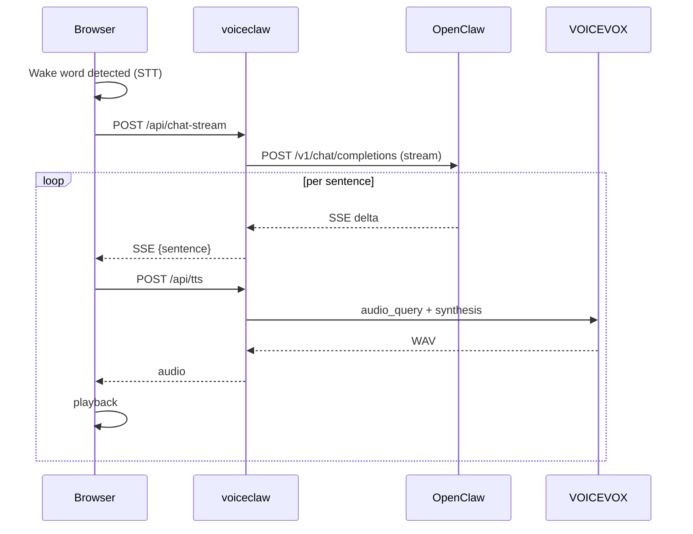

# 🦞 voiceclaw

**Voice conversation interface for [OpenClaw](https://github.com/openclaw/openclaw)**

Say a wake word, speak naturally, and hear your AI agent respond — with streaming low-latency TTS.

```
"アリス、今日の天気は？" → 🎙️ STT → 🤖 LLM (streaming) → 🔊 TTS → 🔈 playback
```

## Features

- 🎙️ **Wake word activation** — configurable trigger words (default: "アリス")
- ⚡ **Streaming responses** — sentence-level TTS starts before the full reply arrives
- 🗣️ **VOICEVOX TTS** — high-quality Japanese speech synthesis
- 🔧 **Zero config** — auto-detects OpenClaw gateway, no API keys to set up
- 💬 **Conversation history** — multi-turn context preserved in session

## Prerequisites

| Dependency | Version | Install |
|---|---|---|
| [OpenClaw](https://github.com/openclaw/openclaw) | Latest | [docs.openclaw.ai](https://docs.openclaw.ai) |
| [Node.js](https://nodejs.org/) | 18+ | `brew install node` or [nodejs.org](https://nodejs.org/) |
| [VOICEVOX](https://voicevox.hiroshiba.jp/) | Latest | [Download](https://voicevox.hiroshiba.jp/) |
| Chrome / Edge | Latest | Web Speech API required for STT |

> **Note:** HTTPS is required for microphone access on remote devices. Localhost works without HTTPS.

## Quick Start

```bash
git clone https://github.com/kentoku24/voiceclaw.git
cd voiceclaw
npm install
npm start
```

Open http://127.0.0.1:8788 → press **開始** → say **"アリス"** → speak your command.

That's it. No `.env` file needed if OpenClaw is running locally.

## Configuration

All settings are optional. See [SKILL.md](SKILL.md) for the full configuration table.

```bash
# Example: English wake word + different speaker
WAKE_WORDS=Hey,Hello STT_LANG=en-US VOICEVOX_SPEAKER=3 npm start
```

### What stays outside this repo

voiceclaw itself has no secrets or environment-specific data checked in. Keep the following on your local machine, **not** in the repository:

| Data | Where | Notes |
|---|---|---|
| OpenClaw gateway token | `.env` or `~/.openclaw/openclaw.json` | Auto-detected at startup; `.env` is gitignored |
| Tailscale / HTTPS hostnames | Your reverse proxy config | Not part of voiceclaw |
| Personal notes (IDs, endpoints, etc.) | `.local-notes.md` (gitignored) | Optional scratchpad for your setup |

## Architecture



See [docs/architecture.md](docs/architecture.md) for the detailed sequence diagram.

## License

MIT

## Contributing

Issues and PRs welcome! See [open issues](https://github.com/kentoku24/voiceclaw/issues).
