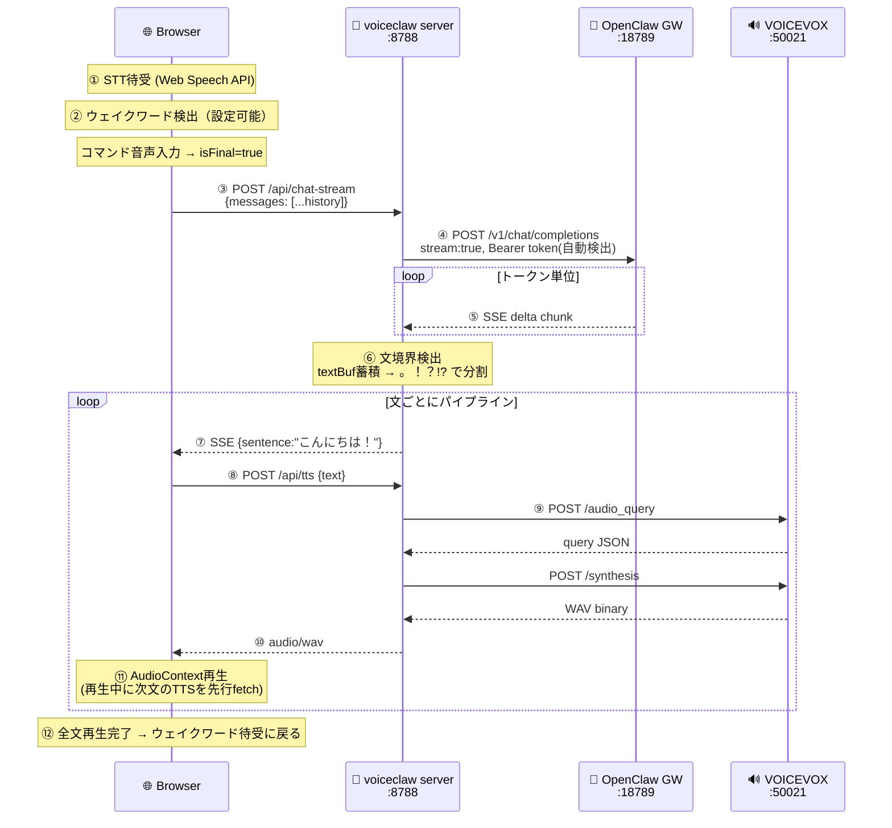

# voiceclaw アーキテクチャ

## シーケンス図: ウェイクワード → 回答再生



## コンポーネント

| コンポーネント | ポート | 役割 |
|---|---|---|
| Browser | - | STT (Web Speech API) + TTS再生 (Web Audio) + UI |
| voiceclaw server | :8788 | リレー + 文境界検出 + VOICEVOX proxy |
| OpenClaw Gateway | :18789 | LLM呼び出し + セッション管理 |
| VOICEVOX | :50021 | 日本語音声合成 |

## 設定の取得フロー

```
起動時:
  環境変数あり？ → 使う
  なければ ~/.openclaw/openclaw.json → gateway port + token 自動検出
  なければデフォルト値

フロントエンド:
  GET /api/config → ウェイクワード, STT言語, speaker ID を取得
```

## API一覧

| Method | Path | Description |
|---|---|---|
| GET | `/health` | ヘルスチェック |
| GET | `/api/config` | クライアント設定（ウェイクワード, STT言語） |
| POST | `/api/chat-stream` | ストリーミングLLM → 文単位SSE |
| POST | `/api/chat` | 非ストリーミングLLM（フォールバック） |
| POST | `/api/tts` | テキスト → VOICEVOX → WAV |

## 秘密情報

**なし。** Gateway tokenは `~/.openclaw/openclaw.json` から自動検出。
