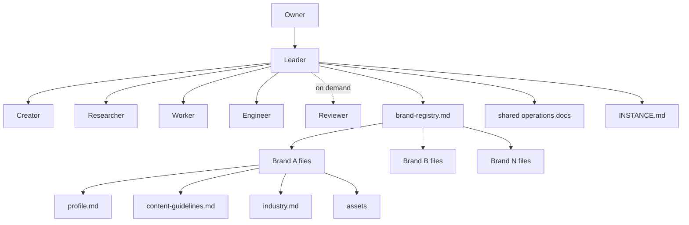
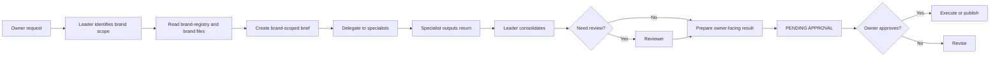
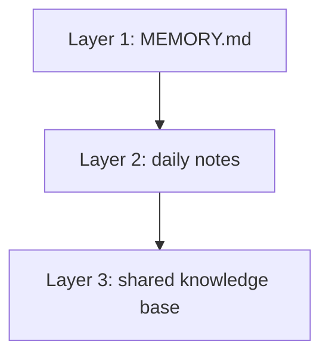
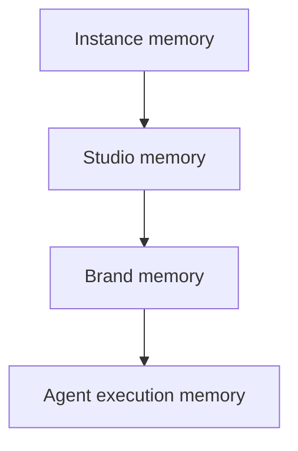

# Multi-Agent Brand Studio

Multi-Agent Brand Studio is an OpenClaw skill for running multiple brands inside one structured AI operating system.

The important part is not just "multi-agent." The important part is that the system can manage multiple brands as separate operating units, each with its own profile, content rules, channel routing, assets, and accumulated knowledge, while one shared studio team does the work around them.

If you only read one sentence, read this:

> Multi-Agent Brand Studio turns OpenClaw into a multi-brand studio with isolated brand context, shared operating memory, specialized agents, and approval-gated execution.

## What This Skill Actually Is

This skill is not only:

- a prompt pack
- a roleplay team
- a content generator

It is a combined system with three layers:

1. A brand management layer
   It keeps multiple brands organized as separate units with their own files, rules, and routing.

2. A multi-agent execution layer
   A Leader orchestrates specialists for research, creation, execution, engineering, and review.

3. A memory and operations layer
   The system stores instance settings, brand knowledge, daily learning, approval rules, channel maps, and reusable operational knowledge.

That combination is why the skill is called Brand Studio. It is meant to behave like a studio that can serve multiple brands, not like a single assistant with a big prompt.

## Why It Is Called Brand Studio

The word "Brand" matters as much as the word "Studio."

This system is designed around the idea that one OpenClaw deployment may need to support:

- one brand today and more brands later
- different voices and content languages per brand
- different channels or topic threads per brand
- separate brand assets and references
- different operating priorities across brands

So the architecture is not just "many agents."

It is:

- one studio
- many brands
- one shared control plane
- isolated brand context for each brand

That is why the main concept is Brand Studio, not just Agent Studio.

## The Real Core: Multi-Brand Management

The strongest idea in this skill is that memory is not only "what an agent remembers."

Memory in this system also means:

- what the studio knows about a brand
- how a brand should sound
- where a brand's approvals should be routed
- what industry context belongs to that brand
- which assets belong to that brand

Each brand becomes a managed unit inside the studio.

### Every brand gets its own operating surface

When a brand is added, the system creates or updates:

- `shared/brands/{brand_id}/profile.md`
- `shared/brands/{brand_id}/content-guidelines.md`
- `shared/domain/{brand_id}-industry.md`
- `assets/{brand_id}/generated/`
- `assets/{brand_id}/received/`
- `shared/brand-registry.md`
- `shared/operations/channel-map.md`
- `shared/operations/posting-schedule.md`

That matters because brand context stops being vague chat context and becomes structured operating data.

### Brand registry is the studio's routing table

`shared/brand-registry.md` is the single source of truth for brands in the system.

It tracks:

- brand ID
- display name
- local name
- domain
- target market
- content language
- channel thread
- status

This means the studio can manage more than one brand without collapsing them into one generic voice.

### Brand lifecycle is part of the system

The bundled `brand-manager` skill is responsible for brand lifecycle operations:

- add
- edit
- archive
- list

When a brand is archived, the system does not blindly delete its files. The registry status changes, but the historical brand files remain available for reference. That is another sign that the system treats brands as managed units with memory, not as disposable prompt variables.

### Brand isolation is a design rule

The Leader's instructions explicitly require brand-scoped briefs. Agents are told to read only the brand files specified in the task brief unless cross-brand scope is explicitly requested.

That gives you:

- cleaner brand separation
- less accidental context bleeding
- better content consistency
- safer routing for approvals and operations

## High-Level Architecture



The diagram above is the key to understanding the skill:

- the Leader is the execution hub
- the brand registry is the brand map
- shared operations files are the studio rules
- each brand has its own memory surface

## How Work Flows Through the Studio

When a request comes in, the system should not ask "which agent should do this?" first.

It should ask:

1. Which brand does this belong to?
2. What brand context should be loaded?
3. Which agents are needed after brand scope is clear?

That sequencing is what makes this a brand system instead of a generic agent cluster.



### What this means in practice

- A skincare brand request and a cafe brand request should not feel like the same system pretending to be different
- Each brief should carry brand identity by file path, not only by natural-language reminder
- The right topic/thread should receive the right brand output
- Cross-brand tasks must be explicit, not accidental

### How brand context reaches the working agents

The brand isolation mechanism is not just a Leader-side convention.

The working agents are instructed to load brand files directly:

- Creator reads `shared/brands/{brand_id}/profile.md`
- Creator reads `shared/brands/{brand_id}/content-guidelines.md`
- Researcher works from the brand files specified by the Leader
- Both agents are told to request clarification if cross-brand scope is needed

So the system is explicitly built to carry brand context into execution, not only into planning.

## Multi-Agent Layer

The studio uses a strict star topology.

The Leader is the only hub. Specialists do not free-form message each other. They report back to the Leader, and the Leader manages dependencies, owner communication, approval state, and routing.

### Agent roles

| Agent | Primary role | Why it exists in the studio |
|-------|--------------|-----------------------------|
| Leader | Orchestration, routing, owner communication, knowledge management | Keeps the whole system coherent |
| Creator | Copy, visuals, platform packaging | Produces brand-facing content packages |
| Researcher | Market and competitor research, evidence gathering | Supplies deeper context and reduces guesswork |
| Worker | File ops, config changes, maintenance | Handles operational execution that the Leader should not do directly |
| Engineer | Code, automation, integrations | Handles technical work and implementation |
| Reviewer | Independent review when needed | Adds a separate quality gate for important outputs |

### Why the Leader matters

The Leader is not just the traffic cop. It is the control layer that:

- resolves brand scope
- decides which brand files matter
- dispatches atomic tasks
- updates shared knowledge
- tracks task state
- owns approval flow
- keeps the owner's experience coherent

Without that role, the system would become a collection of agents with no consistent brand memory or routing discipline.

## Memory Architecture

The README needs one important clarification:

In this skill, memory is not only agent memory.

There are really two memory dimensions working together:

1. Agent memory
   What each agent learns from operating over time

2. Brand memory
   What the studio knows about each brand

That distinction is what the earlier README version under-explained.

## Agent Memory: 3 Layers

Inside the agent layer, the system uses a three-layer model:



### Layer 1: `MEMORY.md`

Curated long-term memory for each agent.

Use it for:

- stable patterns
- important learned preferences
- brand voice observations worth retaining
- recurring technical or operational lessons

### Layer 2: `memory/YYYY-MM-DD.md`

Daily notes for raw activity and recent learnings.

Use it for:

- observations from current work
- short-term discoveries
- task-linked notes
- rework and review outcomes

The agent instructions explicitly tell Creator and Researcher to write brand-tagged notes such as:

- `[brand:your-brand]`
- `[cross-brand]`

That means the daily memory layer is already designed to hold both per-brand and cross-brand learnings.

### Layer 3: `shared/`

The shared knowledge base is the permanent studio reference layer.

This includes:

- instance configuration
- brand registry
- cross-brand guide
- per-brand profiles and rules
- channel map
- posting schedule
- approval workflow
- compliance guidance
- error solutions

This is the part many people miss: for this skill, `shared/` is not just a folder. It is the studio's institutional memory.

## Brand Memory: What The Studio Knows About Each Brand

The most important brand-memory files are:

- `shared/brands/{brand_id}/profile.md`
- `shared/brands/{brand_id}/content-guidelines.md`
- `shared/domain/{brand_id}-industry.md`
- `assets/{brand_id}/generated/`
- `assets/{brand_id}/received/`

Together, those files answer questions like:

- Who is this brand?
- How should it sound?
- Which audience is it speaking to?
- What industry context matters?
- What visual references or owned assets already exist?
- Where should outputs for this brand go?

This is why the memory system is tightly connected to brand management. The brand itself is part of the memory architecture.

## Studio Memory vs Brand Memory vs Agent Memory

A good way to think about the system is:



### Instance memory

Files like `shared/INSTANCE.md` describe owner, timezone, language defaults, bot identity, and mode.

### Studio memory

Files like `shared/brand-registry.md`, `shared/brand-guide.md`, and `shared/operations/*` define how the whole studio works.

### Brand memory

Per-brand profiles, guidelines, industry files, assets, schedules, and channels define what makes one brand different from another.

### Agent execution memory

Per-agent `MEMORY.md` and daily notes capture operating experience, patterns, and lessons learned while working inside that studio.

This four-part mental model is more accurate than thinking only in terms of one generic "memory system."

## Approval and Routing Are Brand-Aware

The skill is also designed so brand work is routed correctly after it is created.

`shared/operations/channel-map.md` and the approval workflow together define:

- where brand work should be delivered
- how approvals are routed
- how operations notifications are separated from brand content
- how topic-based isolation works in Telegram

This is another reason the skill is called Brand Studio. It does not only generate brand content. It also organizes brand delivery.

## What Happens When You Install It

Installing this skill changes your OpenClaw environment in real ways.

### It scaffolds a studio workspace

The scaffold script creates:

- a Leader workspace
- separate workspaces for specialist agents
- per-agent memory directories
- a shared knowledge directory
- brand asset directories
- bundled helper skills

### It patches `openclaw.json`

The config patcher adds:

- agent definitions
- default agent behavior
- agent-to-agent permissions
- session settings
- safe execution paths for local tools
- optional QMD configuration for semantic memory

### It sets up the foundation for brand operations

The onboarding flow then configures:

- instance identity and defaults
- channel mode
- Telegram routing
- the first brand
- brand topics or brand channels

So this is not a passive install. It is a setup flow that turns an OpenClaw instance into a structured operating environment.

## Relevant Directory Shape

At a high level, the repo and installed workspace are built around this shape:

```text
shared/
  INSTANCE.md
  brand-registry.md
  brand-guide.md
  system-guide.md
  compliance-guide.md
  brands/
    _template/
    {brand_id}/
      profile.md
      content-guidelines.md
  domain/
    _template/
    {brand_id}-industry.md
  operations/
    approval-workflow.md
    channel-map.md
    posting-schedule.md
    content-guidelines.md
    communication-signals.md

assets/
  {brand_id}/
    generated/
    received/

workspace/
workspace-creator/
workspace-researcher/
workspace-worker/
workspace-engineer/
workspace-reviewer/
```

That structure is part of the product. It is how the system keeps brands, operations, and agents organized.

## Bundled Helper Skills

The main skill includes helper skills because they are part of the operating model, not side utilities.

### `instance-setup`

Configures instance-level settings such as:

- owner name
- timezone
- communication language
- default content language
- bot identity
- channel mode

### `brand-manager`

Manages the brand lifecycle:

- add a brand
- edit a brand
- archive a brand
- keep registry, assets, industry files, channel map, and schedule aligned

This is one of the clearest proofs that the skill is fundamentally about brand management, not only agent orchestration.

### `qmd-setup`

Enables stronger semantic memory and retrieval if QMD is available.

## What This Skill Is Best At

This skill is strongest when you need:

- one system managing multiple brands
- brand-specific memory and content behavior
- shared operational control across brands
- structured approvals before publishing
- persistent learning over time
- separation between research, creation, execution, and review

It is a strong fit for:

- agencies
- in-house content teams
- founders managing multiple products or brands
- operators who want repeatable brand workflows
- teams that already know ad hoc prompting is no longer enough

## Important Caveats

### It is heavier than a simple skill

This skill creates structure on purpose. If you only want one lightweight assistant prompt, this is too much system.

### Empty brand files mean weak brand behavior

If `profile.md`, content guidelines, and industry files stay empty, the system will still run, but it will act more generic because the brand memory layer is thin.

### Approval is a hard rule

The system is designed around human approval. It is not intended to silently publish external-facing content on its own.

### Multi-brand power requires discipline

The architecture helps prevent context mixing, but only if brand IDs, profiles, channels, and operating docs are kept current.

### Optional capabilities depend on environment

- visual generation depends on Creator's local tooling
- semantic retrieval depends on QMD
- Telegram routing depends on valid bot and topic configuration

## Common Failure Modes

- Brand profiles are too empty, so outputs feel generic
- Channel mapping is incomplete, so approvals route to the wrong place
- Cross-brand work is requested without explicit brand scope
- Local execution paths are not trusted, so Creator or Engineer tools fail
- QMD is unavailable, so memory recall is less powerful than intended

If the system feels wrong after setup, the problem is often not "the agents are bad." It is usually one of these:

- brand memory is incomplete
- routing is incomplete
- instance configuration is incomplete
- the wrong brand scope was used in the brief

## How To Trigger It

After installation, prompts like these should start the setup flow:

- `Set up Multi-Agent Brand Studio`
- `Set up my brand studio team`
- `Help me build a multi-brand social workflow`
- `Set up a brand operations team in OpenClaw`

After setup, the studio is meant to be used through brand-aware requests such as:

- `Add a new brand`
- `Create a Facebook post for brand X`
- `Research competitors for brand Y`
- `Update the profile for brand Z`

## Quick Start

1. Install the skill into OpenClaw
2. Trigger the setup flow
3. Configure instance defaults
4. Add the first brand
5. Fill in the brand profile and brand content guidelines
6. Verify channel routing and approval flow
7. Start operating through the Leader with explicit brand scope

## In One Line

Multi-Agent Brand Studio is a multi-brand management and memory system that uses specialized agents to execute brand work without losing brand isolation.
