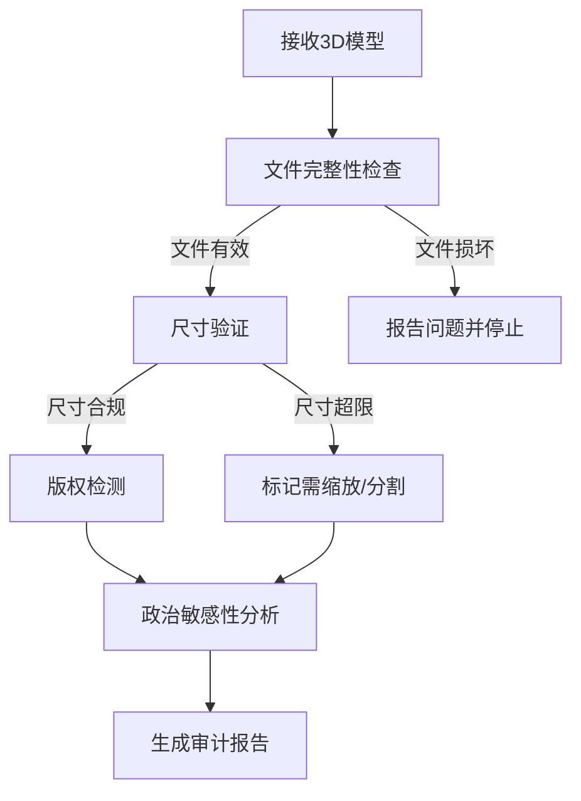

# 3D Guard - 3D模型审计技能

## 概述

本技能用于系统化地审计3D模型文件，确保其在使用前符合版权、内容安全、技术规格等要求。支持常见3D模型格式（STL、OBJ、3MF等），并可通过多模态视觉模型和文本分析进行综合检查。

## 快速开始

**基本审计流程：**
```
1. 文件完整性检查 → 2. 元数据快速分析 → 3. 尺寸验证 → 4. 深度检查（如需要） → 5. 生成审计报告
```

**优化策略：优先元数据分析**
- 元数据（Title、Description、Author等）通常能快速判断合规性
- 如果元数据**明确显示不合规** → 直接得出结论，无需进一步分析
- 如果元数据**模糊不清或可疑** → 才进行图像分析等深度检查
- 这样可以大幅提高审计效率，减少不必要的API调用

## 核心审计任务

### 1. 文件完整性检查

**目标：** 验证3D模型文件的完整性和格式有效性

**检查项：**
- 文件是否能正常解析（不损坏、不截断）
- 文件格式符合标准（STL二进制/ASCII、OBJ、3MF等）
- 几何数据完整性（顶点、面片、法线等）
- 纹理和材质文件是否存在（如OBJ文件引用的纹理）

**工具：**
- 使用 `scripts/validate_3d_model.py` 进行自动验证
- 手动检查文件头部和结构

**常见问题：**
- 文件损坏或截断 → 需要重新下载或修复
- 缺少关联文件（纹理、材质） → 需要获取完整文件包
- 格式不规范 → 可能需要转换或修复

### 2. 尺寸验证

**目标：** 确保模型尺寸适合目标3D打印机

**检查流程：**
1. 解析模型边界框（bounding box）
2. 计算X、Y、Z三个维度的最大尺寸
3. 与目标打印机规格对比

**常见打印机规格参考：**

| 打印机类型 | 构建体积 (mm) | 备注 |
|-----------|--------------|------|
| 桌面级FDM | 200×200×200 | 标准入门级 |
| 桌面级SLA | 120×68×160 | 小体积高精度 |
| 中级FDM | 300×300×400 | 中等尺寸 |
| 工业级 | 500×500×500+ | 大尺寸打印 |

**超出范围处理：**
- 稍微超出（<10%）→ 可考虑缩放或分割
- 严重超出（>50%）→ 需要大尺寸打印机或完全重新设计
- 可旋转打印 → 检查长边是否能放入构建平台

### 3. 版权侵权检测

**目标：** 识别模型是否包含可能侵犯版权的内容

**检测范围：**
- **知名IP角色：** 迪士尼、漫威、星球大战、任天堂、宝可梦等
- **潮玩品牌IP：** POP MART（泡泡玛特）- Molly、Dimoo、Skullpanda、Labubu等
- **品牌标志：** Nike、Adidas、Apple、Tesla等知名品牌
- **受保护的设计：** 商业产品、艺术作品、游戏道具等

**检测方法（优先级从高到低）：**

**第一优先级：元数据快速分析** ⚡️
```bash
# 检查模型元数据中的文本信息
# Title、Description、Author、License等字段
```

**检查内容：**
- **Title字段：** 是否直接包含IP名称（如"米老鼠"、"马里奥"）
- **Description字段：** 是否明确描述版权内容
- **License字段：** 是否有明确的授权声明
- **Author信息：** 是否为原创作者

**判断规则：**
- ✅ **元数据明确显示IP侵权** → 直接判定高风险，无需进一步分析
- ❓ **元数据模糊或可疑** → 进行第二级检查
- ✅ **元数据显示原创** → 进入风险等级评估
- 🔴 **元数据不完整** → 如果Title、Description、License三项全部为空，直接判定为不合规

**合规性验证（重要）：**
```
必须满足的条件：
✅ Title字段不为空
✅ Description字段不为空  
✅ License字段不为空

如果不满足以上条件：
🔴 直接判定为“元数据不完整-不合规”
停止进一步分析，拒绝使用
```

---

**第二优先级：文件名和路径分析** 🔍
- 文件名是否包含版权名称（如 "mario", "mickey", "marvel", "molly", "dimoo", "popmart"）
- 文件路径是否暗示版权内容（如包含IP名称的文件夹）
- 是否包含潮玩品牌关键词（"molly", "labubu", "skullpanda", "pucky", "popmart"）

---

**第三优先级：文档和描述检查** 📄
- 模型是否附带说明文档
- 是否有授权声明或CC许可证信息
- 描述中是否引用版权内容

---

**第四优先级：视觉分析（多模态模型）** 🖼️ （仅在需要时）
```bash
# 对模型渲染图或截图进行视觉分析
# 仅在元数据模糊不清时使用
```

**使用场景：**
- 元数据过于通用（如"卡通角色"、"有趣的设计"）
- 元数据与文件名不一致
- 需要验证元数据的真实性
- 可疑的原创声明

**重点关注的视觉特征：**
- 特定的角色造型和标志性特征
- 品牌logo、标志、字体
- 商业产品的独特设计元素

**潮玩品牌识别特征（以POP MART为例）：**
- **Q版比例：** 头大身小，3:1到4:1的比例
- **眼睛设计：** 特别大的眼睛（通常占面部1/2-1/3）
- **色彩风格：** 梦幻、马卡龙、糖果色系
- **细节特征：** 特定的发型、服装花纹、配饰
- **盲盒造型：** 标志性的站立姿势，可爱表情

**风险等级评估：**
- **高风险：** 明确是知名IP的复制品（如完整的任天堂角色）
- **中风险：** 灵感来源于版权作品但有一定原创性
- **低风险：** 通用设计、原创作品或明显在合理使用范围内

### 4. 政治敏感性分析

**目标：** 识别模型是否包含政治敏感、暴力或不当内容

**检查类别：**
- 政治人物、符号、标志
- 政治标语、口号
- 极端主义或仇恨相关符号
- 武器、军事装备（特别是现实主义武器）
- 不当、暴力或恐怖主题

**检测方法（优先级从高到低）：**

**第一优先级：元数据快速分析** ⚡️
```bash
# 检查模型元数据中的文本信息
# Title、Description、Author、DesignRegion等字段
```

**检查内容：**
- **Title字段：** 是否直接包含政治人物名称
- **Description字段：** 是否明确描述政治相关内容
- **DesignRegion/Author：** 判断来源和背景

**判断规则：**
- ✅ **元数据明确显示政治敏感内容** → 直接判定高风险，无需进一步分析
- ❓ **元数据模糊不清** → 进行第二级检查
- ✅ **元数据显示非政治内容** → 进入风险评估

---

**第二优先级：文件名和路径分析** 🔍
- 文件名是否包含政治人物名称或敏感词
- 文件路径是否暗示敏感内容

---

**第三优先级：视觉分析** 🖼️ （仅在需要时）
```bash
# 对模型渲染图或截图进行视觉分析
# 仅在元数据模糊不清时使用
```

**使用场景：**
- 元数据过于通用（如"人物头像"、"雕像"）
- 元数据与文件名不一致
- 需要验证元数据的真实性

---

**第四优先级：上下文评估** 📊
- 结合模型用途判断合理性
- 考虑设计时间和背景
- 评估作者和来源可信度

**合理例外：**
- 教育用途的通用历史模型
- 艺术表达（需谨慎评估）
- 个人非政治用途

### 5. 审计报告生成

**报告结构（优化版）：**
```markdown
# 3D模型审计报告

## 基本信息
- 模型文件：[文件名]
- 文件格式：[STL/OBJ/3MF]
- 文件大小：[大小]
- 审计时间：[时间戳]

## 审计结果

### 1. 文件完整性 ✅/❌
[结果详情]

### 2. 元数据分析 ⚡️ 快速检查

**首先验证元数据合规性：**
- **Title状态：** [存在/缺失]
- **Description状态：** [存在/缺失]
- **License状态：** [存在/缺失]
- **合规性：** [合规/不合规-元数据缺失]

**如果不合规（元数据缺失）：**
- **风险等级：** 🔴 高风险
- **结论：** 直接拒绝使用，无需进一步分析
- **理由：** 缺少必须的元数据字段
- **建议：** 要求模型提供者补充完整的元数据，或拒绝使用

**如果合规：继续分析**
- **Title：** [元数据内容]
- **Description：** [元数据内容]
- **License：** [许可证信息]
- **判断：** [明确/模糊/原创]

### 3. 尺寸验证 ✅/❌
- 模型尺寸：[X×Y×Z mm]
- 目标打印机：[打印机型号]
- 构建体积：[体积]
- 结论：[是否符合]

### 4. 元数据合规性检查 🔴
- **Title状态：** [存在/缺失]
- **Description状态：** [存在/缺失]
- **License状态：** [存在/缺失]
- **合规性：** [合规/不合规-元数据缺失]

**如果不合规（元数据缺失）：**
- **风险等级：** 🔴 高风险
- **理由：** 缺少必须的元数据（Title、Description、License）
- **建议：** 要求模型提供者补充完整的元数据，或拒绝使用

### 5. 版权检测 ⚠️
- 风险等级：[高/中/低]
- 检测到的内容：[具体描述]
- 检测依据：[元数据/视觉分析/两者结合]
- 建议：[使用建议]

### 6. 政治敏感性 ✅/⚠️
- 检测结果：[内容描述]
- 风险评估：[低/中/高]
- 检测依据：[元数据/视觉分析/两者结合]

## 总体建议
[综合建议和使用限制]
```

## 工作流程

### 完整审计流程



### 条件决策树

**何时需要进行完整审计？**
- 准备公开发布3D模型
- 计划商业化使用模型
- 模型来源不明或不可信
- 组织内部有合规要求

**何时可以简化审计？**
- 自己创建的原创模型
- 已知可信来源的模型
- 个人非商业使用

## 使用场景示例

### 场景1：元数据不合规（新增）
```
用户："检查这个3D模型的合规性"
→ 运行元数据验证：validate_metadata.py
→ 发现：缺少Title、Description、License
→ 结论：元数据不合规，直接拒绝
→ 建议：要求补充元数据或拒绝使用
→ 无需进行后续的版权/政治敏感性分析
```

### 场景2：社区分享前的审计
```
用户："我刚设计了一个3D模型，想在社区分享，帮我检查一下"
→ 运行完整审计流程
→ 首先验证元数据合规性
→ 通过后检查版权和政治敏感性
→ 生成详细报告供用户参考
```

### 场景3：生产前的尺寸验证
```
用户："这个STL文件能用我的Ender 3打印吗？"
→ 简化审计：重点检查尺寸
→ 与220×220×250mm构建体积对比
→ 直接给出是否可打印的结论
```

### 场景4：版权风险评估
```
用户："这个模型看起来有点像任天堂的角色，能用吗？"
→ 优先检查元数据（Title、Description）
→ 如果元数据模糊 → 使用多模态模型分析视觉相似度
→ 提供风险等级和法律建议
```

### 场景5：元数据明确的情况
```
用户："检查这个模型的合规性"
→ 发现元数据 Title: "米老鼠米奇"
→ 结论：明确版权侵权，无需进一步分析
→ 直接给出风险评级和建议
```

### 场景6：元数据模糊的情况
```
用户："这个卡通模型有问题吗？"
→ 元数据 Title: "有趣的卡通角色"
→ 元数据不够明确，需要视觉分析
→ 使用多模态模型判断是否是知名IP
→ 综合评估风险
```

## 参考资源

### scripts/

**validate_metadata.py** - 元数据合规性验证脚本 ⭐ 新增
- 验证3MF文件的元数据完整性
- 检查必须字段：Title、Description、License
- 提取所有可用的元数据字段

使用方法：
```bash
python3 scripts/validate_metadata.py /path/to/model.3mf
```

输出：
```json
{
  "format": "3MF",
  "metadata": {
    "title": "模型名称",
    "description": "模型描述",
    "license": "许可证类型",
    "author": "作者"
  },
  "compliance": {
    "is_compliant": true/false,
    "required_fields": {
      "title": {"exists": true/false, "value": "..."},
      "description": {"exists": true/false, "value": "..."},
      "license": {"exists": true/false, "value": "..."}
    },
    "missing_fields": ["Title", "Description", "License"],
    "reason": "缺少必须的元数据字段"
  }
}
```

**合规性规则：**
- ✅ **合规：** Title、Description、License三个字段全部存在且非空
- 🔴 **不合规：** 任意一个或多个字段缺失或为空

---

**validate_3d_model.py** - 3D模型验证脚本
- 自动验证文件完整性
- 解析模型尺寸
- 提取基本元数据（STL/OBJ）

使用方法：
```bash
python3 scripts/validate_3d_model.py /path/to/model.stl
```

输出：
```json
{
  "valid": true,
  "format": "STL",
  "size": {"x": 150.5, "y": 120.3, "z": 80.2},
  "vertices": 12580,
  "faces": 25160
}
```

### references/

**printer-specs.md** - 常见3D打印机规格参考
- 主流打印机构建体积
- 技术参数对比
- 适用场景说明

**copyright-guidelines.md** - 版权检查指南
- 主要IP列表和特征
- 检查要点和方法
- 合理使用原则

**sensitive-content.md** - 敏感内容识别参考
- 政治敏感内容分类
- 常见符号和标志
- 评估标准

## 注意事项

1. **法律免责声明：** 本技能提供的审计仅供参考，不能替代专业法律意见
2. **元数据优先原则：** 优先使用元数据进行快速判断，节省资源和时间
3. **误判可能性：** AI检测可能存在误判，需要人工复核高风险项目
4. **模型隐私：** 审计过程中不要泄露用户模型文件或敏感信息
5. **持续更新：** 版权和敏感性标准会变化，需要定期更新参考数据

## 优化说明（重要）

**为什么优先元数据分析？**
- ✅ **速度快**：文本分析比图像分析快得多
- ✅ **准确性高**：作者在元数据中通常会诚实地标注内容
- ✅ **成本低**：减少不必要的API调用和计算资源
- ✅ **效率高**：对于明确违规的模型，可以立即得出结论

**元数据合规性验证（新增）：**
- 🔴 **强制要求**：3MF文件必须包含Title、Description、License三个字段
- 🚫 **不合规即拒绝**：缺少任意一个字段，直接判定为不合规
- ✅ **快速筛选**：可以在第一时间淘汰不合格的模型
- ⚡ **提升效率**：避免对不合格模型进行不必要的深度分析

**什么时候跳过元数据检查？**
- STL/OBJ格式（不支持内嵌元数据）
- 元数据字段缺失或损坏（已判定为不合规）
- 需要验证元数据的真实性（怀疑被修改）

**元数据不可靠的情况：**
- 恶意修改元数据来隐藏真实内容
- 下载的模型元数据被篡改
- 不完整的元数据（已判定为不合规）

## 最佳实践

1. **先元数据后深度检查：** 优先使用元数据分析快速判断，只在必要时进行深度检查
2. **明确说明检测依据：** 在报告中清楚说明是基于元数据还是视觉分析
3. **保留审计记录：** 对重要模型保留审计报告和时间戳
4. **上下文很重要：** 结合模型用途和场景评估风险
5. **透明沟通：** 向用户清楚说明审计结果的不确定性
6. **效率优先：** 当元数据已明确时，不要进行不必要的图像分析
