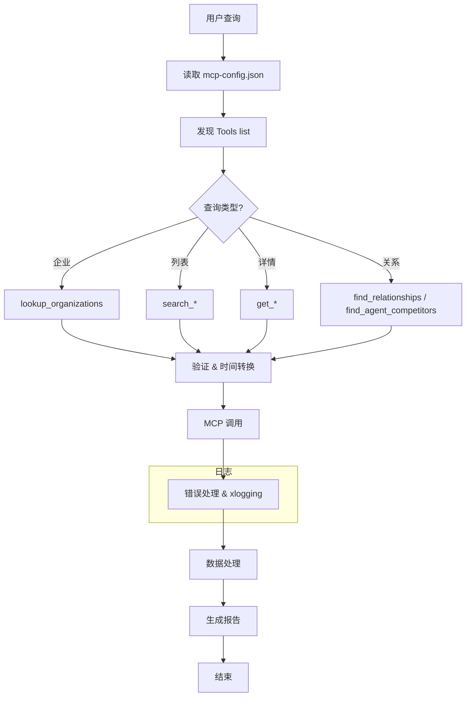
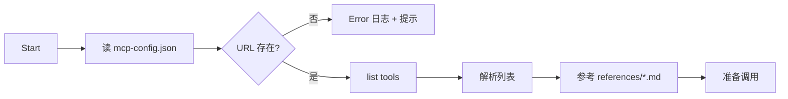
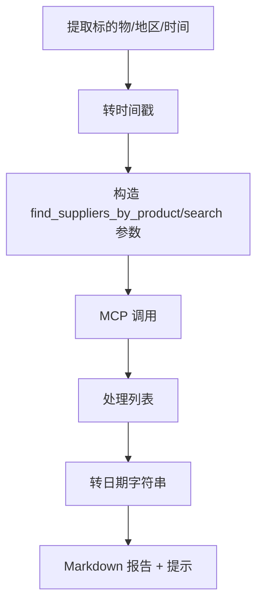
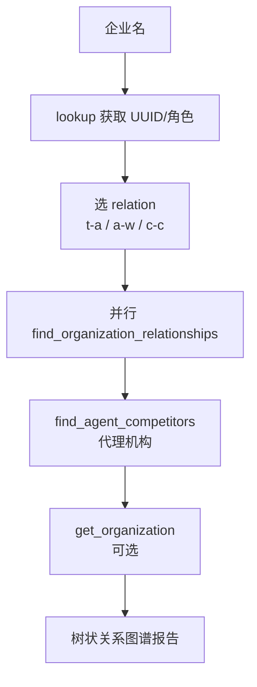
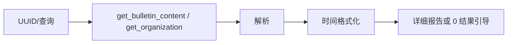

# Golang 项目代码梳理与 API 运行流程分析 SKILL

## 一、执行模式（强约束）

本 SKILL 采用"流程驱动执行模式"，必须遵守：

1. 所有流程图必须与实际代码逻辑保持一致，禁止编造
2. MCP 服务调用必须参考 `references/tools/` 中的接口文档
3. 时间处理必须使用标准转换方式（毫秒时间戳 <-> YYYY-MM-DD）
4. 禁止跳过配置读取直接执行 MCP 调用

---

## 二、项目整体概述

### 2.1 适用场景

| 场景 | 说明 |
|------|------|
| MCP 客户端开发 | HTTP 调用 MCP 服务 |
| 后端服务开发 | 如 eagleeye 等后端服务 |
| 数据处理 | 招标数据清洗、转换 |
| 定时任务 | 周期性数据采集、同步 |

### 2.2 核心概念

| 概念 | 说明 |
|------|------|
| **MCP 服务** | 招标投标助手 MCP 服务 (mcpId: 9741)，必须先读 `mcp-config.json` |
| **核心工具** | lookup_organizations、search_bulletins、find_organization_relationships、find_suppliers_by_product、get_bulletin_content、find_agent_competitors |
| **时间处理** | 毫秒时间戳 <-> YYYY-MM-DD（Golang: `time.Parse` + `UnixMilli`） |

---

## 三、API 运行流程分析

### 3.1 整体流程图



### 3.2 配置读取与工具发现流程



**Golang 实现要点**：

```go
// 读取配置
config, err := os.ReadFile("mcp-config.json")
if err != nil {
    xlogging.D().Error(fmt.Sprintf("read mcp-config.json failed: %+v", err))
    return err
}

var mcpConfig map[string]struct {
    URL string `json:"url"`
}
if err := json.Unmarshal(config, &mcpConfig); err != nil {
    xlogging.D().Error(fmt.Sprintf("parse mcp-config.json failed: %+v", err))
    return err
}

serviceURL := mcpConfig["BID_ASSISTANT_URL"].URL
if serviceURL == "" {
    xlogging.D().Error("BID_ASSISTANT_URL not configured")
    return fmt.Errorf("service URL not configured")
}
```

### 3.3 企业查询流程 (lookup_organizations)

```mermaid
flowchart TD
    A[企业关键词] --> B[params: {"text": "..."}]
    B --> C[调用 lookup_organizations]
    C --> D{结果?}
    D -->|0| E[Warn + 提示修改]
    D -->|1| F[使用 UUID]
    D -->|>1| G[列出供用户选择]
    F --> H[继续业务]
```

**Golang 代码示例**：

```go
func lookupOrganizations(ctx context.Context, keyword string) (string, error) {
    params := map[string]string{"text": keyword}
    xlogging.D().Debug(fmt.Sprintf("lookup_organizations params: %+v", params))

    resp, err := callMCP(ctx, "lookup_organizations", params)
    if err != nil {
        xlogging.D().Error(fmt.Sprintf("lookup_organizations failed: %+v", err))
        return "", err
    }

    // 解析结果
    var result struct {
        Organizations []struct {
            UUID string `json:"uuid"`
            Name string `json:"name"`
        } `json:"organizations"`
    }
    if err := json.Unmarshal(resp, &result); err != nil {
        xlogging.D().Error(fmt.Sprintf("parse lookup result failed: %+v", err))
        return "", err
    }

    // 处理不同结果数量
    switch len(result.Organizations) {
    case 0:
        xlogging.D().Warn(fmt.Sprintf("no organization found for keyword: %s", keyword))
        return "", fmt.Errorf("no organization found")
    case 1:
        return result.Organizations[0].UUID, nil
    default:
        // 返回列表供选择
        return "", fmt.Errorf("multiple organizations found: %v", result.Organizations)
    }
}
```

### 3.4 供应商寻源流程



**时间转换工具函数**：

```go
// 日期字符串转毫秒时间戳
func dateToTimestamp(dateStr string) (int64, error) {
    layouts := []string{
        "2006-01-02",
        "2006-01-02 15:04:05",
    }

    for _, layout := range layouts {
        if t, err := time.Parse(layout, dateStr); err == nil {
            return t.UnixMilli(), nil
        }
    }
    return 0, fmt.Errorf("unsupported date format: %s", dateStr)
}

// 毫秒时间戳转日期字符串
func timestampToDate(ts int64) string {
    return time.UnixMilli(ts).Format("2006-01-02")
}

// 使用示例
startTime, _ := dateToTimestamp("2024-01-01")
endTime, _ := dateToTimestamp("2024-12-31")
```

### 3.5 关系网络分析流程



**并发查询实现**：

```go
func analyzeRelationships(ctx context.Context, uuid string, role string) (*RelationshipResult, error) {
    var g errgroup.Group
    result := &RelationshipResult{}

    // 定义要查询的关系类型
    relations := []string{"t-a", "t-w", "c-c"}

    for _, rel := range relations {
        r := rel // 闭包捕获
        g.Go(func() error {
            params := map[string]string{
                "uuid":     uuid,
                "relation": r,
            }
            resp, err := callMCP(ctx, "find_organization_relationships", params)
            if err != nil {
                xlogging.D().Error(fmt.Sprintf("query relation %s failed: %+v", r, err))
                return err
            }
            // 存储结果到 result
            return nil
        })
    }

    if err := g.Wait(); err != nil {
        return nil, err
    }

    return result, nil
}
```

### 3.6 详情查询流程



---

## 四、Golang 通用模式

### 4.1 MCP 客户端封装

```go
type MCPClient struct {
    baseURL string
    client  *http.Client
}

func NewMCPClient(baseURL string) *MCPClient {
    return &MCPClient{
        baseURL: baseURL,
        client:  &http.Client{Timeout: 30 * time.Second},
    }
}

func (c *MCPClient) Call(ctx context.Context, toolName string, params interface{}) ([]byte, error) {
    start := time.Now()
    xlogging.D().Debug(fmt.Sprintf("mcp call start: %s", toolName))

    reqBody, _ := json.Marshal(map[string]interface{}{
        "tool":   toolName,
        "params": params,
    })

    req, err := http.NewRequestWithContext(ctx, "POST", c.baseURL, bytes.NewReader(reqBody))
    if err != nil {
        xlogging.D().Error(fmt.Sprintf("create request failed: %+v", err))
        return nil, err
    }
    req.Header.Set("Content-Type", "application/json")

    resp, err := c.client.Do(req)
    if err != nil {
        xlogging.D().Error(fmt.Sprintf("mcp request failed: %+v", err))
        return nil, err
    }
    defer resp.Body.Close()

    body, _ := io.ReadAll(resp.Body)
    xlogging.D().Info(fmt.Sprintf("mcp call %s completed, cost: %v", toolName, time.Since(start)))

    if resp.StatusCode != http.StatusOK {
        xlogging.D().Error(fmt.Sprintf("mcp returned non-200: %d, body: %s", resp.StatusCode, body))
        return nil, fmt.Errorf("unexpected status: %d", resp.StatusCode)
    }

    return body, nil
}
```

### 4.2 错误处理模式

```go
// 包装错误 + 日志
type MCPError struct {
    Tool   string
    Params interface{}
    Cause  error
}

func (e *MCPError) Error() string {
    return fmt.Sprintf("mcp call %s failed: %v", e.Tool, e.Cause)
}

func (e *MCPError) Unwrap() error {
    return e.Cause
}

// 使用
if err != nil {
    wrappedErr := &MCPError{Tool: toolName, Params: params, Cause: err}
    xlogging.D().Error(fmt.Sprintf("mcp error: %+v", wrappedErr))
    return nil, wrappedErr
}
```

### 4.3 重试机制

```go
func callWithRetry(ctx context.Context, client *MCPClient, toolName string, params interface{}, maxRetries int) ([]byte, error) {
    var lastErr error

    for i := 0; i <= maxRetries; i++ {
        if i > 0 {
            xlogging.D().Warn(fmt.Sprintf("retrying %s, attempt %d/%d", toolName, i, maxRetries))
            time.Sleep(time.Duration(i) * time.Second) // 指数退避
        }

        resp, err := client.Call(ctx, toolName, params)
        if err == nil {
            return resp, nil
        }

        lastErr = err
        // 非可重试错误直接返回
        if !isRetryableError(err) {
            return nil, err
        }
    }

    return nil, fmt.Errorf("max retries exceeded: %w", lastErr)
}

func isRetryableError(err error) bool {
    // 网络超时、5xx 错误等可重试
    var netErr net.Error
    if errors.As(err, &netErr) && netErr.Timeout() {
        return true
    }
    return false
}
```

---

## 五、参考文档索引

| 文档 | 说明 |
|------|------|
| `SKILL-logging.md` | Golang 日志规范 |
| `references/tools/*.md` | MCP 工具接口文档 |
| `mcp-config.json` | MCP 服务配置 |

---

## 六、严格禁止（NEVER DO）

| 禁止项 | 说明 |
|--------|------|
| 跳过配置读取 | 必须先读取 `mcp-config.json` |
| 编造数据 | 所有流程必须与 references 文档一致 |
| 流程与 references 不符 | 工具参数、响应处理必须参考接口文档 |
| 忽略错误处理 | 所有 MCP 调用必须处理错误并记录日志 |
| 硬编码 URL | 必须从配置文件读取服务地址 |

---

**更新记录**：
- 2026/04/08 优化为标准 SKILL 格式（添加执行模式、规范流程图、完善代码示例、添加禁止事项）
