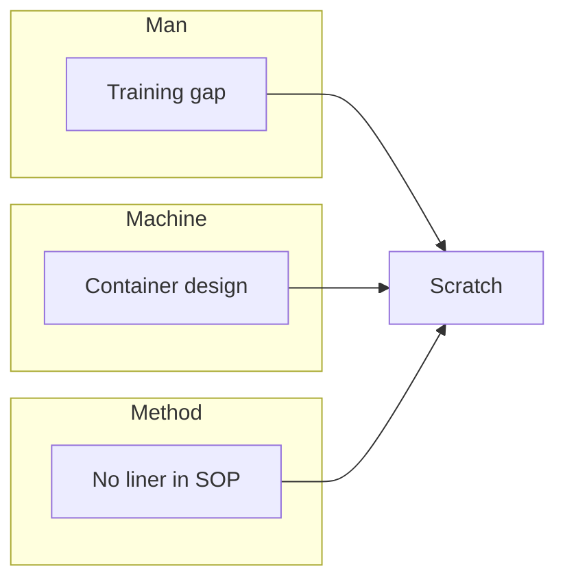

# 8D Methodology Reference

This document supplements the "Customer Complaint 8D Report" skill with 8D origins, common practices per discipline, and typical tools.

---

## 8D origins and when to use it

- **8D** (Eight Disciplines) originated from problem-solving processes at Ford and other automakers; it is widely used in quality, manufacturing, and supply chain for **customer complaints and defect response**.
- Use when: customer complaints, repeat defects, major quality deviations, or when systematic root cause and recurrence prevention are required.
- Goal: **resolve the issue once, eliminate root cause, and prevent recurrence through the system**—not just firefighting.

---

## D1–D8 at a glance

| D | English | Core output |
|---|---------|-------------|
| D1 | Team | Cross-functional team, roles, plan |
| D2 | Problem | 5W2H, problem statement |
| D3 | Interim containment | Quarantine, inspection, stop, recall |
| D4 | Root cause | Root cause conclusion, verification evidence |
| D5 | Permanent CA | Action list, verification result |
| D6 | Implement & validate | Document updates, scope, effectiveness |
| D7 | Prevent recurrence | Process/system improvement, horizontal deployment |
| D8 | Congratulate & close | Closure, filing, customer loop closed |

---

## Common analysis tools (D2/D4)

- **5W2H**: What, Where, When, Who, Why, How many, How did we know—for D2 problem definition.
- **5-Why**: Ask "why" repeatedly until you reach a controllable/verifiable end cause; avoid stopping at symptoms.
- **Fishbone (Ishikawa)**: List potential causes by category (man, machine, material, method, environment, etc.), then narrow and verify.
- **FMEA**: Failure mode and effects analysis for design/process risk and action priority.
- **Pareto / stratification**: Stratify defect data by batch, machine, shift, etc. to narrow the root cause scope.

---

## Charts and diagrams (where to use)

| Discipline | Suggested chart / diagram | Purpose |
|------------|---------------------------|---------|
| D2 | Defect location sketch, simple timeline | Clarify where and when the defect occurred. |
| D3 | Containment flow (block or flowchart) | Show quarantine, sort, hold, recall flow. |
| D4 | **5-Why tree** (each “why” → next level), **fishbone** (categories → causes), **Pareto** or bar chart (defects by category/batch) | Support root cause narrative; Pareto helps prioritize. |
| D5 | Before/after comparison chart, trial run summary table | Show verification data. |
| D6 | Cpk or trend chart after implementation | Prove process stability and effectiveness. |
| D7 | Process change summary (before/after or swimlane) | Show system/process improvement. |

Generate text or Mermaid diagrams in the report when the user provides steps or data; otherwise use placeholders and ask the user to attach the diagram file.

**Example – 5-Why as text (easy to generate in report)**:
```
Why: Defect occurred → Parts scratched.
Why: Parts contacted container edges after blanking.
Why: Container had no liner.
Why: Process did not require liner for this part.
Why: Design/process review did not include handling.
→ Root cause: No liner requirement in process; review gap.
```

**Example – Mermaid fishbone (if supported)**:

Replace with actual categories and causes from the user.

---

## Attachments: images, video, documents

**Images / video** (evidence and verification):

- **D2**: Defect photos, limit sample, customer-supplied evidence. Format: JPG/PNG; short clips (e.g. under 2 min) for video.
- **D4**: Reproduction test setup or result, failure mode close-up. Optional short video of the test.
- **D5**: Verification photos (trial run, measurement, OK parts); optional video of verification.
- **D6**: Updated work area, gauge, or process step. Optional.
- **D7**: Training in progress. Optional.
- **D8**: Team or customer sign-off. Optional.

**Documents** (specs, procedures, records):

- **D2**: Spec sheet, drawing, or limit sample document (ref: doc no., rev).
- **D4**: Process doc or FMEA excerpt showing “before” state. Optional.
- **D5**: Trial report, test protocol, customer verification note.
- **D6**: Revised SOP/spec/drawing (cover or key page with rev and date), approval or change record.
- **D7**: Training record, lesson learned doc ref, FMEA update ref.
- **D8**: Customer closure confirmation (email or signed form), distribution list.

In Markdown reports use placeholders like `[Attach: defect photo]`; when exporting to Word or uploading to a report system, the user attaches the actual files in the right section.

---

## Root cause statement rules

- The root cause should be **verifiable** (provable by test or data) and **controllable** (the organization can eliminate it with actions).
- Avoid vague wording (e.g. "poor management"); be specific (which process, which control).
- Recommended form: **"Due to [specific cause], which resulted in [symptom]."** Include how it was verified.

---

## Interim vs permanent actions

- **D3 interim**: Quick containment to protect the customer and in-transit product; may not change the process.
- **D5/D6 permanent**: Address root cause through process/spec/design/supplier changes, verify effectiveness, and document.
- After permanent actions are in place, interim measures can be phased out per defined criteria and records.

---

## Horizontal deployment (D7)

- Do similar products, processes, suppliers, or design platforms have the same risk?
- Incorporate this case’s actions and lessons into FMEA, control plans, training, and design/process standards so that "only one point is fixed" does not happen.

---

## Multi-customer formats

Suppliers serving multiple customers often face different 8D/CAR formats per customer (different section titles, table columns, or extra fields like RMA number or cost of quality).

**Ways to handle it**:

1. **Ask at the start**: "Which customer or format should we use?" If the user names a customer, the skill checks for a matching format file under `formats/` (e.g. `formats/customer-a.md`).
2. **Stored format files**: In the skill folder, `formats/` can contain one file per customer. Each file lists the section titles (and optionally table headers) in the order required. The skill then generates the report with that structure while filling the same D1–D8 content. See `formats/README.md` for how to add a format.
3. **User-provided template**: If the user pastes or attaches their customer’s template (section list or sample document), the skill parses the headings and order and maps D1–D8 content into that structure. Extra sections get placeholders like `[To be filled]`.
4. **Mapping rule**: Only the **layout** (section names, order, table columns) changes; the **content** (team, problem, containment, root cause, permanent actions, implementation, recurrence prevention, closure) stays aligned with 8D logic.

---

*This reference is used together with SKILL.md; skill execution follows the template and workflow in SKILL.md.*
