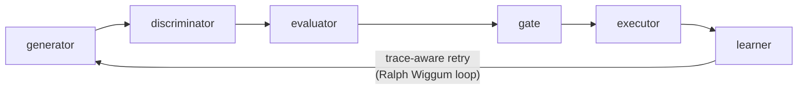

# Auto-Improvement Orchestrator

Closed-loop pipeline that evaluates, improves, and continuously optimizes AI agent skills — so you never ship a SKILL.md that looks right but performs wrong.

[](https://github.com/lanyasheng/auto-improvement-orchestrator-skill/actions)
[](LICENSE)
[](pyproject.toml)

**15 skills | 8,000+ lines Python | 409 tests | pyyaml + pytest only**



## Table of Contents

- [Quick Start](#quick-start)
- [The Problem](#the-problem)
- [Architecture](#architecture)
- [Pipeline Stages](#pipeline-stages)
- [Experiment Results](#experiment-results)
- [Design Decisions](#design-decisions)
- [Project Structure](#project-structure)
- [Known Limitations](#known-limitations)
- [References](#references)
- [License](#license)

---

## Quick Start

```bash
git clone https://github.com/lanyasheng/auto-improvement-orchestrator-skill.git && cd auto-improvement-orchestrator-skill && pip install pyyaml pytest
```

### Score a skill (read-only, no changes)

```bash
python3 skills/improvement-learner/scripts/self_improve.py \
  --skill-path /path/to/your/skill \
  --max-iterations 1
```

```json
{
  "final_scores": {
    "accuracy": 0.83, "coverage": 0.80, "reliability": 1.00,
    "efficiency": 0.87, "security": 1.00, "trigger_quality": 0.60,
    "leakage": 1.00, "knowledge_density": 0.83
  }
}
```

### Auto-improve a skill (5 iterations, Pareto-safe)

```bash
python3 skills/improvement-learner/scripts/self_improve.py \
  --skill-path /path/to/your/skill \
  --max-iterations 5 \
  --memory-dir ./state/memory \
  --state-root ./state
```

### Run full pipeline

```bash
python3 skills/improvement-orchestrator/scripts/orchestrate.py \
  --target /path/to/skill \
  --state-root ./state \
  --max-retries 3
```

### Run task suite (execution effectiveness)

```bash
python3 skills/improvement-evaluator/scripts/evaluate.py \
  --task-suite /path/to/task_suite.yaml \
  --state-root ./state/eval \
  --standalone --mock  # remove --mock for real claude -p
```

### Extract user feedback from session logs

```bash
python3 skills/session-feedback-analyzer/scripts/analyze.py \
  --session-dir ~/.claude/projects/ \
  --output feedback-store/feedback.jsonl
```

---

## The Problem

AI coding agents increasingly rely on SKILL.md files — structured instructions that guide agent behavior. A mature project might have 30+ skills. The problem:

**There is no way to know if a skill change actually makes the agent work better.**

Typical workflow: engineer edits SKILL.md → subjectively judges "looks better" → ships it. Maybe it helped, maybe it regressed something else.

Existing tools check document *structure* (has frontmatter? has "When to Use"?) but not *execution effectiveness* (does the agent produce correct output?). You can have a SKILL.md that scores 99% on structural quality and still fails on real tasks.

This project solves three problems:

1. **Measurement** — How good is a skill, really? (Not just structurally — does it actually work?)
2. **Improvement** — Given measurement, can we automatically improve the weakest dimensions?
3. **Continuous optimization** — Can we run this overnight like Karpathy's autoresearch?

---

## Architecture

15 skills + 3 evaluation signals compose into a closed-loop pipeline:

```
                        +-----------+
                        | generator |  (1) Propose improvements
                        +-----+-----+
                              |
                              v
                     +---------------+
                     | discriminator |  (2) Multi-reviewer scoring
                     +-------+-------+
                              |
                              v
                      +-----------+
                      | evaluator |  (3) Run real tasks, measure pass rate
                      +-----+-----+
                              |
                              v
                        +------+
                        | gate |  (4) 7-layer quality gate
                        +--+---+
                              |
                              v
                      +----------+
                      | executor |  (5) Apply with backup + rollback
                      +----+-----+
                              |
                              v
                      +---------+
                      | learner |  (6) Karpathy self-improvement loop
                      +---------+

     +--------------------+         +------------------+
     | autoloop-controller|         | benchmark-store  |
     | (continuous loop)  |         | (Pareto front,   |
     |  - plateau detect  |         |  frozen tests,   |
     |  - cost cap        |         |  quality tiers)  |
     +--------------------+         +------------------+

     +------------------------+
     | session-feedback-      |  Parse ~/.claude/projects/*.jsonl
     | analyzer               |  Detect corrections/acceptances
     |  -> feedback.jsonl     |  Feed back into generator
     +------------------------+
```

Three evaluation signals:
- **Learner** — structural lint (~$0.5/eval)
- **Evaluator** — execution via `claude -p` with task suites (~$3/eval)
- **Session-feedback-analyzer** — implicit user feedback from Claude Code logs (free)

### Retry loop: "Ralph Wiggum"

Named after the observation that naive LLM retry loops fail the same way repeatedly. Our loop captures a structured failure trace (which dimension regressed, what the diff was, what the gate blockers were) and injects it into the next generator call via `--trace`. The generator reads this trace and deprioritizes the same category that previously failed. When all candidates are rejected, the rejection context is also fed back for the next round. Uses trace-aware reflection to avoid repeating failed strategies.

---

## Pipeline Stages

### Stage 1: Generator

**LLM-first architecture**: reads the target SKILL.md and uses LLM analysis to identify concrete quality issues and propose targeted fixes. Falls back to template-based candidates when the `claude` CLI is unavailable. Also consumes feedback signals (user feedback, evaluator failure traces, previous retry traces).

Candidates are typed by category (`docs`, `reference`, `guardrail`, `prompt`, `workflow`, `tests`) and risk level (`low`/`medium`/`high`). Only `low`-risk document candidates auto-execute; everything else enters human review.

### Stage 2: Discriminator

4 scoring modes that combine:

| Mode | What it measures |
|------|-----------------|
| Heuristic (default) | Source refs + risk penalty + semantic relevance + diff size |
| + Evaluator evidence | Heuristic 50% + evaluator rubric 50% |
| + LLM Judge | Heuristic 30% + LLM semantic analysis 70% |
| + Panel | 4 differentiated reviewers → CONSENSUS / VERIFIED / SPLIT |

### Stage 3: Evaluator (Novel Contribution)

Instead of scoring the *document*, measures whether the skill actually makes an AI agent perform better on real tasks. Runs task suites against candidate SKILL.md using `claude -p`, compares pass rate to cached baseline (7-day TTL).

Three judge types:

| Judge | Mechanism | Best for |
|-------|-----------|----------|
| **ContainsJudge** | Output contains expected keywords | Deterministic structural checks |
| **PytestJudge** | Runs pytest with `AI_OUTPUT_FILE` env var | Structured output validation |
| **LLMRubricJudge** | LLM scores output against rubric | Semantic quality assessment |

Task suite format:

```yaml
skill_id: "your-skill-name"
version: "1.0"
tasks:
  - id: "unique-task-id"
    description: "What this tests"
    prompt: "Prompt sent to claude -p with SKILL.md prepended"
    judge:
      type: "contains"  # or "pytest" or "llm-rubric"
      expected: ["keyword1", "keyword2"]
    timeout_seconds: 120
```

See `skills/improvement-evaluator/references/task-format.md` for the full specification.

### Stage 4: Gate

6-layer mechanical gate. 4 blocking layers (fail = reject) + 2 advisory layers (warn but pass).

| Layer | Pass Condition | Blocking? |
|-------|---------------|-----------|
| SchemaGate | Valid JSON + correct field types/values | Yes |
| CompileGate | Target file syntactically valid | Yes |
| LintGate | No new lint warnings | No (advisory) |
| RegressionGate | Evaluator score above threshold + no execution errors | Yes |
| ReviewGate | Panel consensus not SPLIT+reject, LLM judge not reject | Yes |
| HumanReviewGate | High-risk candidates need manual approval | No (advisory) |

Decisions: `keep` / `pending_promote` / `reject` / `revert`

### Stage 5: Executor

Applies accepted candidates with automatic backup. 4 action types: `append_markdown_section`, `replace_markdown_section`, `insert_before_section`, `update_yaml_frontmatter`. Every execution creates a backup at `executions/backups/<run-id>/` with rollback pointer.

### Stage 6: Learner

Karpathy self-improvement loop:

1. Evaluate across 8 dimensions (accuracy, coverage, reliability, efficiency, security, trigger_quality, leakage, knowledge_density) with category-aware weights
2. Find weakest dimension → propose targeted improvement
3. Backup + apply → re-evaluate
4. Keep if Pareto-accepted (no dimension regressed), revert otherwise
5. Record in HOT/WARM/COLD three-layer memory

Accuracy uses **LLM-as-judge** (`claude -p`, ~$0.5/eval) instead of regex checks — experiment showed regex structural checks have R²=0.00 correlation with execution effectiveness.

---

## Experiment Results

Results from running on a real project with 28 AI coding skills.

### Batch evaluation: 28 skills

| Tier | Score Range | Count |
|------|------------|-------|
| POWERFUL | >= 0.85 | 0 |
| SOLID | 0.70-0.84 | 23 |
| GENERIC | 0.55-0.69 | 5 |

**Zero skills reached POWERFUL tier out of the box.** Even well-maintained skills had accuracy gaps.

### Self-improvement: 0.653 → 0.803 in 3 iterations

Target: `system-maintenance` (GENERIC tier).

| Iter | Type | Score | Decision |
|------|------|-------|----------|
| 1 | accuracy | 0.653 → 0.715 | keep |
| 2 | reliability | 0.715 → 0.770 | keep |
| 3 | accuracy | 0.770 → 0.803 | keep |

Biggest single gain: **reliability 0.30 → 1.00** (auto-generated test stubs that pass).

### Batch improvement: 4 GENERIC-tier skills

| Skill | Before | After | Kept/Total |
|-------|--------|-------|------------|
| perf-profiler | 0.661 | 0.803 | 2/3 |
| component-dev | 0.665 | 0.798 | 1/3 |
| skill-creator | 0.667 | 0.800 | 1/3 |
| release-notes | 0.681 | 0.831 | 3/3 |

Average improvement: **+0.138** (GENERIC → SOLID). Cost: ~$15-20 total.

### Learner vs Evaluator: R² = 0.00

Structural scoring has **zero predictive power** for execution pass rate. A skill with "poor" structure can still guide Claude perfectly — and a "well-structured" skill can fail on real tasks. This is why the evaluator (task suites) exists.

Full analysis in [EVALUATION_REPORT.md](EVALUATION_REPORT.md).

---

## Design Decisions

**Why Pareto front instead of single score?** — A single scalar hides dimension regressions. Candidate that "improves" coverage by destroying accuracy gets the same weighted score. The Pareto front enforces: each dimension must independently not regress beyond 5% tolerance.

**Why conditional evaluation?** — The evaluator calls `claude -p` per task (~$3/eval). The discriminator score acts as a cheap pre-filter; only candidates above threshold (default: 6.0) proceed. Saves 60%+ of evaluation cost.

**Why three-layer memory?** — HOT (≤100, always loaded) / WARM (overflow, on-demand) / COLD (archived). Failed strategies are deprioritized in subsequent rounds via the Ralph Wiggum trace mechanism.

**Why LLM-as-judge for accuracy?** — Regex structural checks (26 items) showed R²=0.00 against evaluator pass rate. 17/26 checks had zero variance. The LLM judge scores clarity, specificity, completeness, actionability, differentiation via `claude -p`.

---

## Project Structure

```
skills/
  improvement-generator/     # Stage 1: Propose candidates
  improvement-discriminator/ # Stage 2: Multi-reviewer scoring
  improvement-evaluator/     # Stage 3: Execution effectiveness
  improvement-gate/          # Stage 4: 7-layer quality gate
  improvement-executor/      # Stage 5: Apply with backup/rollback
  improvement-learner/       # Stage 6: Karpathy self-improvement loop
  improvement-orchestrator/  # Pipeline coordinator
  autoloop-controller/       # Continuous loop with convergence detection
  benchmark-store/           # Frozen benchmarks + Pareto front
  session-feedback-analyzer/ # User feedback from Claude Code session logs
  skill-forge/               # Generate skills + task suites from specs
  skill-distill/             # Merge overlapping skills into one
  prompt-hardening/          # Demo target: harden agent prompts
  deslop/                    # Demo target: strip AI-generated text patterns
  execution-harness/         # 21 patterns for dispatched agent reliability
lib/
  common.py                  # Shared utilities
  pareto.py                  # ParetoFront + ParetoEntry
  state_machine.py           # State management + receipt handling
```

---

## Known Limitations

**Evaluator circularity** — Task suites are written by the same author as SKILL.md. The evaluator grade reflects authoring consistency, not absolute quality. Mitigations: cross-pollination (generator creates adversarial tasks), user feedback (independent signal), held-out test splits.

**Small sample size** — N=5 skills in correlation analysis. A single outlier can dominate results.

**Cold memory not implemented** — The three-layer memory's COLD tier (>3 months archive) is designed but not built.

**No concurrent state locking** — `state_machine.py` uses non-atomic JSON read-modify-write. Running multiple pipeline instances against the same `state_root` can cause TOCTOU races.

**Regex accuracy fallback is useless** — When `claude` CLI is unavailable, the accuracy dimension falls back to regex checks with self-measured R²=0.00 correlation to actual quality. The LLM judge path (`claude -p`) is strongly recommended.

---

## Comparison

| System | Optimizes | Granularity | Human-readable diff? | Multi-dim? | Feedback source |
|--------|-----------|-------------|:--------------------:|:----------:|-----------------|
| **This project** | SKILL.md docs | Section | Yes | 8-dim Pareto | Task suite + user implicit |
| DSPy | Prompt tokens | Token | No (Bayesian search) | Single | User-defined metric |
| TextGrad | LLM output vars | Token | No | Single | LLM "gradients" |
| MOPrompt | Prompt optimization | Prompt | Yes | Pareto front | Multi-objective evolution |
| PromptFoo | Prompt assertions | Prompt | Yes | Single (pass rate) | Assertion suite |
| DeepEval | LLM output | Output | N/A | Multi metric | Rubric |
| LangSmith | Agent traces | Trace | N/A | Multi metric | Observability |
| Karpathy autoresearch | train.py | File | Yes | Single (val_bpb) | Training loss |

---

## References

- **Karpathy autoresearch** — The keep/discard loop pattern
- **MOPrompt (arXiv 2508.01541)** — Multi-objective prompt optimization with Pareto front
- **ADAS (ICLR 2025)** — Meta agent searching over architecture
- **Aider Benchmark** — Execution-based coding agent evaluation
- **DSPy** — Bayesian optimization of LLM prompts

See [docs/design/user-feedback-loop.md](docs/design/user-feedback-loop.md) for the user feedback loop design.

---

## Contributing

PRs welcome. Run `python3 -m pytest skills/*/tests/ -v` before submitting. Each skill is self-contained — add tests under `skills/<name>/tests/`.

## Maintainers

- [@lanyasheng](https://github.com/lanyasheng)

## License

[MIT](LICENSE)
