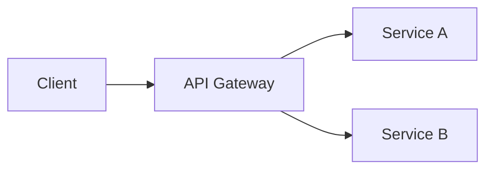

# 徽章与视觉资产指南

## 徽章选择优先级

| 优先级 | 徽章 | 理由 |
|--------|------|------|
| 必需 | CI/Build Status | 项目是否健康 |
| 必需 | License | 法律风险的即时判断 |
| 推荐 | Version (npm/pypi/crates) | 当前版本一目了然 |
| 推荐 | Coverage | 代码质量信号 |
| 可选 | Downloads | 社会证明 |
| 可选 | Stars | 社会证明 |
| 避免 | 超过 8 个 | 信噪比下降 |

## 徽章格式模板

```markdown
[](URL)
[](URL)
[](LICENSE)
```

一行放不下就换行，每行不超过 4 个。

## 终端 GIF（CLI 项目）

优先用 vhs：
```bash
vhs demo.tape
```

备选：asciinema 录制 + svg-term 转 SVG。

## 架构图（框架/复杂项目）

优先用 Mermaid（GitHub 原生渲染）：

````markdown

````

## Logo / Banner

优先用已有 logo。没有的话用 SVG 文字 banner，支持 dark/light mode：

```html
<p align="center">
  <picture>
    <source media="(prefers-color-scheme: dark)" srcset="assets/banner-dark.svg">
    
  </picture>
</p>
```

## 按项目类型选择视觉资产

| 类型 | 推荐 Hero Visual | 工具 |
|------|-----------------|------|
| CLI 工具 | 终端 GIF | vhs, asciinema, terminalizer |
| 库/SDK | 代码截图 | carbon.now.sh, ray.so |
| Web 应用 | 浏览器截图/GIF | 手动截图 |
| 框架 | Mermaid 架构图 | GitHub 原生渲染 |
| 插件/扩展 | 安装流程截图 | 手动截图 |
| Monorepo | 带注释目录树 | 纯文本 |
