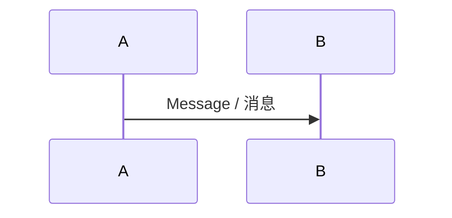

# Slidev PPT Generator

🦞 **OpenClaw Skill** | 📝 **Markdown to PPT** | 🚀 **One-click Professional Slides**

🦞 **OpenClaw Skill** | 📝 **Markdown 写 PPT** | 🚀 **一键生成专业幻灯片**

[](https://opensource.org/licenses/MIT)
[](https://clawhub.ai)

---

## ✨ Features / 特性

- 🎯 **AI-Powered** - OpenClaw auto-generates content
- 📝 **Markdown Authoring** - Create slides like writing docs
- 🎨 **Multiple Themes** - Built-in + community themes
- 📤 **Multi-format Export** - HTML / PDF / PPTX
- 🔧 **Highly Customizable** - Vue components + custom styles
- 🆓 **Completely Free** - Open-source MIT license

---

- 🎯 **AI 驱动** - OpenClaw 自动生成内容
- 📝 **Markdown 编写** - 写文档一样做 PPT
- 🎨 **多主题支持** - 内置 + 社区主题
- 📤 **多格式导出** - HTML / PDF / PPTX
- 🔧 **高度可定制** - Vue 组件 + 自定义样式
- 🆓 **完全免费** - 开源 MIT 协议

---

## 🚀 Quick Start / 快速开始

### 1️⃣ Install Skill / 安装 Skill

```bash
# Install via ClawHub / 通过 ClawHub 安装
npx clawhub@latest install slidev-ppt-generator

# Or install manually / 或手动安装
git clone https://github.com/laofahai/slidev-ppt-generator.git ~/.openclaw/skills/slidev-ppt-generator
openclaw gateway restart
```

### 2️⃣ Initialize Slidev Environment / 初始化 Slidev 环境

```bash
# Create project / 创建项目
npm init slidev@latest ~/slidev-ppt

# Enter project / 进入项目
cd ~/slidev-ppt

# Install dependencies / 安装依赖
npm install

# Install Playwright (required for PDF/PPTX export) / 安装 Playwright（导出 PDF/PPTX 需要）
npm i -D playwright-chromium
```

### 3️⃣ Usage / 使用

Just say in OpenClaw:

在 OpenClaw 中直接说：

```
Make a PPT about OpenClaw introduction
帮我做一个关于 OpenClaw 介绍的 PPT
```

The AI will automatically:
1. Check the Slidev environment
2. Generate slides.md content
3. Start the preview server
4. Ask if you need to export

AI 会自动：
1. 检查 Slidev 环境
2. 生成 slides.md 内容
3. 启动预览服务器
4. 询问是否需要导出

### 4️⃣ Export / 导出

```bash
cd ~/slidev-ppt

# Export PDF / 导出 PDF
slidev export --format pdf --output presentation.pdf

# Export PPTX / 导出 PPTX
slidev export --format pptx --output presentation.pptx

# Build HTML / 构建 HTML
slidev build --out dist/
```

---

## 🎯 Use Cases / 使用场景

| Scenario / 场景 | Recommended Template / 推荐模板 | Recommended Theme / 推荐主题 |
|------|----------|----------|
| Tech Sharing / 技术分享 | tech-share | default / seriph |
| Product Demo / 产品演示 | product-demo | hubro / eloc |
| Work Report / 工作汇报 | report | apple-basic |
| Teaching & Training / 教学培训 | teaching | default |
| Conference Talk / 会议演讲 | conference | seriph |

---

## 🛠️ Script Tools / 脚本工具

The project includes two utility scripts:

项目包含两个实用脚本：

### generate.js - Content Generation / 内容生成

```bash
node scripts/generate.js --topic "Your Topic" --output slides.md
```

**Options / 选项：**
- `-t, --topic` - PPT topic (required) / PPT 主题（必需）
- `-o, --output` - Output file path / 输出文件路径
- `-p, --pages` - Expected page count / 期望页数
- `-s, --style` - Style: tech|product|report / 风格：tech|product|report
- `-a, --author` - Author name / 作者姓名

### export.js - Export Wrapper / 导出封装

```bash
node scripts/export.js --format pdf --output presentation.pdf
```

**Options / 选项：**
- `-f, --format` - Export format: pdf|pptx|png|md / 导出格式：pdf|pptx|png|md
- `-o, --output` - Output file path / 输出文件路径
- `--with-clicks` - Include animation steps / 包含动画步骤
- `--range` - Export specific pages / 导出指定页

---

## 🎨 Theme System / 主题系统

### Built-in Themes / 内置主题

- `default` - Default theme, great for tech sharing / 默认主题，适合技术分享
- `seriph` - Elegant serif font, suitable for formal occasions / 优雅衬线字体，适合正式场合

### Community Themes / 社区主题

```bash
# Minimalist / 极简风
npm i slidev-theme-apple-basic

# Elegant / 优雅风格
npm i slidev-theme-eloc

# Business / 商务风格
npm i slidev-theme-hubro

# Cute / 可爱风格
npm i slidev-theme-cosmo
```

### Custom Themes / 自定义主题

Configure in `slides.md`:

在 `slides.md` 中配置：

```markdown
---
theme: default
colorSchema: dark
highlighter: shiki
background: /path/to/bg.png
fonts:
  sans: 'Inter'
  mono: 'Fira Code'
---
```

---

## 📝 Markdown Syntax / Markdown 语法

### Page Breaks / 分页

```markdown
---

# Page One / 第一页

---

# Page Two / 第二页
```

### Layouts / 布局

```markdown
---
layout: two-cols
---

# Left / 左侧

Content / 内容

::right::

# Right / 右侧

Content / 内容
```

### Code Highlighting / 代码高亮

````markdown
```typescript {1|3|5-7}
function add(a: number, b: number) {
  return a + b
}
```
````

### Math Formulas / 数学公式

```markdown
$$
x = \frac{-b \pm \sqrt{b^2-4ac}}{2a}
$$
```

### Mermaid Diagrams / Mermaid 图表

```markdown

```

---

## 🤝 Contributing / 贡献

Issues and PRs are welcome!

欢迎提交 Issue 和 PR！

### Development Environment / 开发环境

```bash
# Clone the project / 克隆项目
git clone https://github.com/laofahai/slidev-ppt-generator.git

# Enter directory / 进入目录
cd slidev-ppt-generator

# Install dependencies / 安装依赖
npm install

# Test scripts / 测试脚本
node scripts/generate.js --topic "测试" --output test.md
```

### Commit Conventions / 提交规范

- `feat:` New feature / 新功能
- `fix:` Bug fix / 修复 bug
- `docs:` Documentation update / 文档更新
- `style:` Code formatting / 代码格式
- `refactor:` Refactoring / 重构
- `test:` Tests / 测试
- `chore:` Build/tooling / 构建/工具

---

## 📄 License / 许可证

MIT License

---

## 👤 Author / 作者

**闫志鹏 (laofahai)**

- GitHub: [@laofahai](https://github.com/laofahai)
- Company / 公司：诸城市新起点供应链管理有限责任公司
- Projects / 项目：LinchKit / OpenClaw Agent 体系

---

## 🔗 Links / 相关链接

- [Slidev Documentation / Slidev 官方文档](https://cn.sli.dev/)
- [Slidev GitHub](https://github.com/slidevjs/slidev)
- [OpenClaw Website / OpenClaw 官网](https://openclaw.ai)
- [ClawHub Skill Market / ClawHub 技能市场](https://clawhub.ai)
- [Theme Gallery / 主题列表](https://sli.dev/guide/theme-addon-gallery)

---

**Made with ❤️ by laofahai**
