# OpenClaw

## 自托管 AI Agent 网关

<div class="mt-12 text-gray-400">

**技术架构 · 工作流 · 适用场景 · 本地优先价值**

</div>

<div class="mt-24 text-sm text-gray-500">

docs.openclaw.ai · github.com/openclaw/openclaw

</div>

---
layout: two-cols
---

## 什么是 OpenClaw？

<div class="mt-6 text-sm leading-relaxed">

OpenClaw 是一个**自托管网关**，连接您的聊天应用到 AI Agent。

运行在您自己的机器上，单一进程同时服务多个聊天渠道，数据完全本地化。

</div>

<div class="mt-8">

### 核心价值

<div class="mt-4 space-y-3 text-sm">

<div class="flex items-center gap-2">
  <span class="text-green-400">✓</span>
  <span>数据不离开本地</span>
</div>
<div class="flex items-center gap-2">
  <span class="text-green-400">✓</span>
  <span>响应延迟 < 100ms</span>
</div>
<div class="flex items-center gap-2">
  <span class="text-green-400">✓</span>
  <span>核心功能离线可用</span>
</div>
<div class="flex items-center gap-2">
  <span class="text-green-400">✓</span>
  <span>深度定制 (Skills/Agents)</span>
</div>

</div>

</div>

::right::

## 支持的渠道

<div class="mt-6 grid grid-cols-2 gap-3 text-sm">

<div class="bg-gray-800/50 p-3 rounded">

**即时通讯**

- WhatsApp
- Telegram
- Discord

</div>

<div class="bg-gray-800/50 p-3 rounded">

**企业协同**

- 飞书
- 钉钉
- 企业微信

</div>

<div class="bg-gray-800/50 p-3 rounded">

**Apple 生态**

- iMessage
- Mattermost

</div>

<div class="bg-gray-800/50 p-3 rounded">

**AI Agent**

- Pi
- Codex
- Claude Code
- 千问 Coder

</div>

</div>

---

## 系统架构全景

<div class="grid grid-cols-3 gap-6 mt-12">

<div class="bg-gradient-to-b from-gray-800 to-gray-900 p-6 rounded-lg border border-gray-700">

<div class="text-2xl mb-4">📥</div>
<div class="text-lg font-bold mb-3">输入层</div>
<div class="text-sm text-gray-400 space-y-2">

- WhatsApp
- Telegram
- Discord
- 飞书/钉钉

</div>

</div>

<div class="bg-gradient-to-b from-blue-900/50 to-blue-950/50 p-6 rounded-lg border border-blue-700/50">

<div class="text-2xl mb-4">⚙️</div>
<div class="text-lg font-bold mb-3">Gateway 核心</div>
<div class="text-sm text-gray-300 space-y-2">

- 消息路由
- Agent 编排
- 技能调度
- 记忆管理

</div>

</div>

<div class="bg-gradient-to-b from-gray-800 to-gray-900 p-6 rounded-lg border border-gray-700">

<div class="text-2xl mb-4">📤</div>
<div class="text-lg font-bold mb-3">输出层</div>
<div class="text-sm text-gray-400 space-y-2">

- Ollama 本地模型
- 百炼/ OpenRouter API
- 文件系统
- 外部工具

</div>

</div>

</div>

<div class="mt-8 text-center text-sm text-gray-500">

**单一 Gateway 进程** = 消息收发 + Agent 调度 + 技能执行 + 状态管理

</div>

---

## 多 Agent 路由机制

<div class="text-sm mb-6">

**主入口统一**：所有消息进入 `main` Agent，按意图自动分发

</div>

<table class="w-full text-sm">
<thead>
<tr class="border-b border-gray-700">
  <th class="text-left py-2">Agent</th>
  <th class="text-left py-2">触发条件</th>
  <th class="text-left py-2">模型策略</th>
</tr>
</thead>
<tbody class="text-gray-300">
<tr class="border-b border-gray-800">
  <td class="py-3"><code class="text-blue-400">main</code></td>
  <td>默认/简单对话</td>
  <td>百炼 qwen3.5-plus</td>
</tr>
<tr class="border-b border-gray-800">
  <td class="py-3"><code class="text-blue-400">mem-assistant</code></td>
  <td>MEM 备考/学习规划</td>
  <td>百炼 API</td>
</tr>
<tr class="border-b border-gray-800">
  <td class="py-3"><code class="text-blue-400">governance-assistant</code></td>
  <td>公司治理/组织/制度</td>
  <td>百炼 API</td>
</tr>
<tr class="border-b border-gray-800">
  <td class="py-3"><code class="text-blue-400">codex-assistant</code></td>
  <td>编码任务</td>
  <td>Claude Code → Codex → 千问 Coder</td>
</tr>
<tr class="border-b border-gray-800">
  <td class="py-3"><code class="text-blue-400">gemini-assistant</code></td>
  <td>中长分析 (只读)</td>
  <td>Gemini CLI</td>
</tr>
<tr>
  <td class="py-3"><code class="text-blue-400">scout</code></td>
  <td>信息收集/事实核实</td>
  <td>百炼 API</td>
</tr>
</tbody>
</table>

<div class="mt-6 text-xs text-gray-500">

**Fallback 链**：Claude Code CLI (5h/天) → Codex CLI → qwen3-coder-next → qwen3-coder-plus → glm-5

</div>

---
layout: two-cols
---

## 编码任务工作流

<div class="mt-4">

### 强制规则

<div class="mt-4 space-y-4 text-sm">

<div class="bg-gray-800/50 p-3 rounded border-l-4 border-blue-500">

**1. Context7 MCP 强制查询**

写代码前必须查询官方文档

</div>

<div class="bg-gray-800/50 p-3 rounded border-l-4 border-green-500">

**2. CLI Agent 优先**

Claude Code / Codex CLI (5 小时/天)

</div>

<div class="bg-gray-800/50 p-3 rounded border-l-4 border-red-500">

**3. Gemini 禁用编码**

只读，不能写文件/执行命令

</div>

</div>

</div>

::right::

## 执行流程

```mermaid
graph TD
  A[用户请求] --> B{编码任务？}
  B -->|是 | C[Context7 查文档]
  B -->|否 | D[直接处理]
  C --> E[Claude Code CLI]
  E --> F{成功？}
  F -->|否 | G[降级到 Codex]
  G --> H{成功？}
  H -->|否 | I[千问 Coder API]
  
  style A fill:#1f2937,stroke:#374151
  style B fill:#1f2937,stroke:#374151
  style C fill:#1f2937,stroke:#374151
  style E fill:#1f2937,stroke:#374151
  style F fill:#1f2937,stroke:#374151
  style G fill:#1f2937,stroke:#374151
  style H fill:#1f2937,stroke:#374151
  style I fill:#1f2937,stroke:#374151
```

<div class="mt-6 text-sm">



</div>

---

## 技能 (Skills) 体系

<div class="text-sm mb-6">

**已安装 13 个核心技能**，覆盖搜索、检索、备份、自动化等场景

</div>

<div class="grid grid-cols-4 gap-3">

<div class="bg-gray-800/50 p-3 rounded text-xs">

**baidu-web-search**

百度搜索 (强制)

</div>

<div class="bg-gray-800/50 p-3 rounded text-xs">

**qmd**

本地向量检索

</div>

<div class="bg-gray-800/50 p-3 rounded text-xs">

**openclaw-backup**

自动备份

</div>

<div class="bg-gray-800/50 p-3 rounded text-xs">

**agent-browser**

浏览器自动化

</div>

<div class="bg-gray-800/50 p-3 rounded text-xs">

**self-improving**

自我反思

</div>

<div class="bg-gray-800/50 p-3 rounded text-xs">

**skill-vetter**

安全审查

</div>

<div class="bg-gray-800/50 p-3 rounded text-xs">

**summarize**

URL/文件摘要

</div>

<div class="bg-gray-800/50 p-3 rounded text-xs">

**humanizer-zh**

去除 AI 痕迹

</div>

<div class="bg-gray-800/50 p-3 rounded text-xs">

**github**

GitHub 交互

</div>

<div class="bg-gray-800/50 p-3 rounded text-xs">

**free-ride**

免费模型管理

</div>

<div class="bg-gray-800/50 p-3 rounded text-xs">

**clawddocs**

文档专家

</div>

<div class="bg-gray-800/50 p-3 rounded text-xs">

**skill-9**

全网信息获取

</div>

</div>

---

## 知识检索体系 (qmd)

<div class="grid grid-cols-2 gap-8">

<div>

### 索引状态

<div class="mt-4 bg-gray-800/50 p-4 rounded">

<div class="text-3xl font-bold text-blue-400">656</div>
<div class="text-sm text-gray-400">文件索引</div>

<div class="mt-4 text-3xl font-bold text-green-400">2701</div>
<div class="text-sm text-gray-400">向量嵌入</div>

<div class="mt-4 text-3xl font-bold text-purple-400">25.9 MB</div>
<div class="text-sm text-gray-400">索引大小</div>

</div>

</div>

<div>

### 技术配置

<table class="w-full text-sm mt-4">
<tr class="border-b border-gray-800">
  <td class="py-2 text-gray-400">嵌入模型</td>
  <td class="py-2">embeddinggemma</td>
</tr>
<tr class="border-b border-gray-800">
  <td class="py-2 text-gray-400">重排序</td>
  <td class="py-2">Qwen3-Reranker</td>
</tr>
<tr class="border-b border-gray-800">
  <td class="py-2 text-gray-400">索引引擎</td>
  <td class="py-2">SQLite (BM25+ 向量)</td>
</tr>
<tr>
  <td class="py-2 text-gray-400">自动维护</td>
  <td class="py-2">每日 03:00 Cron</td>
</tr>
</table>

### 查询示例

<div class="mt-4 text-xs bg-gray-900 p-3 rounded font-mono">

```bash
qmd search "关键词" -c openclaw
qmd vsearch "语义查询" -c openclaw
qmd query "混合查询" -c openclaw
```

</div>

</div>

</div>

---
layout: two-cols
---

## 典型使用场景

::left::

<div class="space-y-4">

<div class="bg-gradient-to-r from-blue-900/30 to-blue-950/30 p-4 rounded border-l-4 border-blue-500">

<div class="text-xl mb-2">💻 开发辅助</div>
<div class="text-sm text-gray-300 space-y-1">

- AI 编程 (Claude Code/Codex)
- 代码审查/重构
- 文档查询 (Context7)

</div>

</div>

<div class="bg-gradient-to-r from-green-900/30 to-green-950/30 p-4 rounded border-l-4 border-green-500">

<div class="text-xl mb-2">📰 信息获取</div>
<div class="text-sm text-gray-300 space-y-1">

- 百度搜索 (强制)
- 事实核查
- 新闻聚合

</div>

</div>

<div class="bg-gradient-to-r from-purple-900/30 to-purple-950/30 p-4 rounded border-l-4 border-purple-500">

<div class="text-xl mb-2">🔧 系统运维</div>
<div class="text-sm text-gray-300 space-y-1">

- 配置备份/恢复
- 模型切换
- 健康检查

</div>

</div>

</div>

::right::

<div class="space-y-4">

<div class="bg-gradient-to-r from-cyan-900/30 to-cyan-950/30 p-4 rounded border-l-4 border-cyan-500">

<div class="text-xl mb-2">📚 知识管理</div>
<div class="text-sm text-gray-300 space-y-1">

- 文档写作
- 信息整合
- 记忆提取

</div>

</div>

<div class="bg-gradient-to-r from-orange-900/30 to-orange-950/30 p-4 rounded border-l-4 border-orange-500">

<div class="text-xl mb-2">📅 个人助理</div>
<div class="text-sm text-gray-300 space-y-1">

- 日程管理
- MEM 学习规划
- 周报自动生成

</div>

</div>

</div>

---

## 本地优先 vs 云服务

<table class="w-full text-sm">
<thead>
<tr class="border-b-2 border-gray-600">
  <th class="text-left py-3">维度</th>
  <th class="text-left py-3">云服务 (Claude.ai/ChatGPT)</th>
  <th class="text-left py-3 text-green-400">OpenClaw 自托管</th>
</tr>
</thead>
<tbody class="text-gray-300">
<tr class="border-b border-gray-800">
  <td class="py-3 font-medium">数据隐私</td>
  <td class="py-3 text-red-400">数据在第三方服务器</td>
  <td class="py-3 text-green-400">完全本地存储</td>
</tr>
<tr class="border-b border-gray-800">
  <td class="py-3 font-medium">网络依赖</td>
  <td class="py-3 text-red-400">必须在线</td>
  <td class="py-3 text-green-400">核心功能离线可用</td>
</tr>
<tr class="border-b border-gray-800">
  <td class="py-3 font-medium">响应延迟</td>
  <td class="py-3 text-red-400">2-10 秒 (网络 + 排队)</td>
  <td class="py-3 text-green-400">&lt; 100ms (本地处理)</td>
</tr>
<tr class="border-b border-gray-800">
  <td class="py-3 font-medium">定制能力</td>
  <td class="py-3 text-yellow-400">Prompt 级</td>
  <td class="py-3 text-green-400">Skills/Agent/配置级</td>
</tr>
<tr class="border-b border-gray-800">
  <td class="py-3 font-medium">成本模型</td>
  <td class="py-3 text-red-400">$20/月+ 订阅制</td>
  <td class="py-3 text-green-400">一次部署 + API 按量</td>
</tr>
<tr class="border-b border-gray-800">
  <td class="py-3 font-medium">集成能力</td>
  <td class="py-3 text-yellow-400">REST API 调用</td>
  <td class="py-3 text-green-400">本地文件/命令/数据库直连</td>
</tr>
<tr class="border-b border-gray-800">
  <td class="py-3 font-medium">多 Agent</td>
  <td class="py-3 text-red-400">单会话</td>
  <td class="py-3 text-green-400">7+ Agent 自动路由</td>
</tr>
<tr>
  <td class="py-3 font-medium">记忆持久化</td>
  <td class="py-3 text-red-400">会话级</td>
  <td class="py-3 text-green-400">长期记忆 (OpenViking)</td>
</tr>
</tbody>
</table>

---

## 安全与备份体系

<div class="grid grid-cols-2 gap-8">

<div>

### 密钥管理

<div class="mt-4 space-y-3">

<div class="bg-green-900/20 p-4 rounded border border-green-500/30">

<div class="text-sm font-bold text-green-400 mb-2">✅ SecretRef 存储</div>
<div class="text-xs text-gray-300">

- feishu.appSecret
- bailian.apiKey

</div>
<div class="text-xs text-gray-500 mt-2">

位置：`~/.openclaw/secrets.json` (权限 600)

</div>

</div>

<div class="bg-gray-800/50 p-4 rounded border border-gray-700">

<div class="text-sm font-bold text-gray-400 mb-2">⚠️ 本地占位符</div>
<div class="text-xs text-gray-300">

- ollama.apiKey

</div>
<div class="text-xs text-gray-500 mt-2">

本地模型无需密钥

</div>

</div>

</div>

</div>

<div>

### 自动备份

<div class="mt-4 bg-gray-800/50 p-4 rounded">

<div class="text-sm space-y-3">

<div class="flex justify-between">
  <span class="text-gray-400">工具</span>
  <span class="text-white">openclaw-backup</span>
</div>
<div class="flex justify-between">
  <span class="text-gray-400">下载量</span>
  <span class="text-green-400">6964 次 (冠军)</span>
</div>
<div class="flex justify-between">
  <span class="text-gray-400">频率</span>
  <span class="text-white">每日 03:00 (Cron)</span>
</div>
<div class="flex justify-between">
  <span class="text-gray-400">格式</span>
  <span class="text-white">tar.gz</span>
</div>
<div class="flex justify-between">
  <span class="text-gray-400">轮转</span>
  <span class="text-white">保留最近 7 个</span>
</div>
<div class="flex justify-between">
  <span class="text-gray-400">位置</span>
  <span class="text-white">~/openclaw-backups/</span>
</div>

</div>

</div>

</div>

</div>

---

## 定时任务与心跳

<div class="grid grid-cols-2 gap-8">

<div>

### Cron 任务 (6 个)

<table class="w-full text-xs mt-4">
<thead>
<tr class="border-b border-gray-700">
  <th class="text-left py-2">任务</th>
  <th class="text-left py-2">Schedule</th>
</tr>
</thead>
<tbody class="text-gray-300">
<tr class="border-b border-gray-800">
  <td class="py-2">qmd 索引更新</td>
  <td class="py-2 font-mono text-blue-400">0 3 * * *</td>
</tr>
<tr class="border-b border-gray-800">
  <td class="py-2">OpenClaw 备份</td>
  <td class="py-2 font-mono text-blue-400">0 3 * * *</td>
</tr>
<tr class="border-b border-gray-800">
  <td class="py-2">MEM Daily Plan</td>
  <td class="py-2 font-mono text-blue-400">0 9 * * 1-5</td>
</tr>
<tr class="border-b border-gray-800">
  <td class="py-2">MEM Check-in</td>
  <td class="py-2 font-mono text-blue-400">0 20 * * 1-5</td>
</tr>
<tr class="border-b border-gray-800">
  <td class="py-2">MEM Weekly Review</td>
  <td class="py-2 font-mono text-blue-400">0 10 * * 0</td>
</tr>
<tr>
  <td class="py-2">周报自动生成</td>
  <td class="py-2 font-mono text-blue-400">0 17 * * 5</td>
</tr>
</tbody>
</table>

</div>

<div>

### Heartbeat 检查

<div class="mt-4 space-y-3 text-sm">

<div class="bg-gray-800/50 p-3 rounded">

<div class="text-xs text-gray-400 mb-1">每 30 分钟</div>
<div class="text-white">qmd 索引状态</div>

</div>

<div class="bg-gray-800/50 p-3 rounded">

<div class="text-xs text-gray-400 mb-1">每周</div>
<div class="text-white">密钥安全状态</div>
<div class="text-white">组织治理文档</div>
<div class="text-white">文控文档归档</div>

</div>

<div class="bg-gray-800/50 p-3 rounded">

<div class="text-xs text-gray-400 mb-1">每 3 天</div>
<div class="text-white">MEM 学习进度</div>

</div>

</div>

</div>

</div>

---

## 快速开始

<div class="grid grid-cols-2 gap-8">

<div>

### 安装与初始化

<div class="mt-4 text-xs bg-gray-900 p-4 rounded font-mono leading-relaxed">

```bash
# 全局安装
npm i -g openclaw

# 交互式初始化
openclaw onboard

# 启动网关
openclaw gateway start

# 打开控制 UI
openclaw web
```

</div>

</div>

<div>

### 工作区结构

<div class="mt-4 text-xs bg-gray-900 p-4 rounded font-mono leading-relaxed">

```
~/.openclaw/workspace/
├── AGENTS.md
├── SOUL.md
├── USER.md
├── MEMORY.md
├── HEARTBEAT.md
├── memory/
├── skills/
└── foundation/
```

</div>

</div>

</div>

<div class="mt-8">

### 扩展方式

<div class="mt-4 grid grid-cols-3 gap-4 text-sm">

<div class="bg-gray-800/50 p-3 rounded">

**1. 安装 Skills**

`clawhub install <skill>`

</div>

<div class="bg-gray-800/50 p-3 rounded">

**2. 自定义 Agent**

编辑 `~/.openclaw/agents/`

</div>

<div class="bg-gray-800/50 p-3 rounded">

**3. 配置模型**

修改 `openclaw.json`

</div>

</div>

</div>

---
class: text-center
---

# 总结

<div class="grid grid-cols-2 gap-12 mt-16">

<div class="text-left">

## 技术优势

<div class="mt-6 space-y-3 text-sm text-gray-300">

<div class="flex items-center gap-2">
  <span class="text-green-400">✓</span>
  <span>自托管，数据完全本地</span>
</div>
<div class="flex items-center gap-2">
  <span class="text-green-400">✓</span>
  <span>低延迟 (&lt; 100ms)</span>
</div>
<div class="flex items-center gap-2">
  <span class="text-green-400">✓</span>
  <span>离线可用</span>
</div>
<div class="flex items-center gap-2">
  <span class="text-green-400">✓</span>
  <span>深度定制 (Skills/Agents)</span>
</div>

</div>

</div>

<div class="text-left">

## 工程价值

<div class="mt-6 space-y-3 text-sm text-gray-300">

<div class="flex items-center gap-2">
  <span class="text-green-400">✓</span>
  <span>多 Agent 自动路由</span>
</div>
<div class="flex items-center gap-2">
  <span class="text-green-400">✓</span>
  <span>长期记忆持久化</span>
</div>
<div class="flex items-center gap-2">
  <span class="text-green-400">✓</span>
  <span>定时任务 + 心跳检查</span>
</div>
<div class="flex items-center gap-2">
  <span class="text-green-400">✓</span>
  <span>完整的备份体系</span>
</div>

</div>

</div>

</div>

<div class="mt-24">

### 开始使用

<div class="mt-6 text-lg">

**文档**：docs.openclaw.ai  
**GitHub**：github.com/openclaw/openclaw  
**Skills**：clawhub.com

</div>

<div class="mt-12 text-gray-600 text-sm">

🦞 EXFOLIATE! EXFOLIATE!

</div>

</div>
