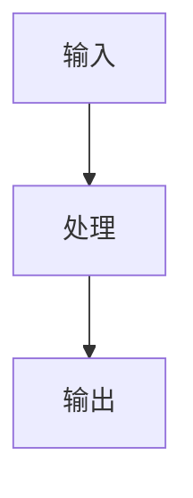

# 技术分享

## 副标题在这里

<div class="pt-4 text-sm opacity-80">
你的名字 | 日期
</div>

---
layout: section
---

# 目录

- 背景与动机
- 核心概念
- 架构设计
- 实现细节
- 实践案例
- 总结与展望

---
layout: two-cols
---

# 背景与动机

## 为什么需要这个技术？

- 痛点 1
- 痛点 2
- 痛点 3

## 现有方案的局限

- 局限 1
- 局限 2

::right::

```typescript
// 问题示例
const result = complexOperation(data);
// 性能问题
// 可维护性问题
```

---
layout: center
class: text-center
---

# 核心概念

## 关键技术点

- 概念 1
- 概念 2
- 概念 3

---
layout: two-cols-header
---

# 架构设计

## 整体架构

::left::

- 组件 A
- 组件 B
- 组件 C

::right::



---

# 实现细节

## 核心代码

```typescript {1|3|5-7}
function solveProblem(input: Input): Output {
  // 步骤 1
  const step1 = preprocess(input);
  
  // 步骤 2
  const result = process(step1);
  
  // 步骤 3
  return postprocess(result);
}
```

---
layout: image-right
image: /path/to/screenshot.png
---

# 实践案例

## 实际应用场景

- 场景 1
- 场景 2

## 效果对比

- 性能提升 X%
- 代码减少 Y%

---
layout: center
class: text-center
---

# 总结

## 关键要点

1. 要点 1
2. 要点 2
3. 要点 3

## 未来方向

- 方向 1
- 方向 2

---
layout: center
class: text-center
---

# 谢谢

## Q&A

<div class="pt-4 text-sm opacity-80">
你的名字

@email.com | @github
</div>
