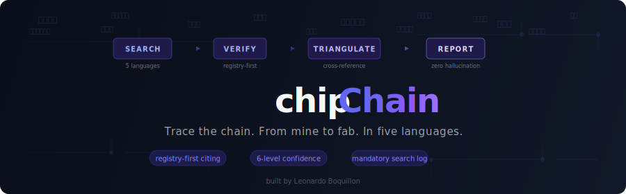

<p align="center">
  
</p>

<p align="center">
  <a href="LICENSE"></a>
  
  
  
</p>

# chipchain
> *The most opaque supply chain on earth, decoded. Without hallucinating.*

## Table of Contents

- [Why This Exists](#why-this-exists)
- [What It Produces](#what-it-produces)
- [How It Stays Honest](#how-it-stays-honest)
- [The Orchestration](#the-orchestration)
- [Multilingual Search](#multilingual-search)
- [What's Inside](#whats-inside)
- [Query Types](#query-types)
- [Installation](#installation)
- [Roadmap](#roadmap)
- [Contributing](#contributing)

---

## Why This Exists

LLMs are confidently wrong about supply chains. They fabricate supplier relationships, invent filing references, and present training data as freshly researched fact. An investor acting on a hallucinated supplier relationship can lose real money. A policy analyst citing a fabricated filing reference destroys their credibility permanently. A hallucination in supply chain intelligence costs actual money, not just an embarrassing chatbot screenshot.

The problem goes deeper when you use multiple agents. Sub-agents find real sources with real URLs, then lose them during narrative synthesis. The parent agent assembles a report and drops every URL because full links read as noise in prose. Three different prompt-based fixes failed to solve this. The solution required structural constraints on how agents communicate: sub-agents return XML with URLs as attributes (structurally inseparable), and the parent builds a numbered Source Registry before writing a single word of prose. By the time creative writing starts, the evidence is already committed.

On top of the orchestration challenge, about 80% of semiconductor supply chain information lives behind language barriers. The answer to "who supplies hafnium precursors to SK Hynix" lives in a [DART filing](https://dart.fss.or.kr) in Korean, under the section header `주요 거래처`. Or in a Japanese [EDINET annual report](https://disclosure2.edinet-fsa.go.jp), in the `主要仕入先` section. Or in a Chinese STAR Market IPO prospectus on [cninfo](https://cninfo.com.cn), under `前五名供应商采购额`. Google Translate won't give you the right search terms for any of these.

`chipchain` is a structured research methodology that makes every claim auditable. It knows where to look, what to search for in each language, and how to keep agents honest through structural constraints rather than hopeful prompting.

---

## What It Produces

Real investigations. Real sources. Real confidence grades.

### Investigation 1: "Who supplies electronic-grade HF to Samsung's Pyeongtaek fab?"

Three parallel research agents. Korean, Japanese, and English searches running simultaneously. **80 seconds.** Try doing that with a human analyst team.

**What it found:**
- **6 suppliers identified**: Soulbrain, ENF Technology, Wonick Materials, Stella Chemifa, Morita Chemical, Foosung
- **The complete pre-2019 vs post-2019 supply chain restructuring**: how Japan's export restrictions permanently shifted Samsung's HF sourcing from Japanese to Korean domestic suppliers
- **Korean imports of Japanese HF fell 87.6%** from 2018 to 2022, sourced from a real article accessed in the session
- **12+ specific sources cited**: 피치원미디어, 녹색경제신문, BusinessKorea, ZDNet Korea, Nikkei, ET News, The Worldfolio, Kabutan
- Soulbrain labeled **CONFIRMED** (multiple independent Korean press sources). Stella Chemifa's pre-2019 role labeled **STRONG INFERENCE** (Nikkei + revenue geography, but no direct Samsung confirmation found)
- A "What I Could Not Verify" section listing 6 specific gaps, and 4 actionable next steps (specific DART filing queries, Comtrade HS codes, EDINET codes)

*Result: supply chain map with sourced confidence levels*


*What it could not verify: honest gaps, failed searches, and actionable next steps*


### Investigation 2: "If China restricts fluorspar exports, what's the downstream impact?"

Full scenario analysis. Multiple agents. Trade data, corporate filings, defense think tank reports.

**What it found:**
- The complete **fluorine cascade**: fluorspar → HF → NF₃ + WF₆ + CF₄ + C₄F₈ + SF₆ + fluoropolymers + LiPF₆ (EV battery competition for the same feedstock)
- **Stella Chemifa operates Chinese JV subsidiaries** (Zhejiang Blue Star Chemical, Quzhou BDX) specifically to secure fluorspar, discovered via live search
- **IDA Document D-5379** modeling a 71,847 metric ton fluorspar shortfall in a military conflict scenario
- **China's own reserves are depleting**: 11.75 year reserve-to-production ratio vs. 31.82 global average. China is becoming a net *importer* from Mongolia
- **Koura/Sojitz building a Mexican-fluorspar-sourced HF plant in Fukuoka**, the first non-China-sourced HF plant in Japan
- Country-by-country exposure assessment, alternative supply evaluation, and a week-by-week impact timeline through year 3

---

## How It Stays Honest

Semiconductor supply chain intelligence is useless if it's wrong. A confident fabrication is worse than no answer. The default behavior of an LLM asked about supply chains is to hallucinate plausibly, and `chipchain` is designed to make that structurally difficult.

### Search First, Know Later

Rule Zero. When `chipchain` receives a question, it searches before it speaks. It does not consult its memory for a draft answer and then look for sources to confirm it. It goes to the databases, the filings, the press, the patent registries, and builds the answer from what it actually finds. If a search comes back empty, that is reported as a result, not papered over with a plausible guess.

### Registry-First Citation

The most important structural constraint: **build the Source Registry before writing any prose.**

Sub-agents return structured XML with URLs as attributes and verbatim evidence quotes (in the original language). The parent extracts them into a numbered registry with evidence, then writes prose using only `[1]` `[2]` markers. Two strict phases:

```markdown
## Source Registry (Phase 1, mechanical, output first)
[1] 피치원미디어 2024-03-15 — https://platum.kr/...
    Evidence: "솔브레인은 삼성전자 평택 불산 주요 공급사로 선정"
[2] Nikkei 2024-02 — https://nikkei.com/...
    Evidence: "ステラケミファは2019年以前の主要供給元だった"

## Findings (Phase 2, creative, numbers only)
Soulbrain is Samsung's primary HF supplier [1].
Stella Chemifa was the pre-2019 incumbent [2].
```

If a claim has no registry number, you don't have evidence. The claim doesn't belong in the report. Writing the registry first means the agent cannot state a conclusion and then go looking for something to back it up. The evidence is already committed to the output before prose begins.

### Counterfactual Falsification

Every strong claim runs through three questions before it ships:

1. **"If this were FALSE, how would I explain my evidence?"** Walk through each piece of evidence and construct a plausible alternative. If the alternative is equally plausible, downgrade the confidence.
2. **"What would I search to disprove this?"** Construct a falsifier from four angles: **numerator** (is the entity's position different?), **denominator/scope** (is the market defined differently?), **visibility** (are there players my data can't see?), and **temporal** (when was this measured?). Every falsifier must name a specific source to check and a threshold that would change the conclusion. "A competitor could show comparable revenue" is a bad falsifier. "If ECHA lists >3 manufacturers for CAS 7664-39-3 at electronic grade, the near-monopoly claim is false" is a good one.
3. **"Do my sources actually agree?"** Surface contradictions instead of averaging them away.

The protocol also detects circular sourcing: multiple sources that all cite the same original estimate, creating the illusion of independent confirmation. Red flags: suspiciously round numbers, all sources clustering within 6 months, all sources giving the exact same figure.

### "Making ≠ Supplying"

The single most common hallucination in supply chain analysis:

> "Company X makes hafnium precursors" ≠ "Company X supplies hafnium precursors to SK Hynix"

Manufacturing a material and supplying it to a specific customer require completely different evidence. A company's product catalog proves they make something. A DART filing listing them as `주요 거래처` proves a commercial relationship. These are different grades of evidence and `chipchain` treats them differently.

### Six-Level Confidence System

Every finding is graded by **how it was obtained**, not by how plausible it sounds:

| Level | What it means |
|---|---|
| **CONFIRMED (YYYY)** | Source accessed THIS session, with year |
| **STRONG INFERENCE** | 2+ independent signals, THIS session |
| **MODERATE INFERENCE** | 1 indirect signal, THIS session |
| **SPECULATIVE** | Logical deduction from market structure |
| **FROM SKILL DATABASE** | Entity files, not verified today |
| **FROM TRAINING KNOWLEDGE** | LLM memory, lowest reliability |

### Evidence Type Caps

The confidence system is complemented by an **evidence type taxonomy** that caps
how high any finding can climb. Capability evidence alone (they make the material)
can never exceed SPECULATIVE, no matter how many sources confirm it. Only a named
commercial relationship, actually accessed, reaches CONFIRMED. See
[evidence-guide.md](evidence-guide.md) for the full scoring rubric.

### Six Hard Rules

| # | Rule | Why |
|---|---|---|
| 1 | **NEVER say "according to DART filing" unless you actually fetched it** | "According to" implies access. If you didn't access it, you're lying. |
| 2 | **NEVER fabricate a URL, filing number, or patent number** | Say "search for X on Y" instead of inventing a reference. |
| 3 | **NEVER present entity database info as confirmed current fact** | "Listed as a supplier" ≠ "supplies." The database is a hypothesis. |
| 4 | **NEVER fill gaps with plausible guesses** | An honest "I don't know" beats a confident fabrication every time. |
| 5 | **NEVER round-trip training knowledge through skill files** | Reading your own database doesn't verify anything. |
| 6 | **NEVER claim to have searched something you didn't** | Failed searches are information. Report them. |

### Mandatory Search Log + Gaps

Every report includes a full log of what was searched, in what language, and what came back, including failed searches. And every report ends with "What I Could Not Verify": specific gaps, failed searches, and actionable next steps. A `chipchain` report with five gaps and clear next steps is more actionable than a hallucinated report with zero gaps and no way to verify anything in it.

---

## The Orchestration

Multi-agent research systems lose information at every handoff. `chipchain` went through three failed approaches before finding one that works.

### The Problem: URLs Die in Transit

Sub-agents run WebSearch, find real URLs, and compose a response. During narrative synthesis, URLs get dropped because good prose doesn't include raw links. The parent agent then synthesizes sub-agent responses into a report, losing more detail. The user sees source names with no clickable links.

Prompt-based fixes ("include URLs in your response," "end with a Sources list") failed across all tests. Sub-agents enter a narrative writing mode where URLs are metadata noise.

### The Fix: XML Pipe + Numbered Registry

Two structural changes working together:

**Sub-agents return XML, not prose.** The URL is an XML attribute, structurally inseparable from the finding. Each finding carries a verbatim evidence quote (in the source language) alongside the sub-agent's interpretation. The Agent tool returns this verbatim. No temp files, no filesystem, no permissions.

```xml
<findings>
  <found url="https://etnews.com/..." source="ET News 2025-01">
    <evidence>SK트리켐은 하프늄 전구체 공급업체로 선정</evidence>
    <claim>SK Trichem named as HF precursor supplier</claim>
  </found>
  <missed query="하프늄 프리커서 공급업체" lang="KO"/>
</findings>
```

**The parent builds the registry first (Phase 1), then writes prose (Phase 2).** Phase 1 is mechanical extraction: parse XML tags, assign numbers, output the Source Registry with evidence quotes. Phase 2 is creative: write the narrative using only `[1]` `[2]` markers. By the time prose begins, every URL and the evidence behind it are already committed to the output. The evidence quotes also let the parent catch sub-agents that overinterpret their sources.

**Why the evidence layer matters.** Anthropic's [interpretability research](https://www.anthropic.com/research/tracing-thoughts-language-model) found that Claude has a default "refuse to answer" circuit that gets suppressed when it recognizes something familiar, and that it sometimes engages in "motivated reasoning," working backwards from a desired answer to justify it. In a supply chain context, this means the model can attach a real URL to a hallucinated claim about what that URL contains. The evidence field breaks this by forcing sub-agents to extract a verbatim quote (often in Korean, Japanese, or Chinese) before interpreting it. Fabricating a quote in the original language is much harder than fabricating an English interpretation, and the parent can check whether the claim actually follows from the evidence.

### Anti-Anchoring

Entity files contain qualitative descriptors ("suspected dominant," "major," "significant") instead of unverified percentages. This was a deliberate fix after live testing showed that numbers like "~70% global share" anchored the agent toward confirmation rather than genuine investigation. Live testing confirmed the fix works: with qualitative descriptors, the agent searches independently, surfaces contradictions, and finds competitors the entity files don't list.

### Geography Follows the Entity

The agent checks where an entity actually operates before choosing languages, not just where it's headquartered. TSMC Fab2 is a Japan question, not a Taiwan question. Samsung Austin is a US question. If any finding during research reveals a new country, the agent loads that lexicon and spawns a sub-agent in that language.

---

## Multilingual Search

English-language research covers maybe 20% of the semiconductor supply chain. The rest lives behind language barriers that machine translation can't cross, because machine translation has no idea how semiconductor engineers actually talk.

`chipchain` includes search terminology for Korean, Japanese, Simplified Chinese, Traditional Chinese, and German. The East Asian lexicons cover filing section headers, translation traps, and search patterns in depth. German is lighter, focused on the translation traps that trip up agents searching the Dresden/Bavaria semiconductor clusters and Bundesanzeiger filings.

### Why Machine Translation Fails

If you Google Translate "etch" into Korean, you get `에칭`. Korean semiconductor engineers use `식각`. Search for `에칭` on ET News and you get noise. Search for `식각` and you get every article about Samsung's etch process.

Critical spelling trap in Japanese: silicon wafer = `ウェーハ`, not `ウエハー`. Both Shin-Etsu and SUMCO use `ウェーハ`. Wrong spelling, zero results.

For Chinese, eleven critical terms are completely different words between mainland and Taiwan. `光刻胶` (mainland photoresist) vs `光阻` (Taiwan photoresist). Search the wrong one and you're looking at the wrong country's supply chain.

### Where to Find Supplier Disclosures

| Country | Filing System | Section that reveals suppliers |
|---|---|---|
| Korea | DART (dart.fss.or.kr) | `주요 거래처`, `원재료 매입 현황` |
| Japan | EDINET | `主要仕入先`, `主要販売先` (>10% revenue) |
| Taiwan | MOPS (mops.twse.com.tw) | `主要供應商`, `前十大供應商` |
| China | cninfo (cninfo.com.cn) | `前五名供应商采购额` |

Chinese STAR Market IPO prospectuses (`招股说明书`) disclose top-5 suppliers **by name with dollar amounts**. This is the richest public source for Chinese semiconductor supply chain mapping, and almost nobody outside China knows it exists.

---

## What's Inside

### Skill Contents

- **130+ companies** across `entities/` files (Korea, Japan, Taiwan, China) with tickers, products, and native-script names. Includes invisible tier-2/tier-3 suppliers: Toyo Gosei (photoacid generators), Fuso Chemical (colloidal silica), Ajinomoto Fine-Techno (ABF substrate film). All concentration claims are labeled as unverified hypotheses
- **Multiple chemistry chains** in `chemistry/precursor-chains.md` tracing materials from fab to mine: photoresist, hafnium precursors, electronic-grade HF, NF₃, silicon wafers (all the way to Spruce Pine, NC quartz), CMP slurry, and sputtering targets. Chokepoints identified at every tier with CAS numbers
- **Multiple investigative workflows** in `queries/`, including an unknown-supplier discovery methodology that searches by material/technology rather than company name, an 8-step chemistry chain tracer, a market sizing pipeline with top-down/bottom-up cross-checks, and an early signal detector that scans filings, qualification announcements, and capex for supply chain changes within the last 60 days
- **Counterfactual falsification protocol** in `queries/counterfactual-check.md` with four angles of attack, circular sourcing detection, and executable falsifier construction
- **Multilingual lexicons** with industry-specific terminology and regulatory filing section headers for each supported language
- **HS codes** for tracking bilateral semiconductor material flows (silicon wafers, photoresists, equipment, HF, fluorspar)
- **Patent co-filing analysis** guide with CPC codes, co-assignee detection, and links to KIPRIS, J-PlatPat, CNIPA, Google Patents, Lens.org
- **University-industry signals**: SKKU co-publications signal Samsung R&D, NYCU signals TSMC, Tohoku signals TEL/Kioxia
- **Geopolitical context** covering export controls (US-China Oct 2022+, Japan July 2023, Japan-Korea 2019), localization drives, and CHIPS Act subsidies
- **Free broker research aggregators**: Naver Finance (Korea), EastMoney (China), Kabutan (Japan), MOPS (Taiwan)

The skill queries APIs where possible (Comtrade, OpenDART, e-Stat, KIPRIS, Lens.org, PubChem) and falls back to WebSearch for sources without API access. See `sources.md` for details.

### Verification Log System

Entity files include a **Verification Log**, a running record of claims confirmed through actual investigations. Entries start as unverified hypotheses from training knowledge. When an investigation confirms a claim with sources accessed in that session, it gets logged with the date, sources, and investigation name. Entity file trust accumulates over time.

---

## Query Types

| Type | Example | What it does |
|---|---|---|
| **Supplier ID** | "Who supplies hafnium precursors to SK Hynix?" | Multi-language filing + press + patent search |
| **Bottleneck** | "Where's the chokepoint in EUV pellicles?" | Concentration risk with substitutability assessment |
| **Change Detection** | "What shifted in Korea's photoresist supply?" | Before/after with localization progress tracking |
| **Reverse Lookup** | "What does LK Chem actually do?" | Places unknown company in the supply chain taxonomy |
| **Scenario Analysis** | "If China restricts fluorspar, what breaks?" | Full cascade with timeline and exposure matrix |
| **Chemistry Chain** | "Trace hafnium from mine to fab" | 8-step tier-by-tier tracing with CAS lookups |
| **Market Sizing** | "What's the CMP slurry market breakdown?" | Top-down + bottom-up + trade data cross-check |
| **Discovery** | "Who else makes PAGs?" | Inverted search: find unknown suppliers by material, not by name |
| **Signal Detection** | "What's about to change in CMP slurry supply?" | Early signals from filings, qualifications, and capex in four languages |

---

## Installation

### Prerequisites

- [Claude Code](https://claude.ai/code) or [OpenClaw](https://openclaw.ai)
- Git
- Python 3.10+ (only needed for running the verification scripts in `scripts/`)

### Quick Start (macOS/Linux)

```bash
git clone https://github.com/lboquillon/chipchain.git
mkdir -p ~/.claude/skills
ln -sfn "$(pwd)/chipchain" ~/.claude/skills/chipchain
claude
```

Then ask: `/chipchain Who supplies CMP slurry to TSMC?`

### Claude Code

**macOS / Linux:**

```bash
git clone https://github.com/lboquillon/chipchain.git
mkdir -p ~/.claude/skills
ln -sfn "$(pwd)/chipchain" ~/.claude/skills/chipchain
claude  # start a new session
```

**Windows (PowerShell as Administrator):**

```powershell
git clone https://github.com/lboquillon/chipchain.git
New-Item -ItemType Directory -Path "$env:USERPROFILE\.claude\skills" -Force | Out-Null
New-Item -ItemType SymbolicLink -Path "$env:USERPROFILE\.claude\skills\chipchain" -Target "$(Get-Location)\chipchain"
claude  # start a new session
```

**Windows (CMD as Administrator):**

```cmd
git clone https://github.com/lboquillon/chipchain.git
if not exist "%USERPROFILE%\.claude\skills" mkdir "%USERPROFILE%\.claude\skills"
mklink /D "%USERPROFILE%\.claude\skills\chipchain" "%CD%\chipchain"
claude
```

> **Note:** Windows symlinks require Administrator privileges, or Developer Mode enabled in Settings > For Developers.

```
/chipchain Who supplies CMP slurry to TSMC?
```

Or just ask naturally, the skill triggers on semiconductor supply chain questions automatically.

**Try these:**
- `Who supplies photoacid generators for EUV resist?`
- `If China restricts fluorspar exports, what breaks?`
- `Trace hafnium from mine to TSMC's fab`
- `What's the CMP slurry market breakdown?`
- `What does Toyo Gosei actually make and why does it matter?`
- `Who else makes PAGs besides Toyo Gosei?`
- `Any early signals in the CMP slurry supply chain?`

### OpenClaw

If you already have OpenClaw installed:

```bash
git clone https://github.com/lboquillon/chipchain.git ~/.openclaw/skills/chipchain
openclaw gateway restart
```

Or install from ClawHub:

```bash
clawhub install chipchain
```

---

## Roadmap

### Filing Parsers: From "Here's Where to Look" to "Here's the Data"

The skill currently tells you *where* to look in regulatory filings and *which section headers* to search for. Next step: code that actually extracts and structures the data programmatically.

**The problem:** DART filings have structured APIs. Chinese cninfo filings are downloadable PDFs with standardized section layouts. Taiwan MOPS has structured HTML. EDINET (Japan) requires a Subscription-Key for API access and the viewer site (GeneXus framework) can't be scraped because filings are rendered entirely via JavaScript. For now the skill gives you search strategies and section names, but you still have to read the output yourself.

**What we're building:** Python parsers (in `scripts/`) for each filing system that:
1. Download a filing by company code
2. Extract the supply-chain-relevant sections (주요 거래처, 前五名供应商, 主要供應商)
3. Output structured JSON with company names, percentages, amounts, and dates

**Planned targets (in order):**

| Filing System | Format | Difficulty | Why this order |
|---|---|---|---|
| **OpenDART** (Korea) | JSON API + HTML | Medium | Free API key. 주요 거래처 and 원재료 매입 현황 sections are semi-structured |
| **cninfo** (China) | PDF + HTML | Hard | STAR Market IPO prospectuses (招股说明书) with 前五名供应商采购额, the richest source but PDF extraction is a pain |
| **MOPS** (Taiwan) | HTML | Medium | Monthly revenue (月營收) is structured HTML. Supplier sections (主要供應商) often anonymized |

**EDINET (Japan) limitations:** The EDINET API requires a Subscription-Key (free but requires registration). The EDINET viewer website runs on GeneXus, a framework that renders all content via JavaScript, which makes it impossible to scrape with standard HTTP requests. For Japanese filings, the agent uses WebSearch with company names + filing section terms (e.g., `"信越化学工業" 有価証券報告書 主要仕入先`). EDINET codes for key semiconductor companies are maintained in `sources.md` as search aids.

This turns the skill from "here's how to investigate" into "here's the data, already extracted."

---

## Contributing

**Add a company:** Edit `entities/*.md`. Include name (English + native script), ticker, products, confidence level.

**Fix a term:** Edit `lexicon/*.md`. Verify against actual industry press (ET News, The Elec, DigiTimes, EE Times Japan), not dictionary translation.

**Add a source:** Edit `sources.md`. Include URL, language, access method, and a working curl example.

---

## License

MIT

---

*Built by [Leonardo Boquillon](https://leoinai.substack.com). Contributions welcome.*

---

## Related Projects

`chipchain` is part of a broader semiconductor supply chain intelligence effort built around [Investmap](https://investmap.cc):

- **[Investmap Supply Chain Network](https://investmap.cc/network)**: Interactive network graph tracing supplier relationships between semiconductor companies. Visualize who supplies what to whom across the entire chain.
- **[How Chips Are Made](https://investmap.cc/steps)**: Step-by-step visual guide to the semiconductor manufacturing process, from wafer fabrication to packaging and test.
- **[Company Directory](https://investmap.cc/companies)**: Searchable directory of semiconductor supply chain companies with products, tickers, and supply chain positioning.
- **[Leo in AI (Substack)](https://leoinai.substack.com)**: Writing about AI, semiconductor supply chains, and the tools being built to make them transparent.