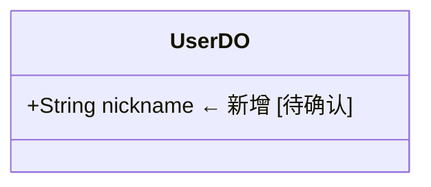

# 同步操作规程 (Sync Procedures)

> 本文件定义 Contract 轨文档同步的具体操作步骤，是 `contract-doc-sync` 技能的核心参考。
> 所有文档修复操作必须通过 `md-sections` 脚本精确定位，禁止全文加载。

**全局约定**：本文件中所有 `scripts/md-sections.sh` 引用均应替换为实际探测到的 `$MD_SECTIONS` 路径（项目版本优先 > skill 内置版本兜底）。

---

## 1. 概述

### 1.1 目标

在代码变更后，将 Contract 轨文档（`docs/`）同步到与代码一致的状态，确保文档始终是代码的**可信镜像**。

### 1.2 核心原则

| 原则 | 说明 |
|------|------|
| **精准定位** | 所有文档操作通过 `md-sections` 脚本精确定位章节，禁止全文读取 |
| **分层披露** | 先获取章节结构（JSON），再按需提取目标章节内容 |
| **最小修改** | 只修改与代码变更直接相关的文档段落，不做无关调整 |
| **保留格式** | 修改时严格保持原文档的 Markdown 格式、缩进和表格结构 |
| **标记待确认** | 半确定性修改必须标记 `[待确认]`，不可冒充确定性结论 |

### 1.3 工具链

```
detect-changes.py          → 分类代码变更，生成 JSON 报告
md-sections <file>         → 获取文档章节结构（JSON 树）
md-sections <file> "标题"  → 提取指定章节内容
Edit tool                  → 精确替换文档段落
```

---

## 2. 代码→文档映射规则

> 此表定义了代码变更位置到文档目标的基线映射，是同步操作的路由表。
> `detect-changes.py` 的 `CATEGORY_RULES` 和 `DOC_TARGETS` 与此表保持一致。

### 2.1 基线映射表

| 代码位置 | 文档目标 | 目标章节 | 维护级别 |
|----------|---------|---------|---------|
| `controller/*.java` | `docs/modules/{module}.md` | API 参考 | 🤖 确定性 |
| `facade/*.java` | `docs/modules/{module}.md` | API 参考 + 技术设计 | 🤖 确定性 |
| `service/*.java` | `docs/modules/{module}.md` | 技术设计 | 🤖 确定性 |
| `repository/*.java` (Mapper) | `docs/modules/{module}.md` | 技术设计 | 🤖 确定性 |
| `entity/*.java` (DO/VO/Request/Result) | `docs/modules/{module}.md` | 技术设计 > 类图 | 🤖👤 半确定性 |
| `config/*Properties.java` | `docs/conventions/configuration.md` | 配置参考 | 🤖 确定性 |
| `pom.xml` 版本变更 | `docs/architecture/system-overview.md` | 技术栈表格 | 🤖 确定性 |
| 新 Maven 模块 | `docs/modules/{module}.md` | 整个文件 | 👤 创造性 |
| Client 模块 (`clients/*`) | `docs/modules/client-{name}.md` | 整个文件 | 🤖 确定性 |
| `common/` 异常类 | `docs/conventions/error-handling.md` | 异常体系 | 🤖👤 半确定性 |
| `app/.../shared/` 横切关注点 | `docs/modules/{concern}.md` | 对应章节 | 🤖👤 半确定性 |
| `docs/` 文档变更 | `docs/` 自身 | 自引用（需交叉引用检查） | 🤖 确定性 |
| `scripts/` 脚本变更 | 无直接映射 | 工具链变更，报告中提示 | — |

### 2.2 模块名推断规则

`detect-changes.py` 的 `extract_module()` 函数从文件路径中提取模块名：

```
app/src/main/java/.../controller/UserController.java
→ module = "app"
→ doc = docs/modules/auth.md（通过 controller 类名推断所属业务模块）

clients/client-cache/src/.../CaffeineCacheConfig.java
→ module = "clients/client-cache"
→ doc = docs/modules/client-cache.md

common/src/.../BizException.java
→ module = "common"
→ doc = docs/conventions/error-handling.md
```

### 2.3 特殊映射

| 代码变更 | 文档动作 |
|----------|---------|
| 删除 Controller 方法 | 从 API 参考表格中移除对应行 |
| 重命名 Service 方法 | 更新技术设计中的方法引用 |
| 新增 Entity 字段 | 在类图中新增属性行 `[待确认]` |
| 修改 Properties 前缀 | 更新配置参考中的前缀列 |
| pom.xml 版本升级 | 更新 system-overview 技术栈表格的版本列 |
| 删除模块 | 归档对应文档（非删除） |

---

## 3. 维护级别策略

### 3.1 🤖 确定性维护 (Deterministic)

**适用范围**：方法签名、配置项、版本号、文件路径、API 端点、表格行

**执行方式**：自动修复，无需人工确认

**操作流程**：
1. 从代码中提取事实（方法名、参数、返回值、配置键值等）
2. 通过 `md-sections` 定位文档目标章节
3. 使用 Edit 工具精确替换

**判定标准**：满足以下**全部**条件
- 代码变更可以 1:1 映射到文档中的具体文本
- 不涉及业务语义解释或设计意图描述
- 修改后的文档在结构上与原文档一致（表格行、参数列表、代码块等）

**典型场景**：

| 场景 | 代码事实 | 文档操作 |
|------|---------|---------|
| Controller 端点变更 | `@PostMapping("/api/users")` → `@PutMapping("/api/users/{id}")` | 更新 API 参考表格的 HTTP Method + Path 列 |
| 新增配置项 | `private int maxRetries = 3;` | 在配置参考表格中新增一行 |
| 版本号升级 | `<mybatis-plus.version>3.5.9</mybatis-plus.version>` | 更新 system-overview 技术栈表格 |
| 新增依赖 | `<artifactId>bucket4j</artifactId>` | 在技术栈表格中新增一行 |
| 方法参数变更 | `findById(Long id)` → `findById(Long id, boolean includeDeleted)` | 更新 API 参考表格的参数列 |

### 3.2 🤖👤 半确定性维护 (Semi-Deterministic)

**适用范围**：业务描述、设计考量、Mermaid 图、时序说明、类图

**执行方式**：提出修改建议，标记为待确认

**操作流程**：
1. 从代码中提取事实
2. **理解代码意图**（需要推理，非机械提取）
3. 生成文档修改建议
4. 在修改位置标记 `[待确认]`
5. 在同步报告中列出所有待确认项

**判定标准**：满足以下**任意**条件
- 需要将代码行为翻译为自然语言描述
- 涉及 Mermaid 图的节点或连线变更
- 需要判断业务含义或设计意图
- 文档中没有精确对应的文本段落，需要新增内容

**标记格式**：

```markdown
<!-- 新增内容示例 -->
- 用户登录时先校验密码，再生成 Token [待确认]

<!-- 替换内容示例 -->
- ~~旧描述~~ → 新描述（基于代码变更：xxx） [待确认]

<!-- 图表更新示例 -->

```

**典型场景**：

| 场景 | 代码事实 | 文档操作 |
|------|---------|---------|
| Service 方法行为变更 | 新增参数校验逻辑 | 更新技术设计中的方法描述 `[待确认]` |
| Entity 新增字段 | `private String avatar;` | 在类图中新增属性 `[待确认]` |
| 业务规则修改 | 权限校验从 Service 移到 Facade | 更新设计考量描述 `[待确认]` |
| 新增异常分支 | 抛出 `BizException(ErrorCode.USER_NOT_FOUND)` | 在时序图中新增异常路径 `[待确认]` |

### 3.3 👤 创造性维护 (Creative)

**适用范围**：架构决策、设计模式引入、新模块创建、跨切面关注点

**执行方式**：跳过修复，在报告中通知人类

**操作流程**：
1. 检测到需要创造性维护的变更
2. 在同步报告中记录：变更描述 + 建议的文档动作
3. 提醒人类处理

**判定标准**：满足以下**任意**条件
- 需要创建新的文档文件
- 涉及架构层面的决策或权衡描述
- 需要编写从零开始的设计说明
- 变更影响多个文档或需要重新组织文档结构

**报告格式**：

```
## 👤 需要人工处理的文档变更

### [模块名] 新模块文档创建
- **变更文件**: clients/client-oss/ (新增)
- **建议动作**: 创建 docs/modules/client-oss.md
- **参考模板**: docs/modules/client-cache.md（现有客户端模块文档）
- **优先级**: 高

### [模块名] 架构设计更新
- **变更文件**: app/.../shared/ratelimit/ (新增限流横切关注点)
- **建议动作**: 更新 docs/architecture/system-overview.md 中限流相关描述
- **优先级**: 中
```

**典型场景**：

| 场景 | 代码事实 | 建议动作 |
|------|---------|---------|
| 新 Maven 模块创建 | `clients/client-payment/` 目录出现 | 创建 `docs/modules/client-payment.md` |
| 架构模式变更 | 引入新的设计模式 | 更新 `docs/architecture/design-patterns.md` |
| 新横切关注点 | `app/.../shared/new-feature/` 出现 | 创建或更新对应文档 |
| 删除模块 | 整个模块目录被移除 | 归档对应文档文件 |

---

## 4. 修复操作步骤

> 以下步骤按修复类型分类，每种类型给出从变更检测到文档更新的完整操作链。
> 所有 `md-sections` 命令中的 `{module}` 需替换为实际模块名。

### 4.1 修复 API 参考章节

**触发条件**：Controller 或 Facade 文件变更（category = `controller` 或 `facade`）

**步骤**：

```bash
# Step 1: 获取文档章节结构，确认目标章节存在
scripts/md-sections.sh docs/modules/{module}.md
# → 输出 JSON 树，检查是否包含 "API 参考" 节点

# Step 2: 提取 API 参考章节内容
scripts/md-sections.sh docs/modules/{module}.md "API 参考"
# → 输出该章节的完整 Markdown 内容

# Step 3: 读取 Controller 源码（使用 Read 工具）
# 提取以下信息：
#   - @RequestMapping / @GetMapping / @PostMapping 等注解 → HTTP Method + Path
#   - 方法名 → 操作名称
#   - 参数列表（@RequestParam, @PathVariable, @RequestBody） → 请求参数
#   - 返回值类型 → 响应结构

# Step 4: 比对代码事实与文档内容
# 逐行检查 API 参考表格中的每个端点：
#   - Method 是否匹配？
#   - Path 是否匹配？
#   - 参数是否完整？
#   - 返回值描述是否准确？

# Step 5: 执行修复（使用 Edit 工具）
# 示例：更新端点方法
# oldString: "| GET | /api/users/{id} | 查询用户 | - | UserVO |"
# newString: "| GET | /api/users/{id} | 查询用户 | includeDeleted: boolean | UserVO |"

# 示例：移除已删除的端点
# oldString: "| DELETE | /api/users/{id} | 删除用户 | - | void |\n"
# newString: ""

# 示例：新增端点
# oldString: "| POST | /api/users | 创建用户 | ... |"
# newString: "| POST | /api/users | 创建用户 | ... |\n| PATCH | /api/users/{id}/status | 更新状态 | status: String | UserVO |"
```

**表格格式约定**：

```markdown
| HTTP Method | Path | 描述 | 参数 | 返回值 | 备注 |
|-------------|------|------|------|--------|------|
| POST | /api/auth/login | 用户登录 | username, password | LoginResult | - |
```

### 4.2 修复技术设计章节

**触发条件**：Service、Repository、Facade 文件变更

**步骤**：

```bash
# Step 1: 获取文档章节结构
scripts/md-sections.sh docs/modules/{module}.md

# Step 2: 提取技术设计章节内容
scripts/md-sections.sh docs/modules/{module}.md "技术设计"

# Step 3: 如果技术设计有子章节，进一步定位
# 例如定位"登录时序图"子章节：
scripts/md-sections.sh docs/modules/{module}.md "技术设计" "登录时序图"

# Step 4: 读取源码（使用 Read 工具）
# Service/Repository 变更关注：
#   - 方法签名变更 → 更新方法描述
#   - 新增/删除方法 → 新增/移除方法说明
#   - 业务逻辑变更 → 提出描述更新建议 [待确认]

# Step 5: 执行修复
# 确定性修复（方法签名等）：
# oldString: "UserService 提供 `findById(Long id)` 方法"
# newString: "UserService 提供 `findById(Long id, boolean includeDeleted)` 方法"

# 半确定性修复（业务描述）：
# oldString: "查询用户时返回基本信息"
# newString: "查询用户时返回基本信息，可通过 includeDeleted 参数包含已删除用户 [待确认]"
```

**Mermaid 图更新规则**：

```markdown
# 时序图参与者变更 → 确定性修复
# oldString: "Controller->>Service: findById(id)"
# newString: "Controller->>Service: findById(id, includeDeleted)"

# 时序图新增步骤 → 半确定性修复
# 在合适位置插入新行并标记 [待确认]

# 类图新增属性 → 半确定性修复
# oldString: "class UserDO {\n        +Long id\n    }"
# newString: "class UserDO {\n        +Long id\n        +String nickname  ← 新增 [待确认]\n    }"
```

### 4.3 修复配置参考

**触发条件**：`*Properties.java` 或配置文件变更（category = `config`）

**步骤**：

```bash
# Step 1: 获取配置文档结构
scripts/md-sections.sh docs/conventions/configuration.md

# Step 2: 提取配置参考章节
scripts/md-sections.sh docs/conventions/configuration.md "配置参考"

# Step 3: 读取 Properties 源码（使用 Read 工具）
# 提取以下信息：
#   - @ConfigurationProperties 前缀 → 配置前缀
#   - 字段名 + 类型 + 默认值 → 配置项
#   - @NotBlank / @Min / @Max 等校验注解 → 约束说明

# Step 4: 比对并更新
# 确定性修复 — 新增配置项：
# oldString: "| middleware.cache.maximumSize | int | 1000 | 缓存最大条目数 |"
# newString: "| middleware.cache.maximumSize | int | 1000 | 缓存最大条目数 |\n| middleware.cache.expireAfterWrite | Duration | 10m | 写入后过期时间 |"

# 确定性修复 — 默认值变更：
# oldString: "| middleware.cache.maximumSize | int | 1000 | 缓存最大条目数 |"
# newString: "| middleware.cache.maximumSize | int | 2000 | 缓存最大条目数 |"
```

**配置表格格式约定**：

```markdown
| 配置键 | 类型 | 默认值 | 说明 |
|--------|------|--------|------|
| middleware.cache.maximumSize | int | 1000 | 缓存最大条目数 |
```

### 4.4 修复版本号表格

**触发条件**：`pom.xml` 变更（category = `pom`）

**步骤**：

```bash
# Step 1: 获取系统全景文档结构
scripts/md-sections.sh docs/architecture/system-overview.md

# Step 2: 提取技术栈章节（含版本号表格）
scripts/md-sections.sh docs/architecture/system-overview.md "技术栈"

# Step 3: 读取 pom.xml（使用 Read 工具）
# 提取版本属性：
#   <properties>
#     <mybatis-plus.version>3.5.9</mybatis-plus.version>
#   </properties>

# Step 4: 比对并更新
# oldString: "| MyBatis-Plus | 3.5.8 |"
# newString: "| MyBatis-Plus | 3.5.9 |"

# 新增依赖：
# oldString: "| Sa-Token | 1.45.0 |"
# newString: "| Sa-Token | 1.45.0 |\n| Bucket4j | 8.17.0 |"
```

### 4.5 修复类图

**触发条件**：Entity 文件变更（category = `entity`）

**步骤**：

```bash
# Step 1: 获取模块文档结构
scripts/md-sections.sh docs/modules/{module}.md

# Step 2: 定位类图章节（通常在技术设计下）
scripts/md-sections.sh docs/modules/{module}.md "技术设计" "类图"
# 如果 "类图" 未命中，尝试：
scripts/md-sections.sh docs/modules/{module}.md "类图"

# Step 3: 读取 Entity 源码（使用 Read 工具）
# 提取以下信息：
#   - 类名 + 继承关系 → 类定义
#   - 字段名 + 类型 → 属性
#   - @TableName / @TableId 等注解 → 元信息

# Step 4: 执行修复（半确定性 — 必须标记 [待确认]）
# 新增字段：
# oldString: "class UserDO {\n        +Long id\n        +String username\n    }"
# newString: "class UserDO {\n        +Long id\n        +String username\n        +String avatar  ← 新增 [待确认]\n    }"

# 删除字段：
# oldString: "        +String legacyField\n"
# newString: ""
```

### 4.6 修复变更历史

**触发条件**：任何同步操作完成后

**步骤**：

```bash
# Step 1: 定位变更历史章节
scripts/md-sections.sh docs/modules/{module}.md "变更历史"
# 如果模块文档没有变更历史章节，跳过此步骤

# Step 2: 追加新记录
# oldString: "| 2026-04-10 | 初始版本 | - |"
# newString: "| 2026-04-10 | 初始版本 | - |\n| 2026-04-14 | API 端点变更、新增配置项 | 同步代码变更 |"
```

**变更历史格式约定**：

```markdown
| 日期 | 变更内容 | 备注 |
|------|---------|------|
| 2026-04-14 | Controller 端点从 GET 改为 POST | 同步 commit abc1234 |
```

### 4.7 修复错误处理文档

**触发条件**：`common/` 异常类变更（category = `common`）

**步骤**：

```bash
# Step 1: 获取错误处理文档结构
scripts/md-sections.sh docs/conventions/error-handling.md

# Step 2: 提取异常体系章节
scripts/md-sections.sh docs/conventions/error-handling.md "异常体系"

# Step 3: 读取异常源码（使用 Read 工具）
# 提取以下信息：
#   - ErrorCode 枚举新增项 → 新增错误码
#   - BaseException 子类新增 → 新增异常类说明

# Step 4: 执行修复
# 确定性 — 新增错误码枚举值：
# 在错误码表格中新增行

# 半确定性 — 新增异常子类：
# 在异常体系描述中新增说明 [待确认]
```

---

## 5. 同步级别流程

> 同步级别决定操作的深度和自动化程度，由调用方（SKILL.md 工作流）根据场景选择。

### 5.1 L0: 漂移检测

**目标**：仅报告文档与代码的差异，不做任何修复

**执行流程**：

```
1. 运行 detect-changes.py 获取变更报告
2. 对每个受影响的文档目标：
   a. 获取文档结构：md-sections <doc-path>
   b. 提取相关章节内容：md-sections <doc-path> "<section>"
   c. 读取对应源码
   d. 比对差异，记录但不修复
3. 输出漂移报告（Markdown 格式）
```

**漂移报告格式**：

```markdown
## 文档漂移报告

### 📄 docs/modules/auth.md

#### API 参考 — 漂移项

| 类型 | 位置 | 代码事实 | 文档当前值 | 维护级别 |
|------|------|---------|-----------|---------|
| 端点变更 | LoginController.login | POST /api/auth/login | GET /api/auth/login | 🤖 |
| 参数新增 | LoginController.login | captcha: String | (缺失) | 🤖 |

#### 技术设计 — 漂移项

| 类型 | 位置 | 代码事实 | 文档当前值 | 维护级别 |
|------|------|---------|-----------|---------|
| 描述过时 | AuthService.login | 新增验证码校验 | 无验证码相关描述 | 🤖👤 |

### 📄 docs/architecture/system-overview.md

#### 技术栈 — 漂移项

| 类型 | 位置 | 代码事实 | 文档当前值 | 维护级别 |
|------|------|---------|-----------|---------|
| 版本过时 | MyBatis-Plus | 3.5.9 | 3.5.8 | 🤖 |
```

**输出要求**：
- 按文档文件分组
- 按章节分组
- 每个漂移项包含：类型、位置、代码事实、文档当前值、维护级别
- 汇总统计：🤖 N 项 / 🤖👤 N 项 / 👤 N 项

### 5.2 L1: 快速同步

**目标**：仅修复确定性（🤖）漂移项

**执行流程**：

```
1. 运行 L0 漂移检测
2. 筛选维护级别 = 🤖 的漂移项
3. 按修复类型（4.1-4.7）执行修复：
   a. md-sections 定位章节
   b. Edit 工具精确替换
4. 输出同步报告
```

**同步报告格式**：

```markdown
## L1 同步报告

### 已修复 (🤖)
- ✅ docs/modules/auth.md — API 参考: 更新 LoginController.login 端点方法 GET→POST
- ✅ docs/modules/auth.md — API 参考: 新增 captcha 参数
- ✅ docs/architecture/system-overview.md — 技术栈: MyBatis-Plus 版本 3.5.8→3.5.9

### 跳过 (🤖👤)
- ⏭️ docs/modules/auth.md — 技术设计: AuthService.login 描述过时（需人工确认）

### 跳过 (👤)
- ⏭️ (无)

### 统计
- 已修复: 3 项
- 待确认: 1 项
- 需人工: 0 项
```

### 5.3 L2: 常用同步

**目标**：修复确定性项 + 提出半确定性建议 + 报告创造性项

**执行流程**：

```
1. 运行 L0 漂移检测
2. 修复所有 🤖 漂移项（同 L1）
3. 对每个 🤖👤 漂移项：
   a. 理解代码意图
   b. 生成修改建议（具体到 oldString/newString）
   c. 在文档中标记 [待确认]
   d. 在报告中列出建议
4. 对每个 👤 漂移项：
   a. 在报告中记录变更描述和建议动作
5. 输出同步报告（含待确认项详情）
```

**同步报告格式（L2 扩展）**：

```markdown
## L2 同步报告

### 已修复 (🤖)
- ✅ ...（同 L1）

### 已标记待确认 (🤖👤)

#### docs/modules/auth.md — 技术设计: AuthService.login 描述更新
- **代码事实**: AuthService.login() 新增 `captchaCode` 参数校验
- **当前文档**: "用户登录时校验用户名和密码"
- **建议修改**: "用户登录时校验用户名、密码和验证码"
- **标记位置**: docs/modules/auth.md 技术设计章节

#### docs/modules/auth.md — 技术设计: 类图新增字段
- **代码事实**: LoginRequest 新增 `captchaCode` 字段
- **当前文档**: LoginRequest 类图中无此字段
- **建议修改**: 在类图中新增 `+String captchaCode` 行
- **标记位置**: docs/modules/auth.md 技术设计 > 类图

### 需人工处理 (👤)
- ⏭️ (无)

### 统计
- 已修复: 3 项
- 已标记待确认: 2 项
- 需人工: 0 项
```

### 5.4 L3: 高度同步

**目标**：L2 全部功能 + 语义检查 + 更详细建议 + 上下文分析

**执行流程**：

```
1. 运行 L0 漂移检测
2. 修复所有 🤖 漂移项
3. 对每个 🤖👤 漂移项（增强处理）：
   a. 读取完整的 Service/Facade 源码（不只是变更方法）
   b. 理解整体业务上下文
   c. 检查关联文档章节是否也需要同步
   d. 生成更精确的修改建议，包含修改理由
   e. 在文档中标记 [待确认] 并附带修改理由
4. 语义检查：
   a. 检查文档内部一致性（API 参考与技术设计是否矛盾）
   b. 检查跨文档引用是否有效（AGENTS.md 索引表中的路径是否指向存在的文档）
   c. 检查 OpenSpec Intent 轨是否需要更新
5. 对每个 👤 漂移项（增强报告）：
   a. 提供参考模板或类似文档作为编写依据
   b. 建议优先级
   c. 估算工作量（小/中/大）
6. 输出增强版同步报告
```

**同步报告格式（L3 扩展）**：

```markdown
## L3 同步报告

### 已修复 (🤖)
- ✅ ...（同 L2）

### 已标记待确认 (🤖👤) — 含详细分析

#### docs/modules/auth.md — 技术设计: AuthService.login 描述更新
- **代码事实**: AuthService.login() 新增 `captchaCode` 参数校验，校验逻辑委托给 CaptchaService
- **当前文档**: "用户登录时校验用户名和密码"
- **建议修改**: "用户登录时校验用户名、密码和验证码。验证码通过 CaptchaService 验证。"
- **修改理由**: captchaCode 校验是新增的防御性逻辑，应在描述中体现
- **关联检查**:
  - API 参考: LoginController.login 的参数列表已同步 ✅
  - 类图: LoginRequest.captchaCode 已标记 [待确认] ✅
  - 时序图: 未包含验证码校验步骤 → 建议新增 [待确认]
- **标记位置**: docs/modules/auth.md 技术设计章节

### 语义检查结果

#### 文档内部一致性
- ⚠️ docs/modules/auth.md: API 参考中列出 5 个端点，技术设计中只描述了 3 个方法
  → 可能缺少 Facade 层方法的描述

#### 跨文档引用
- ✅ AGENTS.md 索引表中的所有路径均有效
- ⚠️ docs/modules/client-cache.md 引用了 docs/conventions/configuration.md 中的 "配置参考" 章节，但该章节标题为 "配置项参考"（标题不匹配）

#### OpenSpec Intent 轨
- ⚠️ openspec/specs/auth/spec.md 中的登录流程描述可能需要更新以反映验证码校验

### 需人工处理 (👤) — 含操作建议

#### 新模块文档创建: clients/client-payment
- **建议动作**: 创建 docs/modules/client-payment.md
- **参考模板**: docs/modules/client-cache.md
- **优先级**: 高
- **工作量**: 中（约 30 分钟）
- **模板来源**: client-cache.md 的结构可直接复用，需替换具体配置项和 API

### 统计
- 已修复: 3 项
- 已标记待确认: 3 项（含 1 项关联检查发现）
- 语义问题: 3 项
- 需人工: 1 项
```

---

## 附录 A: md-sections 错误处理

| 错误码 | 含义 | 处理方式 |
|--------|------|---------|
| `missing_file` | 未指定文件路径 | 检查调用参数 |
| `file_not_found` | 文件不存在 | 检查文档路径是否正确，可能是新模块尚未创建文档 |
| `not_found` | 标题未匹配 | 检查 JSON 章节树中的实际标题文本，可能标题措辞不同 |
| `line_not_found` | 行号不在任何章节内 | 行号超出文件范围 |

**`not_found` 错误的恢复流程**：

```bash
# 假设 "API 参考" 未命中，脚本返回：
# {"error":"not_found","missing":["API 参考"],"children":[...]}

# 1. 检查返回的 children 子树，找到实际标题
# 可能实际标题是 "API 端点" 或 "接口参考"

# 2. 用实际标题重试
scripts/md-sections.sh docs/modules/{module}.md "API 端点"
```

## 附录 B: Edit 工具使用注意事项

1. **oldString 必须精确匹配**：从 md-sections 输出中复制原文，保留所有空格和换行
2. **避免歧义匹配**：如果 oldString 可能在文件中出现多次，扩大上下文范围使其唯一
3. **保持缩进**：表格行、列表项的缩进必须与原文一致
4. **表格行操作**：
   - 新增行：找到表格最后一行，在其后追加
   - 删除行：将目标行替换为空字符串，注意处理前后的 `\n`
   - 修改行：精确匹配整行内容
5. **Mermaid 图操作**：
   - 代码块围栏（```）不能作为 oldString 的一部分
   - 只修改围栏内部的图表内容

## 附录 C: 同步级别选择指南

| 场景 | 推荐级别 | 理由 |
|------|---------|------|
| CI/CD 自动检查 | L0 | 只检测不修改，适合自动化流水线 |
| 提交前快速检查 | L1 | 快速修复明显的版本号/端点不一致 |
| 功能开发完成后的文档同步 | L2 | 平衡自动化效率和人工确认需求 |
| 版本发布前的全面文档审计 | L3 | 最全面，包含语义检查和关联分析 |
| 重构后的文档对齐 | L3 | 重构影响面广，需要深度检查 |
