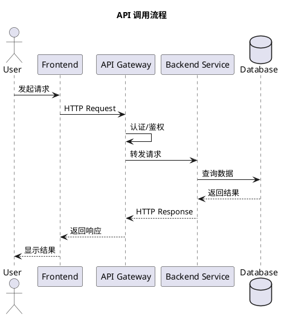
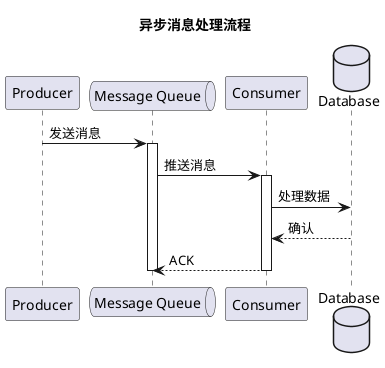
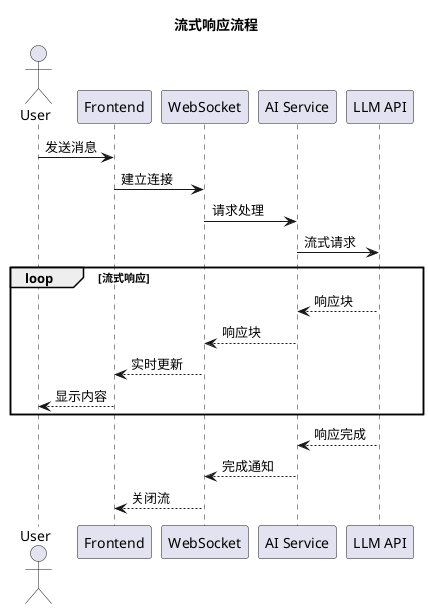
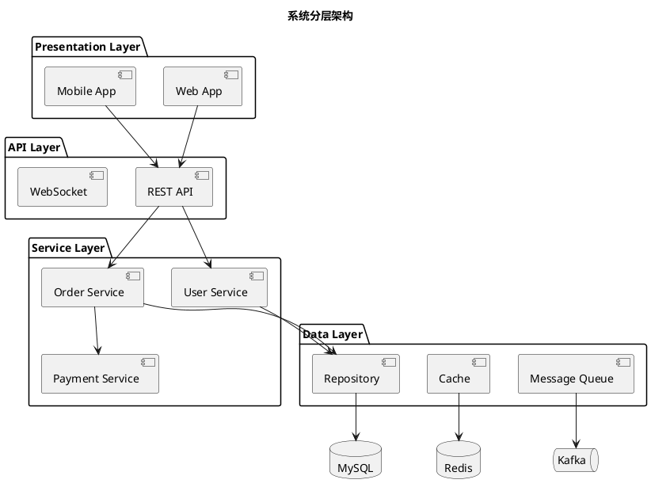
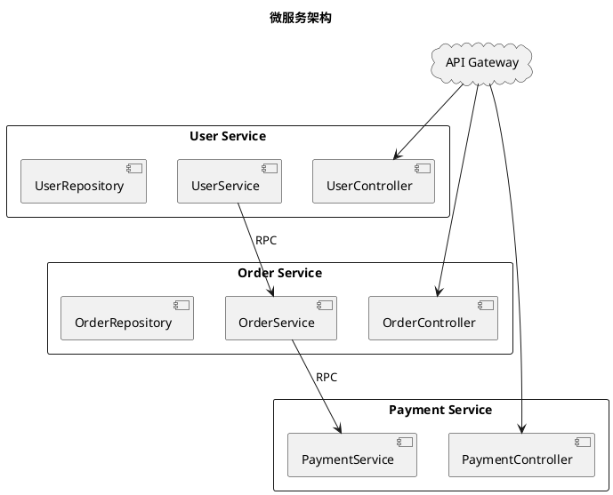
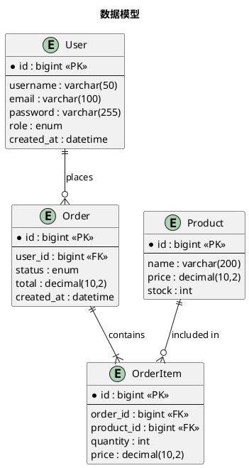
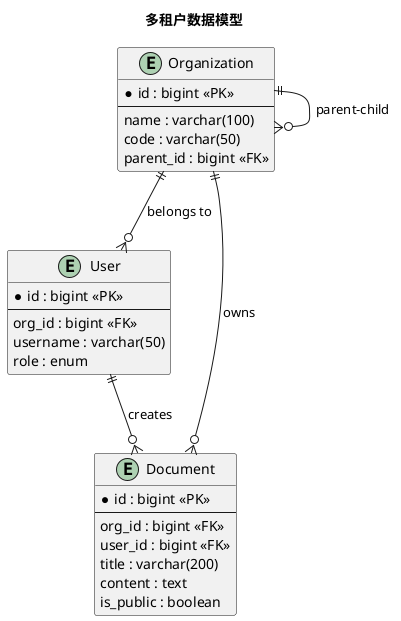
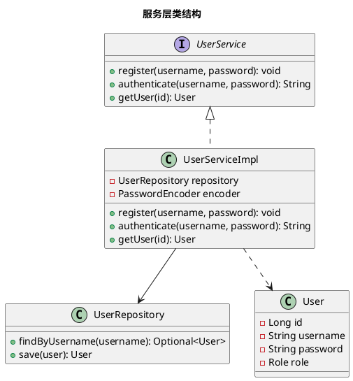
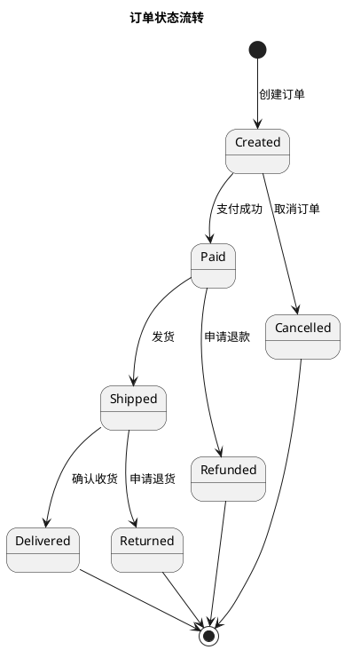

# PlantUML 图表模式

> 常用图表模板和最佳实践

## 目录

1. [图表类型选择](#图表类型选择)
2. [序列图模板](#序列图模板)
3. [组件图模板](#组件图模板)
4. [ER图模板](#er图模板)
5. [类图模板](#类图模板)
6. [状态图模板](#状态图模板)
7. [复杂度控制](#复杂度控制) ⭐ 重要
8. [渐进式拆分策略](#渐进式拆分策略) ⭐ 重要
9. [语法校验](#语法校验)
10. [最佳实践](#最佳实践)

---

## 图表类型选择

| 场景 | 推荐图表 | PlantUML 关键字 |
|------|----------|-----------------|
| 展示交互流程 | 序列图 | `sequenceDiagram` |
| 展示组件关系 | 组件图 | `@startuml` + `[Component]` |
| 展示类结构 | 类图 | `classDiagram` |
| 展示数据模型 | ER图 | `entity` |
| 展示状态变化 | 状态图 | `stateDiagram` |
| 展示部署结构 | 部署图 | `deploymentDiagram` |

---

## 序列图模板

### 标准 API 调用



### 异步消息处理



### 流式响应



---

## 组件图模板

### 分层架构



### 微服务架构



---

## ER图模板

### 标准关系



### 多租户模型



---

## 类图模板

### 服务类结构



---

## 状态图模板

### 订单状态流转



---

## 最佳实践

### 1. 保持简洁

```plantuml
# 好的做法 - 只展示关键参与者
participant User
participant API
participant DB

# 不好的做法 - 包含过多细节
participant User
participant Browser
participant Nginx
participant API Gateway
participant Load Balancer
participant Service A
participant Service B
...
```

### 2. 使用别名

```plantuml
# 好的做法 - 使用有意义的别名
actor "用户" as user
participant "前端应用" as fe
participant "后端服务" as be

user -> fe: 登录
fe -> be: 认证请求
```

### 3. 添加注释

```plantuml
user -> api: 请求
note right of api
  验证 Token
  检查权限
end note
```

### 4. 使用分组

```plantuml
group 认证流程
    user -> auth: 登录
    auth --> user: Token
end

group 业务流程
    user -> api: 业务请求
    api --> user: 响应
end
```

---

## 图表渲染工具

| 工具 | 用途 | 链接 |
|------|------|------|
| VS Code 插件 | 本地预览 | PlantUML |
| PlantText | 在线编辑 | planttext.com |
| PlantUML Server | 自托管 | plantuml.com |
| JetBrains 插件 | IDE 集成 | PlantUML Integration |

---

## 复杂度控制

### 复杂度阈值

**每个图表应遵循以下限制**：

| 指标 | 推荐值 | 最大值 | 说明 |
|------|--------|--------|------|
| **总元素数** | ≤ 20 | 25 | 节点+箭头+动作+注释 |
| **代码行数** | ≤ 50 | 60 | 包含 @startuml/@enduml |
| **节点数量** | ≤ 15 | 20 | 组件/包/数据库等 |
| **箭头数量** | ≤ 15 | 20 | 连接线 |

### 为什么需要控制复杂度？

```
❌ 过于复杂的图表：
   - 难以快速理解
   - 渲染可能失败
   - 信息过载
   - 无法聚焦重点

✅ 适度拆分的图表：
   - 每个图聚焦一个主题
   - 由浅入深，渐进展示
   - 便于维护和更新
   - 渲染稳定可靠
```

### 复杂度计算

```javascript
// 元素统计公式
totalElements = nodes + arrows + actions + notes + participants

// 节点类型
nodes = [Component] + component + package + database + queue + entity + actor

// 箭头类型
arrows = --> + -> + ..> + <--

// 动作（活动图）
actions = :action;

// 注释
notes = note right + note left
```

---

## 渐进式拆分策略

### 核心原则

**由浅入深，层层递进**：
1. **概览图**：展示全局，元素少（10-15个）
2. **详图**：深入细节，按模块/阶段拆分（15-20个/图）
3. **补充图**：特殊场景，可选阅读

---

## ⭐ 拆分决策规则

### 必须拆分的情况

| 条件 | 说明 | 示例 |
|------|------|------|
| **元素数 > 30** | 无论如何都需要拆分 | 87元素的架构图 → 4个小图 |
| **元素数 > 25 且 行数 > 70** | 复杂度过高 | 技术选型图 → 核心架构 + 模块关系 |
| **单一图表包含多个独立主题** | 主题混乱 | 前后端混合图 → 前端图 + 后端图 |

### 可以不拆分的情况

| 条件 | 说明 | 示例 |
|------|------|------|
| **元素数 25-30，行数 ≤ 60** | 概览图/架构图，拆分会破坏整体视图 | 系统架构概览图 |
| **元素数 ≤ 25，行数 > 60** | ER图、note较多的流程图 | 数据模型ER图（元素少但note多） |
| **序列图元素数 25-30** | 序列图天然纵向排列，可读性好 | WebSocket通信流程 |
| **技术选型分析图** | 需要展示完整技术栈 | Vue + Naive UI 架构图 |

### 拆分决策流程

```
图表元素数 > 25？
│
├── 元素数 > 30
│   └── ✅ 必须拆分
│       └── 选择拆分策略：按层级 / 按阶段 / 按模块
│
├── 元素数 26-30
│   │
│   ├── 行数 > 70
│   │   └── ✅ 建议拆分
│   │
│   └── 行数 ≤ 70
│       │
│       ├── 是概览图/架构图？
│       │   └── ⏸️ 可不拆分（保持整体视图）
│       │
│       ├── 是序列图？
│       │   └── ⏸️ 可不拆分（纵向排列可读）
│       │
│       └── 其他类型
│           └── ⚠️ 视情况拆分
│
└── 元素数 ≤ 25
    │
    ├── 行数 > 80
    │   └── ⚠️ 考虑精简 note 内容
    │
    └── 行数 ≤ 80
        └── ✅ 保持单图
```

---

## 拆分策略

### 策略 1：按层级拆分（适用于架构图）

**原图**（87 元素）：
```
整体系统架构图，包含：
- 前端层（Vue、Router、Store...）
- 后端层（Controller、Service、Repository...）
- 数据层（MySQL、Redis、ES...）
- AI服务（DeepSeek、Embedding...）
```

**拆分后**（4 个图，共 ~60 元素）：

```plantuml
// 1. 概览图（15 元素）- 展示主要层次
@startuml system-overview
package "前端层" { [Vue App] }
package "后端层" { [Spring Boot] }
database "数据层" { [MySQL] }
[Vue App] --> [Spring Boot]
[Spring Boot] --> [MySQL]
@enduml

// 2. 前端详图（18 元素）- 前端模块细节
@startuml frontend-detail
package "前端" {
    [Vue App] --> [Pinia Store]
    [Vue App] --> [Vue Router]
    [Pinia Store] --> [Axios]
}
@enduml

// 3. 后端详图（15 元素）
// 4. 数据层详图（12 元素）
```

### 策略 2：按阶段拆分（适用于流程图）

**原图**（70+ 元素）：
```
完整 RAG 对话流程：
连接 → 发消息 → 搜索 → 构建 Prompt → LLM 调用 → 响应 → 完成
```

**拆分后**（5 个图，共 ~50 元素）：

```markdown
### 阶段一：连接建立（12 元素）
@startuml rag-phase1
User -> Frontend: 打开页面
Frontend -> WebSocket: 建立连接
@enduml

### 阶段二：消息处理（10 元素）
### 阶段三：混合搜索（15 元素）
### 阶段四：LLM 调用（8 元素）
### 阶段五：流式响应（10 元素）
```

### 策略 3：按模块拆分（适用于依赖图）

**原图**（72 元素）→ 拆分为 4 个图：
1. **模块概览**（15 元素）
2. **服务层详情**（18 元素）
3. **数据访问层**（12 元素）
4. **外部客户端**（10 元素）

### 策略 4：分离核心与扩展（适用于混合流程图）

**原图**（40+ 元素）：
```
完整流程：基础流程 + 停止响应 + 错误处理
```

**拆分后**（2 个图）：
1. **基础流程**（20 元素）：连接 → 发送 → 响应 → 完成
2. **扩展流程**（15 元素）：停止响应 + 错误处理

---

## 实际案例参考

### ✅ 已拆分的图表

| 原图表 | 元素数 | 拆分后 | 原因 |
|--------|--------|--------|------|
| vue-design | 42 | vue-core-architecture + vue-pages-components | 元素数 > 30 |
| mysql-design | 37 | mysql-repository-layer + mysql-service-layer | 元素数 > 30 |
| springboot-design | 31 | springboot-core + springboot-starters | 元素数 > 30 |
| kafka-design | 31 | kafka-producer + kafka-consumer | 元素数 > 30 |
| multi-tenant-architecture | 32 | tenant-data-isolation + permission-control | 元素数 > 30 |
| es-design | 28 | es-module + es-dependencies | 元素数 > 25，行数 > 60 |
| redis-design | 26 | redis-services + redis-data-structures | 元素数 > 25，可按模块拆分 |
| WebSocket通信流程 | 41 | WebSocket基础流程 + WebSocket扩展流程 | 元素数 > 30 |

### ⏸️ 未拆分的图表（合理）

| 图表 | 元素数 | 行数 | 不拆分原因 |
|------|--------|------|------------|
| system-overview | 36 | 63 | 概览图，需要展示完整技术栈 |
| rag-chat-flow | 24 | 72 | 序列图，元素数 ≤ 25 |
| er-diagram | 6 | 83 | ER图，元素少但note多 |
| auth-flow | 29 | 35 | 序列图，纵向排列可读 |
| 权限验证流程 | 19 | 76 | 活动图，元素少但note多 |

---

## 语法校验

### 常见语法错误

| 错误 | 错误示例 | 正确写法 |
|------|----------|----------|
| **组件名含空格** | `[User Service]`<br>`note right of User Service` | `[User Service] as US`<br>`note right of US` |
| **note right of 组件** | `note right of [Component]` | `[Component] as C`<br>`note right of C` |
| **loop 在组件图** | `loop {...}` in component diagram | 改用序列图，或用 `note` 描述 |
| **-x-> 箭头** | `A -x-> B` | `A ..> B : 无权` |
| **package 颜色** | `package "X" #Color` | 使用 `skinparam packageBackgroundColor<<stereotype>> Color` |
| **外部 include** | `!include <archimate/...>` | 移除或内联定义 |

### 使用校验脚本

```bash
# 验证单个文件
python3 scripts/validate_plantuml.py docs/README.md

# 验证整个目录
python3 scripts/validate_plantuml.py ./docs --verbose

# 设置复杂度阈值
python3 scripts/validate_plantuml.py ./docs --max-elements 30
```

### 校验输出示例

```
📄 docs/architecture.md
──────────────────────────────────────────────────

✅ system-overview
   元素: 15 | 行数: 25

⚠️ backend-detail
   元素: 28 | 行数: 58
   拆分建议:
   - [component] 按层级/模块拆分

❌ full-architecture
   元素: 87 | 行数: 150
   语法错误:
   - package 上使用 #Color 可能不支持 (行 4)
   拆分建议:
   - [component] 按层级/模块拆分

──────────────────────────────────────────────────
总计: 3 | ✅ 通过: 1 | ⚠️ 警告: 1 | ❌ 错误: 1
```
