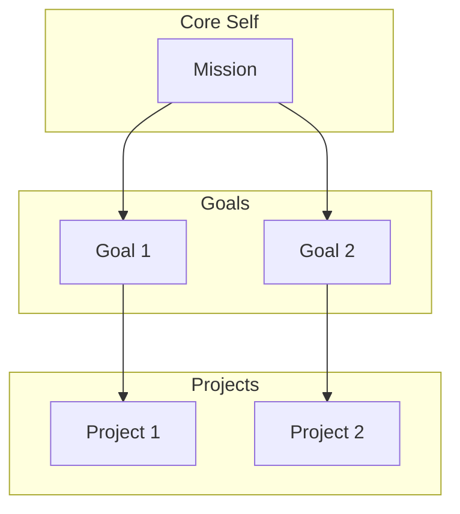

# Personal Ontology

**Your own Palantir — a knowledge graph of who you are.**

A framework for organizing your life as interconnected Objects (beliefs, goals, projects) and Links (relationships between them). Your AI assistant uses this graph to make decisions aligned with who you are.

## What It Does

- **Extracts** your beliefs, predictions, goals, and projects from existing notes
- **Organizes** them into a 6-layer hierarchy (Higher Order → Beliefs → Predictions → Core Self → Goals → Projects)
- **Visualizes** relationships as an interactive Mermaid graph
- **Validates** alignment (flags orphan projects, stale predictions, contradictions)
- **Integrates** into daily briefings as invisible "meaning guardrails"

## The Hierarchy

```
Layer 1: Higher Order     — What you orient toward (God, truth, universe)
Layer 2: Beliefs          — What you hold true about reality
Layer 3: Predictions      — Testable bets about the future
Layer 4: Core Self        — Mission, Values, Strengths
Layer 5: Goals            — Time-bound objectives
Layer 6: Projects         — Organized efforts toward goals
```

Every Project must serve a Goal. Every Goal must serve Core Self. Orphans get flagged.

## Quick Start

### 1. Bootstrap from existing notes
```
"Bootstrap my personal ontology"
```
The agent scans your notes, extracts candidate Objects, and presents them for review. Nothing auto-commits.

### 2. Review and confirm
For each candidate, you can:
- **Accept** — add as-is
- **Edit** — modify before adding
- **Skip** — don't add

### 3. Fill gaps manually
Work through `prompts.md` for anything the bootstrap missed.

### 4. Daily integration (optional)
Add ontology checks to your briefings:
- Morning: "What goal should I advance today?"
- Evening: "Did today's work serve my mission?"

## File Structure

After setup, your ontology lives in your notes folder:

```
My_Personal_Ontology/
├── index.md           ← Mermaid visualization + navigation
├── 1-higher-order.md  ← Transcendent orientation
├── 2-beliefs.md       ← Foundational assumptions
├── 3-predictions.md   ← Testable, time-bound bets
├── 4-core-self.md     ← Mission, Values, Strengths
├── 5-goals.md         ← Time-bound objectives
└── 6-projects.md      ← Organized efforts
```

## Link Types

| Link | Meaning |
|------|---------|
| `serves` | Directly supports an outcome |
| `supports` | Provides evidence/foundation |
| `contradicts` | In tension with |
| `depends-on` | Requires for completion |

## Visualization

The index.md includes a Mermaid diagram showing all Objects and their relationships:



## Agent Integration

Once your ontology exists, your AI assistant can:
- Reference it when helping you make decisions
- Flag tasks that don't serve any goal
- Surface stale predictions for review
- Detect contradictions between beliefs and actions

### Adaptive Prompts

If key layers are empty (Higher Order, Predictions), the agent will occasionally ask a single, optional question — at most once per week. No nagging.

## Requirements

- Clawdbot (or any AI agent that can read markdown)
- Obsidian (recommended) or any markdown-based notes system

## Install

```bash
clawdhub install personal-ontology
```

Or manually copy the skill folder to your Clawdbot skills directory.

## Philosophy

This isn't about productivity — it's about alignment. The goal is to ensure your daily actions connect to what actually matters to you.

A project without a goal is drift. A goal without connection to your core self is someone else's priority. This system makes those disconnects visible.

---

*"Know thyself" — now machine-readable.*
