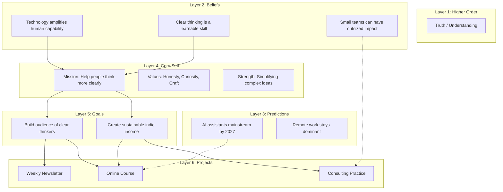

# Personal Ontology — Demo

*Example ontology showing the structure and relationships.*

---

## Ontology Map

---

## Layer Details

| Layer | File |
|------:|------|
| 1. Higher Order | [[1-higher-order]] |
| 2. Beliefs | [[2-beliefs]] |
| 3. Predictions | [[3-predictions]] |
| 4. Core Self | [[4-core-self]] |
| 5. Goals | [[5-goals]] |
| 6. Projects | [[6-projects]] |

---

*This is a demo. Your ontology will reflect your actual beliefs, goals, and projects.*
