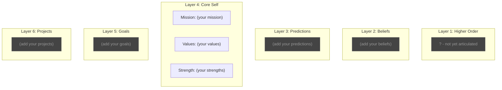

# Personal Ontology

*A compact map of what matters — your "meaning guardrails."*

---

## Ontology Map

*Update this diagram as you add Objects. Connect them with arrows to show relationships.*

---

## Layer Details

| Layer | File |
|------:|------|
| 1. Higher Order | [[1-higher-order]] |
| 2. Beliefs | [[2-beliefs]] |
| 3. Predictions | [[3-predictions]] |
| 4. Core Self | [[4-core-self]] |
| 5. Goals | [[5-goals]] |
| 6. Projects | [[6-projects]] |

---

## Getting Started

1. Work through the layers top-to-bottom using the prompts
2. Or run a bootstrap scan on your existing notes
3. Update the Mermaid diagram above as you add Objects
4. Every Project should connect to a Goal; every Goal to Core Self

---

## Related

- [[Ontology_Suggestions]] — Candidates waiting for review

---

*Created: [date]*
