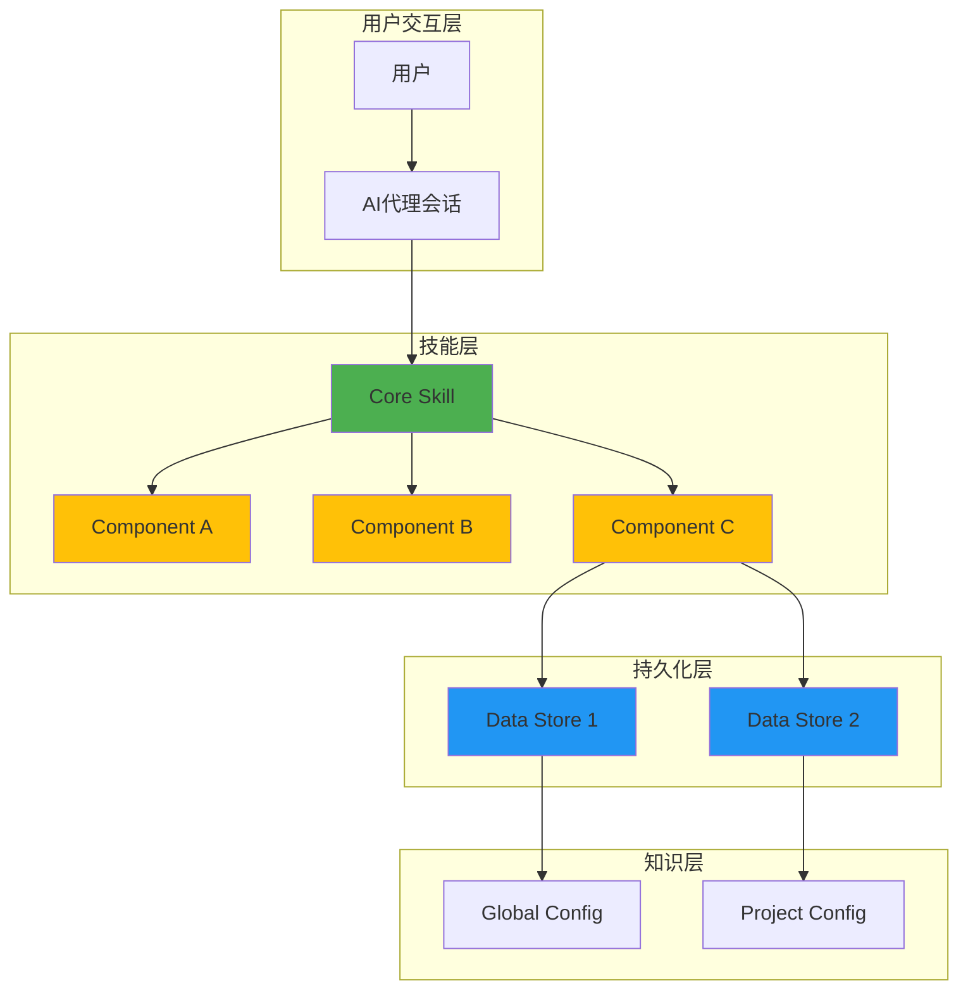
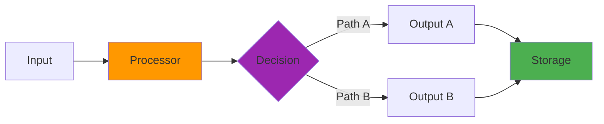
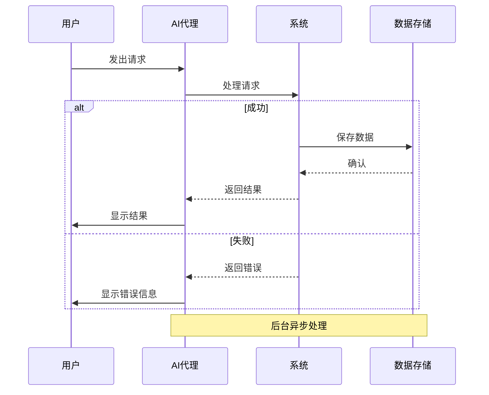
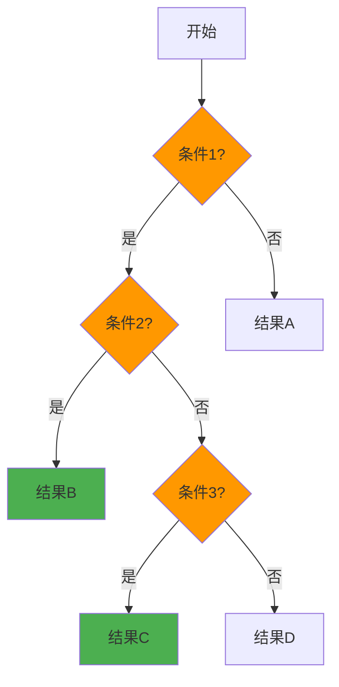
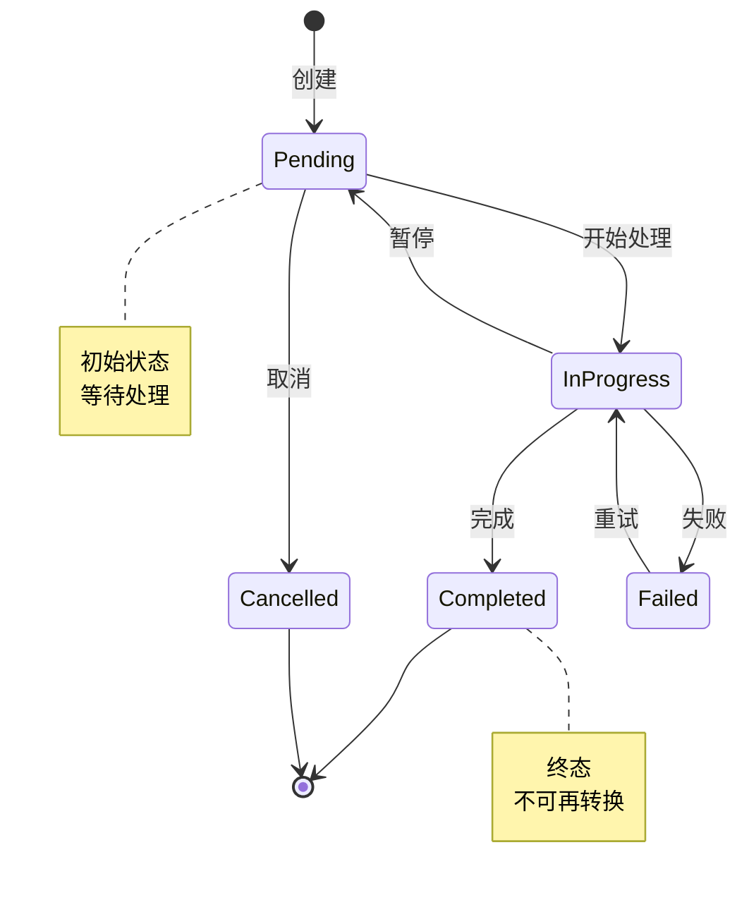
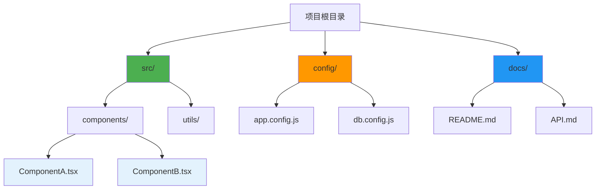
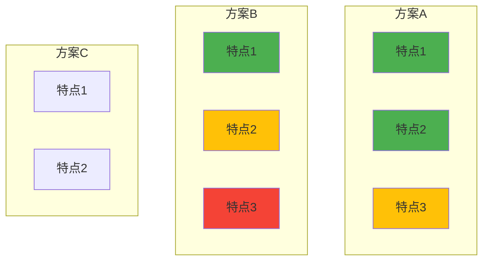
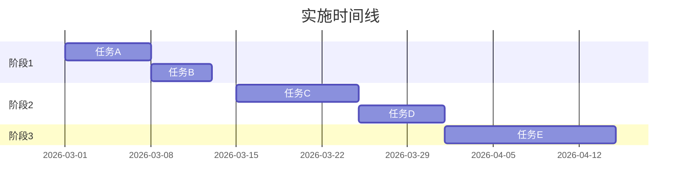
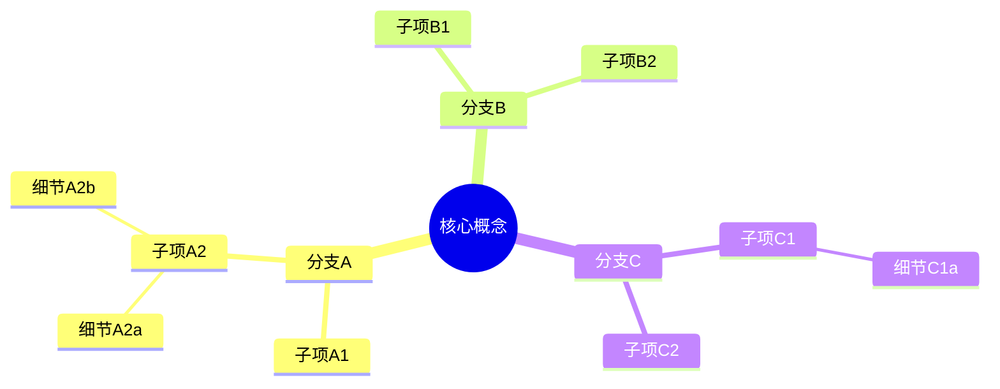
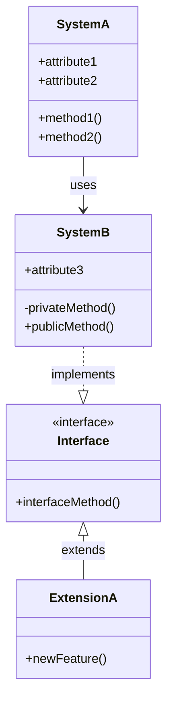

# Mermaid Diagram Examples

Common diagram patterns used in Architecture Visualization documents.

## 1. System Architecture (Layered)



**Use when**: Showing component hierarchy and data flow in layers

---

## 2. Data Flow



**Use when**: Showing how data moves through the system

---

## 3. Sequence Diagram



**Use when**: Showing interactions between components over time

---

## 4. Decision Tree



**Use when**: Showing conditional logic and branching

---

## 5. State Machine



**Use when**: Showing lifecycle and state transitions

---

## 6. File System Topology



**Use when**: Showing directory structure and file organization

---

## 7. Comparison Graph



**Use when**: Comparing features across different options

---

## 8. Gantt Chart (Timeline)



**Use when**: Showing project timelines or lifecycle stages

---

## 9. Mind Map



**Use when**: Showing hierarchical relationships and categories

---

## 10. Class Diagram (for OO systems)



**Use when**: Documenting object-oriented architecture

---

## Color Coding Standards

Consistent colors help readers quickly understand diagrams:

| Color | Hex | Mermaid | Use For |
|-------|-----|---------|---------|
| 🟢 Green | `#4CAF50` | `fill:#4CAF50` | Success, output, final state |
| 🔵 Blue | `#2196F3` | `fill:#2196F3` | Data, storage, information |
| 🟠 Orange | `#FF9800` | `fill:#FF9800` | Processing, transformation |
| 🟣 Purple | `#9C27B0` | `fill:#9C27B0` | Decision, logic, control flow |
| 🟡 Yellow | `#FFC107` | `fill:#FFC107` | Warning, attention, medium priority |
| 🔴 Red | `#f44336` | `fill:#f44336` | Error, critical, failure |
| 🟤 Brown | `#795548` | `fill:#795548` | Deprecated, legacy |
| ⚪ Light Blue | `#E3F2FD` | `fill:#E3F2FD` | Secondary elements |

---

## Best Practices

### DO ✅

- **Use subgraphs** for logical grouping
- **Apply consistent colors** across all diagrams
- **Keep node labels short** (3-5 words max)
- **Add style** to important nodes
- **Use notes** for additional context
- **Test rendering** before finalizing

### DON'T ❌

- **Don't overcrowd** - max 15-20 nodes per diagram
- **Don't mix styles** - stick to one color scheme
- **Don't use tiny text** - readable labels matter
- **Don't skip legends** - explain colors if not obvious
- **Don't nest too deep** - max 3 levels of subgraphs

---

## Common Syntax Errors

### Missing quotes
```mermaid
❌ graph TD
    A[Node with spaces] --> B[Another node]
```

```mermaid
✅ graph TD
    A["Node with spaces"] --> B["Another node"]
```

### Invalid node IDs
```mermaid
❌ graph TD
    1-Node --> 2-Node
```

```mermaid
✅ graph TD
    N1[Node 1] --> N2[Node 2]
```

### Broken arrows
```mermaid
❌ A -> B
```

```mermaid
✅ A --> B  (flowchart/graph)
✅ A->>B    (sequence diagram)
```

---

## Mermaid Resources

- **Official Docs**: https://mermaid.js.org/
- **Live Editor**: https://mermaid.live/
- **Cheat Sheet**: https://jojozhuang.github.io/tutorial/mermaid-cheat-sheet/

---

**Tip**: Start with simple diagrams and add complexity gradually. A simple, clear diagram beats a complex, confusing one every time. 📊
