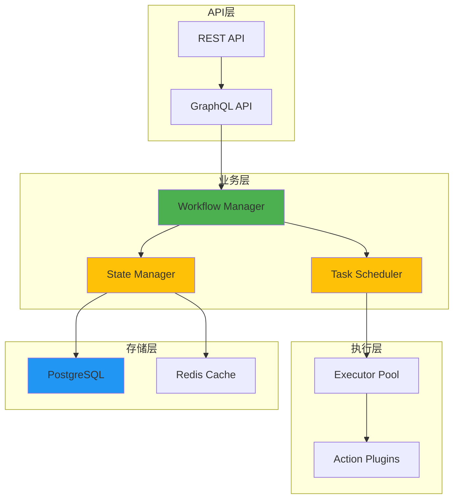
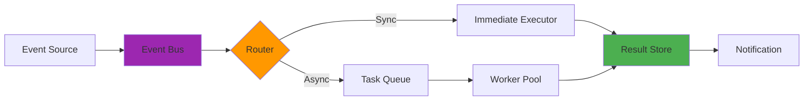

# Documentation Output Example

This shows what the 4-document suite looks like when complete.

## Example: Documenting "TaskFlow" System

**Context**: TaskFlow is a workflow automation system with 15 files, 3 subsystems, and multiple integration points.

---

## Output Structure

```
TaskFlow/
├── 技术原理文档.md              # 7,200 words
├── 架构与流程可视化.md           # 12 diagrams
├── 快速参考指南.md              # 3,100 words  
└── README-文档索引.md           # 2,400 words
```

---

## 1. 技术原理文档.md (Sample Sections)

```markdown
# TaskFlow - 技术原理详解

## 目录
1. [核心概念](#核心概念)
2. [系统架构](#系统架构)
3. [工作原理](#工作原理)
...

---

## 核心概念

### 1.1 设计理念

TaskFlow 是一个事件驱动的工作流自动化引擎，核心理念是：

> **将复杂的业务流程分解为可组合的原子任务，通过声明式配置实现灵活的流程编排。**

解决的核心问题：

1. **流程碎片化**：业务流程散落在多个系统中，难以追踪
2. **变更困难**：流程修改需要代码变更和部署
3. **可观测性差**：无法实时监控流程执行状态

### 1.2 核心机制

```
事件触发 → 任务调度 → 执行器运行 → 状态更新 → 结果通知
    ↑                                              ↓
    └─────────────── 异常重试/补偿 ─────────────────┘
```

---

## 系统架构

### 2.1 组件结构

```
taskflow/
├── api/                    # REST API接口
│   ├── routes/            # 路由定义
│   └── controllers/       # 控制器
├── core/                   # 核心引擎
│   ├── scheduler.ts       # 任务调度器
│   ├── executor.ts        # 执行引擎
│   └── state-machine.ts   # 状态机
├── plugins/                # 插件系统
│   ├── triggers/          # 触发器插件
│   └── actions/           # 动作插件
└── config/                 # 配置管理
    └── workflow.schema.json
```

[... continues with detailed explanation of each component ...]
```

**Key characteristics**:
- Deep technical detail
- Explains "why" behind design decisions
- Includes code snippets with explanations
- ~7,000 words
- 45-60 minute read

---

## 2. 架构与流程可视化.md (Sample Diagrams)

```markdown
# TaskFlow - 架构与流程可视化

## 1. 核心架构图

### 1.1 系统分层架构



### 1.2 数据流架构



[... continues with 10 more diagrams ...]
```

**Key characteristics**:
- Diagram-heavy (10-15 Mermaid diagrams)
- Minimal explanatory text
- Visual storytelling
- 20-30 minute study time

---

## 3. 快速参考指南.md (Sample Sections)

```markdown
# TaskFlow - 快速参考指南

## 📚 一分钟了解

**TaskFlow** 让你通过 JSON 配置定义业务流程，自动调度执行任务。

### 核心概念
```
定义工作流 → 触发事件 → 自动执行 → 监控状态
```

- **Workflow**：流程定义（JSON）
- **Task**：可执行的最小单元
- **Trigger**：触发条件（时间/事件/手动）
- **Executor**：执行引擎

---

## 🎯 何时使用

| 场景 | 解决方案 |
|------|---------|
| 定时批量处理 | Cron Trigger + Batch Action |
| 用户注册流程 | Event Trigger + Multi-step Workflow |
| 数据同步任务 | Webhook Trigger + Transform Action |

---

## 📝 工作流模板

### 基础工作流

```json
{
  "name": "user-onboarding",
  "version": "1.0",
  "trigger": {
    "type": "event",
    "event": "user.created"
  },
  "tasks": [
    {
      "id": "send-welcome-email",
      "type": "email",
      "config": {
        "template": "welcome",
        "to": "{{user.email}}"
      }
    },
    {
      "id": "create-default-settings",
      "type": "database",
      "config": {
        "operation": "insert",
        "table": "user_settings"
      }
    }
  ]
}
```

### 条件分支工作流

```json
{
  "tasks": [
    {
      "id": "check-plan",
      "type": "condition",
      "config": {
        "if": "{{user.plan}} == 'premium'",
        "then": "task-a",
        "else": "task-b"
      }
    }
  ]
}
```

---

## 🔧 快速安装

### Docker部署

```bash
# 克隆仓库
git clone https://github.com/example/taskflow.git
cd taskflow

# 启动服务
docker-compose up -d

# 验证
curl http://localhost:3000/health
```

### 本地开发

```bash
# 安装依赖
npm install

# 配置环境变量
cp .env.example .env

# 启动开发服务器
npm run dev
```

---

## 🛠️ 常用命令

### 工作流管理

```bash
# 创建工作流
curl -X POST http://localhost:3000/api/workflows \
  -H "Content-Type: application/json" \
  -d @workflow.json

# 列出所有工作流
curl http://localhost:3000/api/workflows

# 触发执行
curl -X POST http://localhost:3000/api/workflows/{id}/trigger

# 查看执行历史
curl http://localhost:3000/api/executions?workflow={id}
```

---

## 🆘 故障排查

| 问题 | 解决方案 |
|------|---------|
| 任务执行失败 | 检查 logs 目录，查看详细错误信息 |
| 工作流不触发 | 验证 trigger 配置，检查事件总线连接 |
| 执行器超时 | 调整 executor.timeout 配置 |

---

## 🔖 速查卡

```
创建工作流: POST /api/workflows
触发执行: POST /api/workflows/{id}/trigger
查看状态: GET /api/executions/{id}
暂停: POST /api/executions/{id}/pause
恢复: POST /api/executions/{id}/resume
取消: POST /api/executions/{id}/cancel
```

**提示**: 保持此指南在手边，快速查阅关键信息！ 📖
```

**Key characteristics**:
- Highly practical
- Copy-paste ready templates
- Command cheat sheets
- Troubleshooting section
- ~3,000 words
- 10-15 minute reference

---

## 4. README-文档索引.md (Sample Sections)

```markdown
# TaskFlow - 文档索引

欢迎！这是 TaskFlow 的完整文档库。

---

## 📚 文档导航

<table>
<tr>
<td width="33%">

#### 🚀 快速入门
**适合**: 新用户、需要立即使用

👉 [快速参考指南.md](快速参考指南.md)

- ⏱️ 阅读时间: 15分钟
- 📋 包含: 模板、命令、API
- 🎓 难度: 入门级

</td>
<td width="33%">

#### 🏗️ 架构理解
**适合**: 架构师、技术负责人

👉 [架构与流程可视化.md](架构与流程可视化.md)

- ⏱️ 阅读时间: 25分钟
- 📊 包含: 12个架构图
- 🎓 难度: 中级

</td>
<td width="33%">

#### 🔬 深入原理
**适合**: 开发者、贡献者

👉 [技术原理文档.md](技术原理文档.md)

- ⏱️ 阅读时间: 50分钟
- 📖 包含: 完整技术细节
- 🎓 难度: 高级

</td>
</tr>
</table>

---

## 🗺️ 学习路径

### 路径A: 快速上手（30分钟）

```
1️⃣ 快速参考指南.md - "一分钟了解" + "快速安装"
2️⃣ 创建第一个工作流（使用模板）
3️⃣ 触发执行并查看结果
✅ 现在可以开始使用！
```

### 路径B: 深入理解（1小时）

```
1️⃣ 快速参考指南.md - 完整阅读
2️⃣ 架构与流程可视化.md - 重点：核心架构 + 数据流
3️⃣ 技术原理文档.md - 重点："工作原理" 章节
✅ 现在有完整理解！
```

---

## 💡 按场景查找

### 🆕 我是新用户
**开始阅读**: 快速参考指南 - "一分钟了解" + "快速安装"
**推荐时长**: 15分钟

### 🔧 我要创建工作流
**查阅**: 快速参考指南 - "工作流模板" 部分
**推荐时长**: 5分钟

### 🏗️ 我要理解架构
**阅读**: 架构与流程可视化 - 完整阅读
**推荐时长**: 25分钟

---

## 📊 文档内容对比

| 主题 | 快速参考 | 架构可视化 | 技术原理 |
|-----|---------|-----------|---------|
| 快速上手 | ⭐⭐⭐ | ⭐ | ⭐ |
| 架构理解 | ⭐ | ⭐⭐⭐ | ⭐⭐⭐ |
| API参考 | ⭐⭐⭐ | ⭐ | ⭐⭐ |
| 配置说明 | ⭐⭐⭐ | ⭐ | ⭐⭐⭐ |
| 故障排查 | ⭐⭐⭐ | ⭐ | ⭐⭐ |

---

## 🎓 下一步

根据您的角色选择：

| 角色 | 推荐行动 |
|------|---------|
| 👤 新用户 | 阅读快速参考 → 跑通第一个示例 |
| 👨‍💻 开发者 | 阅读技术原理 → 查看架构图 → 贡献代码 |
| 🏗️ 架构师 | 研究架构可视化 → 规划集成方案 |

---

**文档版本**: 1.0
**最后更新**: 2026-03-05
```

**Key characteristics**:
- Navigation-focused
- Learning paths by role
- Scenario-based guidance
- Document comparison matrix
- ~2,400 words
- 5 minute orientation

---

## Summary

This 4-document suite provides:

| Document | Words | Time | Audience | Purpose |
|----------|-------|------|----------|---------|
| Technical Principles | 7,200 | 50 min | Developers | Deep understanding |
| Architecture Viz | ~1,500 | 25 min | Architects | Visual overview |
| Quick Reference | 3,100 | 15 min | All users | Practical guide |
| Navigation Index | 2,400 | 5 min | First-timers | Find your way |

**Total**: ~14,000 words, 12 diagrams, 95 minutes of reading across all depths.

**Result**: Every user finds what they need at the depth they prefer. 🎯

---

## When to Scale Down

For a simpler system (5-10 files, single purpose):

```
Simple System/
├── 快速参考指南.md              # 2,000 words  
└── 技术原理文档.md              # 4,000 words
```

Skip Architecture Visualization and Navigation Index if:
- System has <5 major components
- Architecture is straightforward
- Target audience is homogeneous (all developers)

---

**Remember**: The goal is to serve your readers, not to create documentation for its own sake. Adjust the approach based on actual needs. 📚
