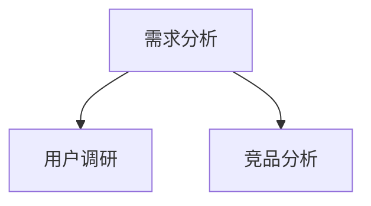

# XMind to Markdown 转换

## 概述

将 XMind 思维导图文件转换为多种 Markdown 流程图格式。

- **零依赖**：仅使用 Python 标准库
- **5种输出格式**：mermaid、plantuml、markdown、numbered、styled
- **完全兼容**：与 xmind2md-mcp Node.js 版本输出完全一致

## 快速参考

| 任务 | 方法 |
|------|------|
| 转换为 Mermaid | `python scripts/xmind2md.py file.xmind mermaid` |
| 转换为 PlantUML | `python scripts/xmind2md.py file.xmind plantuml` |
| 转换为 Markdown 列表 | `python scripts/xmind2md.py file.xmind markdown` |
| 带编号流程图 | `python scripts/xmind2md.py file.xmind numbered` |
| 带样式流程图 | `python scripts/xmind2md.py file.xmind styled` |

## 使用场景

- 当用户需要将 XMind 文件转换为可嵌入文档的流程图时
- 当用户需要分析 XMind 思维导图结构时
- 当用户需要将思维导图内容以文本形式展示时

## 脚本位置

```
scripts/xmind2md.py
```

## 使用方法

```bash
# 基本用法
python scripts/xmind2md.py <xmind_file> [format]

# 默认输出 mermaid 格式
python scripts/xmind2md.py test.xmind

# 指定输出格式
python scripts/xmind2md.py test.xmind mermaid
python scripts/xmind2md.py test.xmind markdown
python scripts/xmind2md.py test.xmind plantuml
python scripts/xmind2md.py test.xmind numbered
python scripts/xmind2md.py test.xmind styled
```

## 支持的输出格式

| 格式 | 说明 | 适用场景 |
|------|------|----------|
| `mermaid` | Mermaid 流程图 | GitHub/GitLab Markdown、文档嵌入 |
| `plantuml` | PlantUML UML 图 | 需要更正式的 UML 表示 |
| `markdown` | Markdown 列表 | 简单层级展示 |
| `numbered` | 带编号的 Mermaid | 复杂结构，需要追踪节点 |
| `styled` | 带主题样式的 Mermaid | 需要视觉美化 |

## 执行步骤

当用户请求转换 XMind 文件时：

1. **确认文件路径** - 获取用户提供的 XMind 文件路径
2. **选择输出格式** - 默认使用 `mermaid`，根据用户需求选择其他格式
3. **执行转换** - 运行脚本 `python scripts/xmind2md.py <file> <format>`
4. **展示结果** - 输出转换后的流程图代码和统计信息

## 输出示例

### Mermaid 格式



### Markdown 列表格式

```markdown
# 项目规划

- 需求分析
  - 用户调研
  - 竞品分析
- 开发阶段
  - 前端开发
  - 后端开发
```

### Styled 格式


## 错误处理

- 文件不存在：提示用户检查路径
- 格式无效：自动使用默认 mermaid 格式
- 文件损坏：提示 XMind 文件可能损坏

## 技术细节

- XMind 文件实际是 ZIP 格式，包含 `content.xml` 或 `content.json`
- 支持 XMind 新版（JSON）和旧版（XML）两种格式
- 特殊字符（引号、换行、管道符）会被自动转义
- Windows 系统下脚本会自动设置 UTF-8 输出编码
- 输出与 xmind2md-mcp Node.js 版本完全一致