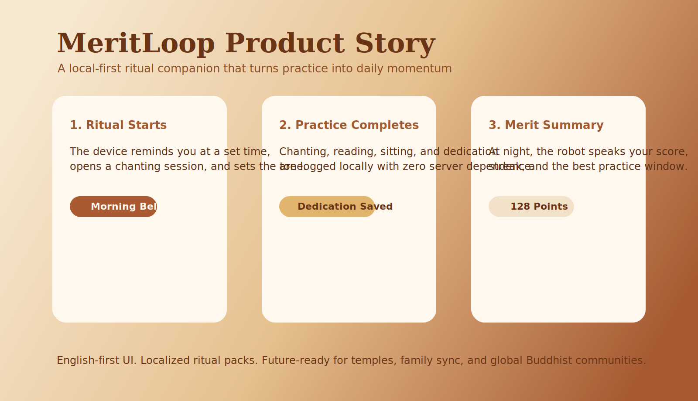
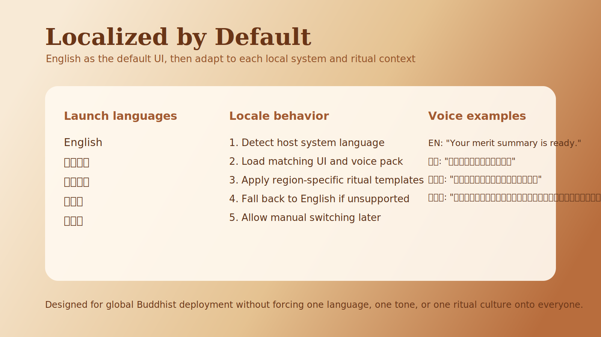

# Buddhist Agent Product

## Overview

This skill turns vague "AI + Buddhism" ideas into product-ready concepts. It is especially useful for cyber-chanting agents, Buddhist ritual companions, scripture-based assistants, merit-point systems, local shrine robots, digital temple services, and hybrid hardware + agent experiences.

Default to product-manager thinking rather than theology-first exposition. The goal is to help the user define a believable product that respects religious context, has repeated usage loops, starts locally without server complexity, and can later scale into online community features without making reckless spiritual claims.

## When To Use It

- The user wants a new AI product or agent related to Buddhism, chanting, scriptures, merit dedication, prayer reminders, temple workflows, or robot ritual behavior.
- The user has fragments such as "AI master", "automatic chanting", "daily practice", "robot offering", "digital monastery", or "global Buddhist users" and needs a coherent concept.
- The user wants use cases, feature menus, product positioning, monetization, safety boundaries, or a launch roadmap for a spiritual agent.
- The user wants to decide what the agent should and should not do, especially around doctrine, ordination, healing claims, or spiritual authority.

## Core Output

Unless the user asks for something narrower, produce a compact concept pack with:

- Product one-liner
- Version scope: what is local-first now, and what is online later
- Target users
- Core usage loop
- 4-8 priority scenarios
- MVP feature set
- Merit-score or功德值 system if relevant
- Trust and religious-safety boundaries
- Content architecture, including scripture handling
- Monetization or distribution angle
- Short roadmap
- Optional brand or naming directions
- Missing-pieces check: what is still undefined or risky

## Workflow

### 1. Identify the product archetype

Map the idea into one or more of these archetypes:

- Ritual companion: leads chanting, bells, timing, posture prompts, and dedication flows.
- Daily cultivation copilot: schedules morning/evening practice, tracks vows, reminders, reflections, and streaks.
- Merit-score keeper: records devotional actions and turns them into visible daily or cumulative功德值.
- Scripture guide: retrieves sutras, versions, summaries, pronunciation help, and structured study plans.
- Merit and dedication operator: after a practice or donation, helps compose and record回向 targets and intentions.
- Digital temple or commerce layer: incense/lamps/offering fulfillment, sponsored chanting, memorial rituals, merit ledgers, temple CRM.
- Embodied robot or device: altar robot, home shrine assistant, chanting speaker, prayer wheel interface, or companion hardware.
- Community and sangha layer: group practice rooms, global events, shared chanting counters, temple-hosted campaigns.

If the user's idea is broad, choose one primary archetype and at most two secondary ones.

### 2. Reframe "AI master" carefully

Do not position the agent as a real enlightened authority, ordained monk, or infallible guru. A safer and stronger framing is:

- Practice companion
- Ritual guide
- Dharma librarian
- Devotional operator
- Temple service concierge
- Discipline and remembrance assistant

If the user explicitly wants "AI master", preserve the ambition but translate it into product language such as "a master-like daily companion with humility, citations, and clear authority limits."

### 3. Design repeated usage loops

Favor behaviors that can recur daily or weekly. Strong loops include:

- Morning chanting -> intention setting -> reminder for evening dedication
- Scheduled robot recitation -> session completion -> today's merit summary -> bedtime reflection
- One-tap sutra session -> audio playback -> merit dedication -> share with family
- Festival day notification -> suggested liturgy -> offering purchase or temple booking
- Grief or memorial flow -> selected ritual package -> chanting progress -> dedication completion
- Travel or busy-work mode -> short practice plan -> wearable or speaker playback -> daily summary

The product should not only answer questions. It should help users complete a devotional or discipline loop.

### 4. Build feature ideas in modules

Choose the smallest set that makes the concept feel alive:

- Chanting engine: timed recitation, looping, counters, bells, transliteration, pace control, voice selection.
- Merit engine: local event log, weighted action scoring, streak multipliers, daily summary, weekly report, and reflective language explaining why the score moved.
- Dedication engine: templates for回向, custom recipients, event-based dedication, saved beneficiary lists, logs.
- Scripture layer: canonical text library, multilingual indexing, short explanations, pronunciation guides, commentary links.
- Practice planner: day-part routines, lunar/calendar reminders, observance days, vow tracking, adaptive schedules.
- Temple services: remote lamp offering, incense ordering, sponsored chanting, donation receipts, ritual booking.
- Physical automation: robot speaker, home altar gestures, smart candle/light cues, scheduled playback, shrine camera checks.
- Sangha network: family rooms, group chanting, leader-led sessions, temple livestreams, accountability circles.

### 5. Prefer local-first MVPs

If the user mentions that servers or online infrastructure are too heavy for v1, explicitly split the concept into:

- V1 local-first: on-device schedule, local scripture/audio library, local merit log, local reminders, local dedication history, offline robot actions.
- V2 connected: cloud backup, family sync, community challenges, temple channels, remote offerings, shared chanting rooms.

Local-first concepts are often stronger for privacy, simplicity, and faster prototyping. Treat online community as a roadmap item unless the user explicitly wants network features now.

### 6. Design the merit-score system carefully

When the user wants "功德值", "merit points", or a score that the robot accumulates on the owner's behalf, design it as a reflective product mechanic, not an objective spiritual measurement.

Recommended framing:

- Public name: 功德值, 修行值, 愿力值, 清明值, or 福慧积分.
- Product meaning: a motivational score derived from completed devotional actions and consistency.
- User promise: helps visualize discipline, intention, and continuity; does not guarantee metaphysical outcomes.

Recommended local-first algorithm shape:

- Base action score: each completed action gets a fixed weight, such as chanting, listening, dedication, vow review, altar greeting, or scripture reading.
- Duration modifier: longer or complete sessions earn more than skipped or partial sessions.
- Consistency multiplier: daily streaks and multi-day completion patterns increase the score modestly.
- Intention bonus: if the user sets a daily intention and completes the linked session, add a small bonus.
- Calmness bonus: optionally reward end-of-session reflection or silent sitting, not only noisy activity.
- Overclaim guardrail: cap daily score inflation so the system feels meaningful rather than gameable.

Useful outputs:

- "Today your robot helped you accumulate 128 merit points."
- "This week your strongest practice window was 7:30 PM."
- "Your score rose because evening dedication was completed three days in a row."

Be clear that the score is an internal practice index. Do not state or imply that it proves karmic merit in a literal religious sense.

### 7. Handle the scripture library thoughtfully

When the user asks how many books or sutras to include, do not answer with a random large number. Propose a layered rollout:

- Layer 1: essential daily-use texts for onboarding and retention.
- Layer 2: themed packs such as Pure Land, Zen, Tibetan, Theravada chanting, compassion practices, memorial rites.
- Layer 3: broader canon, commentaries, and regional variants.

Recommend organizing the library by:

- Tradition or lineage
- Ritual use case
- Language and transliteration
- Audio availability
- Difficulty or practice depth

If needed, read [references/use-cases.md](./references/use-cases.md) for a scenario bank and content strategy patterns.

### 8. Always include safety boundaries

Every concept should explicitly state what the agent will not do:

- Will not claim enlightenment, ordination, miracle powers, or karmic guarantees.
- Will not say that computed功德值 equals real spiritual merit in an authoritative doctrinal sense.
- Will not replace clergy, teachers, or medical or mental-health professionals.
- Will distinguish scripture, commentary, folklore, and generated guidance.
- Will cite source texts or temple-defined templates when making ritual suggestions.
- Will support user intention and discipline rather than pretending to possess spiritual authority.

### 9. Shape the answer to the user's intent

If the user wants brainstorming, lead with bold scenario ideas.

If the user wants a startup concept, include wedge, moat, pricing, and GTM.

If the user wants a skill or system prompt, turn the concept into operating instructions, boundaries, and output formats.

If the user wants hardware, emphasize routines, sensors, ambient interaction, and the emotional role of the device in the home shrine.

If the user wants naming, propose both Chinese and English options, explain the tone of each, and recommend one safe default plus one bolder brand direction.

If the user wants a gap review, identify what is still missing across hardware, content, UX, operations, trust, and monetization.

## Output Template

Use this default structure unless the user asks for another format:

### Concept

One paragraph describing the product in plain language.

### Version Scope

State what works fully offline or locally in v1, and what online/community features are future roadmap.

### Who It Is For

2-4 user segments with the highest motivation.

### Core Scenarios

List the strongest repeated-use scenarios first.

### MVP

5-7 features that prove the concept.

### Merit System

Explain how功德值 or the equivalent score is calculated and how it is presented to the user.

### Why Users Return

State the habit loop, emotional loop, and practical loop.

### Trust Boundaries

State the role and non-role of the AI clearly.

### Expansion Paths

Include one or more of: commerce, temple partnerships, hardware, premium library, group practice, enterprise-for-temples.

### Missing Pieces

List the major unanswered questions, implementation gaps, or launch risks.

## Example Requests

- "Help me turn cyber-chanting into a global Buddhist consumer app."
- "Design a home altar robot that can recite sutras and do dedication rituals."
- "I want an AI that feels like a master but does not cross religious boundaries."
- "Plan a scripture library and paid features for a Buddhist agent."
- "Turn my rough Buddhist robot idea into an MVP and business model."

## Resources (optional)

### references/
Read [references/use-cases.md](./references/use-cases.md) when the user wants deeper scenario ideation, business models, service menus, scripture rollout strategy, or temple partnership concepts.

Read [references/naming-and-gaps.md](./references/naming-and-gaps.md) when the user wants brand names, English naming, or a product-manager gap review.
