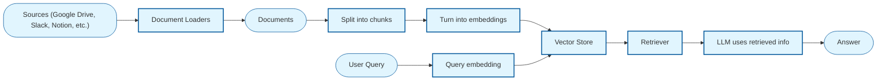
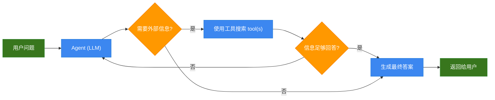
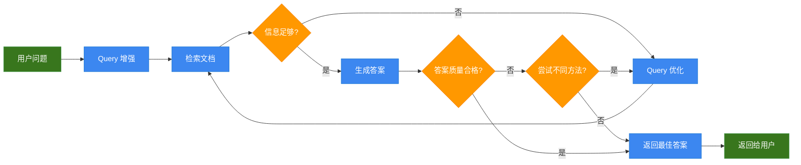

# RAG

大模型的训练数据有截止日期，在此之后的事它不知道；大模型的参数量有限，无法容纳所有专业知识。也就是说，大模型在实时性和专业性上都有所欠缺。

如何让大模型变得实时且专业呢？最省力的方法是“打小抄”。**知识库** 就像大模型的“小抄”。在回答问题之前，先瞅一眼小抄，看有没有与问题相关的内容。如果有，就从知识库中取回这段内容，结合大模型的推理能力，生成最终答案。

这里「打小抄」的动作，就是 [**RAG**](https://docs.langchain.com/oss/python/langchain/retrieval)（Retrieval-Augmented Generation, 检索增强生成）。

> **Note**
>
> 使用知识库可以让大模型的回答有据可依、减少幻觉，代价是需要承担知识库的构建成本。尤其当知识库的规模较大时，有必要想想是否值得支付对价。毕竟，通过扩大知识库的方式提升 Agent 性能，多少有点「用有限对抗无限，用确定对抗不确定」的意思。虽然我们总是在提起 RAG 时提到知识库，但 RAG 是一种检索技术，它可以检索任何内容。比起检索需要手动构建的知识库，用来检索联网内容、历史对话也是可以的，而且性价比很高。你的下一个检索对象，又何必是知识库。

## 一、提示词模板

RAG 做的事情并不复杂，就是从知识库中召回与用户问题有关的内容，作为上下文注入到 **提示词模板 (Prompt Template)** 中。

下面是一个提示词模板：

```text
{context}

---

基于上面给出的上下文，回答问题。

问题：{question}

回答： 
```

使用该模板时，将召回文本填入 `{context}`，将用户问题填入 `{question}`。然后把填好的提示词模板交给大模型推理。

RAG 主要做了两件事：一是从知识库中 **召回** 与用户问题有关的文本，二是使用提示词模板 **拼接** 召回文本与用户问题。拼接很容易做到，难度主要集中在召回上。在下一小节中，我将介绍如何召回与用户问题有关的文本。

## 二、向量检索

完成「召回与用户问题有关的文本」这件事，需要用到检索器。实现检索器的方式有 [很多](https://docs.langchain.com/oss/python/integrations/retrievers)，比如基于关键词检索的 [BM25](https://docs.langchain.com/oss/python/integrations/retrievers/bm25) 算法，但本节主要介绍基于 Embedding 的检索方法：**向量检索**。

### 1）从文本向量化说起

Embedding 是一种将文本转为向量的技术。它的输入是一段文本，输出是一个定长的向量。

```
"好喜欢你" --> [0.190012, 0.123555, .... ]
```

将文本转为向量的目的，是把语义相近的词分配到同一片向量空间。所以，一对近义词转成向量后，它们的向量之间的距离通常比其他词更近。比如，足球和篮球在向量空间中的距离更近一些，而足球和篮筐之间的距离更远。Embedding 的本质是压缩。从编码角度讲，自然语言存在冗余信息。Embedding 相当于对自然语言进行重编码，用最少的 token 表达最多的语义。

Embedding 在多语言场景下也有优势。经过充分训练的 Embedding 模型，会将多语言内容在语义层面上对齐。也就是说，一个向量可以在多语言环境中保持同一语义。这种特性让大模型得以兼容并包。即使加入多语言材料，也不会因为字面上的词不同，而产生“理解”上的混乱。

### 2）向量检索的原理

由于 Embedding 模型具有将相似语义的词训练成距离相近的向量的特性，我们可以把「用户问题」与「知识库内容」都转成 Embedding 向量。然后计算向量之间的距离。向量之间的距离越小，则语料之间的相似度越高。借助这个原理，最后返回知识库中与问题向量距离最小的 Top-K 份语料即可。

我们用一个简单的实验，验证这种计算方式能否获取真正的相关文本。

```python
from dotenv import load_dotenv
from langchain_community.embeddings import DashScopeEmbeddings
from sklearn.metrics.pairwise import cosine_similarity

# 加载环境变量
_ = load_dotenv()
```

下面计算知识库中每一条内容与问题之间的相似度，看看语义相近的内容是否具有更高的余弦相似度。

```python
# 用户问题
query = "过年要给不熟的亲戚发红包么？"

# 知识库
docs = [
    "不来往的人就不要给他钱",
    "海胆豆腐真好吃下次还吃",
    "半熟牛排淋上不熟的芝士",
]

# 初始化向量生成器
embeddings = DashScopeEmbeddings()

# 生成向量
qv = embeddings.embed_query(query)
dv = embeddings.embed_documents(docs)

# 计算余弦相似度
similarities = cosine_similarity([qv], dv)[0]
results = list(enumerate(similarities))
by_sim = sorted(results, key=lambda r: r[1], reverse=True)

# 余弦相似度大 -> 两个单位向量夹角小 -> 向量挨得更近
print("按余弦相似度排序：")
for i, s in by_sim:
    print('-', docs[i], s)
```

```
按余弦相似度排序：
- 不来往的人就不要给他钱 0.346204651165491
- 半熟牛排淋上不熟的芝士 0.11805922713791331
- 海胆豆腐真好吃下次还吃 0.09085072283609508
```

## 三、向量检索流程

上述代码虽然已经可以计算知识库内容与用户问题的相似度，但在工程化过程中还会遇到一些问题：

- **问题一**：Embedding 模型对输入文本有长度限制，且文本过长本身也会影响向量表达
- **问题二**：当知识库规模较大时，难以快速召回 Top-K 相关文本

为了解决 **问题一**，我们需要做文本切块（Split into chunks）：将知识库中的文本切成大小均匀的文本片段。然后使用 Embedding 模型将这些文本片段转成 Embedding 向量。为了确保文本片段不会因截断产生语义缺失，还要让两个相邻文本片段之间有一定的 overlap。**问题二** 一般引入向量数据库解决，向量数据库有成熟的 [ANN](https://milvus.io/docs/single-vector-search.md) 算法，可以帮助我们快速召回最近邻向量。

工程化之后，我们的检索流程变得更复杂了一些。下面是一个典型的 [向量检索流程](https://docs.langchain.com/oss/python/langchain/retrieval#retrieval-pipeline)：



*\* 圆框代表数据，方框代表组件。*

由于 LangChain 使用模块化的编写方式，所以每个组件都是可替换的。下面粗体部分列出了图中的组件，右边是它们可替换的变体：

- **Document Loader（文档加载器）**：`TextLoader`, `PyMuPDFLoader`, `WebBaseLoader`
- **Document Splitter（文档分割器）**：`RecursiveCharacterTextSplitter`
- **Embedding Generation（向量生成器）**：`DashScopeEmbeddings`, `HuggingFaceEmbeddings`
- **Vector Store（向量存储）**：`Chroma`, `Milvus`, `FAISS`
- **Retriever（检索器）**：`EnsembleRetriever`, `BM25Retriever`
- **LLM（大语言模型）**：`ChatOpenAI`

下一小节，我们将实现一个包含上述全部组件的向量检索流程。

## 四、基于向量检索的 RAG

☝️🤓 仅需六个步骤，就能实现一个基于向量检索的 RAG。

```python
import os

# 配置 UA
MY_USER_AGENT = (
    "Mozilla/5.0 (Macintosh; Intel Mac OS X 10_15_7) AppleWebKit/605.1.15 "
    "(KHTML, like Gecko) Version/17.0 Safari/605.1.15"
)
os.environ["USER_AGENT"] = MY_USER_AGENT

import bs4

from dotenv import load_dotenv
from langchain_openai import ChatOpenAI
from langchain_community.document_loaders import WebBaseLoader
from langchain_text_splitters import RecursiveCharacterTextSplitter
from langchain_community.embeddings import DashScopeEmbeddings
from langchain_core.vectorstores import InMemoryVectorStore
from langchain.tools import tool
from langchain.agents import create_agent

# 加载模型配置
_ = load_dotenv()

# 加载模型
llm = ChatOpenAI(
    model="qwen3-max",
    api_key=os.getenv("DASHSCOPE_API_KEY"),
    base_url=os.getenv("DASHSCOPE_BASE_URL"),
)
```

### 1）加载文档

使用 `WebBaseLoader` 加载 [《阿里发布新版 Quick BI，聊聊 ChatBI 的底层架构、交互设计和云计算生态》](https://luochang212.github.io/posts/quick_bi_intro/) 这篇文章的内容。

```python
# 加载文章内容
bs4_strainer = bs4.SoupStrainer(class_=("post"))
loader = WebBaseLoader(
    web_paths=("https://luochang212.github.io/posts/quick_bi_intro/",),
    bs_kwargs={"parse_only": bs4_strainer},
    requests_kwargs={"headers": {"User-Agent": MY_USER_AGENT}},
)
docs = loader.load()

assert len(docs) == 1

print(f"Total characters: {len(docs[0].page_content)}")
print(docs[0].page_content[:248])
```

```
Total characters: 4222

8月28日，阿里云发布了数据分析工具 Quick BI 的全新版本。它是大模型应用在 BI 行业的最新实践。Quick BI 在云计算基础设施之上，搭建了一个 ChatBI 应用。阿里为这个应用起了一个拟人化的名字：智能小Q。智能小Q允许用户以对话的形式探索数据。无需写 SQL，只需与小Q对话，即可获得想要的统计信息。

智能小Q其实是一个多智能体系统（multi-agent system），包含多个 Agent：

报告 Agent
问数 Agent
搭建 Agent
解读 Agent
```

### 2）分割文档

使用 `RecursiveCharacterTextSplitter` 将文本分块，以便后续计算文本块的 Embedding。

```python
# 文本分块
text_splitter = RecursiveCharacterTextSplitter(
    chunk_size=1000,  # chunk size (characters)
    chunk_overlap=200,  # chunk overlap (characters)
    add_start_index=True,  # track index in original document
)
all_splits = text_splitter.split_documents(docs)

print(f"Split blog post into {len(all_splits)} sub-documents.")
```

```
Split blog post into 7 sub-documents.
```

### 3）向量生成

注意，用户问题 和 知识库 必须使用同一个 Embedding 模型来生成向量。

```python
# 初始化向量生成器
embeddings = DashScopeEmbeddings()
```

### 4）向量存储

这里仅用 `InMemoryVectorStore` 做演示。正式项目请用 Chroma、Milvus 等向量数据库。

```python
# 初始化内存向量存储
vector_store = InMemoryVectorStore(embedding=embeddings)

# 将文档添加到向量存储
document_ids = vector_store.add_documents(documents=all_splits)

print(document_ids[:2])
```

```
['bd26b165-e93d-484a-9ba9-c964003342c3', '57645d8a-fedd-4b56-ad6c-f07808dc4679']
```

### 5）创建工具

创建可被 Agent 调用的工具。该工具从向量存储中召回 `k=2` 个与 `query` 最相似的文本片段。

```python
# 创建上下文检索工具
@tool(response_format="content_and_artifact")
def retrieve_context(query: str):
    """Retrieve information to help answer a query."""
    retrieved_docs = vector_store.similarity_search(query, k=2)
    serialized = "\n\n".join(
        (f"Source: {doc.metadata}\nContent: {doc.page_content}")
        for doc in retrieved_docs
    )
    return serialized, retrieved_docs
```

### 6）召回文本

使用 Agent 调用检索工具，召回与问题有关的上下文。

```python
# 创建 ReAct Agent
agent = create_agent(
    llm,
    tools=[retrieve_context],
    system_prompt=(
        # If desired, specify custom instructions
        "You have access to a tool that retrieves context from a blog post. "
        "Use the tool to help answer user queries."
    )
)

# 调用 Agent
response = agent.invoke({
    "messages": [{"role": "user", "content": "当前的 Agent 能力有哪些局限性？"}]
})

# # 获取 Agent 的完整回复
# for message in result["messages"]:
#     message.pretty_print()
```

```python
# 获取 Agent 的最终回复
response['messages'][-1].pretty_print()
```

```
================================== Ai Message ==================================

当前的 Agent 能力存在以下几个主要局限性：

1. **长期记忆能力不足**：  
   Agent 难以有效地区分和保留有用的历史对话信息，同时遗忘无用内容。此外，还缺乏跨对话积累经验、持续提升问答效果的能力。

2. **验证（Verification）能力缺失**：  
   即使具备一定的记忆能力，Agent 仍缺乏对信息真伪或合理性的判断能力。它无法自主验证所获取或生成的信息是否准确可靠。

3. **知识体系构建困难**：  
   在没有良好验证机制的前提下，Agent 无法将零散的记忆系统化地加工成结构化的知识体系，从而限制了其推理和决策能力。

这些问题是当前基于 Agent 技术的产品（如 Quick BI、TRAE 等）共同面临的瓶颈。未来随着 Agent 技术在上述方向上的突破，相关应用（例如 ChatBI）的能力也有望显著提升。
```

## 五、关键词检索

[BM25](https://en.wikipedia.org/wiki/Okapi_BM25) 是一种基于词频的排序算法，它可以估计文档与给定查询的相关性。给定一个包含关键词 $q_1, ..., q_n$ 的查询 $Q$，文档 $D$ 的 BM25 分数是：

$$\\text{score}(D, Q) = \\sum\_{i=1}^{n} \\text{IDF}(q_i) \\cdot \\frac{f(q_i, D) \\cdot (k_1 + 1)}{f(q_i, D) + k_1 \\cdot \\left( 1 - b + b \\cdot \\frac{|D|}{\\text{avgdl}} \\right)}$$

其中：

- $f(q_i, D)$：关键词 $q_i$ 在文档 $D$ 中出现的次数
- $|D|$：文档 $D$ 的词数
- $avgdl$：文档集合的平均文档长度
- $k_1$：可调参数，用于控制词频饱和度，通常选择为 $k_1 \\in [1.2, 2.0]$
- $b$：可调参数，用于控制文档归一化程度，通常选择为 $b = 0.75$
- $\\text{IDF}(q_i)$：关键词 $q_i$ 的 IDF（逆文档频率）权重，用于衡量一个词的普遍程度，越常见的词值越低

对于中文关键词检索，需要安装支持分词的 Python 包：

```python
# !pip install jieba
```

### 1）创建检索器

我们使用 LangChain 提供的 [BM25Retriever](https://docs.langchain.com/oss/python/integrations/retrievers/bm25) 创建检索器，并将 jieba 作为它的分词器。

```python
import jieba

from langchain_community.retrievers import BM25Retriever
from langchain_core.documents import Document
```

```python
def chinese_tokenize(text: str) -> list[str]:
    """中文分词函数"""
    tokens = jieba.lcut(text)
    return [token for token in tokens if token.strip()]

# 1. 使用文本创建中文检索器
text_retriever = BM25Retriever.from_texts(
    [
        "何意味",
        "那很坏了",
        "这点小事也无所谓吧",
        "我替她原谅你了",
    ],
    k=2,
    preprocess_func=chinese_tokenize,
)

# 2. 使用文档创建中文检索器
doc_retriever = BM25Retriever.from_documents(
    [
        Document(page_content="辣椒炒肉拌面"),
        Document(page_content="肉蛋葱鸡"),
        Document(page_content="这下不熟了"),
        Document(page_content="铁串子"),
    ],
    k=2,
    preprocess_func=chinese_tokenize,
)
```

```
Building prefix dict from the default dictionary ...
Loading model from cache /var/folders/71/g9q2ppqn1_3gxwzt_nm1_sjw0000gn/T/jieba.cache
Loading model cost 0.230 seconds.
Prefix dict has been built successfully.
```

### 2）使用检索器

```python
# 检索文本
text_retriever.invoke("一件小事")
```

```
[Document(metadata={}, page_content='这点小事也无所谓吧'),
 Document(metadata={}, page_content='我替她原谅你了')]
```

```python
# 检索文档
doc_retriever.invoke("拌面")
```

```
[Document(metadata={}, page_content='辣椒炒肉拌面'),
 Document(metadata={}, page_content='铁串子')]
```

## 六、混合检索

向量检索和关键词检索各擅胜场。向量检索擅长语义匹配，关键词检索擅长精确匹配，两者可以形成互补。因此，工业界的 RAG 系统常用 **向量检索 + 关键词检索** 的混合检索方案。这相当于有两路召回，混合检索的关键在于如何对两路召回的结果进行筛选和重排（Rerank）。

### 1）RRF 分数

**RRF**（Reciprocal Rank Fusion, 倒数排序融合）是一种经典的重排方案。你可以使用 RRF 集成多个检索器分数，以计算文本片段的最终排名。

一个文本片段的 RRF 分数可由以下公式计算得出：

$$\\text{RRF} = \\sum\_{i} \\frac{w_i}{k + r_i}$$

其中：

- $w_i$：第 $i$ 个检索器的权重，默认值为 $1.0$
- $k$：平滑参数，默认值为 $60$
- $r_i$：文档在第 $i$ 个检索器中的排名

基于 RRF 分数的混合检索可以通过向量数据库实现，详情参见文档，这里不再赘述了：

- [Milvus](https://milvus.io/docs/multi-vector-search.md)
- [Chroma](https://docs.trychroma.com/cloud/search-api/hybrid-search)

### 2）Agentic Hybrid Search

根据第一性原理，若用大模型可以获得更好的重排效果，何须计算 RRF 分数。下面我们写一段实验代码，验证一下用大模型做重排的效果。

```python
import random
from typing import List
from pydantic import BaseModel, Field

# 这是用户 query
query = "盘点海獭的黑历史"

# 这是 向量检索 召回的文本片段
dense_texts = [
    "某些海洋生物会乱扔垃圾",
    "海獭太可爱了",
    "海獭臭臭的",
]

# 这是 关键词检索 召回的文本片段
sparse_texts = [
    "海獭臭臭的",
    "雪鸮的黑历史",
]

# 定义 Agent 输出格式
class ReRankOutput(BaseModel):
    indices: List[int] = Field(description="重排后的召回文本片段的索引列表")

# 返回最多 limit 个文本片段
def get_relevant_texts(query: str,
                       dense_texts: list,
                       sparse_texts: list,
                       limit: int = 3):

    # 创建上下文
    texts = dense_texts + sparse_texts

    # 去重
    texts = list(set(texts))

    # 打乱元素顺序，消除由位置引入的 bias
    random.shuffle(texts)

    # 将索引 id 显式添加到文本片段前
    texts_with_index = [f"{i} - {text}" for i, text in enumerate(texts)]

    context = '\n\n'.join(texts_with_index)
    prompt = "\n".join([
        f"{context}",
        "---",
        "上面是RAG召回的多个文本片段。每个文本片段的格式为 [索引] - [内容]。",
        f"请返回最多{limit}个与用户问题有关的文本片段的索引（若相关性内容不足，允许少于{limit}条）。",
        "\n注意事项：",
        "1. 相关性更高的文本片段应该排在前面",
        "2. 返回的文本片段必须有助于回答用户问题！",
        f"\n用户问题：{query}",
        "文本片段的索引列表：",
    ])

    # 创建带结构化输出的Agent
    agent = create_agent(
        model=llm,
        system_prompt="你是一个召回文本相关性重排助手",
        response_format=ReRankOutput,
    )

    # 调用 Agent
    result = agent.invoke(
        {"messages": [{"role": "user", "content": prompt}]},
    )

    indices = result['structured_response'].indices
    return [texts[i] for i in indices]
```

调用召回文本相关性重排助手，获取重排后的相关性文本列表。

```python
res = get_relevant_texts(
    query,
    dense_texts,
    sparse_texts,
)

res
```

```
['海獭臭臭的', '海獭太可爱了']
```

## 七、RAG 架构

RAG 有三种主流架构：

|架构|描述|
| -- | -- |
| 2-Step RAG | 先检索，再生成 |
| Agentic RAG | 使用 Agent 控制检索的时机与方式 |
| Hybrid RAG | 在 Agentic RAG 的基础上，增加用户 query 改写，确认召回文本的相关性等步骤 |

> **Note**
> 官方文档的 [架构部分](https://docs.langchain.com/oss/python/langchain/retrieval#rag-architectures) 写得很好，推荐阅读。

### 1）2-Step RAG


### 2）Agentic RAG



### 3）Hybrid RAG



参考：

- [All-in-RAG](https://datawhalechina.github.io/all-in-rag/#/chapter4/11_hybrid_search)
- [Multi-Vector Hybrid Search](https://milvus.io/docs/multi-vector-search.md)
- [Hybrid Search with RRF](https://docs.trychroma.com/cloud/search-api/hybrid-search)
